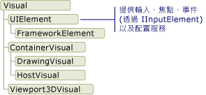
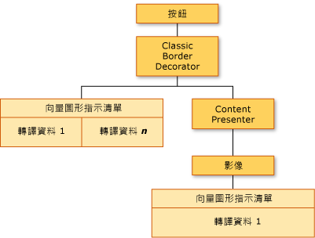
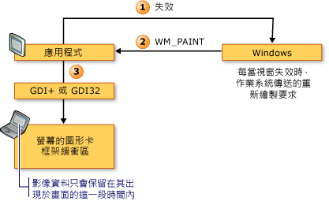
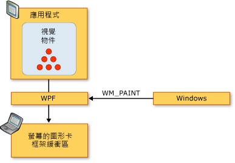
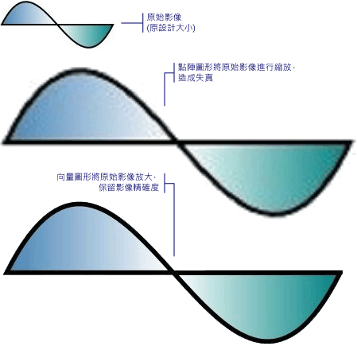

# WPF 圖形轉譯概觀
本主題提供 [!INCLUDE[TLA2#tla_winclient](../../../../includes/tla2sharptla-winclient-md.md)] 視覺圖層的概觀。 它著重於角色<xref:System.Windows.Media.Visual>類別，用於呈現中的支援[!INCLUDE[TLA2#tla_winclient](../../../../includes/tla2sharptla-winclient-md.md)]模型。  
  
  
   
## 視覺物件的角色  
 <xref:System.Windows.Media.Visual>類別是資料來源的基本抽象每<xref:System.Windows.FrameworkElement>衍生物件。 它也作為在 [!INCLUDE[TLA2#tla_winclient](../../../../includes/tla2sharptla-winclient-md.md)] 中撰寫新控制項的進入點，且在許多方面，可以視為 Win32 應用程式模型中的視窗控制代碼 (HWND)。  
  
 <xref:System.Windows.Media.Visual>物件是的核心[!INCLUDE[TLA2#tla_winclient](../../../../includes/tla2sharptla-winclient-md.md)]物件，其主要角色是提供呈現支援。 使用者介面控制項，例如<xref:System.Windows.Controls.Button>和<xref:System.Windows.Controls.TextBox>，衍生自<xref:System.Windows.Media.Visual>類別，並將它用於保存其呈現資料。 <xref:System.Windows.Media.Visual>物件提供的支援：  
  
-   輸出顯示︰轉譯視覺物件已保存、序列化的繪圖內容。  
  
-   轉換︰執行視覺物件的轉換。  
  
-   裁剪：提供視覺物件的裁剪區域支援。  
  
-   點擊測試︰判斷座標或幾何是否包含於視覺物件的範圍內。  
  
-   週框方塊計算︰判斷視覺物件的週框矩形。  
  
 不過，<xref:System.Windows.Media.Visual>物件不支援非轉譯功能，例如：  
  
-   事件處理  
  
-   配置  
  
-   樣式  
  
-   資料繫結  
  
-   全球化  
  
 <xref:System.Windows.Media.Visual> 會公開為公用抽象類別必須衍生子類別。 下圖顯示 [!INCLUDE[TLA2#tla_winclient](../../../../includes/tla2sharptla-winclient-md.md)] 中公開之視覺物件的階層。  
  
   
Visual 類別階層  
  
### DrawingVisual 類別  
 <xref:System.Windows.Media.DrawingVisual>是輕量型繪製用來呈現圖形、 影像或文字的類別。 此類別之所以被視為輕量型，是因為它不提供版面配置或事件處理，而這會改善其執行階段效能。 基於此原因，繪圖適合背景或美工圖案。 <xref:System.Windows.Media.DrawingVisual>可以用來建立自訂的視覺物件。 如需詳細資訊，請參閱[使用 DrawingVisual 物件](../../../../docs/framework/wpf/graphics-multimedia/using-drawingvisual-objects.md)。  
  
### Viewport3DVisual 類別  
 <xref:System.Windows.Media.Media3D.Viewport3DVisual>提供 2D 之間的橋樑<xref:System.Windows.Media.Visual>和<xref:System.Windows.Media.Media3D.Visual3D>物件。 <xref:System.Windows.Media.Media3D.Visual3D>類別是所有 3D 視覺元素的基底類別。 <xref:System.Windows.Media.Media3D.Viewport3DVisual>會要求您定義<xref:System.Windows.Media.Media3D.Viewport3DVisual.Camera%2A>值和<xref:System.Windows.Media.Media3D.Viewport3DVisual.Viewport%2A>值。 相機可讓您檢視場景。 檢視區會建立投影到 2D 平面上的對應位置。 如需 [!INCLUDE[TLA2#tla_winclient](../../../../includes/tla2sharptla-winclient-md.md)] 中 3D 的詳細資訊，請參閱 [3D 圖形概觀](../../../../docs/framework/wpf/graphics-multimedia/3-d-graphics-overview.md)。  
  
### ContainerVisual 類別  
 <xref:System.Windows.Media.ContainerVisual>類別會當做容器使用的集合<xref:System.Windows.Media.Visual>物件。 <xref:System.Windows.Media.DrawingVisual>類別衍生自<xref:System.Windows.Media.ContainerVisual>類別，讓它可以包含視覺物件的集合。  
  
### 視覺物件中的繪圖內容  
 A<xref:System.Windows.Media.Visual>物件會儲存為其呈現資料**向量圖形指示清單**。 指示清單中的每個項目代表一組低階圖形資料和相關聯的序列化格式的資源。 可包含繪圖內容的轉譯資料有四種不同的類型。  
  
|繪圖內容類型|描述|  
|--------------------------|-----------------|  
|向量圖形|代表向量圖形資料，以及任何相關聯<xref:System.Windows.Media.Brush>和<xref:System.Windows.Media.Pen>資訊。|  
|Image|代表所定義的區域內的影像<xref:System.Windows.Rect>。|  
|圖像|表示呈現的繪圖<xref:System.Windows.Media.GlyphRun>，也就是從指定的字型資源的圖像 （glyph） 的序列。 這是文字的表現方式。|  
|視訊|代表轉譯視訊的繪圖。|  
  
 <xref:System.Windows.Media.DrawingContext>可讓您填入<xref:System.Windows.Media.Visual>的視覺內容。 當您使用<xref:System.Windows.Media.DrawingContext>物件的繪製命令，您實際上儲存一組圖形系統將稍後使用的轉譯資料; 您不繪製即時螢幕。  
  
 當您建立[!INCLUDE[TLA2#tla_winclient](../../../../includes/tla2sharptla-winclient-md.md)]控制，例如<xref:System.Windows.Controls.Button>，控制項隱含產生的繪圖本身呈現資料。 例如，設定<xref:System.Windows.Controls.ContentControl.Content%2A>屬性<xref:System.Windows.Controls.Button>導致控制項儲存圖像 （glyph） 的轉譯表示法。  
  
 A<xref:System.Windows.Media.Visual>描述其一個或多個內容<xref:System.Windows.Media.Drawing>內含物件<xref:System.Windows.Media.DrawingGroup>。 A<xref:System.Windows.Media.DrawingGroup>也描述不透明度遮罩、 轉換、 點陣圖效果，以及其他會套用到其內容的作業。 <xref:System.Windows.Media.DrawingGroup> 在轉譯內容時依下列順序套用作業： <xref:System.Windows.Media.DrawingGroup.OpacityMask%2A>， <xref:System.Windows.Media.DrawingGroup.Opacity%2A>， <xref:System.Windows.Media.DrawingGroup.BitmapEffect%2A>， <xref:System.Windows.Media.DrawingGroup.ClipGeometry%2A>， <xref:System.Windows.Media.DrawingGroup.GuidelineSet%2A>，然後<xref:System.Windows.Media.DrawingGroup.Transform%2A>。  
  
 下圖中顯示的順序<xref:System.Windows.Media.DrawingGroup>轉譯序列期間所套用的作業。  
  
   
DrawingGroup 作業的順序  
  
 如需詳細資訊，請參閱[繪製物件概觀](../../../../docs/framework/wpf/graphics-multimedia/drawing-objects-overview.md)。  
  
#### 視覺圖層的繪圖內容  
 您永遠不會直接具現化<xref:System.Windows.Media.DrawingContext>; 可以不過，購買繪圖內容從特定方法，例如<xref:System.Windows.Media.DrawingGroup.Open%2A?displayProperty=nameWithType>和<xref:System.Windows.Media.DrawingVisual.RenderOpen%2A?displayProperty=nameWithType>。 下列範例會擷取<xref:System.Windows.Media.DrawingContext>從<xref:System.Windows.Media.DrawingVisual>並用來繪製矩形。  
  
 [!code-csharp[drawingvisualsample#101](../../../../samples/snippets/csharp/VS_Snippets_Wpf/DrawingVisualSample/CSharp/Window1.xaml.cs#101)]
 [!code-vb[drawingvisualsample#101](../../../../samples/snippets/visualbasic/VS_Snippets_Wpf/DrawingVisualSample/visualbasic/window1.xaml.vb#101)]  
  
#### 列舉視覺圖層的繪圖內容  
 除了其他用途，<xref:System.Windows.Media.Drawing>物件也會提供物件模型來列舉的內容<xref:System.Windows.Media.Visual>。  
  
> [!NOTE]
>  當您要列舉的視覺效果的內容時，您會擷取<xref:System.Windows.Media.Drawing>物件和不基礎資料的表示法呈現為向量圖形指示清單。  
  
 下列範例會使用<xref:System.Windows.Media.VisualTreeHelper.GetDrawing%2A>方法來擷取<xref:System.Windows.Media.DrawingGroup>值<xref:System.Windows.Media.Visual>和列舉它。  
  
 [!code-csharp[DrawingMiscSnippets_snip#GraphicsMMRetrieveDrawings](../../../../samples/snippets/csharp/VS_Snippets_Wpf/DrawingMiscSnippets_snip/CSharp/EnumerateDrawingsExample.xaml.cs#graphicsmmretrievedrawings)]  
  
   
## 視覺物件如何用來建置控制項  
 [!INCLUDE[TLA2#tla_winclient](../../../../includes/tla2sharptla-winclient-md.md)] 中的許多物件是由其他視覺物件所組成，這表示它們可以包含不同的子系物件階層。 [!INCLUDE[TLA2#tla_winclient](../../../../includes/tla2sharptla-winclient-md.md)] 中的許多使用者介面元素 (例如控制項) 是由多個視覺物件所組成，代表不同類型的轉譯元素。 例如，<xref:System.Windows.Controls.Button>控制項可以包含其他物件，包括一些<xref:Microsoft.Windows.Themes.ClassicBorderDecorator>， <xref:System.Windows.Controls.ContentPresenter>，和<xref:System.Windows.Controls.TextBlock>。  
  
 下列程式碼會示範<xref:System.Windows.Controls.Button>標記中定義的控制項。  
  
 [!code-xaml[VisualsOverview#VisualsOverviewSnippet1](../../../../samples/snippets/csharp/VS_Snippets_Wpf/VisualsOverview/CSharp/Window1.xaml#visualsoverviewsnippet1)]  
  
 如果您是先列舉包含預設的 visual 物件<xref:System.Windows.Controls.Button>控制項，您會發現以下的視覺化物件的階層：  
  
   
視覺化樹狀階層架構的圖表  
  
 <xref:System.Windows.Controls.Button>控制項包含<xref:Microsoft.Windows.Themes.ClassicBorderDecorator>元素，其亦包含<xref:System.Windows.Controls.ContentPresenter>項目。 <xref:Microsoft.Windows.Themes.ClassicBorderDecorator>項目會負責繪製框線和背景<xref:System.Windows.Controls.Button>。 <xref:System.Windows.Controls.ContentPresenter>項目是負責顯示內容的<xref:System.Windows.Controls.Button>。 在此情況下，由於您要顯示的文字，<xref:System.Windows.Controls.ContentPresenter>元素包含<xref:System.Windows.Controls.TextBlock>項目。 事實上，<xref:System.Windows.Controls.Button>控制使用<xref:System.Windows.Controls.ContentPresenter>表示內容無法代表其他項目，例如<xref:System.Windows.Controls.Image>或幾何，例如<xref:System.Windows.Media.EllipseGeometry>。  
  
### 控制項範本  
 擴充的控制項為階層之控制項的索引鍵是<xref:System.Windows.Controls.ControlTemplate>。 控制項範本會指定控制項的預設視覺階層。 當您明確地參考控制項時，您會以隱含方式參考其視覺階層。 您可以覆寫控制項範本的預設值，以針對控制項建立自訂視覺外觀。 例如，您可以修改的背景色彩值<xref:System.Windows.Controls.Button>控制，好讓它使用線性漸層色彩值，而不是純色值。 如需詳細資訊，請參閱[按鈕樣式和範本](../../../../docs/framework/wpf/controls/button-styles-and-templates.md)。  
  
 使用者介面項目，例如<xref:System.Windows.Controls.Button>控制項，包含數個向量圖形的指示清單，描述控制項的整個轉譯定義。 下列程式碼會示範<xref:System.Windows.Controls.Button>標記中定義的控制項。  
  
 [!code-xaml[VisualsOverview#VisualsOverviewSnippet2](../../../../samples/snippets/csharp/VS_Snippets_Wpf/VisualsOverview/CSharp/Window1.xaml#visualsoverviewsnippet2)]  
  
 如果您要列舉的 visual 物件和向量圖形指示清單構成<xref:System.Windows.Controls.Button>控制項，您會發現下面說明的物件的階層：  
  
   
視覺化樹狀結構和轉譯資料的圖表  
  
 <xref:System.Windows.Controls.Button>控制項包含<xref:Microsoft.Windows.Themes.ClassicBorderDecorator>元素，其亦包含<xref:System.Windows.Controls.ContentPresenter>項目。 <xref:Microsoft.Windows.Themes.ClassicBorderDecorator>項目會負責繪製所有離散圖形項目組成的框線和按鈕的背景。 <xref:System.Windows.Controls.ContentPresenter>項目是負責顯示內容的<xref:System.Windows.Controls.Button>。 在此情況下，由於您要顯示影像、<xref:System.Windows.Controls.ContentPresenter>元素包含<xref:System.Windows.Controls.Image>項目。  
  
 關於視覺物件的階層和向量圖形指示清單，有幾點需要注意：  
  
-   階層中的順序代表繪製資訊的轉譯順序。 子元素會由左至右、由上而下從根視覺元素周遊。 如果某元素具有視覺化子元素，則會在元素的同層級元素之前周遊這些子元素。  
  
-   非分葉節點的項目在階層中，例如<xref:System.Windows.Controls.ContentPresenter>，用來包含子項目，而不會包含指示清單。  
  
-   如果視覺元素同時包含向量圖形指示清單與視覺子元素，父系視覺元素中的指示清單就會在任何視覺子元素物件中的繪圖之前轉譯。  
  
-   向量圖形指示清單中的項目會由左至右轉譯。  
  
   
## 視覺化樹狀結構  
 視覺化樹狀結構包含應用程式使用者介面中所使用的所有視覺元素。 由於視覺元素包含持續性繪圖資訊，您可以將視覺化樹狀結構想像為場景圖形，其中包含將輸出撰寫至顯示裝置所需的所有轉譯資訊。 此樹狀結構是直接由應用程式所建立 (不論是以程式碼或標記) 的所有視覺元素累積而成。 視覺化樹狀結構也包含由元素 (例如控制項和資料物件) 的範本展開所建立的所有視覺元素。  
  
 下列程式碼會示範<xref:System.Windows.Controls.StackPanel>標記中定義的項目。  
  
 [!code-xaml[VisualsOverview#VisualsOverviewSnippet3](../../../../samples/snippets/csharp/VS_Snippets_Wpf/VisualsOverview/CSharp/Window1.xaml#visualsoverviewsnippet3)]  
  
 如果您選擇了要列舉的 visual 物件組成的<xref:System.Windows.Controls.StackPanel>標記範例中的項目，您會發現以下的視覺化物件的階層：  
  
   
視覺化樹狀階層架構的圖表  
  
### 轉譯順序  
 視覺化樹狀結構會決定 [!INCLUDE[TLA2#tla_winclient](../../../../includes/tla2sharptla-winclient-md.md)] 視覺物件和繪圖物件的轉譯順序。 周遊順序會從根視覺物件開始，這是視覺化樹狀結構的最上層節點。 然後，會由左至右周遊根視覺物件的子系。 如果視覺物件具有子系，則會在該視覺物件的同層級項目之前周遊其子系。 這表示子視覺物件的內容會在視覺物件本身的內容前面轉譯。  
  
   
視覺化樹狀結構轉譯順序的圖表  
  
### 根視覺物件  
 「根視覺物件」是視覺化樹狀結構階層中最上層的元素。 大多數的應用程式中的根 visual 的基底類別是<xref:System.Windows.Window>或<xref:System.Windows.Navigation.NavigationWindow>。 不過，如果您已在 Win32 應用程式中裝載視覺物件，根視覺物件是您在 Win32 視窗中裝載的最上層視覺物件。 如需詳細資訊，請參閱[教學課程︰在 Win32 應用程式中裝載視覺物件](../../../../docs/framework/wpf/graphics-multimedia/tutorial-hosting-visual-objects-in-a-win32-application.md)。  
  
### 邏輯樹狀結構的關聯性  
 [!INCLUDE[TLA2#tla_winclient](../../../../includes/tla2sharptla-winclient-md.md)] 中的邏輯樹狀結構代表執行階段應用程式的元素。 雖然您不會直接操作此樹狀結構，但應用程式的這個檢視適合用來了解屬性繼承和事件路由。 不同的視覺化樹狀結構中，於邏輯樹狀結構可以代表非視覺化資料物件，例如<xref:System.Windows.Documents.ListItem>。 在許多案例中，邏輯樹狀結構會非常密切地對應至應用程式的標記定義。 下列程式碼會示範<xref:System.Windows.Controls.DockPanel>標記中定義的項目。  
  
 [!code-xaml[VisualsOverview#VisualsOverviewSnippet5](../../../../samples/snippets/csharp/VS_Snippets_Wpf/VisualsOverview/CSharp/Window1.xaml#visualsoverviewsnippet5)]  
  
 如果您選擇了要列舉之邏輯物件組成的<xref:System.Windows.Controls.DockPanel>標記範例中的項目，您會發現下面說明的邏輯物件的階層：  
  
   
邏輯樹狀結構的圖表  
  
 視覺化樹狀結構和邏輯樹狀結構會與目前的應用程式元素集合同步處理，以反映元素的任何新增、刪除或修改。 不過，樹狀結構會呈現不同的應用程式檢視。 不同的視覺化樹狀結構中，於邏輯樹狀結構不會展開控制項的<xref:System.Windows.Controls.ContentPresenter>項目。 這表示針對相同的物件集合，邏輯樹狀結構和視覺化樹狀結構之間沒有直接的一對一對應。 事實上，叫用**LogicalTreeHelper**物件的<xref:System.Windows.LogicalTreeHelper.GetChildren%2A>方法和**VisualTreeHelper**物件的<xref:System.Windows.Media.VisualTreeHelper.GetChild%2A>方法使用相同的項目做為參數會產生不同的結果.  
  
 如需有關邏輯樹狀結構的詳細資訊，請參閱 [WPF 中的樹狀結構](../../../../docs/framework/wpf/advanced/trees-in-wpf.md)。  
  
### 使用 XamlPad 檢視視覺化樹狀結構  
 [!INCLUDE[TLA2#tla_winclient](../../../../includes/tla2sharptla-winclient-md.md)] 工具 XamlPad 提供了選項，可讓您檢視及探索對應至目前定義之 [!INCLUDE[TLA#tla_titlexaml](../../../../includes/tlasharptla-titlexaml-md.md)] 內容的視覺化樹狀結構。 按一下功能表列上的 [顯示視覺化樹狀結構] 按鈕以顯示視覺化樹狀結構。 下圖說明在 XamlPad 的 [視覺化樹狀結構總管] 面板中，[!INCLUDE[TLA#tla_titlexaml](../../../../includes/tlasharptla-titlexaml-md.md)] 內容展開為視覺化樹狀結構節點：  
  
   
XamlPad 中的視覺化樹狀結構總管面板  
  
 請注意如何<xref:System.Windows.Controls.Label>， <xref:System.Windows.Controls.TextBox>，和<xref:System.Windows.Controls.Button>每個控制項顯示個別的 visual 物件階層中**視覺化樹狀結構總管**XamlPad 的面板。 這是因為[!INCLUDE[TLA2#tla_winclient](../../../../includes/tla2sharptla-winclient-md.md)]控制項有<xref:System.Windows.Controls.ControlTemplate>，其中包含該控制項的視覺化樹狀結構。 當您明確地參考控制項時，您會以隱含方式參考其視覺階層。  
  
### 分析視覺效能  
 [!INCLUDE[TLA2#tla_winclient](../../../../includes/tla2sharptla-winclient-md.md)] 提供一套效能分析工具，可讓您分析應用程式的執行階段行為，並判斷您可以套用的效能最佳化類型。 Visual Profiler 工具透過直接對應至應用程式的視覺化樹狀結構，提供豐富的效能資料的圖形化檢視。 在這個螢幕擷取畫面中，Visual Profiler 的 [CPU 使用量] 區段可提供您物件使用 [!INCLUDE[TLA2#tla_winclient](../../../../includes/tla2sharptla-winclient-md.md)] 服務的精確分析，例如轉譯和版面配置。  
  
   
Visual Profiler 顯示輸出  
  
   
## Visual 轉譯行為  
 [!INCLUDE[TLA2#tla_winclient](../../../../includes/tla2sharptla-winclient-md.md)] 導入幾個會影響視覺物件轉譯行為的功能：保留模式圖形、向量圖形和裝置獨立圖形。  
  
### 保留模式圖形  
 了解視覺物件角色的其中一個關鍵就是要了解「直接模式」和「保留模式」圖形系統之間的差異。 以 GDI 或 GDI+ 為基礎的標準 Win32 應用程式使用直接模式圖形系統。 這表示應用程式負責重新繪製因為像是重新調整視窗大小或者物件正在變更其視覺外觀等動作而無效的用戶端區域部分。  
  
   
Win32 轉譯序列的圖表  
  
 相反地，[!INCLUDE[TLA2#tla_winclient](../../../../includes/tla2sharptla-winclient-md.md)] 使用保留模式系統。 這表示具有視覺外觀的應用程式物件會定義一組序列化繪圖資料。 一旦定義繪圖資料，系統此後就會負責回應轉譯應用程式物件的所有重新繪製要求。 即使在執行階段，您也可以修改或建立應用程式物件，並仍需依賴系統以回應繪製要求。 保留模式圖形系統的能力在於繪製資訊一律由應用程式以序列化狀態持續保存，但是轉譯的責任屬於系統。 下圖顯示應用程式如何依賴 [!INCLUDE[TLA2#tla_winclient](../../../../includes/tla2sharptla-winclient-md.md)] 來回應繪製要求。  
  
   
WPF 轉譯序列的圖表  
  
#### 智慧型重新繪製  
 使用保留模式圖形的一個最大的優點就是 [!INCLUDE[TLA2#tla_winclient](../../../../includes/tla2sharptla-winclient-md.md)] 可以有效地最佳化應用程式中需要重新繪製的項目。 即使您有一個具有不同層級不透明度的複雜場景，通常也不需要撰寫特殊用途程式碼來最佳化重新繪製作業。 與 Win32 程式設計比較，在 Win32 程式設計中您可能會花費大量精力，透過將更新區域中重新繪製的次數降至最低，來最佳化您的應用程式上。 如需在 Win32 應用程式中最佳化重新繪製所牽涉之複雜性類型的範例，請參閱[在更新區域中重新繪製](https://msdn.microsoft.com/library/dd162909.aspx)。  
  
### 向量圖形  
 [!INCLUDE[TLA2#tla_winclient](../../../../includes/tla2sharptla-winclient-md.md)] 使用「向量圖形」作為其轉譯資料格式。 向量圖形 (包含可縮放向量圖形 (SVG)、Windows 中繼檔案 (.wmf) 和 TrueType 字型) 會儲存轉譯資料並將它以說明如何使用圖形基元重新建立影像的指示清單來傳輸。 例如，TrueType 字型是邊框字型，可描述一組線條、曲線和命令，而非像素陣列。 向量圖形的其中一個主要優點就是能夠縮放為任何大小和解析度。  
  
 與向量圖形不同，點陣圖圖形將轉譯資料儲存為影像的逐像素 (pixel-by-pixel) 表示法，針對特定解析度預先轉譯。 點陣和向量圖形格式之間的其中一個主要差異是原始來源影像的逼真度。 例如，當來源影像的的大小經過修改，點陣圖圖形系統會伸展影像，而向量圖形系統則是縮放影像，因此保留影像逼真度。  
  
 下圖顯示已將大小調整為 300% 的來源影像。 請注意，當來源影像是以點陣圖圖形影像伸展而非以向量圖形影像縮放時，會出現扭曲。  
  
   
點陣圖形和向量圖形之間的差異  
  
 下列標記會顯示兩個<xref:System.Windows.Shapes.Path>定義的項目。 第二個項目使用<xref:System.Windows.Media.ScaleTransform>300%調整大小的第一個項目繪圖的指示。 請注意，在 繪圖的指示<xref:System.Windows.Shapes.Path>項目會維持不變。  
  
 [!code-xaml[VectorGraphicsSnippets#VectorGraphicsSnippet1](../../../../samples/snippets/csharp/VS_Snippets_Wpf/VectorGraphicsSnippets/CS/PageOne.xaml#vectorgraphicssnippet1)]  
  
### 有關解析度和裝置獨立圖形  
 決定螢幕上文字和圖形大小的系統因素有兩個：解析度和 DPI。 解析度描述螢幕上顯示的像素數目。 解析度越高，像素越小，使得圖形和文字看起來比較小。 顯示在設定為 1024 x 768 的監視器上的圖形，當解析度變更為 1600 x 1200 時，看起來會更小。  
  
 另一個系統設定 DPI 則描述以像素為單位的畫面英吋大小。 大部分 [!INCLUDE[TLA#tla_mswin](../../../../includes/tlasharptla-mswin-md.md)] 系統的 DPI 為 96，這表示畫面英吋為 96 像素。 提高 DPI 設定會讓畫面英吋更大；降低 DPI 則讓畫面英吋更小。 這表示畫面英吋與實際英吋不相同，在大部分的系統上，通常都不相同。 當您提高 DPI，DPI 感知的圖形和文字會變得更大，因為您已經提高畫面英吋的大小。 提高 DPI 可讓文字更方便閱讀，特別是在高解析度時。  
  
 並非所有應用程式都是 DPI 感知：某些應用程式使用硬體像素作為主要度量單位；變更系統 DPI 不會影響這些應用程式。 許多其他的應用程式會使用 DPI 感知單位來描述字型大小，但是使用像素來描述所有其他項目。 DPI 太小或太大可能造成這些應用程式的版面配置問題，因為應用程式的文字是隨著系統的 DPI 設定縮放，但應用程式的 UI 則否。 針對使用 [!INCLUDE[TLA2#tla_winclient](../../../../includes/tla2sharptla-winclient-md.md)] 開發的應用程式，此問題已解決。  
  
 [!INCLUDE[TLA2#tla_winclient](../../../../includes/tla2sharptla-winclient-md.md)] 支援自動縮放，方法是使用裝置獨立像素作為其主要度量單位，而非硬體像素；圖形和文字會適當地縮放，應用程式開發人員不需要執行任何額外工作。 下圖顯示以不同 DPI 設定顯示 [!INCLUDE[TLA2#tla_winclient](../../../../includes/tla2sharptla-winclient-md.md)] 文字和圖形之方式的範例。  
  
   
不同 DPI 設定時的圖形和文字  
  
   
## VisualTreeHelper 類別  
 <xref:System.Windows.Media.VisualTreeHelper>類別是提供低階功能在視覺物件層級，適合非常特定的情況下，例如開發高效能的自訂控制項的程式設計的靜態 helper 類別。 在大部分情況下，較高層級[!INCLUDE[TLA2#tla_winclient](../../../../includes/tla2sharptla-winclient-md.md)]架構物件，例如<xref:System.Windows.Controls.Canvas>和<xref:System.Windows.Controls.TextBlock>，提供更大的彈性和易用性。  
  
### 點擊測試  
 <xref:System.Windows.Media.VisualTreeHelper>類別提供方法的點擊測試視覺化的物件上，預設值叫用測試支援時不符合您的需求。 您可以使用<xref:System.Windows.Media.VisualTreeHelper.HitTest%2A>方法<xref:System.Windows.Media.VisualTreeHelper>判斷幾何或點的座標值是否為指定的物件，例如控制項或圖形元素的界限內的類別。 例如，您可以使用點擊測試來判斷物件的週框矩形內的滑鼠點擊是否落於圓形的幾何內。您也可以選擇覆寫預設點擊測試實作，以執行您的自訂點擊測試計算。  
  
 如需點擊測試的詳細資訊，請參閱[視覺分層中的點擊測試](../../../../docs/framework/wpf/graphics-multimedia/hit-testing-in-the-visual-layer.md)。  
  
### 列舉視覺化樹狀結構  
 <xref:System.Windows.Media.VisualTreeHelper>類別提供的功能來列舉視覺化樹狀結構的成員。 若要擷取父代，呼叫<xref:System.Windows.Media.VisualTreeHelper.GetParent%2A>方法。 若要擷取的子系或的視覺物件的直屬下階呼叫<xref:System.Windows.Media.VisualTreeHelper.GetChild%2A>方法。 這個方法會傳回子系<xref:System.Windows.Media.Visual>的指定索引處的父系。  
  
 下列範例示範如何列舉視覺物件的所有子系，如果您對將視覺物件階層的所有轉譯資訊序列化感興趣，這也會是您想要使用的技術。  
  
 [!code-csharp[VisualsOverview#101](../../../../samples/snippets/csharp/VS_Snippets_Wpf/VisualsOverview/CSharp/Window1.xaml.cs#101)]
 [!code-vb[VisualsOverview#101](../../../../samples/snippets/visualbasic/VS_Snippets_Wpf/VisualsOverview/visualbasic/window1.xaml.vb#101)]  
  
 在大部分案例中，邏輯樹狀結構是 [!INCLUDE[TLA2#tla_winclient](../../../../includes/tla2sharptla-winclient-md.md)] 應用程式中更有用的元素表示法。 雖然您不會直接修改邏輯樹狀結構，但應用程式的這個檢視適合用來了解屬性繼承和事件路由。 不同的視覺化樹狀結構中，於邏輯樹狀結構可以代表非視覺化資料物件，例如<xref:System.Windows.Documents.ListItem>。 如需有關邏輯樹狀結構的詳細資訊，請參閱 [WPF 中的樹狀結構](../../../../docs/framework/wpf/advanced/trees-in-wpf.md)。  
  
 <xref:System.Windows.Media.VisualTreeHelper>類別提供方法來傳回視覺物件的週框矩形。 您可以藉由呼叫傳回的視覺物件的週框<xref:System.Windows.Media.VisualTreeHelper.GetContentBounds%2A>。 您可以傳回的視覺物件，包括 visual 物件本身，藉由呼叫的所有下階的週框矩形<xref:System.Windows.Media.VisualTreeHelper.GetDescendantBounds%2A>。 下列程式碼示範如何計算視覺物件及其所有子系的週框矩形。  
  
 [!code-csharp[VisualsOverview#102](../../../../samples/snippets/csharp/VS_Snippets_Wpf/VisualsOverview/CSharp/Window1.xaml.cs#102)]
 [!code-vb[VisualsOverview#102](../../../../samples/snippets/visualbasic/VS_Snippets_Wpf/VisualsOverview/visualbasic/window1.xaml.vb#102)]  
  
## 另請參閱  
 <xref:System.Windows.Media.Visual>  
 <xref:System.Windows.Media.VisualTreeHelper>  
 <xref:System.Windows.Media.DrawingVisual>  
 [2D 圖形和影像處理](../../../../docs/framework/wpf/advanced/optimizing-performance-2d-graphics-and-imaging.md)  
 [視覺分層中的點擊測試](../../../../docs/framework/wpf/graphics-multimedia/hit-testing-in-the-visual-layer.md)  
 [使用 DrawingVisual 物件](../../../../docs/framework/wpf/graphics-multimedia/using-drawingvisual-objects.md)  
 [教學課程：在 Win32 應用程式中裝載視覺物件](../../../../docs/framework/wpf/graphics-multimedia/tutorial-hosting-visual-objects-in-a-win32-application.md)  
 [最佳化 WPF 應用程式效能](../../../../docs/framework/wpf/advanced/optimizing-wpf-application-performance.md)
