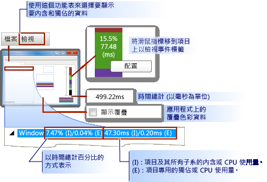
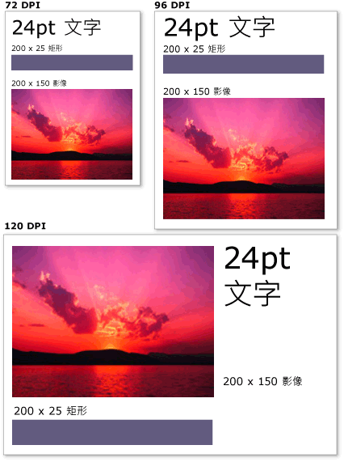

# WPF 圖形轉譯概觀WPF Graphics Rendering Overview
本主題提供 [!INCLUDE[TLA2#tla_winclient](../../../../includes/tla2sharptla-winclient-md.md)] 視覺圖層的概觀。This topic provides an overview of the [!INCLUDE[TLA2#tla_winclient](../../../../includes/tla2sharptla-winclient-md.md)] visual layer. 它著重於所扮演的角色<xref:System.Windows.Media.Visual>類別來呈現中的支援[!INCLUDE[TLA2#tla_winclient](../../../../includes/tla2sharptla-winclient-md.md)]模型。It focuses on the role of the <xref:System.Windows.Media.Visual> class for rendering support in the [!INCLUDE[TLA2#tla_winclient](../../../../includes/tla2sharptla-winclient-md.md)] model.  

   
## 視覺物件的角色Role of the Visual Object  
 <xref:System.Windows.Media.Visual>類別是基本抽象，從中每<xref:System.Windows.FrameworkElement>物件衍生。The <xref:System.Windows.Media.Visual> class is the basic abstraction from which every <xref:System.Windows.FrameworkElement> object derives. 它也作為在 [!INCLUDE[TLA2#tla_winclient](../../../../includes/tla2sharptla-winclient-md.md)] 中撰寫新控制項的進入點，且在許多方面，可以視為 Win32 應用程式模型中的視窗控制代碼 (HWND)。It also serves as the entry point for writing new controls in [!INCLUDE[TLA2#tla_winclient](../../../../includes/tla2sharptla-winclient-md.md)], and in many ways can be thought of as the window handle (HWND) in the Win32 application model.  
  
 <xref:System.Windows.Media.Visual>物件是核心[!INCLUDE[TLA2#tla_winclient](../../../../includes/tla2sharptla-winclient-md.md)]物件，其主要角色是提供轉譯支援。The <xref:System.Windows.Media.Visual> object is a core [!INCLUDE[TLA2#tla_winclient](../../../../includes/tla2sharptla-winclient-md.md)] object, whose primary role is to provide rendering support. 使用者介面控制項，例如<xref:System.Windows.Controls.Button>並<xref:System.Windows.Controls.TextBox>，衍生自<xref:System.Windows.Media.Visual>類別，並使用它來保存其轉譯資料。User interface controls, such as <xref:System.Windows.Controls.Button> and <xref:System.Windows.Controls.TextBox>, derive from the <xref:System.Windows.Media.Visual> class, and use it for persisting their rendering data. <xref:System.Windows.Media.Visual>物件提供下列支援：The <xref:System.Windows.Media.Visual> object provides support for:  
  
- 輸出顯示：轉譯保存、 序列化 visual 的繪圖內容。Output display: Rendering the persisted, serialized drawing content of a visual.  
  
- 轉換：在 視覺效果上執行轉換。Transformations: Performing transformations on a visual.  
  
- 裁剪：提供視覺效果的裁剪區域支援。Clipping: Providing clipping region support for a visual.  
  
- 點擊測試：判斷座標或幾何是否包含視覺項目的界限內。Hit testing: Determining whether a coordinate or geometry is contained within the bounds of a visual.  
  
- 週框方塊計算：判斷視覺效果的週框矩形。Bounding box calculations: Determining the bounding rectangle of a visual.  
  
 不過，<xref:System.Windows.Media.Visual>物件不包含支援非轉譯功能，例如：However, the <xref:System.Windows.Media.Visual> object does not include support for non-rendering features, such as:  
  
- 事件處理Event handling  
  
- 配置Layout  
  
- 樣式Styles  
  
- 資料繫結Data binding  
  
- 全球化Globalization  
  
 <xref:System.Windows.Media.Visual> 會公開為公用抽象類別必須從中衍生子類別。<xref:System.Windows.Media.Visual> is exposed as a public abstract class from which child classes must be derived. 下圖顯示 [!INCLUDE[TLA2#tla_winclient](../../../../includes/tla2sharptla-winclient-md.md)] 中公開之視覺物件的階層。The following illustration shows the hierarchy of the visual objects that are exposed in [!INCLUDE[TLA2#tla_winclient](../../../../includes/tla2sharptla-winclient-md.md)].  
  
     
  
### DrawingVisual 類別DrawingVisual Class  
 <xref:System.Windows.Media.DrawingVisual>的輕量型繪圖類別，用來呈現圖形、 影像或文字。The <xref:System.Windows.Media.DrawingVisual> is a lightweight drawing class that is used to render shapes, images, or text. 此類別之所以被視為輕量型，是因為它不提供版面配置或事件處理，而這會改善其執行階段效能。This class is considered lightweight because it does not provide layout or event handling, which improves its runtime performance. 基於此原因，繪圖適合背景或美工圖案。For this reason, drawings are ideal for backgrounds and clip art. <xref:System.Windows.Media.DrawingVisual>可用來建立自訂的視覺物件。The <xref:System.Windows.Media.DrawingVisual> can be used to create a custom visual object. 如需詳細資訊，請參閱[使用 DrawingVisual 物件](using-drawingvisual-objects.md)。For more information, see [Using DrawingVisual Objects](using-drawingvisual-objects.md).  
  
### Viewport3DVisual 類別Viewport3DVisual Class  
 <xref:System.Windows.Media.Media3D.Viewport3DVisual>提供 2D 之間的橋樑<xref:System.Windows.Media.Visual>和<xref:System.Windows.Media.Media3D.Visual3D>物件。The <xref:System.Windows.Media.Media3D.Viewport3DVisual> provides a bridge between 2D <xref:System.Windows.Media.Visual> and <xref:System.Windows.Media.Media3D.Visual3D> objects. <xref:System.Windows.Media.Media3D.Visual3D>類別是所有 3D 視覺元素的基底類別。The <xref:System.Windows.Media.Media3D.Visual3D> class is the base class for all 3D visual elements. <xref:System.Windows.Media.Media3D.Viewport3DVisual>會要求您定義<xref:System.Windows.Media.Media3D.Viewport3DVisual.Camera%2A>值並<xref:System.Windows.Media.Media3D.Viewport3DVisual.Viewport%2A>值。The <xref:System.Windows.Media.Media3D.Viewport3DVisual> requires that you define a <xref:System.Windows.Media.Media3D.Viewport3DVisual.Camera%2A> value and a <xref:System.Windows.Media.Media3D.Viewport3DVisual.Viewport%2A> value. 相機可讓您檢視場景。The camera allows you to view the scene. 檢視區會建立投影到 2D 平面上的對應位置。The viewport establishes where the projection maps onto the 2D surface. 如需 [!INCLUDE[TLA2#tla_winclient](../../../../includes/tla2sharptla-winclient-md.md)] 中 3D 的詳細資訊，請參閱 [3D 圖形概觀](3-d-graphics-overview.md)。For more information on 3D in [!INCLUDE[TLA2#tla_winclient](../../../../includes/tla2sharptla-winclient-md.md)], see [3-D Graphics Overview](3-d-graphics-overview.md).  
  
### ContainerVisual 類別ContainerVisual Class  
 <xref:System.Windows.Media.ContainerVisual>類別的集合時，可做為容器<xref:System.Windows.Media.Visual>物件。The <xref:System.Windows.Media.ContainerVisual> class is used as a container for a collection of <xref:System.Windows.Media.Visual> objects. <xref:System.Windows.Media.DrawingVisual>類別衍生自<xref:System.Windows.Media.ContainerVisual>類別，使其可包含視覺物件的集合。The <xref:System.Windows.Media.DrawingVisual> class derives from the <xref:System.Windows.Media.ContainerVisual> class, allowing it to contain a collection of visual objects.  
  
### 視覺物件中的繪圖內容Drawing Content in Visual Objects  
 A<xref:System.Windows.Media.Visual>物件會儲存為其轉譯資料**向量圖形指示清單**。A <xref:System.Windows.Media.Visual> object stores its render data as a **vector graphics instruction list**. 指示清單中的每個項目代表一組低階圖形資料和相關聯的序列化格式的資源。Each item in the instruction list represents a low-level set of graphics data and associated resources in a serialized format. 可包含繪圖內容的轉譯資料有四種不同的類型。There are four different types of render data that can contain drawing content.  
  
|繪圖內容類型Drawing content type|描述Description|  
|--------------------------|-----------------|  
|向量圖形Vector graphics|代表向量圖形資料，以及任何相關聯<xref:System.Windows.Media.Brush>和<xref:System.Windows.Media.Pen>資訊。Represents vector graphics data, and any associated <xref:System.Windows.Media.Brush> and <xref:System.Windows.Media.Pen> information.|  
|ImageImage|表示所定義的區域內的影像<xref:System.Windows.Rect>。Represents an image within a region defined by a <xref:System.Windows.Rect>.|  
|圖像Glyph|代表轉譯的繪圖<xref:System.Windows.Media.GlyphRun>，這是一系列字符，從指定的字型資源。Represents a drawing that renders a <xref:System.Windows.Media.GlyphRun>, which is a sequence of glyphs from a specified font resource. 這是文字的表現方式。This is how text is represented.|  
|視訊Video|代表轉譯視訊的繪圖。Represents a drawing that renders video.|  
  
 <xref:System.Windows.Media.DrawingContext>可讓您填入<xref:System.Windows.Media.Visual>視覺內容。The <xref:System.Windows.Media.DrawingContext> allows you to populate a <xref:System.Windows.Media.Visual> with visual content. 當您使用<xref:System.Windows.Media.DrawingContext>物件的繪製命令，您實際上儲存一組稍後會由圖形系統的轉譯資料; 您不繪製即時在畫面。When you use a <xref:System.Windows.Media.DrawingContext> object's draw commands, you are actually storing a set of render data that will later be used by the graphics system; you are not drawing to the screen in real-time.  
  
 當您建立[!INCLUDE[TLA2#tla_winclient](../../../../includes/tla2sharptla-winclient-md.md)]控制項，例如<xref:System.Windows.Controls.Button>，控制項會以隱含方式產生自行繪製的轉譯資料。When you create a [!INCLUDE[TLA2#tla_winclient](../../../../includes/tla2sharptla-winclient-md.md)] control, such as a <xref:System.Windows.Controls.Button>, the control implicitly generates render data for drawing itself. 例如，設定<xref:System.Windows.Controls.ContentControl.Content%2A>屬性<xref:System.Windows.Controls.Button>使控制項儲存圖像的轉譯表示法。For example, setting the <xref:System.Windows.Controls.ContentControl.Content%2A> property of the <xref:System.Windows.Controls.Button> causes the control to store a rendering representation of a glyph.  
  
 A<xref:System.Windows.Media.Visual>將一個或多個其內容描述<xref:System.Windows.Media.Drawing>內所含物件<xref:System.Windows.Media.DrawingGroup>。A <xref:System.Windows.Media.Visual> describes its content as one or more <xref:System.Windows.Media.Drawing> objects contained within a <xref:System.Windows.Media.DrawingGroup>. A<xref:System.Windows.Media.DrawingGroup>也會說明不透明度遮罩、 轉換、 點陣圖效果以及其他會套用至其內容的作業。A <xref:System.Windows.Media.DrawingGroup> also describes opacity masks, transforms, bitmap effects, and other operations that are applied to its contents. <xref:System.Windows.Media.DrawingGroup> 轉譯內容時，作業會依下列順序套用： <xref:System.Windows.Media.DrawingGroup.OpacityMask%2A>， <xref:System.Windows.Media.DrawingGroup.Opacity%2A>， <xref:System.Windows.Media.DrawingGroup.BitmapEffect%2A>， <xref:System.Windows.Media.DrawingGroup.ClipGeometry%2A>， <xref:System.Windows.Media.DrawingGroup.GuidelineSet%2A>，然後<xref:System.Windows.Media.DrawingGroup.Transform%2A>。<xref:System.Windows.Media.DrawingGroup> operations are applied in the following order when content is rendered: <xref:System.Windows.Media.DrawingGroup.OpacityMask%2A>, <xref:System.Windows.Media.DrawingGroup.Opacity%2A>, <xref:System.Windows.Media.DrawingGroup.BitmapEffect%2A>, <xref:System.Windows.Media.DrawingGroup.ClipGeometry%2A>, <xref:System.Windows.Media.DrawingGroup.GuidelineSet%2A>, and then <xref:System.Windows.Media.DrawingGroup.Transform%2A>.  
  
 下圖中顯示的順序<xref:System.Windows.Media.DrawingGroup>轉譯序列期間套用作業。The following illustration shows the order in which <xref:System.Windows.Media.DrawingGroup> operations are applied during the rendering sequence.  
  
   
DrawingGroup 作業的順序Order of DrawingGroup operations  
  
 如需詳細資訊，請參閱[繪製物件概觀](drawing-objects-overview.md)。For more information, see [Drawing Objects Overview](drawing-objects-overview.md).  
  
#### 視覺圖層的繪圖內容Drawing Content at the Visual Layer  
 您永遠不會直接具現化<xref:System.Windows.Media.DrawingContext>; 您也可以不過，向繪製的內容從特定的方法，例如<xref:System.Windows.Media.DrawingGroup.Open%2A?displayProperty=nameWithType>和<xref:System.Windows.Media.DrawingVisual.RenderOpen%2A?displayProperty=nameWithType>。You never directly instantiate a <xref:System.Windows.Media.DrawingContext>; you can, however, acquire a drawing context from certain methods, such as <xref:System.Windows.Media.DrawingGroup.Open%2A?displayProperty=nameWithType> and <xref:System.Windows.Media.DrawingVisual.RenderOpen%2A?displayProperty=nameWithType>. 下列範例會擷取<xref:System.Windows.Media.DrawingContext>從<xref:System.Windows.Media.DrawingVisual>並使用它來繪製矩形。The following example retrieves a <xref:System.Windows.Media.DrawingContext> from a <xref:System.Windows.Media.DrawingVisual> and uses it to draw a rectangle.  
  
 [!code-csharp[drawingvisualsample#101](~/samples/snippets/csharp/VS_Snippets_Wpf/DrawingVisualSample/CSharp/Window1.xaml.cs#101)]
 [!code-vb[drawingvisualsample#101](~/samples/snippets/visualbasic/VS_Snippets_Wpf/DrawingVisualSample/visualbasic/window1.xaml.vb#101)]  
  
#### 列舉視覺圖層的繪圖內容Enumerating Drawing Content at the Visual Layer  
 其他用途，除了<xref:System.Windows.Media.Drawing>物件也會提供物件模型來列舉內容<xref:System.Windows.Media.Visual>。In addition to their other uses, <xref:System.Windows.Media.Drawing> objects also provide an object model for enumerating the contents of a <xref:System.Windows.Media.Visual>.  
  
> [!NOTE]
>  當您要列舉的視覺效果內容時，您要擷取<xref:System.Windows.Media.Drawing>物件和不基礎表示法的轉譯資料作為向量圖形指示清單。When you are enumerating the contents of the visual, you are retrieving <xref:System.Windows.Media.Drawing> objects, and not the underlying representation of the render data as a vector graphics instruction list.  
  
 下列範例會使用<xref:System.Windows.Media.VisualTreeHelper.GetDrawing%2A>方法來擷取<xref:System.Windows.Media.DrawingGroup>的值<xref:System.Windows.Media.Visual>並列舉它。The following example uses the <xref:System.Windows.Media.VisualTreeHelper.GetDrawing%2A> method to retrieve the <xref:System.Windows.Media.DrawingGroup> value of a <xref:System.Windows.Media.Visual> and enumerate it.  
  
 [!code-csharp[DrawingMiscSnippets_snip#GraphicsMMRetrieveDrawings](~/samples/snippets/csharp/VS_Snippets_Wpf/DrawingMiscSnippets_snip/CSharp/EnumerateDrawingsExample.xaml.cs#graphicsmmretrievedrawings)]  
  
   
## 視覺物件如何用來建置控制項How Visual Objects are Used to Build Controls  
 [!INCLUDE[TLA2#tla_winclient](../../../../includes/tla2sharptla-winclient-md.md)] 中的許多物件是由其他視覺物件所組成，這表示它們可以包含不同的子系物件階層。Many of the objects in [!INCLUDE[TLA2#tla_winclient](../../../../includes/tla2sharptla-winclient-md.md)] are composed of other visual objects, meaning they can contain varying hierarchies of descendant objects. [!INCLUDE[TLA2#tla_winclient](../../../../includes/tla2sharptla-winclient-md.md)] 中的許多使用者介面元素 (例如控制項) 是由多個視覺物件所組成，代表不同類型的轉譯元素。Many of the user interface elements in [!INCLUDE[TLA2#tla_winclient](../../../../includes/tla2sharptla-winclient-md.md)], such as controls, are composed of multiple visual objects, representing different types of rendering elements. 例如，<xref:System.Windows.Controls.Button>控制項可以包含多個其他物件，包括<xref:Microsoft.Windows.Themes.ClassicBorderDecorator>， <xref:System.Windows.Controls.ContentPresenter>，和<xref:System.Windows.Controls.TextBlock>。For example, the <xref:System.Windows.Controls.Button> control can contain a number of other objects, including <xref:Microsoft.Windows.Themes.ClassicBorderDecorator>, <xref:System.Windows.Controls.ContentPresenter>, and <xref:System.Windows.Controls.TextBlock>.  
  
 下列程式碼示範<xref:System.Windows.Controls.Button>標記中定義的控制項。The following code shows a <xref:System.Windows.Controls.Button> control defined in markup.  
  
 [!code-xaml[VisualsOverview#VisualsOverviewSnippet1](~/samples/snippets/csharp/VS_Snippets_Wpf/VisualsOverview/CSharp/Window1.xaml#visualsoverviewsnippet1)]  
  
 如果您是要列舉組成預設值的視覺物件<xref:System.Windows.Controls.Button>控制項，您會發現下面說明的視覺物件的階層：If you were to enumerate the visual objects that comprise the default <xref:System.Windows.Controls.Button> control, you would find the hierarchy of visual objects illustrated below:  
  
  
  
 <xref:System.Windows.Controls.Button>控制項包含<xref:Microsoft.Windows.Themes.ClassicBorderDecorator>項目，依序包含<xref:System.Windows.Controls.ContentPresenter>項目。The <xref:System.Windows.Controls.Button> control contains a <xref:Microsoft.Windows.Themes.ClassicBorderDecorator> element, which in turn, contains a <xref:System.Windows.Controls.ContentPresenter> element. <xref:Microsoft.Windows.Themes.ClassicBorderDecorator>項目會負責繪製框線和背景<xref:System.Windows.Controls.Button>。The <xref:Microsoft.Windows.Themes.ClassicBorderDecorator> element is responsible for drawing a border and a background for the <xref:System.Windows.Controls.Button>. <xref:System.Windows.Controls.ContentPresenter>項目會負責顯示的內容<xref:System.Windows.Controls.Button>。The <xref:System.Windows.Controls.ContentPresenter> element is responsible for displaying the contents of the <xref:System.Windows.Controls.Button>. 在此情況下，因為您要顯示文字<xref:System.Windows.Controls.ContentPresenter>項目包含<xref:System.Windows.Controls.TextBlock>項目。In this case, since you are displaying text, the <xref:System.Windows.Controls.ContentPresenter> element contains a <xref:System.Windows.Controls.TextBlock> element. 事實上，<xref:System.Windows.Controls.Button>控制項會使用<xref:System.Windows.Controls.ContentPresenter>表示無法被其他項目，表示內容，例如<xref:System.Windows.Controls.Image>或幾何，例如<xref:System.Windows.Media.EllipseGeometry>。The fact that the <xref:System.Windows.Controls.Button> control uses a <xref:System.Windows.Controls.ContentPresenter> means that the content could be represented by other elements, such as an <xref:System.Windows.Controls.Image> or a geometry, such as an <xref:System.Windows.Media.EllipseGeometry>.  
  
### 控制項範本Control Templates  
 展開為控制項的控制項階層的關鍵在於<xref:System.Windows.Controls.ControlTemplate>。The key to the expansion of a control into a hierarchy of controls is the <xref:System.Windows.Controls.ControlTemplate>. 控制項範本會指定控制項的預設視覺階層。A control template specifies the default visual hierarchy for a control. 當您明確地參考控制項時，您會以隱含方式參考其視覺階層。When you explicitly reference a control, you implicitly reference its visual hierarchy. 您可以覆寫控制項範本的預設值，以針對控制項建立自訂視覺外觀。You can override the default values for a control template to create a customized visual appearance for a control. 例如，您可以修改的背景色彩值<xref:System.Windows.Controls.Button>控制項，讓它使用線性漸層色彩值，而不是純色值。For example, you could modify the background color value of the <xref:System.Windows.Controls.Button> control so that it uses a linear gradient color value instead of a solid color value. 如需詳細資訊，請參閱[按鈕樣式和範本](../controls/button-styles-and-templates.md)。For more information, see [Button Styles and Templates](../controls/button-styles-and-templates.md).  
  
 使用者介面項目，例如<xref:System.Windows.Controls.Button>控制項，包含數個向量圖形指示清單描述控制項的整個轉譯定義。A user interface element, such as a <xref:System.Windows.Controls.Button> control, contains several vector graphics instruction lists that describe the entire rendering definition of a control. 下列程式碼示範<xref:System.Windows.Controls.Button>標記中定義的控制項。The following code shows a <xref:System.Windows.Controls.Button> control defined in markup.  
  
 [!code-xaml[VisualsOverview#VisualsOverviewSnippet2](~/samples/snippets/csharp/VS_Snippets_Wpf/VisualsOverview/CSharp/Window1.xaml#visualsoverviewsnippet2)]  
  
 如果您要列舉視覺物件和向量圖形指示清單構成<xref:System.Windows.Controls.Button>控制項，您會發現下面說明的物件的階層：If you were to enumerate the visual objects and vector graphics instruction lists that comprise the <xref:System.Windows.Controls.Button> control, you would find the hierarchy of objects illustrated below:  
  
   
  
 <xref:System.Windows.Controls.Button>控制項包含<xref:Microsoft.Windows.Themes.ClassicBorderDecorator>項目，依序包含<xref:System.Windows.Controls.ContentPresenter>項目。The <xref:System.Windows.Controls.Button> control contains a <xref:Microsoft.Windows.Themes.ClassicBorderDecorator> element, which in turn, contains a <xref:System.Windows.Controls.ContentPresenter> element. <xref:Microsoft.Windows.Themes.ClassicBorderDecorator>元素負責繪製所有離散圖形元素組成的框線和按鈕的背景。The <xref:Microsoft.Windows.Themes.ClassicBorderDecorator> element is responsible for drawing all the discrete graphic elements that make up the border and background of a button. <xref:System.Windows.Controls.ContentPresenter>項目會負責顯示的內容<xref:System.Windows.Controls.Button>。The <xref:System.Windows.Controls.ContentPresenter> element is responsible for displaying the contents of the <xref:System.Windows.Controls.Button>. 在此情況下，因為您顯示影像時才<xref:System.Windows.Controls.ContentPresenter>項目包含<xref:System.Windows.Controls.Image>項目。In this case, since you are displaying an image, the <xref:System.Windows.Controls.ContentPresenter> element contains a <xref:System.Windows.Controls.Image> element.  
  
 關於視覺物件的階層和向量圖形指示清單，有幾點需要注意：There are a number of points to note about the hierarchy of visual objects and vector graphics instruction lists:  
  
- 階層中的順序代表繪製資訊的轉譯順序。The ordering in the hierarchy represents the rendering order of the drawing information. 子元素會由左至右、由上而下從根視覺元素周遊。From the root visual element, child elements are traversed, left to right, top to bottom. 如果某元素具有視覺化子元素，則會在元素的同層級元素之前周遊這些子元素。If an element has visual child elements, they are traversed before the element’s siblings.  
  
- 非分葉節點項目，在階層中，例如<xref:System.Windows.Controls.ContentPresenter>，用來包含子元素 — 它們不包含指示清單。Non-leaf node elements in the hierarchy, such as <xref:System.Windows.Controls.ContentPresenter>, are used to contain child elements—they do not contain instruction lists.  
  
- 如果視覺元素同時包含向量圖形指示清單與視覺子元素，父系視覺元素中的指示清單就會在任何視覺子元素物件中的繪圖之前轉譯。If a visual element contains both a vector graphics instruction list and visual children, the instruction list in the parent visual element is rendered before drawings in any of the visual child objects.  
  
- 向量圖形指示清單中的項目會由左至右轉譯。The items in the vector graphics instruction list are rendered left to right.  
  
   
## 視覺化樹狀結構Visual Tree  
 視覺化樹狀結構包含應用程式使用者介面中所使用的所有視覺元素。The visual tree contains all visual elements used in an application's user interface. 由於視覺元素包含持續性繪圖資訊，您可以將視覺化樹狀結構想像為場景圖形，其中包含將輸出撰寫至顯示裝置所需的所有轉譯資訊。Since a visual element contains persisted drawing information, you can think of the visual tree as a scene graph, containing all the rendering information needed to compose the output to the display device. 此樹狀結構是直接由應用程式所建立 (不論是以程式碼或標記) 的所有視覺元素累積而成。This tree is the accumulation of all visual elements created directly by the application, whether in code or in markup. 視覺化樹狀結構也包含由元素 (例如控制項和資料物件) 的範本展開所建立的所有視覺元素。The visual tree also contains all visual elements created by the template expansion of elements such as controls and data objects.  
  
 下列程式碼示範<xref:System.Windows.Controls.StackPanel>標記中定義的項目。The following code shows a <xref:System.Windows.Controls.StackPanel> element defined in markup.  
  
 [!code-xaml[VisualsOverview#VisualsOverviewSnippet3](~/samples/snippets/csharp/VS_Snippets_Wpf/VisualsOverview/CSharp/Window1.xaml#visualsoverviewsnippet3)]  
  
 如果您是要列舉組成的視覺物件<xref:System.Windows.Controls.StackPanel>標記範例中的項目，您會發現下面說明的視覺物件的階層：If you were to enumerate the visual objects that comprise the <xref:System.Windows.Controls.StackPanel> element in the markup example, you would find the hierarchy of visual objects illustrated below:  
  
   
  
### 轉譯順序Rendering Order  
 視覺化樹狀結構會決定 [!INCLUDE[TLA2#tla_winclient](../../../../includes/tla2sharptla-winclient-md.md)] 視覺物件和繪圖物件的轉譯順序。The visual tree determines the rendering order of [!INCLUDE[TLA2#tla_winclient](../../../../includes/tla2sharptla-winclient-md.md)] visual and drawing objects. 周遊順序會從根視覺物件開始，這是視覺化樹狀結構的最上層節點。The order of traversal starts with the root visual, which is the top-most node in the visual tree. 然後，會由左至右周遊根視覺物件的子系。The root visual’s children are then traversed, left to right. 如果視覺物件具有子系，則會在該視覺物件的同層級項目之前周遊其子系。If a visual has children, its children are traversed before the visual’s siblings. 這表示子視覺物件的內容會在視覺物件本身的內容前面轉譯。This means that the content of a child visual is rendered in front of the visual's own content.  
  
  
  
### 根視覺物件Root Visual  
 「根視覺物件」是視覺化樹狀結構階層中最上層的元素。The **root visual** is the top-most element in a visual tree hierarchy. 在大部分的應用程式，根視覺的基底類別是<xref:System.Windows.Window>或<xref:System.Windows.Navigation.NavigationWindow>。In most applications, the base class of the root visual is either <xref:System.Windows.Window> or <xref:System.Windows.Navigation.NavigationWindow>. 不過，如果您已在 Win32 應用程式中裝載視覺物件，根視覺物件是您在 Win32 視窗中裝載的最上層視覺物件。However, if you were hosting visual objects in a Win32 application, the root visual would be the top-most visual you were hosting in the Win32 window. 如需詳細資訊，請參閱[教學課程：裝載在 Win32 應用程式中的視覺物件](tutorial-hosting-visual-objects-in-a-win32-application.md)。For more information, see [Tutorial: Hosting Visual Objects in a Win32 Application](tutorial-hosting-visual-objects-in-a-win32-application.md).  
  
### 邏輯樹狀結構的關聯性Relationship to the Logical Tree  
 [!INCLUDE[TLA2#tla_winclient](../../../../includes/tla2sharptla-winclient-md.md)] 中的邏輯樹狀結構代表執行階段應用程式的元素。The logical tree in [!INCLUDE[TLA2#tla_winclient](../../../../includes/tla2sharptla-winclient-md.md)] represents the elements of an application at run time. 雖然您不會直接操作此樹狀結構，但應用程式的這個檢視適合用來了解屬性繼承和事件路由。Although you do not manipulate this tree directly, this view of the application is useful for understanding property inheritance and event routing. 不同於視覺化樹狀結構中，邏輯樹狀結構可以代表非視覺化資料物件，例如<xref:System.Windows.Documents.ListItem>。Unlike the visual tree, the logical tree can represent non-visual data objects, such as <xref:System.Windows.Documents.ListItem>. 在許多案例中，邏輯樹狀結構會非常密切地對應至應用程式的標記定義。In many cases, the logical tree maps very closely to an application's markup definitions. 下列程式碼示範<xref:System.Windows.Controls.DockPanel>標記中定義的項目。The following code shows a <xref:System.Windows.Controls.DockPanel> element defined in markup.  
  
 [!code-xaml[VisualsOverview#VisualsOverviewSnippet5](~/samples/snippets/csharp/VS_Snippets_Wpf/VisualsOverview/CSharp/Window1.xaml#visualsoverviewsnippet5)]  
  
 如果您是要列舉組成的邏輯物件<xref:System.Windows.Controls.DockPanel>標記範例中的項目，您會發現下面說明的邏輯物件的階層：If you were to enumerate the logical objects that comprise the <xref:System.Windows.Controls.DockPanel> element in the markup example, you would find the hierarchy of logical objects illustrated below:  
  
   
邏輯樹狀結構的圖表Diagram of logical tree  
  
 視覺化樹狀結構和邏輯樹狀結構會與目前的應用程式元素集合同步處理，以反映元素的任何新增、刪除或修改。Both the visual tree and logical tree are synchronized with the current set of application elements, reflecting any addition, deletion, or modification of elements. 不過，樹狀結構會呈現不同的應用程式檢視。However, the trees present different views of the application. 不同於視覺化樹狀結構中，邏輯樹狀結構不會展開控制項的<xref:System.Windows.Controls.ContentPresenter>項目。Unlike the visual tree, the logical tree does not expand a control's <xref:System.Windows.Controls.ContentPresenter> element. 這表示針對相同的物件集合，邏輯樹狀結構和視覺化樹狀結構之間沒有直接的一對一對應。This means there is not a direct one-to-one correspondence between a logical tree and a visual tree for the same set of objects. 事實上，叫用**LogicalTreeHelper**物件的<xref:System.Windows.LogicalTreeHelper.GetChildren%2A>方法和**VisualTreeHelper**物件的<xref:System.Windows.Media.VisualTreeHelper.GetChild%2A>方法使用相同的項目，因為參數會產生不同的結果.In fact, invoking the **LogicalTreeHelper** object's <xref:System.Windows.LogicalTreeHelper.GetChildren%2A> method and the **VisualTreeHelper** object's <xref:System.Windows.Media.VisualTreeHelper.GetChild%2A> method using the same element as a parameter yields differing results.  
  
 如需有關邏輯樹狀結構的詳細資訊，請參閱 [WPF 中的樹狀結構](../advanced/trees-in-wpf.md)。For more information on the logical tree, see [Trees in WPF](../advanced/trees-in-wpf.md).  
  
### 使用 XamlPad 檢視視覺化樹狀結構Viewing the Visual Tree with XamlPad  
 [!INCLUDE[TLA2#tla_winclient](../../../../includes/tla2sharptla-winclient-md.md)] 工具 XamlPad 提供了選項，可讓您檢視及探索對應至目前定義之 [!INCLUDE[TLA#tla_titlexaml](../../../../includes/tlasharptla-titlexaml-md.md)] 內容的視覺化樹狀結構。The [!INCLUDE[TLA2#tla_winclient](../../../../includes/tla2sharptla-winclient-md.md)] tool, XamlPad, provides an option for viewing and exploring the visual tree that corresponds to the currently defined [!INCLUDE[TLA#tla_titlexaml](../../../../includes/tlasharptla-titlexaml-md.md)] content. 按一下功能表列上的 [顯示視覺化樹狀結構] 按鈕以顯示視覺化樹狀結構。Click the **Show Visual Tree** button on the menu bar to display the visual tree. 下圖說明在 XamlPad 的 [視覺化樹狀結構總管] 面板中，[!INCLUDE[TLA#tla_titlexaml](../../../../includes/tlasharptla-titlexaml-md.md)] 內容展開為視覺化樹狀結構節點：The following illustrates the expansion of [!INCLUDE[TLA#tla_titlexaml](../../../../includes/tlasharptla-titlexaml-md.md)] content into visual tree nodes in the **Visual Tree Explorer** panel of XamlPad:  
  
   

 請注意如何<xref:System.Windows.Controls.Label>， <xref:System.Windows.Controls.TextBox>，並<xref:System.Windows.Controls.Button>每個控制項會顯示在個別的視覺物件階層**視覺化樹狀結構總管**XamlPad 的面板。Notice how the <xref:System.Windows.Controls.Label>, <xref:System.Windows.Controls.TextBox>, and <xref:System.Windows.Controls.Button> controls each display a separate visual object hierarchy in the **Visual Tree Explorer** panel of XamlPad. 這是因為[!INCLUDE[TLA2#tla_winclient](../../../../includes/tla2sharptla-winclient-md.md)]控制項有<xref:System.Windows.Controls.ControlTemplate>包含該控制項的視覺化樹狀結構。This is because [!INCLUDE[TLA2#tla_winclient](../../../../includes/tla2sharptla-winclient-md.md)] controls have a <xref:System.Windows.Controls.ControlTemplate> that contains the visual tree of that control. 當您明確地參考控制項時，您會以隱含方式參考其視覺階層。When you explicitly reference a control, you implicitly reference its visual hierarchy.  
  
### 分析視覺效能Profiling Visual Performance  
 [!INCLUDE[TLA2#tla_winclient](../../../../includes/tla2sharptla-winclient-md.md)] 提供一套效能分析工具，可讓您分析應用程式的執行階段行為，並判斷您可以套用的效能最佳化類型。provides a suite of performance profiling tools that allow you to analyze the run-time behavior of your application and determine the types of performance optimizations you can apply. Visual Profiler 工具透過直接對應至應用程式的視覺化樹狀結構，提供豐富的效能資料的圖形化檢視。The Visual Profiler tool provides a rich, graphical view of performance data by mapping directly to the application's visual tree. 在這個螢幕擷取畫面中，Visual Profiler 的 [CPU 使用量] 區段可提供您物件使用 [!INCLUDE[TLA2#tla_winclient](../../../../includes/tla2sharptla-winclient-md.md)] 服務的精確分析，例如轉譯和版面配置。In this screenshot, the **CPU Usage** section of the Visual Profiler gives you a precise breakdown of an object's use of [!INCLUDE[TLA2#tla_winclient](../../../../includes/tla2sharptla-winclient-md.md)] services, such as rendering and layout.  
  
   
Visual Profiler 顯示輸出Visual Profiler display output  
  
   
## Visual 轉譯行為Visual Rendering Behavior  
 [!INCLUDE[TLA2#tla_winclient](../../../../includes/tla2sharptla-winclient-md.md)] 導入幾個會影響視覺物件轉譯行為的功能：保留模式圖形、向量圖形和裝置獨立圖形。introduces several features that affect the rendering behavior of visual objects: retained mode graphics, vector graphics, and device independent graphics.  
  
### 保留模式圖形Retained Mode Graphics  
 了解視覺物件角色的其中一個關鍵就是要了解「直接模式」和「保留模式」圖形系統之間的差異。One of the keys to understanding the role of the Visual object is to understand the difference between **immediate mode** and **retained mode** graphics systems. 以 GDI 或 GDI+ 為基礎的標準 Win32 應用程式使用直接模式圖形系統。A standard Win32 application based on GDI or GDI+ uses an immediate mode graphics system. 這表示應用程式負責重新繪製因為像是重新調整視窗大小或者物件正在變更其視覺外觀等動作而無效的用戶端區域部分。This means that the application is responsible for repainting the portion of the client area that is invalidated, due to an action such as a window being resized, or an object changing its visual appearance.  
  
   
  
 相反地，[!INCLUDE[TLA2#tla_winclient](../../../../includes/tla2sharptla-winclient-md.md)] 使用保留模式系統。In contrast, [!INCLUDE[TLA2#tla_winclient](../../../../includes/tla2sharptla-winclient-md.md)] uses a retained mode system. 這表示具有視覺外觀的應用程式物件會定義一組序列化繪圖資料。This means application objects that have a visual appearance define a set of serialized drawing data. 一旦定義繪圖資料，系統此後就會負責回應轉譯應用程式物件的所有重新繪製要求。Once the drawing data is defined, the system is responsible thereafter for responding to all repaint requests for rendering the application objects. 即使在執行階段，您也可以修改或建立應用程式物件，並仍需依賴系統以回應繪製要求。Even at run time, you can modify or create application objects, and still rely on the system for responding to paint requests. 保留模式圖形系統的能力在於繪製資訊一律由應用程式以序列化狀態持續保存，但是轉譯的責任屬於系統。The power in a retained mode graphics system is that drawing information is always persisted in a serialized state by the application, but rendering responsibility left to the system. 下圖顯示應用程式如何依賴 [!INCLUDE[TLA2#tla_winclient](../../../../includes/tla2sharptla-winclient-md.md)] 來回應繪製要求。The following diagram shows how the application relies on [!INCLUDE[TLA2#tla_winclient](../../../../includes/tla2sharptla-winclient-md.md)] for responding to paint requests.  
  
   

#### 智慧型重新繪製Intelligent Redrawing  
 使用保留模式圖形的一個最大的優點就是 [!INCLUDE[TLA2#tla_winclient](../../../../includes/tla2sharptla-winclient-md.md)] 可以有效地最佳化應用程式中需要重新繪製的項目。One of the biggest benefits in using retained mode graphics is that [!INCLUDE[TLA2#tla_winclient](../../../../includes/tla2sharptla-winclient-md.md)] can efficiently optimize what needs to be redrawn in the application. 即使您有一個具有不同層級不透明度的複雜場景，通常也不需要撰寫特殊用途程式碼來最佳化重新繪製作業。Even if you have a complex scene with varying levels of opacity, you generally do not need to write special-purpose code to optimize redrawing. 與 Win32 程式設計比較，在 Win32 程式設計中您可能會花費大量精力，透過將更新區域中重新繪製的次數降至最低，來最佳化您的應用程式上。Compare this with Win32 programming in which you can spend a great deal of effort in optimizing your application by minimizing the amount of redrawing in the update region. 如需在 Win32 應用程式中最佳化重新繪製所牽涉之複雜性類型的範例，請參閱[在更新區域中重新繪製](/windows/desktop/gdi/redrawing-in-the-update-region)。See [Redrawing in the Update Region](/windows/desktop/gdi/redrawing-in-the-update-region) for an example of the type of complexity involved in optimizing redrawing in Win32 applications.  
  
### 向量圖形Vector Graphics  
 [!INCLUDE[TLA2#tla_winclient](../../../../includes/tla2sharptla-winclient-md.md)] 使用「向量圖形」作為其轉譯資料格式。uses **vector graphics** as its rendering data format. 向量圖形 (包含可縮放向量圖形 (SVG)、Windows 中繼檔案 (.wmf) 和 TrueType 字型) 會儲存轉譯資料並將它以說明如何使用圖形基元重新建立影像的指示清單來傳輸。Vector graphics—which include Scalable Vector Graphics (SVG), Windows metafiles (.wmf), and TrueType fonts—store rendering data and transmit it as a list of instructions that describe how to recreate an image using graphics primitives. 例如，TrueType 字型是邊框字型，可描述一組線條、曲線和命令，而非像素陣列。For example, TrueType fonts are outline fonts that describe a set of lines, curves, and commands, rather than an array of pixels. 向量圖形的其中一個主要優點就是能夠縮放為任何大小和解析度。One of the key benefits of vector graphics is the ability to scale to any size and resolution.  
  
 與向量圖形不同，點陣圖圖形將轉譯資料儲存為影像的逐像素 (pixel-by-pixel) 表示法，針對特定解析度預先轉譯。Unlike vector graphics, bitmap graphics store rendering data as a pixel-by-pixel representation of an image, pre-rendered for a specific resolution. 點陣和向量圖形格式之間的其中一個主要差異是原始來源影像的逼真度。One of the key differences between bitmap and vector graphic formats is fidelity to the original source image. 例如，當來源影像的的大小經過修改，點陣圖圖形系統會伸展影像，而向量圖形系統則是縮放影像，因此保留影像逼真度。For example, when the size of a source image is modified, bitmap graphics systems stretch the image, whereas vector graphics systems scale the image, preserving the image fidelity.  
  
 下圖顯示已將大小調整為 300% 的來源影像。The following illustration shows a source image that has been resized by 300%. 請注意，當來源影像是以點陣圖圖形影像伸展而非以向量圖形影像縮放時，會出現扭曲。Notice the distortions that appear when the source image is stretched as a bitmap graphics image rather than scaled as a vector graphics image.  
  
   
  
 下列標記會顯示兩個<xref:System.Windows.Shapes.Path>定義的項目。The following markup shows two <xref:System.Windows.Shapes.Path> elements defined. 第二個項目使用<xref:System.Windows.Media.ScaleTransform>到第一個元素的繪製指示調整 300%。The second element uses a <xref:System.Windows.Media.ScaleTransform> to resize the drawing instructions of the first element by 300%. 請注意，中的繪製指示<xref:System.Windows.Shapes.Path>項目會保持不變。Notice that the drawing instructions in the <xref:System.Windows.Shapes.Path> elements remain unchanged.  
  
 [!code-xaml[VectorGraphicsSnippets#VectorGraphicsSnippet1](~/samples/snippets/csharp/VS_Snippets_Wpf/VectorGraphicsSnippets/CS/PageOne.xaml#vectorgraphicssnippet1)]  
  
### 有關解析度和裝置獨立圖形About Resolution and Device-Independent Graphics  
 決定螢幕上文字和圖形大小的系統因素有兩個：解析度和 DPI。There are two system factors that determine the size of text and graphics on your screen: resolution and DPI. 解析度描述螢幕上顯示的像素數目。Resolution describes the number of pixels that appear on the screen. 解析度越高，像素越小，使得圖形和文字看起來比較小。As the resolution gets higher, pixels get smaller, causing graphics and text to appear smaller. 顯示在設定為 1024 x 768 的監視器上的圖形，當解析度變更為 1600 x 1200 時，看起來會更小。A graphic displayed on a monitor set to 1024 x 768 will appear much smaller when the resolution is changed to 1600 x 1200.  
  
 另一個系統設定 DPI 則描述以像素為單位的畫面英吋大小。The other system setting, DPI, describes the size of a screen inch in pixels. 大部分 [!INCLUDE[TLA#tla_mswin](../../../../includes/tlasharptla-mswin-md.md)] 系統的 DPI 為 96，這表示畫面英吋為 96 像素。Most [!INCLUDE[TLA#tla_mswin](../../../../includes/tlasharptla-mswin-md.md)] systems have a DPI of 96, which means a screen inch is 96 pixels. 提高 DPI 設定會讓畫面英吋更大；降低 DPI 則讓畫面英吋更小。Increasing the DPI setting makes the screen inch larger; decreasing the DPI makes the screen inch smaller. 這表示畫面英吋與實際英吋不相同，在大部分的系統上，通常都不相同。This means that a screen inch isn't the same size as a real-world inch; on most systems, it's probably not. 當您提高 DPI，DPI 感知的圖形和文字會變得更大，因為您已經提高畫面英吋的大小。As you increase the DPI, DPI-aware graphics and text become larger because you've increased the size of the screen inch. 提高 DPI 可讓文字更方便閱讀，特別是在高解析度時。Increasing the DPI can make text easier to read, especially at high resolutions.  
  
 並非所有應用程式都是 DPI 感知：某些應用程式使用硬體像素作為主要度量單位；變更系統 DPI 不會影響這些應用程式。Not all applications are DPI-aware: some use hardware pixels as the primary unit of measurement; changing the system DPI has no effect on these applications. 許多其他的應用程式會使用 DPI 感知單位來描述字型大小，但是使用像素來描述所有其他項目。Many other applications use DPI-aware units to describe font sizes, but use pixels to describe everything else. DPI 太小或太大可能造成這些應用程式的版面配置問題，因為應用程式的文字是隨著系統的 DPI 設定縮放，但應用程式的 UI 則否。Making the DPI too small or too large can cause layout problems for these applications, because the applications' text scales with the system's DPI setting, but the applications' UI does not. 針對使用 [!INCLUDE[TLA2#tla_winclient](../../../../includes/tla2sharptla-winclient-md.md)] 開發的應用程式，此問題已解決。This problem has been eliminated for applications developed using [!INCLUDE[TLA2#tla_winclient](../../../../includes/tla2sharptla-winclient-md.md)].  
  
 [!INCLUDE[TLA2#tla_winclient](../../../../includes/tla2sharptla-winclient-md.md)] 支援自動縮放，方法是使用裝置獨立像素作為其主要度量單位，而非硬體像素；圖形和文字會適當地縮放，應用程式開發人員不需要執行任何額外工作。supports automatic scaling by using the device independent pixel as its primary unit of measurement, instead of hardware pixels; graphics and text scale properly without any extra work from the application developer. 下圖顯示以不同 DPI 設定顯示 [!INCLUDE[TLA2#tla_winclient](../../../../includes/tla2sharptla-winclient-md.md)] 文字和圖形之方式的範例。The following illustration shows an example of how [!INCLUDE[TLA2#tla_winclient](../../../../includes/tla2sharptla-winclient-md.md)] text and graphics are appear at different DPI settings.  
  
   
不同 DPI 設定時的圖形和文字Graphics and text at different DPI settings  
  
   
## VisualTreeHelper 類別VisualTreeHelper Class  
 <xref:System.Windows.Media.VisualTreeHelper>類別是靜態協助程式類別提供低階功能在視覺物件層級，這很適合在非常特定的情況下，例如開發高效能自訂控制項的程式設計。The <xref:System.Windows.Media.VisualTreeHelper> class is a static helper class that provides low-level functionality for programming at the visual object level, which is useful in very specific scenarios, such as developing high-performance custom controls. 在大部分情況下，較高層級[!INCLUDE[TLA2#tla_winclient](../../../../includes/tla2sharptla-winclient-md.md)]framework 物件，例如<xref:System.Windows.Controls.Canvas>和<xref:System.Windows.Controls.TextBlock>，提供更大的彈性和方便使用。In most case, the higher-level [!INCLUDE[TLA2#tla_winclient](../../../../includes/tla2sharptla-winclient-md.md)] framework objects, such as <xref:System.Windows.Controls.Canvas> and <xref:System.Windows.Controls.TextBlock>, offer greater flexibility and ease of use.  
  
### 點擊測試Hit Testing  
 <xref:System.Windows.Media.VisualTreeHelper>類別提供方法的點擊測試的視覺物件上，當預設點擊測試支援不符合您的需求。The <xref:System.Windows.Media.VisualTreeHelper> class provides methods for hit testing on visual objects when the default hit test support does not meet your needs. 您可以使用<xref:System.Windows.Media.VisualTreeHelper.HitTest%2A>中的方法<xref:System.Windows.Media.VisualTreeHelper>類別，以判斷幾何或點的座標值是否在指定的物件，例如控制項或圖形元素的界限內。You can use the <xref:System.Windows.Media.VisualTreeHelper.HitTest%2A> methods in the <xref:System.Windows.Media.VisualTreeHelper> class to determine whether a geometry or point coordinate value is within the boundary of a given object, such as a control or graphic element. 例如，您可以使用點擊測試來判斷物件的週框矩形內的滑鼠點擊是否落於圓形的幾何內。您也可以選擇覆寫預設點擊測試實作，以執行您的自訂點擊測試計算。For example, you could use hit testing to determine whether a mouse click within the bounding rectangle of an object falls within the geometry of a circle You can also choose to override the default implementation of hit testing to perform your own custom hit test calculations.  
  
 如需點擊測試的詳細資訊，請參閱[視覺分層中的點擊測試](hit-testing-in-the-visual-layer.md)。For more information on hit testing, see [Hit Testing in the Visual Layer](hit-testing-in-the-visual-layer.md).  
  
### 列舉視覺化樹狀結構Enumerating the Visual Tree  
 <xref:System.Windows.Media.VisualTreeHelper>類別會提供功能來列舉視覺化樹狀結構的成員。The <xref:System.Windows.Media.VisualTreeHelper> class provides functionality for enumerating the members of a visual tree. 若要擷取父代，請呼叫<xref:System.Windows.Media.VisualTreeHelper.GetParent%2A>方法。To retrieve a parent, call the <xref:System.Windows.Media.VisualTreeHelper.GetParent%2A> method. 若要擷取的子系或直接子系，視覺物件，呼叫<xref:System.Windows.Media.VisualTreeHelper.GetChild%2A>方法。To retrieve a child, or direct descendant, of a visual object, call the <xref:System.Windows.Media.VisualTreeHelper.GetChild%2A> method. 這個方法會傳回子系<xref:System.Windows.Media.Visual>的指定索引處的父系。This method returns a child <xref:System.Windows.Media.Visual> of the parent at the specified index.  
  
 下列範例示範如何列舉視覺物件的所有子系，如果您對將視覺物件階層的所有轉譯資訊序列化感興趣，這也會是您想要使用的技術。The following example shows how to enumerate all the descendants of a visual object, which is a technique you might want to use if you were interested in serializing all the rendering information of a visual object hierarchy.  
  
 [!code-csharp[VisualsOverview#101](~/samples/snippets/csharp/VS_Snippets_Wpf/VisualsOverview/CSharp/Window1.xaml.cs#101)]
 [!code-vb[VisualsOverview#101](~/samples/snippets/visualbasic/VS_Snippets_Wpf/VisualsOverview/visualbasic/window1.xaml.vb#101)]  
  
 在大部分案例中，邏輯樹狀結構是 [!INCLUDE[TLA2#tla_winclient](../../../../includes/tla2sharptla-winclient-md.md)] 應用程式中更有用的元素表示法。In most cases, the logical tree is a more useful representation of the elements in a [!INCLUDE[TLA2#tla_winclient](../../../../includes/tla2sharptla-winclient-md.md)] application. 雖然您不會直接修改邏輯樹狀結構，但應用程式的這個檢視適合用來了解屬性繼承和事件路由。Although you do not modify the logical tree directly, this view of the application is useful for understanding property inheritance and event routing. 不同於視覺化樹狀結構中，邏輯樹狀結構可以代表非視覺化資料物件，例如<xref:System.Windows.Documents.ListItem>。Unlike the visual tree, the logical tree can represent non-visual data objects, such as <xref:System.Windows.Documents.ListItem>. 如需有關邏輯樹狀結構的詳細資訊，請參閱 [WPF 中的樹狀結構](../advanced/trees-in-wpf.md)。For more information on the logical tree, see [Trees in WPF](../advanced/trees-in-wpf.md).  
  
 <xref:System.Windows.Media.VisualTreeHelper>類別提供方法來傳回視覺物件的週框矩形。The <xref:System.Windows.Media.VisualTreeHelper> class provides methods for returning the bounding rectangle of visual objects. 您可以藉由呼叫傳回的視覺物件的週框矩形<xref:System.Windows.Media.VisualTreeHelper.GetContentBounds%2A>。You can return the bounding rectangle of a visual object by calling <xref:System.Windows.Media.VisualTreeHelper.GetContentBounds%2A>. 您可以傳回視覺物件，包括視覺物件本身，藉由呼叫的所有子系的週框矩形<xref:System.Windows.Media.VisualTreeHelper.GetDescendantBounds%2A>。You can return the bounding rectangle of all the descendants of a visual object, including the visual object itself, by calling <xref:System.Windows.Media.VisualTreeHelper.GetDescendantBounds%2A>. 下列程式碼示範如何計算視覺物件及其所有子系的週框矩形。The following code shows how you would calculate the bounding rectangle of a visual object and all its descendants.  
  
 [!code-csharp[VisualsOverview#102](~/samples/snippets/csharp/VS_Snippets_Wpf/VisualsOverview/CSharp/Window1.xaml.cs#102)]
 [!code-vb[VisualsOverview#102](~/samples/snippets/visualbasic/VS_Snippets_Wpf/VisualsOverview/visualbasic/window1.xaml.vb#102)]  
  
## 另請參閱See also

- <xref:System.Windows.Media.Visual>
- <xref:System.Windows.Media.VisualTreeHelper>
- <xref:System.Windows.Media.DrawingVisual>
- [2D 圖形和影像處理2D Graphics and Imaging](../advanced/optimizing-performance-2d-graphics-and-imaging.md)
- [視覺分層中的點擊測試Hit Testing in the Visual Layer](hit-testing-in-the-visual-layer.md)
- [使用 DrawingVisual 物件Using DrawingVisual Objects](using-drawingvisual-objects.md)
- [教學課程：在 Win32 應用程式中裝載視覺物件Tutorial: Hosting Visual Objects in a Win32 Application](tutorial-hosting-visual-objects-in-a-win32-application.md)
- [最佳化 WPF 應用程式效能Optimizing WPF Application Performance](../advanced/optimizing-wpf-application-performance.md)
