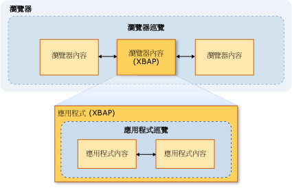

# 安全性 (WPF)
 在開發 Windows Presentation Foundation (WPF) 獨立和瀏覽器裝載的應用程式時，您必須考量的安全性模型。 [!INCLUDE[TLA2#tla_wpf](../../../includes/tla2sharptla-wpf-md.md)] 獨立應用程式使用不受限制的權限執行 ( [!INCLUDE[TLA2#tla_cas](../../../includes/tla2sharptla-cas-md.md)] **FullTrust**權限集合)，不論部署使用 Windows Installer (.msi)、 XCopy 或[!INCLUDE[TLA2#tla_clickonce](../../../includes/tla2sharptla-clickonce-md.md)]。 不支援使用 ClickOnce 部署部分信任的獨立 WPF 應用程式。 不過，完全信任主應用程式可以建立部分信任<xref:System.AppDomain>使用.NET Framework 增益集模型。 如需詳細資訊，請參閱 < [WPF 增益集概觀](../../../docs/framework/wpf/app-development/wpf-add-ins-overview.md)。  
  
 [!INCLUDE[TLA2#tla_wpf](../../../includes/tla2sharptla-wpf-md.md)] 瀏覽器裝載的應用程式所裝載的[!INCLUDE[TLA#tla_iegeneric](../../../includes/tlasharptla-iegeneric-md.md)]或 Firefox，而且可以是[!INCLUDE[TLA#tla_xbap#plural](../../../includes/tlasharptla-xbapsharpplural-md.md)]或鬆散[!INCLUDE[TLA#tla_xaml](../../../includes/tlasharptla-xaml-md.md)]文件，如需詳細資訊，請參閱[WPF XAML 瀏覽器應用程式概觀](../../../docs/framework/wpf/app-development/wpf-xaml-browser-applications-overview.md)。  
  
 [!INCLUDE[TLA2#tla_wpf](../../../includes/tla2sharptla-wpf-md.md)] 瀏覽器裝載的應用程式執行部分信任安全性沙箱內，根據預設，預設值僅限於[!INCLUDE[TLA2#tla_cas](../../../includes/tla2sharptla-cas-md.md)]**網際網路**區域的權限集。 這會有效地隔離[!INCLUDE[TLA2#tla_wpf](../../../includes/tla2sharptla-wpf-md.md)]瀏覽器裝載的應用程式從用戶端電腦，您會預期隔離一般 Web 應用程式的方式相同。 XBAP 可以根據部署 URL 的安全性區域以及用戶端的安全性組態來提高權限，而最高為「完全信任」。 如需詳細資訊，請參閱 [WPF 部分信任安全性](../../../docs/framework/wpf/wpf-partial-trust-security.md)。  
  
 本主題討論 Windows Presentation Foundation (WPF) 獨立和瀏覽器裝載的應用程式的安全性模型。  
  
 此主題包括下列章節：  
  
-   [安全巡覽](#SafeTopLevelNavigation)  
  
-   [Web 瀏覽軟體安全性設定](#InternetExplorerSecuritySettings)  
  
-   [WebBrowser 控制項和功能控制項](#webbrowser_control_and_feature_controls)  
  
-   [停用部分信任用戶端應用程式的 APTCA 組件](#APTCA)  
  
-   [鬆散 XAML 檔案的沙箱行為](#LooseContentSandboxing)  
  
-   [用於開發可提高安全性的 WPF 應用程式的資源](#BestPractices)  
  
   
## 安全巡覽  
 針對[!INCLUDE[TLA2#tla_xbap#plural](../../../includes/tla2sharptla-xbapsharpplural-md.md)]，[!INCLUDE[TLA2#tla_wpf](../../../includes/tla2sharptla-wpf-md.md)]區分兩種類型的 瀏覽： 應用程式和瀏覽器。  
  
 「應用程式巡覽」是瀏覽器所裝載之應用程式的內容項目間的巡覽。 「瀏覽器巡覽」是變更瀏覽器本身的內容和位置 URL 的巡覽。 應用程式巡覽 (通常是 XAML) 與瀏覽器巡覽 (通常是 HTML) 之間的關聯性是由下列圖所示：
  
   
  
 會被視為安全的內容類型[!INCLUDE[TLA2#tla_xbap](../../../includes/tla2sharptla-xbap-md.md)]瀏覽至主要取決於是否使用應用程式巡覽還是瀏覽器瀏覽。  
  
   
### 應用程式巡覽安全性  
 應用程式巡覽視為安全，如果可以用來識別它的組件[!INCLUDE[TLA2#tla_uri](../../../includes/tla2sharptla-uri-md.md)]，可支援四種類型的內容：  
  
|內容類型|描述|URI 範例|  
|------------------|-----------------|-----------------|  
|資源|新增至組建類型為專案的檔案**資源**。|`pack://application:,,,/MyResourceFile.xaml`|  
|內容|新增至組建類型為專案的檔案**內容**。|`pack://application:,,,/MyContentFile.xaml`|  
|Site of origin|新增至組建類型為專案的檔案**無**。|`pack://siteoforigin:,,,/MySiteOfOriginFile.xaml`|  
|應用程式程式碼|具有已編譯程式碼後置的 XAML 資源。   -或-   新增至組建類型為專案的 XAML 檔案**網頁**。|`pack://application:,,,/MyResourceFile` `.xaml`|  
  
> [!NOTE]
>  如需應用程式資料檔案和組件的詳細資訊[!INCLUDE[TLA2#tla_uri#plural](../../../includes/tla2sharptla-urisharpplural-md.md)]，請參閱 < [WPF 應用程式資源、 內容和資料檔案](../../../docs/framework/wpf/app-development/wpf-application-resource-content-and-data-files.md)。  
  
 使用者或透過程式設計方式可以巡覽到這些內容類型的檔案︰  
  
-   **使用者巡覽**。 使用者瀏覽，即可<xref:System.Windows.Documents.Hyperlink>項目。  
  
-   **程式設計巡覽**。 應用程式即可在不需要使用者，例如，藉由設定<xref:System.Windows.Navigation.NavigationWindow.Source%2A?displayProperty=nameWithType>屬性。  
  
   
### 瀏覽器巡覽安全性  
 只有在下列情況下，才會將瀏覽器巡覽視為安全：  
  
-   **使用者巡覽**。 使用者瀏覽，即可<xref:System.Windows.Documents.Hyperlink>項目，位於主要<xref:System.Windows.Navigation.NavigationWindow>而不是巢狀<xref:System.Windows.Controls.Frame>。  
  
-   **區域**。 所要巡覽的內容位在網際網路或近端內部網路。  
  
-   **通訊協定**. 可能是正在使用的通訊協定**http**， **https**，**檔案**，或**mailto**。  
  
 如果[!INCLUDE[TLA2#tla_xbap](../../../includes/tla2sharptla-xbap-md.md)]嘗試瀏覽至內容的方式不符合這些條件，<xref:System.Security.SecurityException>就會擲回。  
  
   
## Web 瀏覽軟體安全性設定  
 電腦上的安全性設定決定授與任何 Web 瀏覽軟體的存取權。 Web 瀏覽軟體包括任何應用程式或元件，它使用[WinINet](https://go.microsoft.com/fwlink/?LinkId=179379)或是[UrlMon](https://go.microsoft.com/fwlink/?LinkId=179383) Api，包括 Internet Explorer 和 PresentationHost.exe。  
  
 [!INCLUDE[TLA2#tla_iegeneric](../../../includes/tla2sharptla-iegeneric-md.md)] 提供一個機制，您可以設定的功能，允許或從中執行[!INCLUDE[TLA2#tla_iegeneric](../../../includes/tla2sharptla-iegeneric-md.md)]，包括下列：  
  
-   .NET framework 相依元件  
  
-   ActiveX 控制項和外掛程式  
  
-   下載  
  
-   正在處理指令碼  
  
-   使用者驗證  
  
 您可以在這種方式保護的功能集合已設定為針對每個區域為基礎**網際網路**，**內部網路**，**信任的網站**，和**限制的網站**區域。 下列步驟描述如何設定安全性設定：  
  
1.  開啟**控制台中**。  
  
2.  按一下 **網路和網際網路**，然後按一下**網際網路選項**。  
  
     [網際網路選項] 對話方塊隨即出現。  
  
3.  在 **安全性**索引標籤上，選取要設定的安全性設定區域。  
  
4.  按一下 [**自訂層級**] 按鈕。  
  
     **安全性設定** 對話方塊隨即出現，而且您可以設定所選區域的安全性設定。  
  
       
  
> [!NOTE]
>  您也可以從 Internet Explorer 到達 [網際網路選項] 對話方塊。 按一下 **工具**，然後按一下**網際網路選項**。  
  
 從開始[!INCLUDE[TLA#tla_ie7](../../../includes/tlasharptla-ie7-md.md)]，特別針對.NET Framework 的下列安全性設定會包含：  
  
-   **鬆散 XAML**。 控制項是否[!INCLUDE[TLA2#tla_iegeneric](../../../includes/tla2sharptla-iegeneric-md.md)]可以瀏覽至並鬆散[!INCLUDE[TLA2#tla_xaml](../../../includes/tla2sharptla-xaml-md.md)]檔案。 ([啟用]、[停用] 和 [提示] 選項)。  
  
-   **XAML 瀏覽器應用程式**。 控制項是否[!INCLUDE[TLA2#tla_iegeneric](../../../includes/tla2sharptla-iegeneric-md.md)]可以瀏覽至並執行[!INCLUDE[TLA2#tla_xbap#plural](../../../includes/tla2sharptla-xbapsharpplural-md.md)]。 ([啟用]、[停用] 和 [提示] 選項)。  
  
 根據預設，這些設定所有啟用**網際網路**，**近端內部網路**，並**信任的網站**區域，並停用**限制的網站**區域。  
  
   
### 安全性相關 WPF 登錄設定  
 除了透過 [網際網路選項] 取得的安全性設定之外，還提供下列登錄值可選擇性地封鎖許多有安全性顧慮的 WPF 功能。 值會定義在下列機碼下方︰  
  
 `HKEY_LOCAL_MACHINE\SOFTWARE\Microsoft\.NETFramework\Windows Presentation Foundation\Features`  
  
 下表列出可設定的值。  
  
|數值名稱|實值類型|數值資料|  
|----------------|----------------|----------------|  
|XBAPDisallow|REG_DWORD|1 表示不允許；0 表示允許。|  
|LooseXamlDisallow|REG_DWORD|1 表示不允許；0 表示允許。|  
|WebBrowserDisallow|REG_DWORD|1 表示不允許；0 表示允許。|  
|MediaAudioDisallow|REG_DWORD|1 表示不允許；0 表示允許。|  
|MediaImageDisallow|REG_DWORD|1 表示不允許；0 表示允許。|  
|MediaVideoDisallow|REG_DWORD|1 表示不允許；0 表示允許。|  
|ScriptInteropDisallow|REG_DWORD|1 表示不允許；0 表示允許。|  
  
   
## WebBrowser 控制項和功能控制項  
 WPF<xref:System.Windows.Controls.WebBrowser>控制項可用來裝載 Web 內容。 WPF<xref:System.Windows.Controls.WebBrowser>控制項包裝基礎 WebBrowser ActiveX 控制項。 WPF 提供一些支援來保護您的應用程式，當您使用 WPF<xref:System.Windows.Controls.WebBrowser>控制項來裝載未受信任的 Web 內容。 不過，必須套用一些安全性功能使用的應用程式來直接<xref:System.Windows.Controls.WebBrowser>控制項。 如需 WebBrowser ActiveX 控制項的詳細資訊，請參閱[WebBrowser 控制項概觀與教學課程](https://go.microsoft.com/fwlink/?LinkId=179388)。  
  
> [!NOTE]
>  本節也適用於<xref:System.Windows.Controls.Frame>控制，因為它會使用<xref:System.Windows.Controls.WebBrowser>來巡覽至 HTML 內容。  
  
 如果 WPF<xref:System.Windows.Controls.WebBrowser>控制項用來裝載不受信任的 Web 內容，您的應用程式應該使用部分信任<xref:System.AppDomain>來協助隔離您的應用程式程式碼，從可能是惡意的 HTML 指令碼。 這是特別有用，如果您的應用程式，會使用互動使用裝載的指令碼<xref:System.Windows.Controls.WebBrowser.InvokeScript%2A>方法和<xref:System.Windows.Controls.WebBrowser.ObjectForScripting%2A>屬性。 如需詳細資訊，請參閱 < [WPF 增益集概觀](../../../docs/framework/wpf/app-development/wpf-add-ins-overview.md)。  
  
 如果您的應用程式使用 WPF<xref:System.Windows.Controls.WebBrowser>控制項，以提高安全性並降低攻擊的另一個方法是啟用 Internet Explorer 功能控制項。 功能控制項是 Internet Explorer 可讓系統管理員和開發人員設定 Internet Explorer 和 WebBrowser ActiveX 控制項中，裝載的應用程式功能的新增功能的 WPF<xref:System.Windows.Controls.WebBrowser>控制包裝。 可以使用設定功能控制項[CoInternetSetFeatureEnabled](https://go.microsoft.com/fwlink/?LinkId=179394)函式，或變更登錄中的值。 如需功能控制項的詳細資訊，請參閱[功能控制項簡介](https://go.microsoft.com/fwlink/?LinkId=179390)並[網際網路功能控制項](https://go.microsoft.com/fwlink/?LinkId=179392)。  
  
 如果您正在開發使用 WPF 的獨立 WPF 應用程式<xref:System.Windows.Controls.WebBrowser>控制項，WPF 會自動啟用您的應用程式的下列功能控制項。  
  
|功能控制項|  
|---------------------|  
|FEATURE_MIME_HANDLING|  
|FEATURE_MIME_SNIFFING|  
|FEATURE_OBJECT_CACHING|  
|FEATURE_SAFE_BINDTOOBJECT|  
|FEATURE_WINDOW_RESTRICTIONS|  
|FEATURE_ZONE_ELEVATION|  
|FEATURE_RESTRICT_FILEDOWNLOAD|  
|FEATURE_RESTRICT_ACTIVEXINSTALL|  
|FEATURE_ADDON_MANAGEMENT|  
|FEATURE_HTTP_USERNAME_PASSWORD_DISABLE|  
|FEATURE_SECURITYBAND|  
|FEATURE_UNC_SAVEDFILECHECK|  
|FEATURE_VALIDATE_NAVIGATE_URL|  
|FEATURE_DISABLE_TELNET_PROTOCOL|  
|FEATURE_WEBOC_POPUPMANAGEMENT|  
|FEATURE_DISABLE_LEGACY_COMPRESSION|  
|FEATURE_SSLUX|  
  
 因為會無條件地啟用這些功能控制項，所以它們可能會損害完全信任應用程式。 在此情況下，如果特定應用程式和其所裝載的內容沒有安全性風險，則可以停用對應的功能控制項。  
  
 具現化 WebBrowser ActiveX 物件的程序會套用功能控制項。 因此，如果您要建立的獨立應用程式會巡覽到不受信任的內容，則應該認真考慮啟用其他功能控制項。  
  
> [!NOTE]
>  這項建議根據 MSHTML 和 SHDOCVW 主機安全性的一般建議。 如需詳細資訊，請參閱 < [MSHTML 主機安全性常見問題集： 第 I 部分 of II](https://go.microsoft.com/fwlink/?LinkId=179396)並[MSHTML 主機安全性常見問題集： 部分 II of II](https://go.microsoft.com/fwlink/?LinkId=179415)。  
  
 針對可執行檔，請考慮將登錄值設定為 1 來啟用下列功能控制項。  
  
|功能控制項|  
|---------------------|  
|FEATURE_ACTIVEX_REPURPOSEDETECTION|  
|FEATURE_BLOCK_LMZ_IMG|  
|FEATURE_BLOCK_LMZ_OBJECT|  
|FEATURE_BLOCK_LMZ_SCRIPT|  
|FEATURE_RESTRICT_RES_TO_LMZ|  
|FEATURE_RESTRICT_ABOUT_PROTOCOL_IE7|  
|FEATURE_SHOW_APP_PROTOCOL_WARN_DIALOG|  
|FEATURE_LOCALMACHINE_LOCKDOWN|  
|FEATURE_FORCE_ADDR_AND_STATUS|  
|FEATURE_RESTRICTED_ZONE_WHEN_FILE_NOT_FOUND|  
  
 針對可執行檔，請考慮將登錄值設定為 0 來停用下列功能控制項。  
  
|功能控制項|  
|---------------------|  
|FEATURE_ENABLE_SCRIPT_PASTE_URLACTION_IF_PROMPT|  
  
 如果您執行部分信任[!INCLUDE[TLA#tla_xbap](../../../includes/tlasharptla-xbap-md.md)]包含 WPF<xref:System.Windows.Controls.WebBrowser>控制中[!INCLUDE[TLA#tla_iegeneric](../../../includes/tlasharptla-iegeneric-md.md)]，WPF 中裝載 WebBrowser ActiveX 控制項，Internet Explorer 處理序的位址空間中。 因為 WebBrowser ActiveX 控制項裝載於[!INCLUDE[TLA2#tla_iegeneric](../../../includes/tla2sharptla-iegeneric-md.md)]處理序中，所有的 Internet Explorer 功能控制項也會啟用 WebBrowser ActiveX 控制項。  
  
 與一般獨立應用程式相較之下，在 Internet Explorer 中執行的 XBAP 也會取得額外層級的安全性。 這個額外的安全性是因為 Internet Explorer 中，因此 WebBrowser ActiveX 控制項，會執行受保護模式上的預設[!INCLUDE[TLA#tla_winvista](../../../includes/tlasharptla-winvista-md.md)]和[!INCLUDE[win7](../../../includes/win7-md.md)]。 如需有關受保護模式的詳細資訊，請參閱 <<c0> [ 了解及使用受保護模式 Internet Explorer 中](https://go.microsoft.com/fwlink/?LinkId=179393)。  
  
> [!NOTE]
>  如果您嘗試執行包含 WPF XBAP <xref:System.Windows.Controls.WebBrowser> Firefox，在 [網際網路] 區域中的控制項<xref:System.Security.SecurityException>就會擲回。 這是因為 WPF 安全性原則。  
  
   
## 停用部分信任用戶端應用程式的 APTCA 組件  
 當 managed 組件安裝到[!INCLUDE[TLA#tla_gac](../../../includes/tlasharptla-gac-md.md)]，它們變成完全受信任的因為使用者必須提供明確的權限，才能進行安裝。 因為它們完全受信任，所以只有完全受信任的受管理用戶端應用程式才能使用它們。 若要允許部分信任的應用程式使用它們，它們必須標示為<xref:System.Security.AllowPartiallyTrustedCallersAttribute>(APTCA)。 只有經過測試可在部分信任中安全執行的組件才應該標記這個屬性。  
  
 不過，就可能 APTCA 組件安裝到之後出現安全性缺陷[!INCLUDE[TLA2#tla_gac](../../../includes/tla2sharptla-gac-md.md)]。 發現安全性缺陷之後，組件發行者可以產生安全性更新來修正現有安裝上的問題，以及防止在發現問題之後可能進行的安裝。 雖然解除安裝組件可能會中斷其他使用組件的完全信任用戶端應用程式，但是更新的其中一個選項是解除安裝組件。  
  
 [!INCLUDE[TLA2#tla_wpf](../../../includes/tla2sharptla-wpf-md.md)] 提供一個機制，用 APTCA 組件可以停用部分信任[!INCLUDE[TLA2#tla_xbap#plural](../../../includes/tla2sharptla-xbapsharpplural-md.md)]沒有解除安裝 APTCA 組件。  
  
 若要停用 APTCA 組件，您必須建立特殊登錄機碼︰  
  
 `HKEY_LOCAL_MACHINE\SOFTWARE\Microsoft\.NETFramework\policy\APTCA\<AssemblyFullName>, FileVersion=<AssemblyFileVersion>`  
  
 下列示範範例：  
  
 `HKEY_LOCAL_MACHINE\SOFTWARE\Microsoft\.NETFramework\policy\APTCA\aptcagac, Version=1.0.0.0, Culture=neutral, PublicKeyToken=215e3ac809a0fea7, FileVersion=1.0.0.0`  
  
 此機碼會為 APTCA 組件建立一個項目。 您也必須在這個機碼中建立啟用或停用組件的數值。 數值的詳細資料如下︰  
  
-   數值名稱︰ **APTCA_FLAG**。  
  
-   實值型別： **REG_DWORD**。  
  
-   數值資料： **1**停用;**0**啟用。  
  
 如果必須停用部分信任用戶端應用程式的組件，您可以撰寫可建立登錄機碼和值的更新。  
  
> [!NOTE]
>  核心.NET Framework 組件不會受到停用它們以這種方式因為所需要的受管理的應用程式執行。 停用 APTCA 組件的支援主要是針對協力廠商應用程式。  
  
   
## 鬆散 XAML 檔案的沙箱行為  
 鬆散[!INCLUDE[TLA2#tla_xaml](../../../includes/tla2sharptla-xaml-md.md)]檔案是純標記 XAML 檔案，不依賴任何程式碼後置、 事件處理常式或特定應用程式的組件。 當鬆散[!INCLUDE[TLA2#tla_xaml](../../../includes/tla2sharptla-xaml-md.md)]檔案直接從瀏覽器巡覽到，它們會在預設網際網路區域權限集合為基礎的安全性沙箱中載入。  
  
 不過，安全性行為是不同時鬆散[!INCLUDE[TLA2#tla_xaml](../../../includes/tla2sharptla-xaml-md.md)]檔案從巡覽到<xref:System.Windows.Navigation.NavigationWindow>或<xref:System.Windows.Controls.Frame>獨立應用程式。  
  
 在這兩種情況下，鬆散[!INCLUDE[TLA2#tla_xaml](../../../includes/tla2sharptla-xaml-md.md)]巡覽到的檔案會繼承其主應用程式的權限。 不過，這種行為可能不想要從安全性觀點來看，尤其是鬆散[!INCLUDE[TLA2#tla_xaml](../../../includes/tla2sharptla-xaml-md.md)]檔案由受信任或未知的實體。 這種類型的內容稱為*外部內容*，並同時<xref:System.Windows.Controls.Frame>和<xref:System.Windows.Navigation.NavigationWindow>可以設定為巡覽時予以隔離。 隔離的方式設定**SandboxExternalContent**屬性設定為 true，如下列範例所示<xref:System.Windows.Controls.Frame>和<xref:System.Windows.Navigation.NavigationWindow>:  
  
 [!code-xaml[SecurityOverviewSnippets#FrameMARKUP](../../../samples/snippets/csharp/VS_Snippets_Wpf/SecurityOverviewSnippets/CS/Window2.xaml#framemarkup)]  
  
 [!code-xaml[SecurityOverviewSnippets#NavigationWindowMARKUP](../../../samples/snippets/csharp/VS_Snippets_Wpf/SecurityOverviewSnippets/CS/Window1.xaml#navigationwindowmarkup)]  
  
 使用此設定，會將外部內容載入與裝載應用程式的程序不同的程序。 此程序僅限於預設網際網路區域權限集，可有效地隔離它與裝載應用程式和用戶端電腦。  
  
> [!NOTE]
>  即使巡覽到鬆散[!INCLUDE[TLA2#tla_xaml](../../../includes/tla2sharptla-xaml-md.md)]檔案，從<xref:System.Windows.Navigation.NavigationWindow>或<xref:System.Windows.Controls.Frame>在獨立的應用程式會實作根據 WPF 瀏覽器裝載基礎結構，包含 PresentationHost 處理序的安全性層級是稍微小於載入內容時直接在 Internet Explorer 上[!INCLUDE[wiprlhext](../../../includes/wiprlhext-md.md)]和[!INCLUDE[win7](../../../includes/win7-md.md)]（仍是透過 PresentationHost）。 這是因為使用 Web 瀏覽器的獨立 WPF 應用程式不會提供 Internet Explorer 的額外受保護模式安全性功能。  
  
   
## 用於開發可提高安全性的 WPF 應用程式的資源  
 以下是一些額外的資源，以協助開發[!INCLUDE[TLA2#tla_wpf](../../../includes/tla2sharptla-wpf-md.md)]提高安全性的應用程式：  
  
|區域圖|資源|  
|----------|--------------|  
|Managed 程式碼|[Patterns and Practices Security Guidance for Applications](https://go.microsoft.com/fwlink/?LinkId=117426) (應用程式的模式和實務安全性指南)|  
|[!INCLUDE[TLA2#tla_cas](../../../includes/tla2sharptla-cas-md.md)]|[程式碼存取安全性](../../../docs/framework/misc/code-access-security.md)|  
|[!INCLUDE[TLA2#tla_clickonce](../../../includes/tla2sharptla-clickonce-md.md)]|[ClickOnce 安全性和部署](/visualstudio/deployment/clickonce-security-and-deployment)|  
|[!INCLUDE[TLA2#tla_wpf](../../../includes/tla2sharptla-wpf-md.md)]|[WPF 部分信任安全性](../../../docs/framework/wpf/wpf-partial-trust-security.md)|  
  
## 另請參閱  
 [WPF 部分信任安全性](../../../docs/framework/wpf/wpf-partial-trust-security.md)  
 [WPF 安全性策略 – 平台安全性](../../../docs/framework/wpf/wpf-security-strategy-platform-security.md)  
 [WPF 安全性策略 – 安全性工程](../../../docs/framework/wpf/wpf-security-strategy-security-engineering.md)  
 [Patterns and Practices Security Guidance for Applications](https://go.microsoft.com/fwlink/?LinkId=117426) (應用程式的模式和實務安全性指南)  
 [程式碼存取安全性](../../../docs/framework/misc/code-access-security.md)  
 [ClickOnce 安全性和部署](/visualstudio/deployment/clickonce-security-and-deployment)  
 [XAML 概觀 (WPF)](../../../docs/framework/wpf/advanced/xaml-overview-wpf.md)
