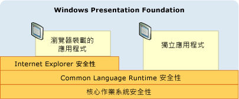
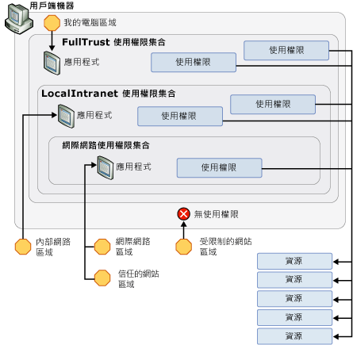

# WPF 安全性策略 – 平台安全性
雖然 Windows Presentation Foundation (WPF) 提供各種安全性服務，它也會運用基礎的平台，包括作業系統、 安全性功能[!INCLUDE[TLA2#tla_clr](../../../includes/tla2sharptla-clr-md.md)]，和[!INCLUDE[TLA2#tla_ie](../../../includes/tla2sharptla-ie-md.md)]。 這三層安全性功能一起為 [!INCLUDE[TLA2#tla_wpf](../../../includes/tla2sharptla-wpf-md.md)] 提供了強大、深入防禦的安全性模型，即使其中一層失敗，還有兩層可以幫忙把關，如下圖所示：  
  
   
  
 本主題的其餘部分會針對每一層安全性功能當中，與 [!INCLUDE[TLA2#tla_wpf](../../../includes/tla2sharptla-wpf-md.md)] 特別有關的功能進行討論。  
  

  
   
## 作業系統安全性  
 [!INCLUDE[TLA2#tla_wpf](../../../includes/tla2sharptla-wpf-md.md)] 需要的最低作業系統層級是 [!INCLUDE[TLA2#tla_winxpsp2](../../../includes/tla2sharptla-winxpsp2-md.md)]。 核心[!INCLUDE[TLA2#tla_winxpsp2](../../../includes/tla2sharptla-winxpsp2-md.md)]提供數個所有的 Windows 應用程式，包括與內建的安全性基礎的安全性功能[!INCLUDE[TLA2#tla_wpf](../../../includes/tla2sharptla-wpf-md.md)]。 [!INCLUDE[TLA#tla_longhorn](../../../includes/tlasharptla-longhorn-md.md)] 加入 [!INCLUDE[TLA2#tla_wpf](../../../includes/tla2sharptla-wpf-md.md)] 的安全性功能，並做進一步擴充。 本主題會詳細討論這些對 [!INCLUDE[TLA2#tla_wpf](../../../includes/tla2sharptla-wpf-md.md)] 至為重要的安全性功能，以及 [!INCLUDE[TLA2#tla_wpf](../../../includes/tla2sharptla-wpf-md.md)] 如何整合這些功能來提供進一步的深入防禦。  
  
   
### Microsoft Windows XP Service Pack 2 (SP2)  
 除了一般的評論和觀念加強 Windows 中，有三項主要功能[!INCLUDE[TLA2#tla_winxpsp2](../../../includes/tla2sharptla-winxpsp2-md.md)]，我們將在本主題中討論：  
  
-   /GS 編譯  
  
-   [!INCLUDE[TLA#tla_win_update](../../../includes/tlasharptla-win-update-md.md)].  
  
#### /GS 編譯  
 [!INCLUDE[TLA2#tla_winxpsp2](../../../includes/tla2sharptla-winxpsp2-md.md)] 提供保護的方式，是透過重新編譯許多核心系統程式庫 (包括 [!INCLUDE[TLA2#tla_clr](../../../includes/tla2sharptla-clr-md.md)] 等所有 [!INCLUDE[TLA2#tla_wpf](../../../includes/tla2sharptla-wpf-md.md)] 相依性)，以協助減少發生緩衝區滿溢的情況。 搭配 C/C++ 命令列編譯器使用 /GS 參數即可達成這個目的。 雖然這樣做應該能夠明確避免發生緩衝區滿溢的情況，但是 /GS 編譯還提供一個深入防禦範例，可防止無意中或惡意利用緩衝區滿溢所造成的潛在弱點遭到攻擊。  
  
 在過去，緩衝區滿溢一直是造成許多重大安全性攻擊的原因。 當攻擊者利用程式碼弱點，插入將緩衝區寫爆的惡意程式碼時，就會發生緩衝區滿溢的情況。 這會讓攻擊者有機會透過覆寫函式的傳回位址，來劫持執行該程式碼的處理序，以執行攻擊者的程式碼。 結果是，惡意程式碼可以利用與被劫持的處理序相同的權限來執行任意程式碼。  
  
 整體而言，/GS 編譯器旗標會針對具有本機字串緩衝區的函式，插入一種特殊的安全性 Cookie 來保護該函式的傳回位址，因此可防止發生一些可能的緩衝區滿溢情況。 在函式傳回之後，安全性 Cookie 會與其原先的值做比較。 如果這個值已變更，則可能發生緩衝區滿溢的情況，而且會停止處理序並顯示錯誤狀況。 停止處理序可防止執行可能惡意的程式碼。 請參閱[/GS （緩衝區安全性檢查）](/cpp/build/reference/gs-buffer-security-check)如需詳細資訊。  
  
 [!INCLUDE[TLA2#tla_wpf](../../../includes/tla2sharptla-wpf-md.md)] 會利用 /GS 旗標進行編譯，可為 [!INCLUDE[TLA2#tla_wpf](../../../includes/tla2sharptla-wpf-md.md)] 應用程式提供多一層的防禦。  
  
#### Microsoft Windows Update 增強功能  
 [!INCLUDE[TLA2#tla_winxpsp2](../../../includes/tla2sharptla-winxpsp2-md.md)] 中也已增強 [!INCLUDE[TLA#tla_win_update](../../../includes/tlasharptla-win-update-md.md)]，下載和安裝更新的程序將會更簡單。 由於這些變更 (特別是安全性更新方面) 可協助確保 [!INCLUDE[TLA2#tla_wpf](../../../includes/tla2sharptla-wpf-md.md)] 客戶的系統會更新成最新版本，因此可以大幅提高這些客戶的安全性。  
  
   
### Windows Vista  
 [!INCLUDE[TLA#tla_longhorn](../../../includes/tlasharptla-longhorn-md.md)] 上的 [!INCLUDE[TLA2#tla_wpf](../../../includes/tla2sharptla-wpf-md.md)] 使用者將會得到這個作業系統額外提供的安全性增強功能，包括「最低權限使用者存取」、程式碼完整性檢查和權限隔離。  
  
#### 使用者帳戶控制 (UAC)  
 現在，Windows 使用者通常以系統管理員權限執行，因為許多應用程式所需要的是這些安裝或執行，或兩者。 其中一個例子是，使用者必須能夠將預設應用程式設定寫入至登錄。  
  
 以系統管理員權限執行，實際上表示應用程式會從具有系統管理員權限的處理序執行。 這樣做會有安全性風險，那就是劫持以系統管理員權限執行之處理序的任何惡意程式碼，都會自動繼承這些權限，包括重要系統資源的存取權。  
  
 防範這個安全性威脅的方法之一，就是以最少的必要權限執行應用程式。 這就是所謂的最低權限原則，也是 [!INCLUDE[TLA#tla_longhorn](../../../includes/tlasharptla-longhorn-md.md)] 作業系統的核心功能。 這項功能稱為使用者帳戶控制 (UAC)，是由 [!INCLUDE[TLA#tla_longhorn](../../../includes/tlasharptla-longhorn-md.md)] UAC 以兩種主要的方式加以使用：  
  
-   讓大多數的應用程式預設以 UAC 權限執行，即使使用者是系統管理員也一樣。只有需要系統管理員權限的應用程式才會以系統管理員權限執行。 若要以系統管理員權限執行，應用程式必須在其應用程式資訊清單中明確標記，或明確標記為安全性原則中的項目。  
  
-   提供像是虛擬化的相容性解決方案。 例如，許多應用程式會嘗試寫入限制位置，例如 C:\Program Files。 如果應用程式是以 UAC 執行，則會建立依使用者而定的替代位置，應用程式不需要有系統管理員權限就能寫入至這個位置。 如果應用程式是以 UAC 執行，則 UAC 會將 C:\Program Files 虛擬化，讓以為寫入至這個位置的應用程式，實際上是寫入至依使用者而定的替代位置。 這種相容性轉換工作可讓作業系統執行更多應用程式 (之前在 UAC 中執行時，並無法執行這麼多應用程式)。  
  
#### 程式碼完整性檢查  
 [!INCLUDE[TLA#tla_longhorn](../../../includes/tlasharptla-longhorn-md.md)] 加入更深入的程式碼完整性檢查，以協助防止在載入/執行階段將惡意程式插入系統檔案或核心中。 這已經超過系統檔案保護範圍。  
  
   
### 瀏覽器裝載之應用程式的有限權限處理序  
 瀏覽器裝載的 [!INCLUDE[TLA2#tla_wpf](../../../includes/tla2sharptla-wpf-md.md)] 應用程式是在網際網路區域沙箱中執行。 [!INCLUDE[TLA2#tla_wpf](../../../includes/tla2sharptla-wpf-md.md)] 與 [!INCLUDE[TLA#tla_ie](../../../includes/tlasharptla-ie-md.md)] 的整合讓這項保護進一步取得更多支援。  
  
#### Internet Explorer 6 Service Pack 2 和 Internet Explorer 7 for XP  
 [!INCLUDE[TLA2#tla_wpf](../../../includes/tla2sharptla-wpf-md.md)] 利用作業系統安全性，方法是限制 [!INCLUDE[TLA#tla_winfxwebapp#plural](../../../includes/tlasharptla-winfxwebappsharpplural-md.md)] 的處理序權限以提供進一步的保護。 在啟動瀏覽器裝載的 [!INCLUDE[TLA2#tla_wpf](../../../includes/tla2sharptla-wpf-md.md)] 應用程式之前，作業系統會先建立主應用程式處理序，這個處理序會從處理序語彙基元中移除不必要的權限。 所移除的一些權限範例包括能夠關閉使用者的電腦、載入驅動程式，以及電腦上所有檔案的讀取權限。  
  
#### Internet Explorer 7 for Vista  
 在 [!INCLUDE[TLA#tla_ie7](../../../includes/tlasharptla-ie7-md.md)] 中，[!INCLUDE[TLA2#tla_wpf](../../../includes/tla2sharptla-wpf-md.md)] 應用程式是以受保護模式執行。 具體來說，[!INCLUDE[TLA#tla_xbap#plural](../../../includes/tlasharptla-xbapsharpplural-md.md)] 是以中度完整性執行。  
  
#### 深層防禦  
 由於 [!INCLUDE[TLA#tla_winfxwebapp#plural](../../../includes/tlasharptla-winfxwebappsharpplural-md.md)] 通常會以網際網路區域權限集合進行沙箱化，所以移除這些權限不但不會破壞 [!INCLUDE[TLA#tla_winfxwebapp#plural](../../../includes/tlasharptla-winfxwebappsharpplural-md.md)] 的相容性， 反而可以建立多一層的深層防禦。即使沙箱化的應用程式能夠攻擊其他層級並劫持處理序，處理序仍然只會有有限的權限。  
  
 請參閱[使用最低權限的使用者帳戶](https://docs.microsoft.com/previous-versions/tn-archive/cc700846%28v=technet.10%29)。  
  
   
## Common Language Runtime 安全性  
 [!INCLUDE[TLA#tla_clr](../../../includes/tlasharptla-clr-md.md)] 提供一些重要的安全性優點，包括驗證 (Validation 和 Verification)、[!INCLUDE[TLA#tla_cas](../../../includes/tlasharptla-cas-md.md)] 和安全性關鍵方法。  
  
   
### 驗證 (Validation 和 Verification)  
 若要提供組件隔離和完整性，[!INCLUDE[TLA2#tla_clr](../../../includes/tla2sharptla-clr-md.md)] 會使用驗證 (Validation) 程序。 [!INCLUDE[TLA2#tla_clr](../../../includes/tla2sharptla-clr-md.md)] 驗證透過驗證組件的可攜式執行檔 (PE) 格式中是否有指向組件外部的位址，來確保隔離組件。 [!INCLUDE[TLA2#tla_clr](../../../includes/tla2sharptla-clr-md.md)] 驗證也會驗證組件中內嵌中繼資料的完整性。  
  
 若要確保類型安全、 協助避免常見的安全性問題 （例如緩衝區滿溢），以及透過子處理序隔離進行沙箱化[!INCLUDE[TLA2#tla_clr](../../../includes/tla2sharptla-clr-md.md)]安全性使用驗證的概念。  
  
 Managed 應用程式會編譯成 Microsoft 中繼語言 (MSIL)。 執行 Managed 應用程式中的方法時，應用程式的 MSIL 會透過 Just-In-Time (JIT) 編譯被編譯成機器碼。 JIT 編譯包含驗證程序，這個程序會套用許多安全和穩定性規則，以確保程式碼不會：  
  
-   違反類型合約  
  
-   引入緩衝區滿溢  
  
-   大量存取記憶體  
  
 不符合驗證規則的 Managed 程式碼除非受到信任，否則無法執行。  
  
 可驗證程式碼的優點是主要的原因為何[!INCLUDE[TLA2#tla_wpf](../../../includes/tla2sharptla-wpf-md.md)].NET Framework 為基礎。 只要是使用可驗證程式碼的地方，潛在弱點遭受攻擊的可能性都會大幅降低。  
  
   
### 程式碼存取安全性  
 用戶端電腦公開了可供 Managed 應用程式存取的各種資源，包括檔案系統、登錄、列印服務、使用者介面、反映和環境變數。 受管理的應用程式可以存取任何用戶端電腦上的資源之前，它必須具備.NET Framework 權限，若要這樣做。 [!INCLUDE[TLA2#tla_cas](../../../includes/tla2sharptla-cas-md.md)] 中的權限是 <xref:System.Security.CodeAccessPermission> 的子類別；[!INCLUDE[TLA2#tla_cas](../../../includes/tla2sharptla-cas-md.md)] 會針對 Managed 應用程式可存取的每個資源各實作一個子類別。  
  
 當 Managed 應用程式開始執行時，[!INCLUDE[TLA2#tla_cas](../../../includes/tla2sharptla-cas-md.md)] 會授與應用程式一組權限，稱為權限集合，其中的權限會由應用程式提供的辨識項來決定。 如果是 [!INCLUDE[TLA2#tla_wpf](../../../includes/tla2sharptla-wpf-md.md)] 應用程式，所提供的辨識項就是應用程式啟動的位置 (或區域)。 [!INCLUDE[TLA2#tla_cas](../../../includes/tla2sharptla-cas-md.md)] 可識別下列區域：  
  
-   **我的電腦**。 從用戶端電腦啟動的應用程式 (完全信任)。  
  
-   **近端內部網路**。 從內部網路啟動的應用程式 (部分受信任)。  
  
-   **網際網路**。 從網際網路啟動的應用程式 (最不受信任)。  
  
-   **信任的網站**。 使用者指定要信任的應用程式 (最不受信任)。  
  
-   **限制的網站**。 使用者指定不要信任的應用程式 (未受信任)。  
  
 [!INCLUDE[TLA2#tla_cas](../../../includes/tla2sharptla-cas-md.md)] 會針對上述每個區域各提供一個預先定義的權限集合，而每個權限集合都包含符合其區域信任層級的權限。 它們包括：  
  
-   **FullTrust**。 從啟動的應用程式**我的電腦**區域。 會授與所有可能的權限。  
  
-   **LocalIntranet**。 從啟動的應用程式**近端內部網路**區域。 會授與權限的子集，以提供對用戶端電腦資源的中度存取權，包括隔離儲存區、無限制的 UI 存取權、無限制的檔案對話方塊、有限的反映、對環境變數的有限存取權。 不會提供重要資源 (例如登錄) 的權限。  
  
-   **Internet**。 從啟動的應用程式**網際網路**或是**信任的網站**區域。 會授與權限的子集，以提供對用戶端電腦資源的有限存取權，包括隔離儲存區、限檔案開啟，以及有限的 UI。 基本上，這個權限集合會將應用程式自用戶端電腦隔離。  
  
 應用程式識別為來自**未受信任的站台**區域會授與任何權限[!INCLUDE[TLA2#tla_cas](../../../includes/tla2sharptla-cas-md.md)]完全。 因此，這些應用程式沒有預先定義的權限集合。  
  
 下圖說明區域、權限集合、權限和資源之間的關係。  
  
   
  
 網際網路區域安全性沙箱的限制會平等套用至 [!INCLUDE[TLA2#tla_winfxwebapp](../../../includes/tla2sharptla-winfxwebapp-md.md)] 從系統程式庫 (包括 [!INCLUDE[TLA2#tla_wpf](../../../includes/tla2sharptla-wpf-md.md)]) 匯入的所有程式碼。 如此可確保程式碼的每個位元都被鎖定，即使是 [!INCLUDE[TLA2#tla_wpf](../../../includes/tla2sharptla-wpf-md.md)] 也一樣。 不幸的是，[!INCLUDE[TLA2#tla_winfxwebapp](../../../includes/tla2sharptla-winfxwebapp-md.md)] 若要能夠執行，其須執行之功能所需要的權限比網際網路區域安全性沙箱所啟用的還要多。  
  
 假設有個 [!INCLUDE[TLA2#tla_winfxwebapp](../../../includes/tla2sharptla-winfxwebapp-md.md)] 應用程式包含下列頁面：  
  
 [!code-csharp[WPFPlatformSecuritySnippets#Permission](~/samples/snippets/csharp/VS_Snippets_Wpf/WPFPlatformSecuritySnippets/CSharp/Page1.xaml.cs#permission)]
 [!code-vb[WPFPlatformSecuritySnippets#Permission](~/samples/snippets/visualbasic/VS_Snippets_Wpf/WPFPlatformSecuritySnippets/VisualBasic/Page1.xaml.vb#permission)]  
  
 若要執行這個 [!INCLUDE[TLA2#tla_winfxwebapp](../../../includes/tla2sharptla-winfxwebapp-md.md)]，基礎 [!INCLUDE[TLA2#tla_wpf](../../../includes/tla2sharptla-wpf-md.md)] 程式碼必須執行比發出呼叫的 [!INCLUDE[TLA2#tla_winfxwebapp](../../../includes/tla2sharptla-winfxwebapp-md.md)] 可以取得的功能還多的功能，其中包括：  
  
-   建立轉譯用的視窗控制代碼 (hWnd)  
  
-   分派訊息  
  
-   載入新細明體字型  
  
 從安全性觀點來看，允許沙箱化應用程式直接存取上述任何作業將會引發十分嚴重的後果。  
  
 好在 [!INCLUDE[TLA2#tla_wpf](../../../includes/tla2sharptla-wpf-md.md)] 已經考慮到這種情況，它會允許這些作業以代表沙箱化應用程式的更高權限來執行。 雖然會對所有 [!INCLUDE[TLA2#tla_wpf](../../../includes/tla2sharptla-wpf-md.md)] 作業檢查是否符合 [!INCLUDE[TLA2#tla_winfxwebapp](../../../includes/tla2sharptla-winfxwebapp-md.md)] 之應用程式定義域的有限網際網路區域安全性權限，但是 [!INCLUDE[TLA2#tla_wpf](../../../includes/tla2sharptla-wpf-md.md)] (就像其他系統程式庫) 會取得含有所有可用權限的權限集合。  
  
 這表示 [!INCLUDE[TLA2#tla_wpf](../../../includes/tla2sharptla-wpf-md.md)] 必須得到更高的權限，同時又要避免這些權限受到主應用程式定義域之 [網際網路] 區域權限集合的控制。  
  
 [!INCLUDE[TLA2#tla_wpf](../../../includes/tla2sharptla-wpf-md.md)] 做法是使用**Assert**權限的方法。 下列程式碼會顯示這個過程。  
  
 [!code-csharp[WPFPlatformSecuritySnippets#Permission](~/samples/snippets/csharp/VS_Snippets_Wpf/WPFPlatformSecuritySnippets/CSharp/Page1.xaml.cs#permission)]
 [!code-vb[WPFPlatformSecuritySnippets#Permission](~/samples/snippets/visualbasic/VS_Snippets_Wpf/WPFPlatformSecuritySnippets/VisualBasic/Page1.xaml.vb#permission)]  
  
 **Assert**基本上可防止不受限制所需的權限[!INCLUDE[TLA2#tla_wpf](../../../includes/tla2sharptla-wpf-md.md)]限制透過網際網路區域權限的[!INCLUDE[TLA2#tla_winfxwebapp](../../../includes/tla2sharptla-winfxwebapp-md.md)]。  
  
 平台的觀點而言，[!INCLUDE[TLA2#tla_wpf](../../../includes/tla2sharptla-wpf-md.md)]負責使用**Assert**正確; 的用法不正確**Assert**可讓惡意程式碼提高權限。 因此，很重要，然後才呼叫**Assert**需要時，並確保沙箱限制保持不變。 例如，沙箱化程式碼不可以開啟隨機檔案，但可以使用字型。 [!INCLUDE[TLA2#tla_wpf](../../../includes/tla2sharptla-wpf-md.md)] 可讓沙箱化應用程式使用字型功能，藉由呼叫**Assert**，以及[!INCLUDE[TLA2#tla_wpf](../../../includes/tla2sharptla-wpf-md.md)]來讀取已知含有這些字型代表沙箱化應用程式檔案。  
  
   
### ClickOnce 部署  
 [!INCLUDE[TLA#tla_clickonce](../../../includes/tlasharptla-clickonce-md.md)] 是一種提供的完整部署技術，隨附於.NET Framework 中，並與整合[!INCLUDE[TLA#tla_visualstu](../../../includes/tlasharptla-visualstu-md.md)](請參閱 < [ClickOnce 安全性和部署](/visualstudio/deployment/clickonce-security-and-deployment)如需詳細資訊)。 獨立 [!INCLUDE[TLA2#tla_wpf](../../../includes/tla2sharptla-wpf-md.md)] 應用程式可以透過 [!INCLUDE[TLA#tla_clickonce](../../../includes/tlasharptla-clickonce-md.md)] 部署，而瀏覽器裝載的應用程式則必須透過 [!INCLUDE[TLA2#tla_clickonce](../../../includes/tla2sharptla-clickonce-md.md)] 部署。  
  
 透過 [!INCLUDE[TLA2#tla_clickonce](../../../includes/tla2sharptla-clickonce-md.md)] 部署的應用程式會取得 [!INCLUDE[TLA#tla_cas](../../../includes/tlasharptla-cas-md.md)] 所提供的多一層安全性；基本上，[!INCLUDE[TLA#tla_clickonce](../../../includes/tlasharptla-clickonce-md.md)] 所部署的應用程式會要求這些應用程式所需的權限。 只有在所要求的權限不超過應用程式部署來源區域的權限集合時，才會將這些權限授與應用程式。 藉由將權限集合減少到只含需要的權限，應用程式可以存取的資源將會降到最基本的數量，即使這些權限比啟動區域的權限集合所提供的權限還少也沒關係。 因此，如果應用程式遭到劫持，用戶端電腦遭到破壞的可能性將會降低。  
  
   
### 安全性關鍵方法  
 使用權限來對 [!INCLUDE[TLA2#tla_wpf](../../../includes/tla2sharptla-wpf-md.md)] 應用程式啟用網際網路區域沙箱的 [!INCLUDE[TLA2#tla_winfxwebapp](../../../includes/tla2sharptla-winfxwebapp-md.md)] 程式碼，必須盡可能以最高度的安全性稽核和控制來保存。 為了滿足此需求，.NET Framework 會提供新的支援，來管理需要提高權限的程式碼。 具體而言，[!INCLUDE[TLA2#tla_clr](../../../includes/tla2sharptla-clr-md.md)]可讓您識別需要提高權限的程式碼，並將其與標示<xref:System.Security.SecurityCriticalAttribute>; 的任何程式碼未標示有<xref:System.Security.SecurityCriticalAttribute>會變成*透明*透過這種方法。 相反地，未標記為 <xref:System.Security.SecurityCriticalAttribute> 的 Managed 程式碼將無法提高權限。  
  
 安全性關鍵方法可讓組織[!INCLUDE[TLA2#tla_wpf](../../../includes/tla2sharptla-wpf-md.md)]需要提高權限到的程式碼*安全性關鍵核心*，其餘步驟當作透明。 隔離安全性關鍵的程式碼可讓[!INCLUDE[TLA2#tla_wpf](../../../includes/tla2sharptla-wpf-md.md)]工程團隊專心超越標準的安全性做法安全性關鍵核心進行額外的安全性分析和原始檔控制 (請參閱[WPF 安全性策略-安全性工程](wpf-security-strategy-security-engineering.md))。  
  
 請注意 .NET Framework 允許受信任的程式碼來擴充[!INCLUDE[TLA2#tla_winfxwebapp](../../../includes/tla2sharptla-winfxwebapp-md.md)]網際網路區域沙箱，可讓開發人員撰寫 managed 組件標記為<xref:System.Security.AllowPartiallyTrustedCallersAttribute>(APTCA) 並部署至使用者的全域組件快取 (GAC)。 在組件上標記 APTCA 是一項極為敏感的安全性作業，因為這可讓任何程式碼 (包括來自網際網路的惡意程式碼) 呼叫該組件。 執行這項操作時請謹慎為之，一定要採取最佳做法，而且使用者必須選擇信任該軟體才能安裝軟體。  
  
   
## Microsoft Internet Explorer 安全性  
 除了減少安全性問題和簡化安全性設定之外，[!INCLUDE[TLA#tla_ie6sp2](../../../includes/tlasharptla-ie6sp2-md.md)] 還包含數項可增強 [!INCLUDE[TLA#tla_winfxwebapp#plural](../../../includes/tlasharptla-winfxwebappsharpplural-md.md)] 使用者安全性的安全性增強功能。 這些功能的主要目的是要讓使用者更能掌控自己的瀏覽體驗。  
  
 在 [!INCLUDE[TLA2#tla_ie6sp2](../../../includes/tla2sharptla-ie6sp2-md.md)] 之前，使用者會受到下列項目干擾：  
  
-   隨機跳出的快顯視窗。  
  
-   令人困惑的指令碼重新導向。  
  
-   某些網站上的大量安全性對話方塊。  
  
 有時候，不可信賴的網站會冒充安裝 [!INCLUDE[TLA#tla_ui](../../../includes/tlasharptla-ui-md.md)] 或一再顯示 [!INCLUDE[TLA#tla_actx](../../../includes/tlasharptla-actx-md.md)] 安裝對話方塊 (即使使用者加以取消也一樣) 來誘騙使用者。 透過這些手法，許多使用者可能信以為真，做出錯誤決定，因而安裝了間諜軟體應用程式。  
  
 [!INCLUDE[TLA2#tla_ie6sp2](../../../includes/tla2sharptla-ie6sp2-md.md)] 以使用者啟始的概念為核心，提供數項可減少這類問題的功能。 [!INCLUDE[TLA2#tla_ie6sp2](../../../includes/tla2sharptla-ie6sp2-md.md)] 使用者已按下動作，也就是連結或頁面項目時偵測到*使用者啟始*，並將類似的動作時改為在網頁上指令碼所觸發。 例如，[!INCLUDE[TLA2#tla_ie6sp2](../../../includes/tla2sharptla-ie6sp2-md.md)]併入**快顯封鎖程式**，偵測到當使用者按一下按鈕，以避免頁面建立快顯視窗。 這可讓 [!INCLUDE[TLA2#tla_ie6sp2](../../../includes/tla2sharptla-ie6sp2-md.md)] 允許顯示無害的快顯視窗，同時又能封鎖使用者未要求或不想要的快顯視窗。 已封鎖快顯視窗會擋住新**資訊列**，這可讓使用者手動取消封鎖來檢視快顯視窗中。  
  
 相同的使用者啟始邏輯也適用於**開放**/**儲存**安全性提示。 除非 [!INCLUDE[TLA2#tla_actx](../../../includes/tla2sharptla-actx-md.md)] 是先前安裝之控制項的升級，否則其安裝對話方塊一律會由 [資訊列] 擋住。 這些措施一起為使用者提供了更安全、更受控制的使用者經驗，因為使用者將可擺脫陌生網站為了讓使用者安裝不必要或惡意的軟體，而一再進行的騷擾。  
  
 這些功能也會保護使用 [!INCLUDE[TLA2#tla_ie6sp2](../../../includes/tla2sharptla-ie6sp2-md.md)] 來瀏覽可下載和安裝 [!INCLUDE[TLA2#tla_wpf](../../../includes/tla2sharptla-wpf-md.md)] 應用程式之網站的客戶。 具體而言，這是因為不論惡意或詐欺的應用程式是以何種技術建置 (包括 [!INCLUDE[TLA2#tla_wpf](../../../includes/tla2sharptla-wpf-md.md)])，[!INCLUDE[TLA2#tla_ie6sp2](../../../includes/tla2sharptla-ie6sp2-md.md)] 都能減少使用者安裝這類應用程式的機會，進而改善使用者經驗。 [!INCLUDE[TLA2#tla_wpf](../../../includes/tla2sharptla-wpf-md.md)] 還可透過網際網路上的 [!INCLUDE[TLA#tla_clickonce](../../../includes/tlasharptla-clickonce-md.md)] 來下載應用程式，以將這些保護進行擴充。 由於 [!INCLUDE[TLA#tla_winfxwebapp#plural](../../../includes/tlasharptla-winfxwebappsharpplural-md.md)] 是在網際網路區域安全性沙箱中執行，因此可順暢地執行。 另一方面，獨立 [!INCLUDE[TLA2#tla_wpf](../../../includes/tla2sharptla-wpf-md.md)] 應用程式則需要完全信任才能執行。 對於這些應用程式，[!INCLUDE[TLA#tla_clickonce](../../../includes/tlasharptla-clickonce-md.md)] 會在啟動程序期間顯示安全性對話方塊，以通知有關應用程式之其他安全性需求的使用。 不過，這必須由使用者啟始、同時受到使用者啟始的邏輯控制，並且可以取消。  
  
 [!INCLUDE[TLA2#tla_ie7](../../../includes/tla2sharptla-ie7-md.md)] 加入並擴充了 [!INCLUDE[TLA2#tla_ie6sp2](../../../includes/tla2sharptla-ie6sp2-md.md)] 中的安全性功能，以便繼續提供更好的安全性。  
  
## 另請參閱
- [了解在 Windows XP SP2 中 Microsoft Internet Explorer 6 的安全性](https://www.microsoft.com/downloads/details.aspx?FamilyId=E550F940-37A0-4541-B5E2-704AB386C3ED&displaylang=en)
- [程式碼存取安全性](../misc/code-access-security.md)
- [安全性](security-wpf.md)
- [WPF 部分信任安全性](wpf-partial-trust-security.md)
- [WPF 安全性策略 – 安全性工程](wpf-security-strategy-security-engineering.md)
