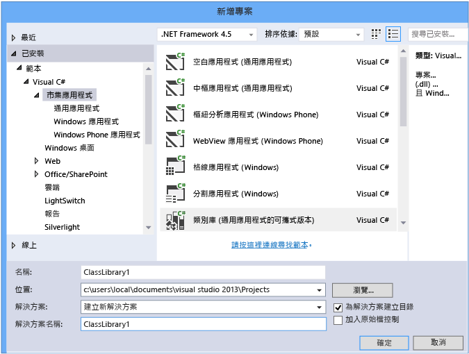
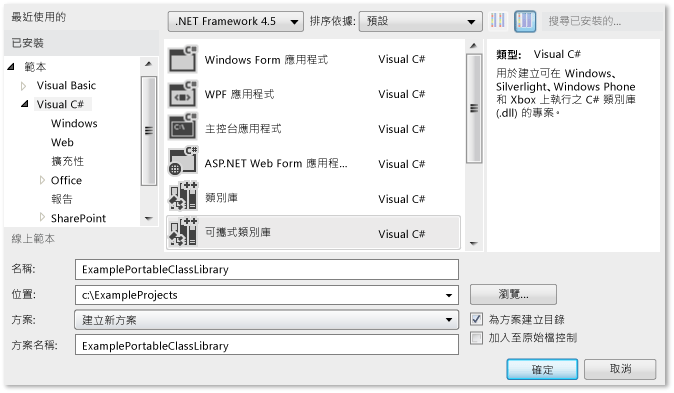
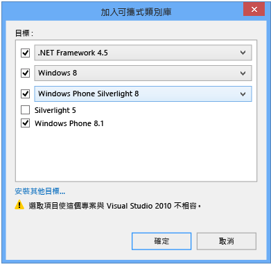
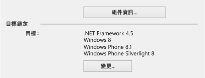
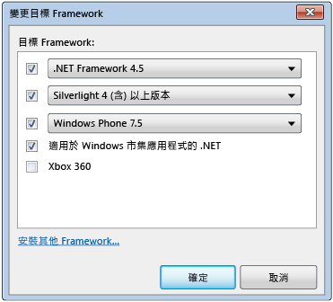
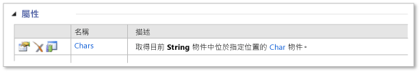
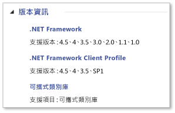

# <a name="cross-platform-development-with-the-portable-class-library"></a>可攜式類別庫的跨平台開發
Visual Studio 中的 .NET Framework 可攜式類別庫專案類型可幫助您快速、輕鬆地建立適用於 Microsoft 平台的跨平台應用程式和程式庫。  

[!INCLUDE[standard](../../../includes/pcl-to-standard.md)]

 可攜式類別庫可幫助您減少開發及測試程式碼的時間和成本。 使用此專案類型來撰寫及建立可攜式 .NET Framework 組件，然後從目標為多重平台 (例如 Windows 和 Windows Phone) 的應用程式參考那些組件。  
  
 即使在 Visual Studio 中建立可攜式類別庫專案並開始開發之後，您還是可以變更目標平台。 Visual Studio 會用新組件來編譯您的程式庫，可幫助您識別程式碼中需要進行的變更。  
  
 本文討論 Visual Studio 中的應用程式開發，但是 Microsoft 也有提供可攜式類別庫參考組件，可供您用來搭配其他工具 (例如 Xamarin) 開發應用程式和程式庫。 您可以在非 Microsoft 平台上的任何 .NET Framework 執行階段中使用這些應用程式和程式庫。 如需詳細的參考組件的詳細資訊，請參閱部落格文章[可攜式類別庫 (PCL) 現在適用於所有平台](https://blogs.msdn.com/b/dotnet/archive/2013/10/14/portable-class-library-pcl-now-available-on-all-platforms.aspx)。 若要下載組件，請參閱[Microsoft.NET 可攜式程式庫參考組件](https://www.microsoft.com/download/details.aspx?id=40727)在 Microsoft 下載中心取得。 如需如何搭配 Xamarin 使用組件的詳細資訊，請參閱部落格文章[PCL 和.NET NuGet 程式庫現在已為 Xamarin 啟用](https://blogs.msdn.com/b/dotnet/archive/2013/11/13/pcl-and-net-nuget-libraries-are-now-enabled-for-xamarin.aspx)。  
  
 Visual Studio 有提供範本，可協助您用可攜式類別庫進行開發。 依據您使用的 Visual Studio 版本，可用的範本和功能表可能會與本文說明的內容不同。  
  
> [!WARNING]
>  Visual Studio 2013 Update 2 包含可攜式類別庫範本的更新。 如果您有舊版的 Visual Studio 和 Visual Studio 2013 安裝在同一部電腦，而您接著會安裝 Update 2 中，所做的變更**目標 Framework**選項將會套用至這兩個版本的 Visual Studio。  
  
 本主題內容：  
  
 [Visual Studio 支援](#vs_support)  
 [建立可攜式類別庫專案](#create_pcl)  
 [目標選項](#platforms)  
 [變更目標](#change_targets)  
 [支援的功能](#features)  
 [支援的類型和成員](#members)  
 [可攜式類別庫中的 API 差異](#API_diff)  
 [使用可攜式類別庫](#using)  
  
<a name="vs_support"></a>   
## <a name="visual-studio-support"></a>Visual Studio 支援  
 對可攜式類別庫的 Visual Studio 支援取決於您使用的 Visual Studio 版本。 在某些情況下，您會擁有一切所需，而某些情況下，則會需要安裝額外的項目，如下表所示。  
  
|Visual Studio SKU|支援建立可攜式類別庫|  
|-----------------------|---------------------------------------------------|  
|Visual Studio 2010、Professional、Premium 或 Ultimate|是的當您安裝[可攜式文件庫工具](https://marketplace.visualstudio.com/items?itemName=BCLTeam.PortableLibraryTools2)。|  
|Visual Studio Express 2010 版本|否。|  
|Visual Studio 2012、Professional、Premium 或 Ultimate|可以。 如需 Windows Phone 8.0 支援安裝[Windows Phone SDK 8.0](https://www.microsoft.com/download/details.aspx?id=35471)。|  
|Visual Studio Express 2012 版本|否。|  
|Visual Studio 2013、Professional、Premium 或 Ultimate|可以。 如需 Windows Phone 8.1 支援安裝[最新版本的 Visual Studio 2013](https://visualstudio.microsoft.com/vs/older-downloads/)。|  
|Windows 的 visual Studio Community 2013|是的當您安裝[最新版本的 Visual Studio Community 2013](https://visualstudio.microsoft.com/vs/older-downloads/)，其中包括 Update 2。|  
  
<a name="create_pcl"></a>   
## <a name="creating-a-portable-class-library-project"></a>建立可攜式類別庫專案  
 若要建立可攜式類別庫，您應使用 Visual Studio 提供的其中一個範本。 建立新的專案，然後在**新的專案**對話方塊的 **範本**，選取您的目標語言 （C# 或 Visual Basic 中），然後選取您想要為目標平台之一。 您可以在下一個步驟選取其他平台。  
  
 在 Visual Studio 2013 Update 2 中，您可以選擇**類別庫 （可攜式）** 您選擇的語言及平台以建立可攜式類別庫的範本。 您會看到適用於下列平台的這個範本：  
  
-   市集應用程式  
  
-   Windows 桌面  
  
-   Silverlight  
  
 如果您想要在 C# 中建立程式庫，以目標為 Windows Phone 8.1 和 Windows 8.1，您可以選擇**市集應用程式**，然後選擇**類別庫 （通用應用程式的可攜式）**。  
  
   
  
 此範本會自動選取 Windows 8.1 和 Windows Phone 8.1 做為目標。 如果您建立的程式庫僅以 Windows Phone 8.1 或 Windows 8.1 為目標，您可以稍後再變更目標平台及加入平台。  
  
 如果您使用 Visual Studio 2012 或不含 Update 2 的 Visual Studio 2013，您建立新的專案，並選擇**可攜式類別庫**Visual C# 或 Visual Basic 底下的範本。  
  
   
  
 **加入可攜式類別庫** 對話方塊隨即出現，而且您可以選取其他平台。 該對話方塊會依據您選取的目標來提供相容性警告。  
  
   
Visual Studio 2013 Update 2 的加入可攜式類別庫對話方塊  
  
 無論您是使用 Visual Studio 2012 或 Visual Studio 2013，都可以在建立可攜式類別庫專案時選取平台，或是在建立專案之後，使用專案屬性來修改目標平台。  
  
<a name="platforms"></a>   
## <a name="target-options"></a>目標選項  
 當您建立可攜式類別庫專案時，可以選擇您要設為目標的作業系統和 .NET Framework 版本。 如果您使用 Visual Studio 2013，您已安裝 Update 2 或更新版本中，您可以選擇**類別庫 （通用應用程式的可攜式）** 範本來建立 Windows 8.1 和 Windows Phone 8.1 為目標的可攜式類別庫。 下表顯示依據您使用之 Visual Studio 版本而定的可用目標。  
  
|目標選項|Visual Studio 2012|Visual Studio 2013|Visual Studio 2013 Update 2 或更新版|  
|-|-|-|-|  
|.NET Framework|.NET framework 4 和更新版本<br /><br /> .NET framework 4.0.3 及更新版本<br /><br /> .NET framework 4.5|.NET framework 4 和更新版本<br /><br /> .NET framework 4.0.3 及更新版本<br /><br /> .NET framework 4.5 和更新版本<br /><br /> .NET framework 4.5.1|.NET framework 4<br /><br /> .NET framework 4.0.3<br /><br /> .NET framework 4.5<br /><br /> .NET framework 4.5.1|  
|Windows Phone|-Windows Phone 7 和更新版本<br /><br /> -Windows Phone 7.5 和更新版本<br /><br /> -Windows Phone 8|-Windows Phone 8|-Windows Phone Silverlight 8<br /><br /> -Windows Phone Silverlight 8.1<br /><br /> 如需 Windows 執行階段和 XAML 支援，請選擇：<br /><br /> -Windows Phone 8.1|  
|Windows 市集|-適用於 Windows 市集應用程式.NET|-Windows 市集應用程式 (Windows 8) 和更新版本<br /><br /> -Windows 市集應用程式 (Windows 8.1)|-Windows 8<br /><br /> - Windows 8.1|  
|Silverlight|Silverlight 4 和更新版本<br /><br /> Silverlight 5|Silverlight 5|Silverlight 5|  
|Xbox|-Xbox 360|N/A|N/A|  
  
<a name="change_targets"></a>   
## <a name="changing-targets"></a>變更目標  
 當您選擇可攜式類別庫範本時，會為您選取預設平台，但這些預設值會依據您安裝的 Visual Studio 版本以及先前選取的目標而不同。 您可以在建立可攜式類別庫時，或是在開始開發可攜式類別庫之後變更平台。  
  
 如果您想要建立您的專案，在之後變更目標**方案總管**，開啟您的可攜式類別庫專案 （而非方案），捷徑功能表，然後選擇**屬性**. 在專案屬性頁面上，**程式庫** 索引標籤上顯示的平台專案的目前目標。  
  
   
Visual Studio 2013 Update 2 的可攜式類別庫屬性頁  
  
 若要新增或移除目標，選擇**變更**按鈕，然後選取及清除適當的核取方塊。  
  
 當您變更目標時，可供您用來開發專案的 API 會變更，以配合您的選項。 Visual Studio 會提報因為目標變更而可能發生的錯誤和警告。  
  
 如果您想要評估的可攜性的組件之前，請在 Visual Studio 中進行變更，您可以使用[.NET Portability Analyzer](https://visualstudiogallery.msdn.microsoft.com/1177943e-cfb7-4822-a8a6-e56c7905292b)。  
  
 功能表選項會依據您使用的 Visual Studio 版本而不同。  
  
   
Visual Studio 2012 中的變更目標對話方塊  
  
<a name="features"></a>   
## <a name="supported-features"></a>支援的功能  
 下表顯示可用平台和版本上支援的功能。 在某些情況下，Microsoft 已加入 NuGet 套件發行的支援，而這會記錄下來。 適用於.NET Framework NuGet 套件的相關資訊，請參閱[.NET Framework 和頻外版本](../../../docs/framework/get-started/the-net-framework-and-out-of-band-releases.md)。  
  
|功能|.NET Framework|.NET Framework|.NET Framework|Windows 市集|Windows 市集|Windows Phone 市集|Windows Phone Silverlight|Windows Phone Silverlight|Windows Phone Silverlight|Silverlight|Silverlight|Xbox 360|  
|-------------|--------------------|--------------------|--------------------|-------------------|-------------------|-------------------------|-------------------------------|-------------------------------|-------------------------------|-----------------|-----------------|--------------|  
||**4**|**4.0.3**|**4.5**|**8**|**8.1**|**8.1**|**7.5**|**8**|**8.1**|**4**|**5**||  
|核心程式庫|✓|✓|✓|✓|✓|✓|✓|✓|✓|✓|✓|✓|  
|非同步支援|➊|➊|✓|✓|✓|✓|➊|➊|✓|➊|➊||  
|壓縮|||✓|✓|✓|✓||➋|➋||||  
|資料註釋||✓|✓|✓|✓|||||✓|✓||  
|Dynamic 關鍵字|✓|✓|✓|✓|✓|||||✓|✓||  
|HTTPClient|➌|➌|✓|✓|✓|✓|➌|➌|➌|➌|➌||  
|IQueryable|✓|✓|✓|✓|✓|✓|✓|✓|✓|✓|✓||  
|Language-Integrated Query (LINQ)|✓|✓|✓|✓|✓|✓|✓|✓|✓|✓|✓||  
|Managed Extensibility Network (MEF)|✓|✓|✓|✓|✓|||||✓|✓||  
|Network Class Library (NCL)|✓|✓|✓|✓|✓|✓|✓|✓|✓|✓|✓||  
|序列化 (資料合約、XML 和 JSON)|✓|✓|✓|✓|✓|✓|✓|✓|✓|✓|✓||  
|System.Numerics|✓|✓|✓|✓|✓|||||✓|✓||  
|檢視模型 (MVVM)|||✓|✓|✓|✓|✓|✓|✓|✓|✓||  
|Windows Communication Foundation (WCF)|✓|✓|✓|✓|✓||✓|✓|✓|✓|✓||  
|Windows 執行階段 API|||||✓|✓|||||||  
|Windows.UI.XAML|||||✓|✓|||||||  
|XLINQ||✓|✓|✓|✓|✓|✓|✓|✓|✓|✓|✓|  
  
 ➊ 需要[Microsoft Async](https://www.nuget.org/packages/Microsoft.Bcl.Async/)封裝  
 ➋ 需要[Microsoft Compression](https://www.nuget.org/packages/Microsoft.Bcl.Compression)封裝  
 ➌ 需要[Microsoft HTTP Client Libraries](https://www.nuget.org/packages/Microsoft.Net.Http)封裝  
  
> [!WARNING]
>  當您參考時，您可能會發生錯誤[Microsoft Compression](https://www.nuget.org/packages/Microsoft.Bcl.Compression)並[Microsoft HTTP Client Libraries](https://www.nuget.org/packages/Microsoft.Net.Http) Windows Phone Silverlight 8.1 應用程式所使用的可攜式程式庫中的套件。 如需詳細資訊，請參閱 <<c0> [ 平台相容性和重大變更 Windows Phone Silverlight 8.1 應用程式](https://docs.microsoft.com/previous-versions/windows/apps/dn642084(v=vs.105))。  
  
<a name="members"></a>   
## <a name="supported-types-and-members"></a>支援的類型和成員  
 可攜式類別庫專案中提供的類型和成員受到多個相容性因素所限制：  
  
-   它們必須在您選取的目標之間共用。  
  
-   它們必須在這些目標上具有類似的行為。  
  
-   它們不能是要被取代的候選項。  
  
-   它們在可攜式環境中必須是合理的，尤其是支援成員無法移植時。  
  
 例如，只有在目標為 Windows 8.1 和 Windows Phone 8.1 時，可攜式類別庫才會包含 UI 相關類型。 此外，如果您的目標平台 (例如 Xbox、.NET Framework 4 和 Windows Phone 7) 是在引進可攜式類別庫之前發行，可能也會遇到一些限制。 .NET Framework 透過 NuGet 發行套件，NuGet 可改善對部分較舊平台的可攜式類別庫支援。 如需詳細資訊和 NuGet 套件的清單，請參閱[.NET Framework 和頻外版本](../../../docs/framework/get-started/the-net-framework-and-out-of-band-releases.md)。  
  
 如果可攜式類別庫和您選取的目標可支援某成員，該成員就會出現在 IntelliSense 的專案中。 此外，可攜式類別庫圖示會出現在成員表格中，在[.NET Framework 類別庫](https://msdn.microsoft.com/library/mt472912.aspx)支援成員旁邊。 例如，下面的成員表格顯示，可攜式類別庫可支援 <xref:System.String.Chars%2A> 類別中的 <xref:System.String> 屬性：  
  
   
可攜式類別庫圖示  
  
 您也可以查看**版本資訊**的注意事項，指出型別或成員支援可攜式類別庫專案中的參考主題的章節：  
  
   
版本資訊範例  
  
 不過，請記得，可攜式類別庫可能會支援 API，但您是否可以使用 API，取決於您選取的目標。  
  
<a name="API_diff"></a>   
## <a name="api-differences-in-the-portable-class-library"></a>可攜式類別庫中的 API 差異  
 為了讓可攜式類別庫組件在所有支援的平台上都相容，可攜式類別庫中有部分成員已稍微變更。  
  
<a name="using"></a>   
## <a name="using-the-portable-class-library"></a>使用可攜式類別庫  
 建立可攜式類別庫專案之後，即可從其他專案參考該專案。 您可以參考此專案，或是包含您想要存取之類別的特定組件。  
  
 若要執行參考可攜式類別庫組件的應用程式，電腦上必須安裝目標平台所需的版本 (或以後版本)。 Visual Studio 包含所有必要架構，因此不需要進一步修改用來開發應用程式的電腦，即可執行該應用程式。  
  
### <a name="deploying-a-windows-store-or-windows-phone-app"></a>部署 Windows 市集或 Windows Phone 應用程式  
 當您建立參考可攜式類別庫組件的 Windows 市集或 Windows Phone 應用程式時，部署應用程式所需的一切都已內含在應用程式套件中，不需要進一步的步驟。  
  
### <a name="deploying-a-net-framework-app"></a>部署 .NET Framework 應用程式  
 當您部署參考可攜式類別庫組件的 .NET Framework 應用程式時，必須指定正確 .NET Framework 版本的相依性。 藉由指定此相依性，您就可以確保所需的版本會隨著您的應用程式一起安裝。 如果您的目標.NET Framework 4 或更新版本中，電腦必須與.NET Framework 4[更新](https://www.microsoft.com/download/details.aspx?id=3556)，.NET Framework 4 或.NET Framework 4.5 安裝的更新 4.0.3。  
  
-   若要建立與 ClickOnce 部署的相依性： 在**方案總管 中**，選擇您想要發佈專案的專案節點。 (這是參考可攜式類別庫專案的專案。)在功能表列上選擇 **專案**，**屬性**，然後選擇**發行** 索引標籤。在 **發佈**頁面上，選擇**必要條件**。 選取所需的 .NET Framework 版本 (或 .NET Framework 4 更新) 做為必要條件。  
  
-   若要建立與安裝專案的相依性： 在**方案總管] 中**，選擇 [安裝專案。 在功能表列上選擇 **專案**，**屬性**，**必要條件**。 選取所需的 .NET Framework 版本做為必要條件。  
  
 如需部署.NET Framework 應用程式的詳細資訊，請參閱 <<c0> [ 開發人員部署手冊](../../../docs/framework/deployment/deployment-guide-for-developers.md)。  
  
### <a name="deploying-a-silverlight-based-app"></a>部署 Silverlight 架構應用程式  
 當您部署參考可攜式類別庫組件的 Silverlight 架構應用程式時，必須確定應用程式所需的最低執行階段版本符合其目標版本。 如果您的目標是 Silverlight 4，則版本必須是 4.0.60129.0 (含) 以後版本。 在裝載 Silverlight 架構應用程式的網頁中包含 `<param name="minRuntimeVersion" value="4.0.60129.0" />` 即可設定版本，如下所示：  
  
```xaml  
<div id="silverlightControlHost">  
    <object data="data:application/x-silverlight-2,"   
           type="application/x-silverlight-2" width="100%" height="100%">  
    <param name="source" value="ClientBin/SilverlightApplication.xap"/>  
    <param name="onError" value="onSilverlightError" />  
    <param name="background" value="white" />  
    <param name="minRuntimeVersion" value="4.0.60129.0" />  
    <param name="autoUpgrade" value="true" />  
    <a href="https://www.microsoft.com/getsilverlight/get-started/install/"   
             style="text-decoration:none">  
        
    </a>  
  </object>  
   <iframe id="_sl_historyFrame"   
              style="visibility:hidden;height:0px;width:0px;border:0px">  
   </iframe>  
</div>  
```  
  
## <a name="see-also"></a>另請參閱

- [搭配 MVVM 使用可攜式類別庫](../../../docs/standard/cross-platform/using-portable-class-library-with-model-view-view-model.md)  
- [以多平台為目標之程式庫的應用程式資源](../../../docs/standard/cross-platform/app-resources-for-libraries-that-target-multiple-platforms.md)  
- [.NET portability Analyzer](https://visualstudiogallery.msdn.microsoft.com/1177943e-cfb7-4822-a8a6-e56c7905292b)  
- [Windows 市集應用程式和 Windows 執行階段的 .NET Framework 支援](../../../docs/standard/cross-platform/support-for-windows-store-apps-and-windows-runtime.md)  
- [部署](../../../docs/framework/deployment/net-framework-applications.md)
