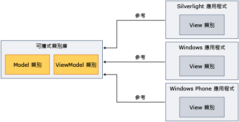

# 搭配 Model-View-View 模型使用可攜式類別庫Using Portable Class Library with Model-View-View Model
您可以使用.NET Framework[可攜式類別庫](../../../docs/standard/cross-platform/cross-platform-development-with-the-portable-class-library.md)實作模型檢視 View Model (MVVM) 模式，並且跨多平台共用組件。You can use the .NET Framework [Portable Class Library](../../../docs/standard/cross-platform/cross-platform-development-with-the-portable-class-library.md) to implement the Model-View-View Model (MVVM) pattern and share assemblies across multiple platforms.  
  
 MVVM 是將使用者介面與基礎商務邏輯隔離的應用程式模式。MVVM is an application pattern that isolates the user interface from the underlying business logic. 您可以在 [!INCLUDE[net_portable](../../../includes/net-portable-md.md)] 的[!INCLUDE[vs_dev11_long](../../../includes/vs-dev11-long-md.md)]專案中實作模型和檢視模型類別，然後建立針對不同平台自訂的檢視。You can implement the model and view model classes in a [!INCLUDE[net_portable](../../../includes/net-portable-md.md)] project in [!INCLUDE[vs_dev11_long](../../../includes/vs-dev11-long-md.md)], and then create views that are customized for different platforms. 這個方法讓您只需撰寫資料模型和商務邏輯一次，就可以從 .NET Framework、Silverlight、Windows Phone 和 [!INCLUDE[win8_appname_long](../../../includes/win8-appname-long-md.md)]應用程式使用該程式碼，如下圖所示。This approach enables you to write the data model and business logic only once, and use that code from .NET Framework, Silverlight, Windows Phone, and [!INCLUDE[win8_appname_long](../../../includes/win8-appname-long-md.md)] apps, as shown in the following illustration.  
  
   
  
 本主題不提供 MVVM 模式的一般資訊。This topic does not provide general information about the MVVM pattern. 它只會提供有關如何使用資訊[!INCLUDE[net_portable](../../../includes/net-portable-md.md)]實作 MVVM。It only provides information about how to use [!INCLUDE[net_portable](../../../includes/net-portable-md.md)] to implement MVVM. 如需 MVVM 的詳細資訊，請參閱[MVVM 快速入門](https://msdn.microsoft.com/library/gg430869(v=PandP.40).aspx)。For more information about MVVM, see the [MVVM Quickstart](https://msdn.microsoft.com/library/gg430869(v=PandP.40).aspx).  
  
## 類別，可支援 MVVMClasses That Support MVVM  
 如果您的[!INCLUDE[net_v45](../../../includes/net-v45-md.md)]專案是以 [!INCLUDE[net_win8_profile](../../../includes/net-win8-profile-md.md)]、[!INCLUDE[net_portable](../../../includes/net-portable-md.md)]、Silverlight 或 Windows Phone 7.5 為目標，就可以使用下列類別實作 MVVM 模式：When you target the [!INCLUDE[net_v45](../../../includes/net-v45-md.md)], [!INCLUDE[net_win8_profile](../../../includes/net-win8-profile-md.md)], Silverlight, or Windows Phone 7.5 for your [!INCLUDE[net_portable](../../../includes/net-portable-md.md)] project, the following classes are available for implementing the MVVM pattern:  
  
-   <xref:System.Collections.ObjectModel.ObservableCollection%601?displayProperty=nameWithType> 類別<xref:System.Collections.ObjectModel.ObservableCollection%601?displayProperty=nameWithType> class  
  
-   <xref:System.Collections.ObjectModel.ReadOnlyObservableCollection%601?displayProperty=nameWithType> 類別<xref:System.Collections.ObjectModel.ReadOnlyObservableCollection%601?displayProperty=nameWithType> class  
  
-   <xref:System.Collections.Specialized.INotifyCollectionChanged?displayProperty=nameWithType> 類別<xref:System.Collections.Specialized.INotifyCollectionChanged?displayProperty=nameWithType> class  
  
-   <xref:System.Collections.Specialized.NotifyCollectionChangedAction?displayProperty=nameWithType> 類別<xref:System.Collections.Specialized.NotifyCollectionChangedAction?displayProperty=nameWithType> class  
  
-   <xref:System.Collections.Specialized.NotifyCollectionChangedEventArgs?displayProperty=nameWithType> 類別<xref:System.Collections.Specialized.NotifyCollectionChangedEventArgs?displayProperty=nameWithType> class  
  
-   <xref:System.Collections.Specialized.NotifyCollectionChangedEventHandler?displayProperty=nameWithType> 類別<xref:System.Collections.Specialized.NotifyCollectionChangedEventHandler?displayProperty=nameWithType> class  
  
-   <xref:System.ComponentModel.DataErrorsChangedEventArgs?displayProperty=nameWithType> 類別<xref:System.ComponentModel.DataErrorsChangedEventArgs?displayProperty=nameWithType> class  
  
-   <xref:System.ComponentModel.INotifyDataErrorInfo?displayProperty=nameWithType> 類別<xref:System.ComponentModel.INotifyDataErrorInfo?displayProperty=nameWithType> class  
  
-   <xref:System.ComponentModel.INotifyPropertyChanged?displayProperty=nameWithType> 類別<xref:System.ComponentModel.INotifyPropertyChanged?displayProperty=nameWithType> class  
  
-   <xref:System.Windows.Input.ICommand?displayProperty=nameWithType> 類別<xref:System.Windows.Input.ICommand?displayProperty=nameWithType> class  
  
-   中的所有類別<xref:System.ComponentModel.DataAnnotations?displayProperty=nameWithType>命名空間All classes in the <xref:System.ComponentModel.DataAnnotations?displayProperty=nameWithType> namespace  
  
## 實作 MVVMImplementing MVVM  
 若要實作 MVVM，您通常會建立模型和檢視模型中的[!INCLUDE[net_portable](../../../includes/net-portable-md.md)]專案，因為[!INCLUDE[net_portable](../../../includes/net-portable-md.md)]專案無法參考非可攜式專案。To implement MVVM, you typically create both the model and the view model in a [!INCLUDE[net_portable](../../../includes/net-portable-md.md)] project, because a [!INCLUDE[net_portable](../../../includes/net-portable-md.md)] project cannot reference a non-portable project. 模型和檢視模型可以是相同專案中，或在不同的專案中。The model and view model can be in the same project or in separate projects. 如果您使用不同的專案，請從檢視模型專案新增參考模型專案。If you use separate projects, add a reference from the view model project to the model project.  
  
 編譯模型後，當您檢視模型專案時，會參考包含此檢視的應用程式中的這些組件。After you compile the model and view model projects, you reference those assemblies in the app that contains the view. 檢視只會與檢視模型互動時，如果您只需要參考組件包含檢視模型。If the view interacts only with the view model, you only have to reference the assembly that contains the view model.  
  
### 型號Model  
 下列範例示範的簡化的模型類別，可能位於[!INCLUDE[net_portable](../../../includes/net-portable-md.md)]專案。The following example shows a simplified model class that could reside in a [!INCLUDE[net_portable](../../../includes/net-portable-md.md)] project.  
  
 [!code-csharp[PortableClassLibraryMVVM#1](../../../samples/snippets/csharp/VS_Snippets_CLR/portableclasslibrarymvvm/cs/customer.cs#1)]
 [!code-vb[PortableClassLibraryMVVM#1](../../../samples/snippets/visualbasic/VS_Snippets_CLR/portableclasslibrarymvvm/vb/customer.vb#1)]  
  
 下列範例顯示簡單的方式填入、 擷取及更新中的資料[!INCLUDE[net_portable](../../../includes/net-portable-md.md)]專案。The following example shows a simple way to populate, retrieve, and update the data in a [!INCLUDE[net_portable](../../../includes/net-portable-md.md)] project. 在實際的應用程式，將會從來源，例如 Windows Communication Foundation (WCF) 服務擷取資料。In a real app, you would retrieve the data from a source such as a Windows Communication Foundation (WCF) service.  
  
 [!code-csharp[PortableClassLibraryMVVM#2](../../../samples/snippets/csharp/VS_Snippets_CLR/portableclasslibrarymvvm/cs/customerrepository.cs#2)]
 [!code-vb[PortableClassLibraryMVVM#2](../../../samples/snippets/visualbasic/VS_Snippets_CLR/portableclasslibrarymvvm/vb/customerrepository.vb#2)]  
  
### 檢視模型View Model  
 實作 MVVM 模式時，經常會加入檢視模型的基底類別。A base class for view models is frequently added when implementing the MVVM pattern. 下列範例顯示基底類別。The following example shows a base class.  
  
 [!code-csharp[PortableClassLibraryMVVM#3](../../../samples/snippets/csharp/VS_Snippets_CLR/portableclasslibrarymvvm/cs/viewmodelbase.cs#3)]
 [!code-vb[PortableClassLibraryMVVM#3](../../../samples/snippets/visualbasic/VS_Snippets_CLR/portableclasslibrarymvvm/vb/viewmodelbase.vb#3)]  
  
 實作<xref:System.Windows.Input.ICommand>介面經常搭配 MVVM 模式。An implementation of the <xref:System.Windows.Input.ICommand> interface is frequently used with the MVVM pattern. 下列範例會示範 <xref:System.Windows.Input.ICommand> 介面的實作。The following example shows an implementation of the <xref:System.Windows.Input.ICommand> interface.  
  
 [!code-csharp[PortableClassLibraryMVVM#4](../../../samples/snippets/csharp/VS_Snippets_CLR/portableclasslibrarymvvm/cs/relaycommand.cs#4)]
 [!code-vb[PortableClassLibraryMVVM#4](../../../samples/snippets/visualbasic/VS_Snippets_CLR/portableclasslibrarymvvm/vb/relaycommand.vb#4)]  
  
 下列範例示範簡化的檢視模型。The following example shows a simplified view model.  
  
 [!code-csharp[PortableClassLibraryMVVM#5](../../../samples/snippets/csharp/VS_Snippets_CLR/portableclasslibrarymvvm/cs/mainpageviewmodel.cs#5)]
 [!code-vb[PortableClassLibraryMVVM#5](../../../samples/snippets/visualbasic/VS_Snippets_CLR/portableclasslibrarymvvm/vb/customerviewmodel.vb#5)]  
  
### 檢視View  
 從[!INCLUDE[net_v45](../../../includes/net-v45-md.md)]應用程式，[!INCLUDE[win8_appname_long](../../../includes/win8-appname-long-md.md)]應用程式、 Silverlight 架構應用程式或 Windows Phone 7.5 的應用程式，您可以參考包含模型和檢視的模型專案的組件。From a [!INCLUDE[net_v45](../../../includes/net-v45-md.md)] app, [!INCLUDE[win8_appname_long](../../../includes/win8-appname-long-md.md)] app, Silverlight-based app, or Windows Phone 7.5 app, you can reference the assembly that contains the model and view model projects.  然後，您會建立互動的檢視以檢視模型。You then create a view that interacts with the view model. 下列範例示範簡化的 Windows Presentation Foundation (WPF) 應用程式，以擷取並更新檢視模型中的資料。The following example shows a simplified Windows Presentation Foundation (WPF) app that retrieves and updates data from the view model. 您可以在 Windows Phone Silverlight 建立類似的檢視或[!INCLUDE[win8_appname_long](../../../includes/win8-appname-long-md.md)]應用程式。You could create similar views in Silverlight, Windows Phone, or [!INCLUDE[win8_appname_long](../../../includes/win8-appname-long-md.md)] apps.  
  
 [!code-xaml[PortableClassLibraryMVVM#6](../../../samples/snippets/csharp/VS_Snippets_CLR/portableclasslibrarymvvm/cs/mainwindow.xaml#6)]  
  
## 另請參閱See Also  
 [可攜式類別庫Portable Class Library](../../../docs/standard/cross-platform/cross-platform-development-with-the-portable-class-library.md)
