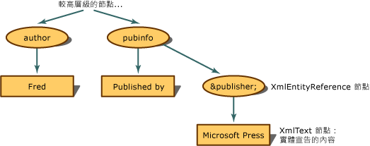

# <a name="entity-references-are-preserved"></a>保留實體參照
當實體參照並未擴充但保留下來時，若 XML 文件物件模型 (DOM) 遇到實體參照，就會建置 **XmlEntityReference** 節點。  
  
 使用下列 XML，  
  
```xml  
<author>Fred</author>  
<pubinfo>Published by &publisher;</pubinfo>  
```  
  
 當 DOM 遇到 `&publisher;` 參照時，就會建置 **XmlEntityReference** 節點。 **XmlEntityReference** 包含從實體宣告中的內容所複製的子節點。 先前的程式碼範例包含實體宣告中的文字，因此 **XmlText** 節點會建立為實體參照節點的子節點。  
  
   
保留之實體參照的樹狀  
  
 **XmlEntityReference** 的子節點是在遇到實體宣告時，由 **XmlEntity** 節點建立的所有子節點的複本。  
  
> [!NOTE]
>  從 **XmlEntity** 複製的節點不一定就是曾置於實體參照節點下的複本。 在實體參照節點的範圍中可能有命名空間，這會影響子節點的最後組態。  
  
 根據預設，會保留 `&abc;` 之類的一般實體，且一律會建立 **XmlEntityReference** 節點。  
  
## <a name="see-also"></a>請參閱  
 [XML 文件物件模型 (DOM)](../../../../docs/standard/data/xml/xml-document-object-model-dom.md)
