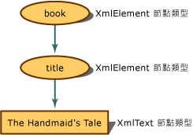

# <a name="mapping-the-object-hierarchy-to-xml-data"></a><span data-ttu-id="0b0ee-102">將物件階層架構對應至 XML 資料</span><span class="sxs-lookup"><span data-stu-id="0b0ee-102">Mapping the Object Hierarchy to XML Data</span></span>
<span data-ttu-id="0b0ee-103">當 XML 文件在記憶體時，概念式的表示就是樹狀。</span><span class="sxs-lookup"><span data-stu-id="0b0ee-103">When an XML document is in memory, the conceptual representation is a tree.</span></span> <span data-ttu-id="0b0ee-104">對於程式設計，您有物件階層架構來存取樹狀結構的節點。</span><span class="sxs-lookup"><span data-stu-id="0b0ee-104">For programming, you have an object hierarchy to access the nodes of the tree.</span></span> <span data-ttu-id="0b0ee-105">下列範例顯示 XML 內容如何成為節點。</span><span class="sxs-lookup"><span data-stu-id="0b0ee-105">The following example shows you how the XML content becomes nodes.</span></span>  
  
 <span data-ttu-id="0b0ee-106">當 XML 讀入 XML 文件物件模型 (DOM) 時，片段會轉譯成節點，而這些節點會保留本身其他相關的中繼資料，例如其節點型別與值。</span><span class="sxs-lookup"><span data-stu-id="0b0ee-106">As the XML is read into the XML Document Object Model (DOM), the pieces are translated into nodes, and these nodes retain additional metadata about themselves, such as their node type and values.</span></span> <span data-ttu-id="0b0ee-107">節點型別是指其物件，以及決定可執行哪些動作與可設定或擷取哪些屬性的項目。</span><span class="sxs-lookup"><span data-stu-id="0b0ee-107">The node type is its object and is what determines what actions can be performed and what properties can be set or retrieved.</span></span>  
  
 <span data-ttu-id="0b0ee-108">如果您有下列的簡單 XML：</span><span class="sxs-lookup"><span data-stu-id="0b0ee-108">If you have the following simple XML:</span></span>  
  
 <span data-ttu-id="0b0ee-109">**輸入**</span><span class="sxs-lookup"><span data-stu-id="0b0ee-109">**Input**</span></span>  
  
```xml  
<book>  
    <title>The Handmaid's Tale</title>  
</book>  
```  
  
 <span data-ttu-id="0b0ee-110">輸入表示在記憶體中，顯示成下列具指派節點型別屬性的節點樹狀：</span><span class="sxs-lookup"><span data-stu-id="0b0ee-110">The input is represented in memory as the following node tree with the assigned node type property:</span></span>  
  
 <span data-ttu-id="0b0ee-111"></span><span class="sxs-lookup"><span data-stu-id="0b0ee-111"></span></span>  
<span data-ttu-id="0b0ee-112">Book 和 title 節點的樹狀表示</span><span class="sxs-lookup"><span data-stu-id="0b0ee-112">Book and title node tree representation</span></span>  
  
 <span data-ttu-id="0b0ee-113">`book` 項目會成為 **XmlElement** 物件，下一個項目 `title` 也會成為 **XmlElement**，而項目內容會成為 **XmlText** 物件。</span><span class="sxs-lookup"><span data-stu-id="0b0ee-113">The `book` element becomes an **XmlElement** object, the next element, `title`, also becomes an **XmlElement**, while the element content becomes an **XmlText** object.</span></span> <span data-ttu-id="0b0ee-114">查看 **XmlElement** 方法和屬性時，方法和屬性與 **XmlText** 物件中可以使用的方法和屬性不同。</span><span class="sxs-lookup"><span data-stu-id="0b0ee-114">In looking at the **XmlElement** methods and properties, the methods and properties are different than the methods and properties available on an **XmlText** object.</span></span> <span data-ttu-id="0b0ee-115">因此了解 XML 標記會變成何種節點型別變得很重要，因為它的節點型別會決定可以執行的動作。</span><span class="sxs-lookup"><span data-stu-id="0b0ee-115">So knowing what node type the XML markup becomes is vital, as its node type determines the actions that can be performed.</span></span>  
  
 <span data-ttu-id="0b0ee-116">下列範例讀入 XML 資料，並且根據節點型別寫出不同的文字。</span><span class="sxs-lookup"><span data-stu-id="0b0ee-116">The following example reads in XML data and writes out different text, depending on the node type.</span></span> <span data-ttu-id="0b0ee-117">使用下列 XML 資料檔 **items.xml** 來做為輸入：</span><span class="sxs-lookup"><span data-stu-id="0b0ee-117">Using the following XML data file as input, **items.xml**:</span></span>  
  
 <span data-ttu-id="0b0ee-118">**輸入**</span><span class="sxs-lookup"><span data-stu-id="0b0ee-118">**Input**</span></span>  
  
```xml  
<?xml version="1.0"?>  
<!-- This is a sample XML document -->  
<!DOCTYPE Items [<!ENTITY number "123">]>  
<Items>  
  <Item>Test with an entity: &number;</Item>  
  <Item>test with a child element <more/> stuff</Item>  
  <Item>test with a CDATA section <![CDATA[<456>]]> def</Item>  
  <Item>Test with a char entity: A</Item>  
  <!-- Fourteen chars in this element.-->  
  <Item>1234567890ABCD</Item>  
</Items>  
```  
  
 <span data-ttu-id="0b0ee-119">下列程式碼範例讀取 **items.xml** 檔並且顯示每個節點型別的資訊。</span><span class="sxs-lookup"><span data-stu-id="0b0ee-119">The following code example reads the **items.xml** file and displays information for each node type.</span></span>  
  
```vb  
Imports System  
Imports System.IO  
Imports System.Xml  
  
Public Class Sample  
    Private Const filename As String = "items.xml"  
  
    Public Shared Sub Main()  
  
        Dim reader As XmlTextReader = Nothing  
  
        Try  
            ' Load the reader with the data file and   
            'ignore all white space nodes.   
            reader = New XmlTextReader(filename)  
            reader.WhitespaceHandling = WhitespaceHandling.None  
  
            ' Parse the file and display each of the nodes.  
            While reader.Read()  
                Select Case reader.NodeType  
                    Case XmlNodeType.Element  
                        Console.Write("<{0}>", reader.Name)  
                    Case XmlNodeType.Text  
                        Console.Write(reader.Value)  
                    Case XmlNodeType.CDATA  
                        Console.Write("<![CDATA[{0}]]>", reader.Value)  
                    Case XmlNodeType.ProcessingInstruction  
                        Console.Write("<?{0} {1}?>", reader.Name, reader.Value)  
                    Case XmlNodeType.Comment  
                        Console.Write("<!--{0}-->", reader.Value)  
                    Case XmlNodeType.XmlDeclaration  
                        Console.Write("<?xml version='1.0'?>")  
                    Case XmlNodeType.Document  
                    Case XmlNodeType.DocumentType  
                        Console.Write("<!DOCTYPE {0} [{1}]", reader.Name, reader.Value)  
                    Case XmlNodeType.EntityReference  
                        Console.Write(reader.Name)  
                    Case XmlNodeType.EndElement  
                        Console.Write("</{0}>", reader.Name)  
                End Select  
            End While  
  
        Finally  
            If Not (reader Is Nothing) Then  
                reader.Close()  
            End If  
        End Try  
    End Sub 'Main ' End class  
End Class 'Sample  
```  
  
```csharp  
using System;  
using System.IO;  
using System.Xml;  
  
public class Sample  
{  
    private const String filename = "items.xml";  
  
    public static void Main()  
    {  
        XmlTextReader reader = null;  
  
        try  
        {  
            // Load the reader with the data file and ignore   
            // all white space nodes.  
            reader = new XmlTextReader(filename);  
            reader.WhitespaceHandling = WhitespaceHandling.None;  
  
            // Parse the file and display each of the nodes.  
            while (reader.Read())  
            {  
                switch (reader.NodeType)  
                {  
                    case XmlNodeType.Element:  
                        Console.Write("<{0}>", reader.Name);  
                        break;  
                    case XmlNodeType.Text:  
                        Console.Write(reader.Value);  
                        break;  
                    case XmlNodeType.CDATA:  
                        Console.Write("<![CDATA[{0}]]>", reader.Value);  
                        break;  
                    case XmlNodeType.ProcessingInstruction:  
                        Console.Write("<?{0} {1}?>", reader.Name, reader.Value);  
                        break;  
                    case XmlNodeType.Comment:  
                        Console.Write("<!--{0}-->", reader.Value);  
                        break;  
                    case XmlNodeType.XmlDeclaration:  
                        Console.Write("<?xml version='1.0'?>");  
                        break;  
                    case XmlNodeType.Document:  
                        break;  
                    case XmlNodeType.DocumentType:  
                        Console.Write("<!DOCTYPE {0} [{1}]", reader.Name, reader.Value);  
                        break;  
                    case XmlNodeType.EntityReference:  
                        Console.Write(reader.Name);  
                        break;  
                    case XmlNodeType.EndElement:  
                        Console.Write("</{0}>", reader.Name);  
                        break;  
                }  
            }  
        }  
  
        finally  
        {  
            if (reader != null)  
                reader.Close();  
        }  
    }  
} // End class  
```  
  
 <span data-ttu-id="0b0ee-120">範例的輸出透露資料至節點型別的對應。</span><span class="sxs-lookup"><span data-stu-id="0b0ee-120">The output from the example reveals the mapping of the data to the node types.</span></span>  
  
 <span data-ttu-id="0b0ee-121">**輸出**</span><span class="sxs-lookup"><span data-stu-id="0b0ee-121">**Output**</span></span>  
  
```xml  
<?xml version='1.0'?><!--This is a sample XML document --><!DOCTYPE Items [<!ENTITY number "123">]<Items><Item>Test with an entity: 123</Item><Item>test with a child element <more> stuff</Item><Item>test with a CDATA section <![CDATA[<456>]]> def</Item><Item>Test with a char entity: A</Item><--Fourteen chars in this element.--><Item>1234567890ABCD</Item></Items>  
```  
  
 <span data-ttu-id="0b0ee-122">逐行使用輸入，並利用程式碼所產生的輸出，即可使用下列表格來分析哪個節點的測試會產生哪些輸出行，藉此瞭解何種 XML 資料會成為何種節點型別。</span><span class="sxs-lookup"><span data-stu-id="0b0ee-122">Taking the input one line at a time and using the output generated from the code, you can use the following table to analyze what node test generated which lines of output, thereby understanding what XML data became what kind of node type.</span></span>  
  
|<span data-ttu-id="0b0ee-123">輸入</span><span class="sxs-lookup"><span data-stu-id="0b0ee-123">Input</span></span>|<span data-ttu-id="0b0ee-124">輸出</span><span class="sxs-lookup"><span data-stu-id="0b0ee-124">Output</span></span>|<span data-ttu-id="0b0ee-125">節點型別測試</span><span class="sxs-lookup"><span data-stu-id="0b0ee-125">Node Type Test</span></span>|  
|-----------|------------|--------------------|  
|<span data-ttu-id="0b0ee-126">\<?xml version="1.0"?></span><span class="sxs-lookup"><span data-stu-id="0b0ee-126">\<?xml version="1.0"?></span></span>|<span data-ttu-id="0b0ee-127">\<?xml version='1.0'?></span><span class="sxs-lookup"><span data-stu-id="0b0ee-127">\<?xml version='1.0'?></span></span>|<span data-ttu-id="0b0ee-128">XmlNodeType.XmlDeclaration</span><span class="sxs-lookup"><span data-stu-id="0b0ee-128">XmlNodeType.XmlDeclaration</span></span>|  
|<span data-ttu-id="0b0ee-129">\<!-- This is a sample XML document --></span><span class="sxs-lookup"><span data-stu-id="0b0ee-129">\<!-- This is a sample XML document --></span></span>|<span data-ttu-id="0b0ee-130">\<!--This is a sample XML document --></span><span class="sxs-lookup"><span data-stu-id="0b0ee-130">\<!--This is a sample XML document --></span></span>|<span data-ttu-id="0b0ee-131">XmlNodeType.Comment</span><span class="sxs-lookup"><span data-stu-id="0b0ee-131">XmlNodeType.Comment</span></span>|  
|<span data-ttu-id="0b0ee-132">\<!DOCTYPE Items [\<!ENTITY number "123">]></span><span class="sxs-lookup"><span data-stu-id="0b0ee-132">\<!DOCTYPE Items [\<!ENTITY number "123">]></span></span>|<span data-ttu-id="0b0ee-133">\<!DOCTYPE Items [\<!ENTITY number "123">]</span><span class="sxs-lookup"><span data-stu-id="0b0ee-133">\<!DOCTYPE Items [\<!ENTITY number "123">]</span></span>|<span data-ttu-id="0b0ee-134">XmlNodeType.DocumentType</span><span class="sxs-lookup"><span data-stu-id="0b0ee-134">XmlNodeType.DocumentType</span></span>|  
|<span data-ttu-id="0b0ee-135">\<Items></span><span class="sxs-lookup"><span data-stu-id="0b0ee-135">\<Items></span></span>|<span data-ttu-id="0b0ee-136">\<Items></span><span class="sxs-lookup"><span data-stu-id="0b0ee-136">\<Items></span></span>|<span data-ttu-id="0b0ee-137">XmlNodeType.Element</span><span class="sxs-lookup"><span data-stu-id="0b0ee-137">XmlNodeType.Element</span></span>|  
|<span data-ttu-id="0b0ee-138">\<Item></span><span class="sxs-lookup"><span data-stu-id="0b0ee-138">\<Item></span></span>|<span data-ttu-id="0b0ee-139">\<Item></span><span class="sxs-lookup"><span data-stu-id="0b0ee-139">\<Item></span></span>|<span data-ttu-id="0b0ee-140">XmlNodeType.Element</span><span class="sxs-lookup"><span data-stu-id="0b0ee-140">XmlNodeType.Element</span></span>|  
|<span data-ttu-id="0b0ee-141">Test with an entity: &number;</span><span class="sxs-lookup"><span data-stu-id="0b0ee-141">Test with an entity: &number;</span></span>|<span data-ttu-id="0b0ee-142">Test with an entity: 123</span><span class="sxs-lookup"><span data-stu-id="0b0ee-142">Test with an entity: 123</span></span>|<span data-ttu-id="0b0ee-143">XmlNodeType.Text</span><span class="sxs-lookup"><span data-stu-id="0b0ee-143">XmlNodeType.Text</span></span>|  
|<span data-ttu-id="0b0ee-144">\</Item></span><span class="sxs-lookup"><span data-stu-id="0b0ee-144">\</Item></span></span>|<span data-ttu-id="0b0ee-145">\</Item></span><span class="sxs-lookup"><span data-stu-id="0b0ee-145">\</Item></span></span>|<span data-ttu-id="0b0ee-146">XmlNodeType.EndElement</span><span class="sxs-lookup"><span data-stu-id="0b0ee-146">XmlNodeType.EndElement</span></span>|  
|<span data-ttu-id="0b0ee-147">\<Item></span><span class="sxs-lookup"><span data-stu-id="0b0ee-147">\<Item></span></span>|<span data-ttu-id="0b0ee-148">\<Item></span><span class="sxs-lookup"><span data-stu-id="0b0ee-148">\<Item></span></span>|<span data-ttu-id="0b0ee-149">XmNodeType.Element</span><span class="sxs-lookup"><span data-stu-id="0b0ee-149">XmNodeType.Element</span></span>|  
|<span data-ttu-id="0b0ee-150">test with a child element</span><span class="sxs-lookup"><span data-stu-id="0b0ee-150">test with a child element</span></span>|<span data-ttu-id="0b0ee-151">test with a child element</span><span class="sxs-lookup"><span data-stu-id="0b0ee-151">test with a child element</span></span>|<span data-ttu-id="0b0ee-152">XmlNodeType.Text</span><span class="sxs-lookup"><span data-stu-id="0b0ee-152">XmlNodeType.Text</span></span>|  
|<span data-ttu-id="0b0ee-153">\<more></span><span class="sxs-lookup"><span data-stu-id="0b0ee-153">\<more></span></span>|<span data-ttu-id="0b0ee-154">\<more></span><span class="sxs-lookup"><span data-stu-id="0b0ee-154">\<more></span></span>|<span data-ttu-id="0b0ee-155">XmlNodeType.Element</span><span class="sxs-lookup"><span data-stu-id="0b0ee-155">XmlNodeType.Element</span></span>|  
|<span data-ttu-id="0b0ee-156">stuff</span><span class="sxs-lookup"><span data-stu-id="0b0ee-156">stuff</span></span>|<span data-ttu-id="0b0ee-157">stuff</span><span class="sxs-lookup"><span data-stu-id="0b0ee-157">stuff</span></span>|<span data-ttu-id="0b0ee-158">XmlNodeType.Text</span><span class="sxs-lookup"><span data-stu-id="0b0ee-158">XmlNodeType.Text</span></span>|  
|<span data-ttu-id="0b0ee-159">\</Item></span><span class="sxs-lookup"><span data-stu-id="0b0ee-159">\</Item></span></span>|<span data-ttu-id="0b0ee-160">\</Item></span><span class="sxs-lookup"><span data-stu-id="0b0ee-160">\</Item></span></span>|<span data-ttu-id="0b0ee-161">XmlNodeType.EndElement</span><span class="sxs-lookup"><span data-stu-id="0b0ee-161">XmlNodeType.EndElement</span></span>|  
|<span data-ttu-id="0b0ee-162">\<Item></span><span class="sxs-lookup"><span data-stu-id="0b0ee-162">\<Item></span></span>|<span data-ttu-id="0b0ee-163">\<Item></span><span class="sxs-lookup"><span data-stu-id="0b0ee-163">\<Item></span></span>|<span data-ttu-id="0b0ee-164">XmlNodeType.Element</span><span class="sxs-lookup"><span data-stu-id="0b0ee-164">XmlNodeType.Element</span></span>|  
|<span data-ttu-id="0b0ee-165">test with a CDATA section</span><span class="sxs-lookup"><span data-stu-id="0b0ee-165">test with a CDATA section</span></span>|<span data-ttu-id="0b0ee-166">test with a CDATA section</span><span class="sxs-lookup"><span data-stu-id="0b0ee-166">test with a CDATA section</span></span>|<span data-ttu-id="0b0ee-167">XmlTest.Text</span><span class="sxs-lookup"><span data-stu-id="0b0ee-167">XmlTest.Text</span></span>|  
|<span data-ttu-id="0b0ee-168"><![CDATA[\<456>]]\></span><span class="sxs-lookup"><span data-stu-id="0b0ee-168"><![CDATA[\<456>]]\></span></span>|<span data-ttu-id="0b0ee-169"><![CDATA[\<456>]]\></span><span class="sxs-lookup"><span data-stu-id="0b0ee-169"><![CDATA[\<456>]]\></span></span>|<span data-ttu-id="0b0ee-170">XmlTest.CDATA</span><span class="sxs-lookup"><span data-stu-id="0b0ee-170">XmlTest.CDATA</span></span>|  
|<span data-ttu-id="0b0ee-171">def</span><span class="sxs-lookup"><span data-stu-id="0b0ee-171">def</span></span>|<span data-ttu-id="0b0ee-172">def</span><span class="sxs-lookup"><span data-stu-id="0b0ee-172">def</span></span>|<span data-ttu-id="0b0ee-173">XmlNodeType.Text</span><span class="sxs-lookup"><span data-stu-id="0b0ee-173">XmlNodeType.Text</span></span>|  
|<span data-ttu-id="0b0ee-174">\</Item></span><span class="sxs-lookup"><span data-stu-id="0b0ee-174">\</Item></span></span>|<span data-ttu-id="0b0ee-175">\</Item></span><span class="sxs-lookup"><span data-stu-id="0b0ee-175">\</Item></span></span>|<span data-ttu-id="0b0ee-176">XmlNodeType.EndElement</span><span class="sxs-lookup"><span data-stu-id="0b0ee-176">XmlNodeType.EndElement</span></span>|  
|<span data-ttu-id="0b0ee-177">\<Item></span><span class="sxs-lookup"><span data-stu-id="0b0ee-177">\<Item></span></span>|<span data-ttu-id="0b0ee-178">\<Item></span><span class="sxs-lookup"><span data-stu-id="0b0ee-178">\<Item></span></span>|<span data-ttu-id="0b0ee-179">XmlNodeType.Element</span><span class="sxs-lookup"><span data-stu-id="0b0ee-179">XmlNodeType.Element</span></span>|  
|<span data-ttu-id="0b0ee-180">Test with a char entity: &\#65;</span><span class="sxs-lookup"><span data-stu-id="0b0ee-180">Test with a char entity: &\#65;</span></span>|<span data-ttu-id="0b0ee-181">Test with a char entity: A</span><span class="sxs-lookup"><span data-stu-id="0b0ee-181">Test with a char entity: A</span></span>|<span data-ttu-id="0b0ee-182">XmlNodeType.Text</span><span class="sxs-lookup"><span data-stu-id="0b0ee-182">XmlNodeType.Text</span></span>|  
|<span data-ttu-id="0b0ee-183">\</Item></span><span class="sxs-lookup"><span data-stu-id="0b0ee-183">\</Item></span></span>|<span data-ttu-id="0b0ee-184">\</Item></span><span class="sxs-lookup"><span data-stu-id="0b0ee-184">\</Item></span></span>|<span data-ttu-id="0b0ee-185">XmlNodeType.EndElement</span><span class="sxs-lookup"><span data-stu-id="0b0ee-185">XmlNodeType.EndElement</span></span>|  
|<span data-ttu-id="0b0ee-186">\<!-- Fourteen chars in this element.--></span><span class="sxs-lookup"><span data-stu-id="0b0ee-186">\<!-- Fourteen chars in this element.--></span></span>|<span data-ttu-id="0b0ee-187">\<--Fourteen chars in this element.--></span><span class="sxs-lookup"><span data-stu-id="0b0ee-187">\<--Fourteen chars in this element.--></span></span>|<span data-ttu-id="0b0ee-188">XmlNodeType.Comment</span><span class="sxs-lookup"><span data-stu-id="0b0ee-188">XmlNodeType.Comment</span></span>|  
|<span data-ttu-id="0b0ee-189">\<Item></span><span class="sxs-lookup"><span data-stu-id="0b0ee-189">\<Item></span></span>|<span data-ttu-id="0b0ee-190">\<Item></span><span class="sxs-lookup"><span data-stu-id="0b0ee-190">\<Item></span></span>|<span data-ttu-id="0b0ee-191">XmlNodeType.Element</span><span class="sxs-lookup"><span data-stu-id="0b0ee-191">XmlNodeType.Element</span></span>|  
|<span data-ttu-id="0b0ee-192">1234567890ABCD</span><span class="sxs-lookup"><span data-stu-id="0b0ee-192">1234567890ABCD</span></span>|<span data-ttu-id="0b0ee-193">1234567890ABCD</span><span class="sxs-lookup"><span data-stu-id="0b0ee-193">1234567890ABCD</span></span>|<span data-ttu-id="0b0ee-194">XmlNodeType.Text</span><span class="sxs-lookup"><span data-stu-id="0b0ee-194">XmlNodeType.Text</span></span>|  
|<span data-ttu-id="0b0ee-195">\</Item></span><span class="sxs-lookup"><span data-stu-id="0b0ee-195">\</Item></span></span>|<span data-ttu-id="0b0ee-196">\</Item></span><span class="sxs-lookup"><span data-stu-id="0b0ee-196">\</Item></span></span>|<span data-ttu-id="0b0ee-197">XmlNodeType.EndElement</span><span class="sxs-lookup"><span data-stu-id="0b0ee-197">XmlNodeType.EndElement</span></span>|  
|<span data-ttu-id="0b0ee-198">\</Items></span><span class="sxs-lookup"><span data-stu-id="0b0ee-198">\</Items></span></span>|<span data-ttu-id="0b0ee-199">\</Items></span><span class="sxs-lookup"><span data-stu-id="0b0ee-199">\</Items></span></span>|<span data-ttu-id="0b0ee-200">XmlNodeType.EndElement</span><span class="sxs-lookup"><span data-stu-id="0b0ee-200">XmlNodeType.EndElement</span></span>|  
  
 <span data-ttu-id="0b0ee-201">您必須知道指派的是何種節點型別，因為節點型別可控制何種動作是有效的，以及何種屬性是您可以設定和擷取的。</span><span class="sxs-lookup"><span data-stu-id="0b0ee-201">You must know what node type is assigned, as the node type controls what kinds of actions are valid and what kind of properties you can set and retrieve.</span></span>  
  
 <span data-ttu-id="0b0ee-202">若資料是由 **PreserveWhitespace** 旗標載入 DOM，泛空白字元節點的建立就會受到控制。</span><span class="sxs-lookup"><span data-stu-id="0b0ee-202">Node creation for white space is controlled when the data is loaded into the DOM by the **PreserveWhitespace** flag.</span></span> <span data-ttu-id="0b0ee-203">如需詳細資訊，請參閱[載入 DOM 時處理泛空白字元和顯著泛空白字元](../../../../docs/standard/data/xml/white-space-and-significant-white-space-handling-when-loading-the-dom.md)。</span><span class="sxs-lookup"><span data-stu-id="0b0ee-203">For more information, see [White Space and Significant White Space Handling when Loading the DOM](../../../../docs/standard/data/xml/white-space-and-significant-white-space-handling-when-loading-the-dom.md).</span></span>  
  
 <span data-ttu-id="0b0ee-204">若要將新節點加入至 DOM，請參閱[將節點插入 XML 文件](../../../../docs/standard/data/xml/inserting-nodes-into-an-xml-document.md)。</span><span class="sxs-lookup"><span data-stu-id="0b0ee-204">To add new nodes to the DOM, see [Inserting Nodes into an XML Document](../../../../docs/standard/data/xml/inserting-nodes-into-an-xml-document.md).</span></span> <span data-ttu-id="0b0ee-205">若要從 DOM 移除節點，請參閱[從 XML 文件移除節點、內容和值](../../../../docs/standard/data/xml/removing-nodes-content-and-values-from-an-xml-document.md)。</span><span class="sxs-lookup"><span data-stu-id="0b0ee-205">To remove nodes from the DOM, see [Removing Nodes, Content, and Values from an XML Document](../../../../docs/standard/data/xml/removing-nodes-content-and-values-from-an-xml-document.md).</span></span> <span data-ttu-id="0b0ee-206">若要修改 DOM 中節點的內容，請參閱[修改 XML 文件中的節點、內容和值](../../../../docs/standard/data/xml/modifying-nodes-content-and-values-in-an-xml-document.md)。</span><span class="sxs-lookup"><span data-stu-id="0b0ee-206">To modify the content of nodes in the DOM, see [Modifying Nodes, Content, and Values in an XML Document](../../../../docs/standard/data/xml/modifying-nodes-content-and-values-in-an-xml-document.md).</span></span>  
  
## <a name="see-also"></a><span data-ttu-id="0b0ee-207">請參閱</span><span class="sxs-lookup"><span data-stu-id="0b0ee-207">See Also</span></span>  
 [<span data-ttu-id="0b0ee-208">XML 文件物件模型 (DOM)</span><span class="sxs-lookup"><span data-stu-id="0b0ee-208">XML Document Object Model (DOM)</span></span>](../../../../docs/standard/data/xml/xml-document-object-model-dom.md)
