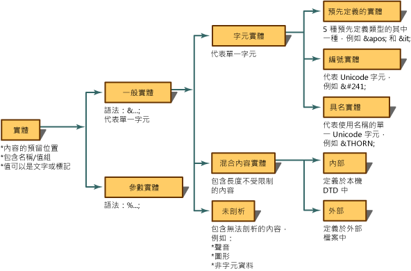
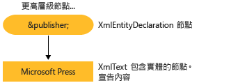

# <a name="reading-entity-declarations-and-entity-references-into-the-dom"></a>將實體宣告和實體參考讀入 DOM
實體是一種宣告，陳述 XML 中用來代替內容或標記的名稱。 實體有兩個部分。 首先，您必須使用實體宣告，將名稱繫結於取代內容。 實體宣告可透過文件類型定義 (DTD) 或 XML 結構描述中的 `<!ENTITY name "value">` 語法來建立。 第二，實體宣告中定義的名稱隨後會用於 XML。 用於 XML 時，它便稱為實體參考。 例如，下列實體宣告會宣告名稱 `publisher` 的實體，而此實體會與 "Microsoft Press" 的內容產生關聯。  
  
```xml  
<!ENTITY publisher "Microsoft Press">  
```  
  
 下列範例顯示在 XML 中，將這個實體宣告當成實體參考的用法。  
  
```xml  
<author>Fred</author>  
<pubinfo>Published by &publisher;</pubinfo>  
```  
  
 有些剖析器在文件載入記憶體時會自動擴充實體。 因此，當 XML 讀入記憶體時，會記住並且儲存實體宣告。 接下來當剖析器發現用來識別一般實體參考的 `&;` 字元時，剖析器會在實體宣告表中查看該名稱。 `&publisher;` 參考會由它所代表的內容取代。 使用下列 XML，  
  
```xml  
<author>Fred</author>  
<pubinfo>Published by &publisher;</pubinfo>  
```  
  
 擴充實體參考，並且以 Microsoft Press 內容取代 `&publisher;`，會產生下列擴充的 XML。  
  
 **輸出**  
  
```xml  
<author>Fred</author>  
<pubinfo>Published by Microsoft Press</pubinfo>  
```  
  
 實體有許多種類。 下圖將說明實體型別和術語的解析。  
  
   
  
 XML 文件物件模型 (DOM) 的 Microsoft .Net Framework 實作預設會保留實體參考，並且在 XML 載入時不會擴充實體。 這表示當文件載入 DOM 時，會建立含有參考變數 `&publisher;` 的 **XmlEntityReference** 節點，其中包含代表 DTD 中所宣告之實體內容的子節點。  
  
 使用 `<!ENTITY publisher "Microsoft Press">` 實體宣告時，下圖會顯示從這個宣告中建立的 **XmlEntity** 和 **XmlText** 節點。  
  
   
  
 實體參考是否會擴充的差異在於記憶體中 DOM 樹狀結構中產生了哪些節點。 [保留實體參考](../../../../docs/standard/data/xml/entity-references-are-preserved.md)和[實體參考已擴充且沒有保留](../../../../docs/standard/data/xml/entity-references-are-expanded-and-not-preserved.md)主題會說明所產生之節點的差異。  
  
## <a name="see-also"></a>另請參閱

- [XML 文件物件模型 (DOM)](../../../../docs/standard/data/xml/xml-document-object-model-dom.md)
