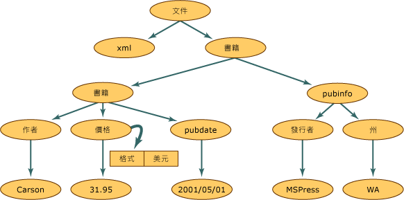

# <a name="xml-document-object-model-dom"></a>XML 文件物件模型 (DOM)
XML 文件物件模型 (DOM) 類別是記憶體中 XML 文件的表示法。 DOM 讓您以程式設計方式讀取、管理和修改 XML 文件。 **XmlReader** 類別也會讀取 XML，但是，它僅提供無快取、順向、唯讀存取。 這表示 **XmlReader** 沒有功能來編輯屬性的值或項目的內容，也沒有插入和移除節點的功能。 編輯是 DOM 的主要功能。 雖然在檔案或其他物件中時，實際的 XML 資料是以線性的方式儲存，但 XML 資料呈現在記憶體中卻是常見且結構化的方式。 下列是 XML 資料。  
  
## <a name="input"></a>輸入  
  
```xml  
<?xml version="1.0"?>  
  <books>  
    <book>  
        <author>Carson</author>  
        <price format="dollar">31.95</price>  
        <pubdate>05/01/2001</pubdate>  
    </book>  
    <pubinfo>  
        <publisher>MSPress</publisher>  
        <state>WA</state>  
    </pubinfo>  
  </books>   
```  
  
 下圖顯示當這個 XML 資料讀入 DOM 結構時，如何建立記憶體的結構。  
  
   
XML 文件結構  
  
 在 XML 文件結構內，此圖中的每個圓圈表示一個節點，稱為 **XmlNode** 物件。 **XmlNode** 物件是 DOM 樹狀中的基本物件。 擴充 **XmlNode** 的 **XmlDocument** 類別支援在文件上整體執行作業的方法，例如，將它載入記憶體或將 XML 儲存至檔案。 此外，**XmlDocument** 提供一個方法來檢視和管理整個 XML 文件中的節點。 **XmlNode** 和 **XmlDocument** 都可加強效能和可用性，而且有方法和屬性可以：  
  
- 存取和修改 DOM 特定的節點，例如項目節點、實體參考節點等等。  
  
- 擷取整個節點，除了節點所包含的資訊之外，還有項目節點中的內容。  
  
    > [!NOTE]
    >  若應用程式不需要 DOM 所提供的結構或編輯功能，則 **XmlReader** 與 **XmlWriter** 類別會提供對 XML 的無快取、順向資料流存取。 如需詳細資訊，請參閱 <xref:System.Xml.XmlReader> 與 <xref:System.Xml.XmlWriter>。  
  
 **Node** 物件有一組方法和屬性，以及基本且完整定義的特性。 這些特性的其中一些是：  
  
- 節點有單一父節點，父節點位於正上方的節點。 唯一沒有父代的節點是文件根，因為它是最上層的節點且包含文件本身與文件片段。  
  
- 大多數的節點可以有多重子節點，就是在正下方的節點。 下列是可以有子節點的節點型別清單。  
  
    - **Document**  
  
    - **DocumentFragment**  
  
    - **EntityReference**  
  
    - **目**  
  
    - **屬性**  
  
     **XmlDeclaration**、**Notation**、**Entity**、**CDATASection**、**Text**、**Comment**、**ProcessingInstruction** 和 **DocumentType** 節點都沒有子節點。  
  
- 相同層級的節點，在圖表中以 **book** 和 **pubinfo** 節點呈現，是同層級 (Sibling)。  
  
 DOM 的其中一項特性是它處理屬性的方式。 屬性不是父系、子系和同層級關係的節點。 屬性 (Attribute) 會被視為項目節點的屬性 (Property)，由一個名稱和一個值配對組成。 例如，如果 XML 資料是由與項目 `format="dollar` 關聯的 `price`" 所組成，則 `format` 這個字即為名稱，而 `format` 屬性的值就是 `dollar`。 若要擷取 **price** 節點的 `format="dollar"` 屬性，可在游標位於 `price` 項目節點上時呼叫 **GetAttribute** 方法。 如需詳細資訊，請參閱[存取 DOM 中的屬性](../../../../docs/standard/data/xml/accessing-attributes-in-the-dom.md)。  
  
 當 XML 讀入記憶體時，就會建立節點。 然而，並非所有的節點都是相同型別。 XML 中的項目之規則和語法與處理指示中的不同。 因此讀取不同的資料時，會為每個節點指派節點型別。 這個節點型別會決定節點的特性和功能。  
  
 如需記憶體中所產生之節點型別的詳細資訊，請參閱 [XML 節點的型別](../../../../docs/standard/data/xml/types-of-xml-nodes.md)。 如需在節點樹狀結構中建立之物件的詳細資訊，請參閱[將物件階層架構對應至 XML 資料](../../../../docs/standard/data/xml/mapping-the-object-hierarchy-to-xml-data.md)。  
  
 Microsoft 已擴充 API，使其可在全球資訊網協會 (W3C) DOM 層級 1 和層級 2 中使用，讓您得以更輕鬆地使用 XML 文件。 在完全支援 W3C 標準的同時，其他的類別、方法和屬性增加比使用 W3C XML DOM 所能做的更多的功能。 新類別可讓您存取關聯式資料，提供您同步處理 ADO.NET 資料的方法，同時將資料公開成 XML。 如需詳細資訊，請參閱[將 DataSet 與 XmlDataDocument 同步處理](../../../../docs/framework/data/adonet/dataset-datatable-dataview/dataset-and-xmldatadocument-synchronization.md)。  
  
 DOM 對於將 XML 資料讀入記憶體以變更它的結構、加入或移除節點，或修改在項目所包含之內容中的節點所儲存的資料時最有用。 但是，在其他案例中，可使用其他比 DOM 更快速的類別。 對於快速、無快取、順向資料流的 XML 存取，請使用 **XmlReader** 與 **XmlWriter**。 如果您需要具游標模型和 **XPath** 的隨機存取，請使用 **XPathNavigator** 類別。  
  
## <a name="see-also"></a>另請參閱

- [XML 節點的類型](../../../../docs/standard/data/xml/types-of-xml-nodes.md)
- [將物件階層對應至 XML 資料](../../../../docs/standard/data/xml/mapping-the-object-hierarchy-to-xml-data.md)
