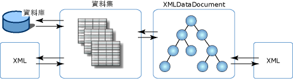

# XML 與關聯式資料和 ADO.NET 互相整合
**XmlDataDocument** 類別是 **XmlDocument** 的衍生類別，而且含有 XML 資料。 **XmlDataDocument** 的好處是提供關聯式與階層式資料之間的橋樑。 可被結合到 **DataSet**，而且兩種類別都可以隨內含資料而同步變更的即是 **XmlDocument**。 結合 **DataSet** 的 **XmlDocument** 允許 XML 和關聯式資料互相整合，因而您的資料並不一定要成為 XML 或以關聯式格式表示。 兩種您都可以選擇，而不必受限於單一資料表示法。  
  
 資料以兩種型式提供的好處在於：  
  
-   XML 文件的結構化部分可以對應到資料集，因此可以有效的儲存、索引和搜尋。  
  
-   轉換、驗證和巡覽可透過以關聯方式儲存的 XML 資料上的游標模型有效達成。 有時如果將 XML 儲存成 **XmlDocument** 模型，可以更有效地運用關聯式結構。  
  
-   **DataSet** 可以儲存 XML 的部分資料。 換句話說，您可以使用 **XPath** 或 **XslTransform**，將有興趣的元件和屬性儲存到 **DataSet**。 從此，可以對較小、篩選過的資料子集進行變更，然後再將變更傳送到 **XmlDataDocument** 中較大的資料。  
  
 您也可以對從 SQL Server 載入 **DataSet** 的資料執行轉換。 另一種選擇是結合 .NET Framework 類別樣式管理的 WinForm 和 WebForm 控制項，成為自 XML 輸入資料流填入的 **DataSet**。  
  
 除了支援 **XslTransform** 之外，**XmlDataDocument** 還公開關聯式資料給 **XPath** 查詢和驗證。  基本上，關聯式資料和關聯式設備都提供所有的 XML 服務，如控制項結合、Codegen 等等，可以在不危害 XML 真實性的結構化 XML 設計上使用。  
  
 因為 **XmlDataDocument** 繼承自 **XmlDocument**，因此會提供 W3C DOM 的實作。 **XmlDataDocument** 與 **DataSet** 有關，而且在 Dataset 中儲存其資料的子集，但仍然不會限制或更改將它做為 **XmlDocument** 來使用。 為使用 **XmlDocument** 而撰寫的程式碼不會隨 **XmlDataDocument** 而變更。 **DataSet** 藉由定義資料表、資料行、關聯和限制，提供相同資料的關聯式檢視，而且是獨立、記憶體中的使用者資料存放區。  
  
 下圖說明 XML 資料和 **DataSet** 與 **XmlDataDocument** 的不同關係。  
  
   
  
 圖例中顯示 XML 資料可直接載入 **DataSet**，它允許以關聯方式直接管理 XML。 或者，XML 也可以載入 **XmlDataDocument** 的 DOM 衍生類別中，之後並會載入且和 **DataSet** 同步。 因為 **DataSet** 和 **XmlDataDocument** 都與單一的資料集同步，所以一個存放區所做的資料變更會反映到另一個存放區。  
  
 **XmlDataDocument** 繼承了 **XmlDocument** 所有的編輯和巡覽功能。 有時在使用 **XmlDataDocument** 及其繼承的功能時，與 **DataSet** 同步會比將 XML 直接載入 **DataSet** 更恰當。 下表顯示在選擇載入 **DataSet** 的方法時，需要考量的項目。  
  
|直接將 XML 載入 DataSet 的時機|同步 DataSet 與 XmlDataDocument 的時機|  
|----------------------------------------------|-----------------------------------------------------------|  
|使用 SQL 查詢 **DataSet** 中的資料比使用 XPath 容易。|查詢 **DataSet** 中的資料需要使用 XPath。|  
|來源 XML 中項目順序的保留並不重要。|來源 XML 中項目順序的保留很重要。|  
|項目和格式間的泛空白字元不需要保留在來源 XML 中。|在來源 XML 中保留泛空白字元和格式很重要。|  
  
 如果您需要從 **DataSet** 直接載入和寫入 XML，請參閱[從 XML 載入 DataSet](../../../../docs/framework/data/adonet/dataset-datatable-dataview/loading-a-dataset-from-xml.md) 和[將 DataSet 寫為 XML 資料](../../../../docs/framework/data/adonet/dataset-datatable-dataview/writing-dataset-contents-as-xml-data.md)。  
  
 如果您需要從 **XmlDataDocument** 載入 **DataSet**，請參閱[使用 XML 文件同步處理 DataSet](../../../../docs/framework/data/adonet/dataset-datatable-dataview/dataset-and-xmldatadocument-synchronization.md)。  
  
## 請參閱  
 [在 DataSet 中使用 XML](../../../../docs/framework/data/adonet/dataset-datatable-dataview/using-xml-in-a-dataset.md)
