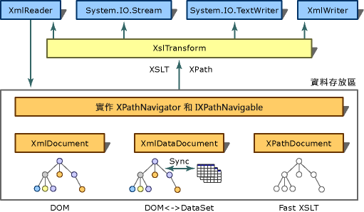

# <a name="xslt-transformations-with-the-xsltransform-class"></a>使用 XslTransform 類別進行 XSLT 轉換
> [!NOTE]
>  <xref:System.Xml.Xsl.XslTransform> 類別在 [!INCLUDE[dnprdnext](../../../../includes/dnprdnext-md.md)] 中已過時。 您可以使用 <xref:System.Xml.Xsl.XslCompiledTransform> 類別來執行可延伸樣式表語言轉換 (XSLT)。 如需詳細資訊，請參閱[使用 XslCompiledTransform 類別](../../../../docs/standard/data/xml/using-the-xslcompiledtransform-class.md)和[從 XslTransform 類別移轉](../../../../docs/standard/data/xml/migrating-from-the-xsltransform-class.md)。  
  
 XSLT 的目的在於，將來源 XML 文件的內容轉換為使用不同格式或結構的其他文件 (例如，將 XML 轉換為 HTML 以供網站使用，或將 XML 轉換為僅含某個應用程式所需之欄位的文件)。 這項轉換程序是由位於 www.w3.org/TR/xslt 的全球資訊網協會 (W3C) XSLT 1.0 版建議事項所指定。 在 [!INCLUDE[dnprdnshort](../../../../includes/dnprdnshort-md.md)] 中，是由 <xref:System.Xml.Xsl.XslTransform> 命名空間中的 <xref:System.Xml.Xsl> 類別做為實作此規格之功能的 XSLT 處理器。 W3C XSLT 1.0 版建議事項中有少數功能未被實作，列示於 [XslTransform 的輸出](../../../../docs/standard/data/xml/outputs-from-an-xsltransform.md)中。 下圖說明 [!INCLUDE[dnprdnshort](../../../../includes/dnprdnshort-md.md)] 的架構轉換作業。  
  
## <a name="overview"></a>總覽  
   
轉換架構  
  
 XSLT 建議事項使用 XML 路徑語言 (XPath) 來選擇 XML 文件的一部分，其中 XPath 是用來巡覽文件樹狀結構節點的查詢語言。 如圖所示，XPath 的 [!INCLUDE[dnprdnshort](../../../../includes/dnprdnshort-md.md)] 實作可用來選取數種類別中所儲存的部份 XML，如 <xref:System.Xml.XmlDocument>、<xref:System.Xml.XmlDataDocument> 和 <xref:System.Xml.XPath.XPathDocument>。 <xref:System.Xml.XPath.XPathDocument> 是最佳化的 XSLT 資料存放區，當它與 <xref:System.Xml.Xsl.XslTransform> 搭配使用時，可在 XSLT 轉換期間提供最佳效能。  
  
 下列表格列出與 <xref:System.Xml.Xsl.XslTransform> 和 XPath 搭配使用時最常用的類別及其函式。  
  
|類別或介面|功能|  
|------------------------|--------------|  
|<xref:System.Xml.XPath.XPathNavigator>|它是 API，為巡覽存放區提供了游標樣式模式以及 XPath 查詢支援。 它並未提供基礎存放區的編輯。 若要進行編輯，請使用 <xref:System.Xml.XmlDocument> 類別。|  
|<xref:System.Xml.XPath.IXPathNavigable>|此介面可將 `CreateNavigator` 方法提供給 <xref:System.Xml.XPath.XPathNavigator>，以進行儲存。|  
|<xref:System.Xml.XmlDocument>|它使得能夠編輯文件。 它可實作 <xref:System.Xml.XPath.IXPathNavigable>，以達成後續需進行 XSLT 轉換的文件編輯案例。 如需詳細資訊，請參閱 [XslTransform 的 XmlDocument 輸入](../../../../docs/standard/data/xml/xmldocument-input-to-xsltransform.md)。|  
|<xref:System.Xml.XmlDataDocument>|它衍生自 <xref:System.Xml.XmlDocument>。 它使用 <xref:System.Data.DataSet>，並根據 <xref:System.Data.DataSet> 上的指定對應，對 XML 文件內的結構化資料儲存進行最佳化，藉以連絡關聯式領域與 XML 領域。 它會實作 <xref:System.Xml.XPath.IXPathNavigable>，以達成 XSLT 轉換可在擷取自資料庫之關聯式資料上執行的案例。 如需詳細資訊，請參閱 [XML 與關聯式資料和 ADO.NET 互相整合](../../../../docs/standard/data/xml/xml-integration-with-relational-data-and-adonet.md)。|  
|<xref:System.Xml.XPath.XPathDocument>|此類別已針對 <xref:System.Xml.Xsl.XslTransform> 處理與 XPath 查詢進行最佳化，並可提供高效能的唯讀快取。 它會實作 <xref:System.Xml.XPath.IXPathNavigable>，是進行 XSLT 轉換時適用的存放區。|  
|<xref:System.Xml.XPath.XPathNodeIterator>|它提供跨 XPath 節點集的巡覽。 <xref:System.Xml.XPath.XPathNavigator> 上的所有 XPath 選取方法都會傳回 <xref:System.Xml.XPath.XPathNodeIterator>。 相同的存放區上可建立多個 <xref:System.Xml.XPath.XPathNodeIterator> 物件，而每個物件各代表一個選取的節點集。|  
  
## <a name="msxml-xslt-extensions"></a>MSXML XSLT 擴充  
 `msxsl:script` 類別所支援的 Microsoft XML Core Services (MSXML) XSLT 擴充只有 `msxsl:node-set` 和 <xref:System.Xml.Xsl.XslTransform> 這兩個函式。  
  
## <a name="example"></a>範例  
 下列程式碼範例會載入 XSL 樣式表、將名為 mydata.xml 的檔案讀取至 <xref:System.Xml.XPath.XPathDocument>，並且在名為 myStyleSheet.xsl 之虛擬檔案的資料上執行轉換，然後將格式化的輸出傳送給主控台。  
  
```vb  
Imports System  
Imports System.IO  
Imports System.Xml  
Imports System.Xml.XPath  
Imports System.Xml.Xsl  
  
Public Class Sample  
    Private filename As [String] = "mydata.xml"  
    Private stylesheet As [String] = "myStyleSheet.xsl"  
  
    Public Shared Sub Main()  
        Dim xslt As New XslTransform()  
        xslt.Load(stylesheet)  
        Dim xpathdocument As New XPathDocument(filename)  
        Dim writer As New XmlTextWriter(Console.Out)  
        writer.Formatting = Formatting.Indented  
  
        xslt.Transform(xpathdocument, Nothing, writer, Nothing)  
    End Sub 'Main  
End Class 'Sample  
```  
  
```csharp  
using System;  
using System.IO;  
using System.Xml;  
using System.Xml.XPath;  
using System.Xml.Xsl;  
  
public class Sample   
{  
    private const String filename = "mydata.xml";  
    private const String stylesheet = "myStyleSheet.xsl";  
  
    public static void Main()   
    {  
    XslTransform xslt = new XslTransform();  
    xslt.Load(stylesheet);  
    XPathDocument xpathdocument = new  
    XPathDocument(filename);  
    XmlTextWriter writer = new XmlTextWriter(Console.Out);  
    writer.Formatting=Formatting.Indented;  
  
    xslt.Transform(xpathdocument, null, writer, null);      
    }  
}  
```  
  
## <a name="see-also"></a>請參閱  
 <xref:System.Xml.Xsl.XslTransform>  
 [XslTransform 類別實作 XSLT 處理器](../../../../docs/standard/data/xml/xsltransform-class-implements-the-xslt-processor.md)  
 [XslTransform 類別中的 Discretionary 行為實作](../../../../docs/standard/data/xml/implementation-of-discretionary-behaviors-in-the-xsltransform-class.md)  
 [轉換中的 XPathNavigator](../../../../docs/standard/data/xml/xpathnavigator-in-transformations.md)  
 [轉換中的 XPathNodeIterator](../../../../docs/standard/data/xml/xpathnodeiterator-in-transformations.md)  
 [XslTransform 的 XPathDocument 輸入](../../../../docs/standard/data/xml/xpathdocument-input-to-xsltransform.md)  
 [XslTransform 的 XmlDataDocument 輸入](../../../../docs/standard/data/xml/xmldatadocument-input-to-xsltransform.md)  
 [XslTransform 的 XmlDocument 輸入](../../../../docs/standard/data/xml/xmldocument-input-to-xsltransform.md)
