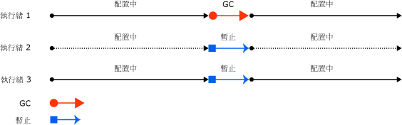
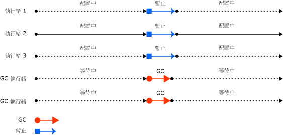
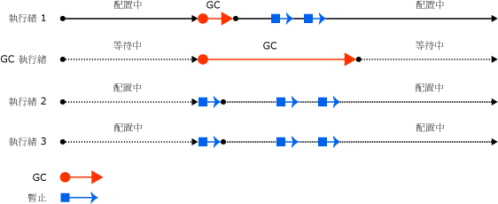
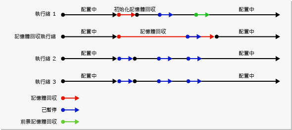

# 記憶體回收的基本概念
 在 Common Language Runtime (CLR) 中，記憶體回收行程會當做自動記憶體管理員。 它提供了下列優點：  
  
-   可讓您開發應用程式，而不需要釋放記憶體。  
  
-   有效率地在 Managed 堆積上配置物件。  
  
-   回收不再使用的物件、清除其記憶體，並且讓記憶體可供未來的配置使用。 Managed 物件在開始時會自動取得乾淨的內容，因此其建構函式不需要初始化每個資料欄位。  
  
-   確保某個物件無法使用另一個物件的內容，藉以提供記憶體安全性。  
  
 本主題描述記憶體回收的核心概念。 它包含以下各節：  
  
-   [記憶體的基本概念](#fundamentals_of_memory)  
  
-   [記憶體回收的條件](#conditions_for_a_garbage_collection)  
  
-   [Managed 堆積](#the_managed_heap)  
  
-   [層代](#generations)  
  
-   [記憶體回收期間進行的作業](#what_happens_during_a_garbage_collection)  
  
-   [管理 Unmanaged 資源](#manipulating_unmanaged_resources)  
  
-   [工作站和伺服器記憶體回收](#workstation_and_server_garbage_collection)  
  
-   [並行的記憶體回收](#concurrent_garbage_collection)  
  
-   [背景工作站記憶體回收](#background_garbage_collection)  
  
-   [背景伺服器記憶體回收](#background_server_garbage_collection)  
  
   
## 記憶體的基本概念  
 下列清單摘要說明重要的 CLR 記憶體概念。  
  
-   每個處理序都有各自獨立的虛擬位址空間。 同一部電腦上的所有處理序會共用相同的實體記憶體，並且共用分頁檔 (如果有的話)。  
  
-   根據預設，在 32 位元電腦上，每個處理序都有 2 GB 使用者模式虛擬位址空間。  
  
-   身為應用程式開發人員，您只會處理虛擬位址空間，絕不會直接操作實體記憶體。 記憶體回收行程會在 Managed 堆積上自動配置和釋出虛擬記憶體。  
  
     如果您要撰寫原生程式碼，可使用 Win32 函式來處理虛擬位址空間。 這些函式會在原生堆積上自動配置和釋出虛擬記憶體。  
  
-   虛擬記憶體可以有三種狀態：  
  
    -   可用。 記憶體區塊沒有任何參考，可進行配置。  
  
    -   保留的。 記憶體區塊可供您使用，但是無法用於任何其他配置要求。 不過，在此記憶體區塊認可之前，您無法將資料儲存到其中。  
  
    -   已認可。 記憶體區塊會指派給實體儲存區。  
  
-   虛擬位址空間可能會分成片段。 這表示，位址空間中有可用的區塊，也稱為可用的洞 (Hole)。 要求虛擬記憶體配置時，虛擬記憶體管理程式必須找到大小可滿足配置要求的單一可用區塊。 即使您擁有 2GB 可用空間，要求 2GB 的配置仍然不會成功，除非該可用空間全都在單一位址區塊中。  
  
-   如果您用盡保留用的虛擬位址空間或認可用的實體空間，則可能會用盡記憶體。  
  
 即使實體記憶體壓力 (也就是實體記憶體的需求) 不高，仍會使用您的分頁檔。 您的實體記憶體第一次面臨壓力高的情況時，作業系統必須釋出實體記憶體的空間來儲存資料，而且它會將實體記憶體中的部分資料備份到分頁檔。 該資料只會在需要時進行分頁，因此可能在實體記憶體壓力相當低的情況下發生分頁。 
 
 [回到頁首](#top)  
  
   
## 記憶體回收的條件  
 當下列其中一個條件成立時，就會進行記憶體回收：  
  
-   系統的實體記憶體不足。 這是透過來自 OS 的低記憶體通知或由主機指出的低記憶體來偵測。
  
-   由 Managed 堆積上之已配置物件所使用的記憶體超過可接受的臨界值。 這個臨界值會在處理序執行時持續調整。  
  
-   已呼叫 <xref:System.GC.Collect%2A?displayProperty=nameWithType> 方法。 在大多數的情況下，您不需要呼叫這個方法，因為記憶體回收行程會持續執行。 這個方法主要用於獨特的情況和測試。  
  
 [回到頁首](#top)  
  
   
## Managed 堆積  
 CLR 初始化記憶體回收行程之後，記憶體回收行程就會配置用來儲存和管理物件的記憶體區段。 這個記憶體稱為 Managed 堆積，與作業系統中的原生堆積相反。  
  
 每個 Managed 處理序都有一個 Managed 堆積。 處理序中的所有執行緒都會對相同堆積上的物件配置記憶體。  
  
 為節省記憶體，記憶體回收行程會呼叫 Win32 [VirtualAlloc](/windows/desktop/api/memoryapi/nf-memoryapi-virtualalloc) 函式，並且針對 Managed 應用程式一次保留一個記憶體區段。 記憶體回收行程也會視需要保留區段，並且透過呼叫 Win32 [VirtualFree](/windows/desktop/api/memoryapi/nf-memoryapi-virtualfree) 函式，將區段釋放回作業系統 (在清除任何物件的區段之後)。  
  
> [!IMPORTANT]
>  記憶體回收行程所配置的區段大小是依實作而定，有可能在任何時間，包括在定期更新時做變更。 您的應用程式永遠都不應該對相關或根據特定區段的大小做出假設，也不應嘗試設定區段配置的可用記憶體數量。  
  
 配置在堆積上的物件越少，記憶體回收行程必須進行的工作就越少。 當您配置物件時，請勿使用超出需求的進位值，例如，當您只需要 15 個位元組時，卻配置 32 個位元組的陣列。  
  
 觸發記憶體回收時，記憶體回收行程就會回收無作用物件所佔據的記憶體。 回收處理序會壓縮使用中物件，讓它們集合在一起，並且移除無作用物件，因而讓堆積更小。 這樣可確保一起配置的物件會在 Managed 堆積上集中，以便保持其區域性。  
  
 記憶體回收的干擾程度 (頻率和持續期間) 是 Managed 堆積上之配置量和未被回收記憶體數量的結果。  
  
 您可以將此堆積視為兩個堆積的累積：大型物件堆積和小型物件堆積。  
  
 大型物件堆積包含 85,000 個位元組以上的超大型物件。 大型物件堆積上的物件通常是陣列。 超大型的執行個體物件非常罕見。  
  
 [回到頁首](#top)  
  
   
## 層代  
 堆積會組織成層代，因此它可以處理存留較久和存留較短的物件。 記憶體回收主要與存留較短物件的回收一起進行，而這些物件通常只佔據堆積的一小部分。 堆積上的物件有三個層代：  
  
-   **層代 0**。 這是最新的層代而且包含存留較短的物件。 存留較短的物件範例是暫存變數。 記憶體回收最常在這個層代中進行。  
  
     新配置的物件會構成新的物件層代而且隱含成為層代 0 回收，但如果它們是大型物件，就會移至層代 2 回收中的大型物件堆積。  
  
     大部分物件都會在層代 0 的記憶體回收中回收，而且不會存留至下一個層代。  
  
-   **層代 1**。 這個層代包含存留較短的物件，而且當做存留較短物件與存留較長物件之間的緩衝區。  
  
-   **層代 2**。 這個層代包含存留較長的物件。 存留較長的物件範例是伺服器應用程式中包含處理序持續期間存留之靜態資料的物件。  
  
 當條件許可時，記憶體回收會針對特定層代進行。 回收層代是指回收該層代中的物件及其所有較新的層代。 層代 2 記憶體回收也稱為完整記憶體回收，因為它會回收所有層代中的所有物件 (亦即，Managed 堆積中的所有物件)。  
  
### 未回收和提升  
 沒有在記憶體回收中回收的物件稱為未回收物件，而且會提升至下一個層代。 在層代 0 記憶體回收中未被回收的物件會提升至層代 1、在層代 1 記憶體回收中未被回收的物件會提升至層代 2，而在層代 2 記憶體回收中未被回收的物件則保留在層代 2 中。  
  
 當記憶體回收行程偵測出某個層代的未回收率很高時，它就會增加該層代的配置臨界值，因此下一次回收就會取得大量的回收記憶體。 CLR 會持續在兩個優先權之間取得平衡：不讓應用程式的工作集變得太大，而且不讓記憶體回收花費太多時間。  
  
### 暫時層代和區段  
 因為層代 0 和 1 中的物件存留較短，所以這些層代稱為暫時層代。  
  
 暫時層代必須配置於稱為暫時區段的記憶體區段中。 記憶體回收行程所取得的每個新區段都會成為新的暫時區段，而且包含在層代 0 記憶體回收中未被回收的物件。 舊的暫時區段會成為新的層代 2 區段。  
  
 暫時區段的大小會根據系統是 32 位元或 64 位元，以及根據系統所執行的記憶體回收行程類型而有所不同。 下表顯示預設值。  
  
||32 位元|64 位元|  
|-|-------------|-------------|  
|工作站 GC|16 MB|256 MB|  
|伺服器 GC|64 MB|4 GB|  
|具有多於 4 個邏輯 CPU 的伺服器 GC|32 MB|2 GB|  
|具有 > 8 個邏輯 CPU 的伺服器 GC|16 MB|1 GB|  
  
 暫時區段可能會包括層代 2 物件。 層代 2 物件可以使用多個區段 (取決於處理序所需而且記憶體允許的數目)。  
  
 暫時記憶體回收中釋放記憶體的數量會限制為暫時區段的大小。 所釋放的記憶體數量會與無作用物件所佔據的空間成正比。  
  
 [回到頁首](#top)  
  
   
## 記憶體回收期間進行的作業  
 記憶體回收具有下列階段：  
  
-   標記階段：尋找和建立所有使用中物件的清單。  
  
-   重新配置階段：更新即將壓縮之物件的參考。  
  
-   壓縮階段：回收無作用物件所佔據的空間並壓縮未被回收的物件。 壓縮階段會將記憶體回收中未被回收的物件移至區段的較舊端。  
  
     因為層代 2 回收可能會佔據多個區段，所以提升至層代 2 的物件可能會移至較舊區段。 層代 1 和層代 2 的未回收物件都可能會移至不同的區段，因為它們都會被提升至層代 2。  
  
     正常情況下，大型物件堆積不會壓縮，因為複製大型物件會帶來效能損失。 不過，從 [!INCLUDE[net_v451](../../../includes/net-v451-md.md)]開始，您可以視需要使用 <xref:System.Runtime.GCSettings.LargeObjectHeapCompactionMode%2A?displayProperty=nameWithType> 屬性壓縮大型物件堆積。  
  
 記憶體回收行程會使用下列資訊來判斷物件是否使用中：  
  
-   **堆疊根目錄**。 Just-in-Time (JIT) 編譯器和堆疊查核器所提供的堆疊變數。 請注意，JIT 最佳化可以延長或縮短程式碼區域，其中堆疊變數會向記憶體回收行程回報。
  
-   **記憶體回收控制代碼**。 會指向 Managed 物件，而且可由使用者程式碼或 Common Language Runtime 配置的控制代碼。  
  
-   **靜態資料**。 應用程式定義域中可能參考其他物件的靜態物件。 每個應用程式定義域都會追蹤其靜態物件。  
  
 記憶體回收開始之前，所有 Managed 執行緒都會暫停，但觸發記憶體回收的執行緒除外。  
  
 下圖顯示觸發記憶體回收且造成其他執行緒暫停的執行緒。  
  
   
觸發記憶體回收的執行緒  
  
 [回到頁首](#top)  
  
   
## 管理 Unmanaged 資源  
 如果您的 Managed 物件使用其原生檔案控制代碼參考 Unmanaged 物件，則您必須明確釋放這些 Unmanaged 物件，因為記憶體回收行程只會追蹤 Managed 堆積上的記憶體。  
  
 Managed 物件的使用者無法處置此物件所使用的原生資源。 若要執行清除，您可以讓 Managed 物件變成可最終處理物件。 最終處理是由您在物件不再使用時所執行的清除動作組成。 當您的 Managed 物件無作用時，它就會執行其完成項方法中指定的清除動作。  
  
 當系統發現某個可最終處理物件無作用時，該物件的完成項就會放入佇列中，以便執行其清除動作，但是物件本身會提升至下一個層代。 因此，您必須等候直到在該層代上進行的下一次記憶體回收 (不一定是下一次記憶體回收)，以便判斷此物件是否已經回收。  
  
 [回到頁首](#top)  
  
   
## 工作站和伺服器記憶體回收  
 記憶體回收行程會自行調整而且可在各種案例中運作。 您可以使用組態檔設定，根據工作負載的特性來設定記憶體回收的類型。 CLR 會提供下列記憶體回收類型：  
  
-   工作站記憶體回收，適用於所有用戶端工作站和獨立電腦。 在執行階段組態結構描述中，這是 [\<gcServer> 項目](../../../docs/framework/configure-apps/file-schema/runtime/gcserver-element.md)的預設設定。  
  
     工作站記憶體回收可能是並行或非並行的。 並行記憶體回收可讓 Managed 執行緒在記憶體回收期間繼續運作。  
  
     從 [!INCLUDE[net_v40_long](../../../includes/net-v40-long-md.md)]開始，背景記憶體回收就取代了並行記憶體回收。  
  
-   伺服器記憶體回收，適用於需要高輸送量和延展性的伺服器應用程式。 伺服器記憶體回收可以是非並行或背景。  
  
 下圖顯示在伺服器上執行記憶體回收的專屬執行緒。  
  
   
伺服器記憶體回收  
  
### 設定記憶體回收  
 您可以使用執行階段組態結構描述的 [\<gcServer> 項目](../../../docs/framework/configure-apps/file-schema/runtime/gcserver-element.md)來指定您想讓 CLR 執行的記憶體回收類型。 當此項目的 `enabled` 屬性設定為 `false` (預設值) 時，CLR 就會執行工作站記憶體回收。 當您將 `enabled` 屬性設定為 `true`時，CLR 就會執行伺服器記憶體回收。  
  
 並行記憶體回收是使用執行階段組態結構描述的 [\<gcConcurrent> 項目](../../../docs/framework/configure-apps/file-schema/runtime/gcconcurrent-element.md)來指定。 預設的設定值是 `enabled`。 這項設定可控制並行和背景記憶體回收。  
  
 您也可以使用 Unmanaged 裝載介面來指定伺服器記憶體回收。 請注意，ASP.NET 和 SQL Server 會自動啟用伺服器記憶體回收 (如果您的應用程式裝載在其中一個環境內部的話)。  
  
### 比較工作站和伺服器記憶體回收  
 以下是工作站記憶體回收的執行緒和效能考量：  
  
-   此回收會針對觸發記憶體回收的使用者執行緒進行，而且維持相同的優先權。 因為使用者執行緒通常會以一般優先權執行，所以記憶體回收行程 (在一般優先權執行緒上執行) 必須與其他執行緒爭用 CPU 時間。  
  
     執行機器碼的執行緒不會暫停。  
  
-   工作站記憶體回收一律使用於只有單一處理器的電腦上，不論 [\<gcServer>](../../../docs/framework/configure-apps/file-schema/runtime/gcserver-element.md) 設定為何。 如果您指定了伺服器記憶體回收，CLR 就會使用工作站記憶體回收並停用並行。  
  
 以下是伺服器記憶體回收的執行緒和效能考量：  
  
-   此回收會針對以 `THREAD_PRIORITY_HIGHEST` 優先權層級執行的多個專屬執行緒進行。  
  
-   執行記憶體回收的堆積和專屬執行緒是針對每個 CPU 提供的，而且這些堆積會同時回收。 每個堆積都包含小型物件堆積和大型物件堆積，而且所有堆積都可由使用者程式碼存取。 不同堆積上的物件可以彼此參考。  
  
-   因為多個記憶體回收執行緒會一起運作，所以就相同大小堆積而言，伺服器記憶體回收的速度比工作站記憶體回收的速度要快。  
  
-   伺服器記憶體回收通常具有較大的區段。 不過請注意，這只是概括而言：區段大小為實作特定，並可能隨時變更。 當您微調應用程式時，不應該對記憶體回收行程所配置的區段大小做出假設。  
  
-   伺服器記憶體回收可能會耗用大量資源。 例如，如果您在具有 4 個處理器的電腦上執行 12 個處理序，就會存在 48 個專屬記憶體回收執行緒 (如果它們都使用伺服器記憶體回收的話)。 在記憶體負載很高的情況下，如果所有處理序開始進行記憶體回收，記憶體回收行程就必須排程 48 個執行緒。  
  
 如果您正在執行數百個應用程式執行個體，請考慮使用工作站記憶體回收並停用並行記憶體回收。 這樣會產生較少的內容切換，因此可能會改善效能。  
  
 [回到頁首](#top)  
  
   
## 並行的記憶體回收  
 在工作站或伺服器記憶體回收中，您可以啟用並行記憶體回收，以便在大部分回收期間，讓執行緒以並行方式與執行記憶體回收的專屬執行緒一起執行。 這個選項只會影響層代 2 中的記憶體回收。層代 0 和 1 一律為非並行，因為它們的完成速度非常快。  
  
 並行記憶體回收會將回收期間的暫停降到最低，藉以加快互動式應用程式的回應速度。 當並行記憶體回收執行緒正在執行時，Managed 執行緒幾乎可以繼續執行。 這會在記憶體回收進行時縮短暫停時間。  
  
 若要在許多處理序正在執行時改善效能，請停用並行記憶體回收。 您可以藉由將 [\<gcConcurrent> 項目](../../../docs/framework/configure-apps/file-schema/runtime/gcconcurrent-element.md)加入應用程式的組態檔，並將其 `enabled` 屬性的值設為 `"false"`，來完成此作業。  
  
 並行記憶體回收會針對專屬執行緒執行。 根據預設，CLR 會執行工作站記憶體回收並啟用並行記憶體回收。 這種回收適用於單一處理器和多處理器電腦。  
  
 並行記憶體回收期間，您在堆積上配置小型物件的能力會受限於並行記憶體回收開始時保留在暫時區段上的物件。 一旦您到達區段的結尾時，就必須等候並行記憶體回收完成，而必須進行小型物件配置的 Managed 執行緒會暫停。  
  
 並行記憶體回收具有稍微較大的工作集 (與非並行記憶體回收相較之下)，因為您可以在並行回收期間配置物件。 不過，這可能會影響效能，因為您所配置的物件會成為工作集的一部分。 基本上，並行記憶體回收會犧牲一些 CPU 和記憶體以換取縮短的暫停時間。  
  
 下列圖例顯示在分開的專屬執行緒上執行的並行記憶體回收。  
  
   
並行的記憶體回收  
  
 [回到頁首](#top)  
  
   
## 背景工作站記憶體回收  
 在背景記憶體回收中，當層代 2 的回收正在進行時，會視需要回收暫時層代 (0 和 1)。 背景記憶體回收沒有任何設定。它會自動與並行記憶體回收一起啟用。 背景記憶體回收是並行記憶體回收的取代項目。 與並行記憶體回收一樣，背景記憶體回收會針對專屬執行緒執行，而且僅適用於層代 2 回收。  
  
> [!NOTE]
>  只有 [!INCLUDE[net_v40_short](../../../includes/net-v40-short-md.md)] 和更新版本才能使用背景記憶體回收。 在 [!INCLUDE[net_v40_short](../../../includes/net-v40-short-md.md)]中，只有工作站記憶體回收才會支援它。 從 .NET Framework 4.5 開始，背景記憶體回收可供工作站和伺服器記憶體回收使用。  
  
 背景記憶體回收期間，暫時層代的回收稱為前景記憶體回收。 進行前景記憶體回收時，所有 Managed 執行緒都會暫停。  
  
 當背景記憶體回收正在進行，而且您已經在層代 0 中配置足夠的物件時，CLR 就會執行層代 0 或層代 1 的前景記憶體回收。 專屬的背景記憶體回收執行緒會在經常安全點檢查，以便判斷是否存在前景記憶體回收的要求。 如果有，背景回收就會自行暫停，讓前景記憶體回收能夠進行。 在前景記憶體回收完成之後，專屬的背景記憶體回收執行緒和使用者執行緒就會繼續進行。  
  
 背景記憶體回收會移除並行記憶體回收所加諸的配置限制，因為暫時記憶體回收可能會在背景記憶體回收期間進行。 這表示，背景記憶體回收可以移除暫時層代中的無作用物件，而且也可以在層代 1 記憶體回收期間視需要擴展堆積。  
  
 下圖顯示在工作站上另一個專用執行緒上執行的背景記憶體回收。  
  
   
背景工作站記憶體回收  
  
 [回到頁首](#top)  
  
   
## 背景伺服器記憶體回收  
 從 .NET Framework 4.5 開始，背景伺服器記憶體回收是伺服器記憶體回收的預設模式。 若要選擇這個模式，在執行階段組態結構描述中，將 [\<gcServer> 項目](../../../docs/framework/configure-apps/file-schema/runtime/gcserver-element.md)的 `enabled` 屬性設定為 `true`。 這個模式的功能類似於背景工作站記憶體回收 (如上一節所述)，不過仍有一些差異。 背景工作站記憶體回收會使用一個專用的背景記憶體回收執行緒，而背景伺服器記憶體回收則使用多個執行緒，通常是針對每個邏輯處理器使用一個專用的執行緒。 與工作站背景記憶體回收執行緒不同的是，這些執行緒不會逾時。  
  
 下圖顯示在伺服器上另一個專用執行緒上執行的背景記憶體回收。  
  
   
背景伺服器記憶體回收  
  
## 另請參閱

- [記憶體回收](../../../docs/standard/garbage-collection/index.md)
