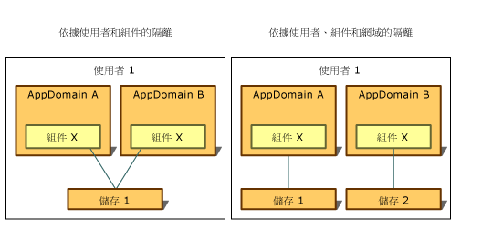

# 隔離的類型
對隔離儲存區的存取永遠限制於建立該隔離儲存區的使用者。 為實作這種類型的隔離，通用語言執行階段會使用作業系統可辨識的相同使用者身分識別概念，這是與開啟儲存區時，與程式碼執行所在處理序相關聯的身分識別。 此身分識別是一個經過驗證的使用者身分識別，但是模擬可能會造成目前使用者的身分識別動態變更。  
  
 對隔離儲存區的存取也會根據與應用程式網域和組件相關聯的身分識別，或單獨與組件相關聯的身分識別而受到限制。 執行階段會以下列方式取得這些身分識別：  
  
-   網域身分識別代表應用程式的辨識項，若是 Web 應用程式，則可能是完整 URL。 針對殼層裝載的程式碼，網域身分識別可能會以應用程式目錄路徑為基礎。 例如，如果可執行檔從路徑 C:\Office\MyApp.exe 執行，網域身分識別將為 C:\Office\MyApp.exe。  
  
-   組件身分識別是組件的辨識項。 這可能是來自密碼編譯數位簽章，它可以是組件的[強式名稱](../../../docs/framework/app-domains/strong-named-assemblies.md)、組件的軟體發行者或其 URL 識別。 如果組件同時具有強式名稱和軟體發行者身分識別，則會使用軟體發行者身分識別。 如果組件來自網際網路，且未經過簽署，則會使用 URL 識別。 如需有關組件和強式名稱的詳細資訊，請參閱[使用組件進行設計程式](../../../docs/framework/app-domains/programming-with-assemblies.md)。  
  
-   漫遊存放區會與具有漫遊使用者設定檔的使用者一起移動。 檔案會寫入網路目錄，且會下載到使用者登入的任何電腦。 如需有關漫遊使用者設定檔的詳細資訊，請參閱 <xref:System.IO.IsolatedStorage.IsolatedStorageScope.Roaming?displayProperty=nameWithType>。  
  
 隔離儲存區可以透過結合使用者、網域和組件身分識別的概念，以下列方式隔離資料，且每個方式都有自己的使用案例：  
  
-   [依使用者和組件隔離](#UserAssembly)  
  
-   [依使用者、網域和組件隔離](#UserDomainAssembly)  
  
 這些隔離中，任一個都可以與漫遊使用者設定檔結合。 如需詳細資訊，請參閱[隔離儲存區和漫遊](#Roaming)一節。  
  
 下圖示範如何以不同的範圍隔離儲存區。  
  
   
隔離儲存區的類型  
  
 請注意，除了漫遊存放區之外，電腦一律以隱含方式將隔離儲存區隔離，因為它會使用指定電腦本機的儲存設施。  
  
> [!IMPORTANT]
>  [!INCLUDE[win8_appname_long](../../../includes/win8-appname-long-md.md)] 應用程式無法使用隔離儲存區。 請改用 `Windows.Storage` 應用程式開發介面內含的 [!INCLUDE[wrt](../../../includes/wrt-md.md)] 命名空間中的應用程式資料類別來儲存本機資料和檔案。 如需詳細資訊，請參閱 Windows 開發人員中心的 [應用程式資料](https://docs.microsoft.com/previous-versions/windows/apps/hh464917(v=win.10)) 。  
  
   
## 依使用者和組件隔離  
 當使用資料存放區的組件必須從任何應用程式的網域存取時，則適用依使用者和組件隔離。 在此情況下，隔離儲存區通常用來儲存適用於多個應用程式，且未繫結至任何特定應用程式的資料，例如使用者的名稱或授權資訊。 若要存取依使用者和組件隔離的儲存區，程式碼必須受到信任，才能在應用程式之間傳輸資訊。 依使用者和組件隔離通常可以在內部網路上進行，但無法在網際網路上進行。 呼叫靜態 <xref:System.IO.IsolatedStorage.IsolatedStorageFile.GetStore%2A?displayProperty=nameWithType> 方法，並傳入使用者和組件 <xref:System.IO.IsolatedStorage.IsolatedStorageScope> 會傳回具有這種隔離的儲存區。  
  
 下列程式碼範例會擷取依使用者和組件隔離的存放區。 您可以透過 `isoFile` 物件存取這個存放區。  
  
 [!code-cpp[Conceptual.IsolatedStorage#17](../../../samples/snippets/cpp/VS_Snippets_CLR/conceptual.isolatedstorage/cpp/source11.cpp#17)]
 [!code-csharp[Conceptual.IsolatedStorage#17](../../../samples/snippets/csharp/VS_Snippets_CLR/conceptual.isolatedstorage/cs/source11.cs#17)]
 [!code-vb[Conceptual.IsolatedStorage#17](../../../samples/snippets/visualbasic/VS_Snippets_CLR/conceptual.isolatedstorage/vb/source11.vb#17)]  
  
 如需使用辨識項參數的範例，請參閱 <xref:System.IO.IsolatedStorage.IsolatedStorageFile.GetStore%28System.IO.IsolatedStorage.IsolatedStorageScope%2CSystem.Security.Policy.Evidence%2CSystem.Type%2CSystem.Security.Policy.Evidence%2CSystem.Type%29>。  
  
 <xref:System.IO.IsolatedStorage.IsolatedStorageFile.GetUserStoreForAssembly%2A> 方法可以當作捷徑使用，如下列程式碼範例所示。 此捷徑無法用來開啟能夠漫遊的存放區；在此情況下，請使用 <xref:System.IO.IsolatedStorage.IsolatedStorageFile.GetStore%2A>。  
  
 [!code-cpp[Conceptual.IsolatedStorage#18](../../../samples/snippets/cpp/VS_Snippets_CLR/conceptual.isolatedstorage/cpp/source11.cpp#18)]
 [!code-csharp[Conceptual.IsolatedStorage#18](../../../samples/snippets/csharp/VS_Snippets_CLR/conceptual.isolatedstorage/cs/source11.cs#18)]
 [!code-vb[Conceptual.IsolatedStorage#18](../../../samples/snippets/visualbasic/VS_Snippets_CLR/conceptual.isolatedstorage/vb/source11.vb#18)]  
  
   
## 依使用者、網域和組件隔離  
 如果您的應用程式使用需要私人資料存放區的協力廠商組件，您可以使用隔離儲存區來儲存私人資料。 依使用者、網域和組件隔離可確保只有指定之組件中的程式碼可以存取資料，而且只有在組件由建立存放區時所執行的應用程式使用的情況下，以及只有在建立存放區之使用者執行應用程式的情況下，才可以存取。 依使用者、網域和組件隔離可防止協力廠商組件向其他應用程式洩漏資料。 如果您知道您想要使用隔離儲存區，但不確定要使用哪一種隔離，這種隔離類型應該是預設選擇。 呼叫 <xref:System.IO.IsolatedStorage.IsolatedStorageFile> 的靜態 <xref:System.IO.IsolatedStorage.IsolatedStorageFile.GetStore%2A> 方法，並傳入使用者、網域和組件 <xref:System.IO.IsolatedStorage.IsolatedStorageScope> 會傳回具有這種隔離的儲存區。  
  
 下列程式碼範例會擷取依使用者、網域和組件隔離的存放區。 您可以透過 `isoFile` 物件存取這個存放區。  
  
 [!code-cpp[Conceptual.IsolatedStorage#14](../../../samples/snippets/cpp/VS_Snippets_CLR/conceptual.isolatedstorage/cpp/source10.cpp#14)]
 [!code-csharp[Conceptual.IsolatedStorage#14](../../../samples/snippets/csharp/VS_Snippets_CLR/conceptual.isolatedstorage/cs/source10.cs#14)]
 [!code-vb[Conceptual.IsolatedStorage#14](../../../samples/snippets/visualbasic/VS_Snippets_CLR/conceptual.isolatedstorage/vb/source10.vb#14)]  
  
 另一種方法可以當作捷徑使用，如下列程式碼範例所示。 此捷徑無法用來開啟能夠漫遊的存放區；在此情況下，請使用 <xref:System.IO.IsolatedStorage.IsolatedStorageFile.GetStore%2A>。  
  
 [!code-cpp[Conceptual.IsolatedStorage#15](../../../samples/snippets/cpp/VS_Snippets_CLR/conceptual.isolatedstorage/cpp/source10.cpp#15)]
 [!code-csharp[Conceptual.IsolatedStorage#15](../../../samples/snippets/csharp/VS_Snippets_CLR/conceptual.isolatedstorage/cs/source10.cs#15)]
 [!code-vb[Conceptual.IsolatedStorage#15](../../../samples/snippets/visualbasic/VS_Snippets_CLR/conceptual.isolatedstorage/vb/source10.vb#15)]  
  
   
## 隔離儲存區和漫遊  
 漫遊使用者設定檔是 Windows 的一個功能，可讓使用者設定網路上的身分識別，並使用該身分識別登入任何網路電腦，讓所有個人化設定繼續存在。 使用隔離儲存區的組件可以指定使用者的隔離儲存區應該隨著漫遊使用者設定檔移動。 漫遊可以搭配依使用者和組件隔離，或依使用者、網域和組件隔離使用。 如果未使用漫遊範圍，即使使用漫遊使用者設定檔，存放區也將不會漫遊。  
  
 下列程式碼範例會擷取依使用者和組件隔離的漫遊存放區。 您可以透過 `isoFile` 物件存取這個存放區。  
  
 [!code-cpp[Conceptual.IsolatedStorage#11](../../../samples/snippets/cpp/VS_Snippets_CLR/conceptual.isolatedstorage/cpp/source9.cpp#11)]
 [!code-csharp[Conceptual.IsolatedStorage#11](../../../samples/snippets/csharp/VS_Snippets_CLR/conceptual.isolatedstorage/cs/source9.cs#11)]
 [!code-vb[Conceptual.IsolatedStorage#11](../../../samples/snippets/visualbasic/VS_Snippets_CLR/conceptual.isolatedstorage/vb/source9.vb#11)]  
  
 若要建立依使用者、網域和應用程式隔離的漫遊存放區，可以新增網域範圍。 下列程式碼範例示範此工作。  
  
 [!code-cpp[Conceptual.IsolatedStorage#12](../../../samples/snippets/cpp/VS_Snippets_CLR/conceptual.isolatedstorage/cpp/source9.cpp#12)]
 [!code-csharp[Conceptual.IsolatedStorage#12](../../../samples/snippets/csharp/VS_Snippets_CLR/conceptual.isolatedstorage/cs/source9.cs#12)]
 [!code-vb[Conceptual.IsolatedStorage#12](../../../samples/snippets/visualbasic/VS_Snippets_CLR/conceptual.isolatedstorage/vb/source9.vb#12)]  
  
## 另請參閱

- <xref:System.IO.IsolatedStorage.IsolatedStorageScope>  
- [隔離儲存區](../../../docs/standard/io/isolated-storage.md)
