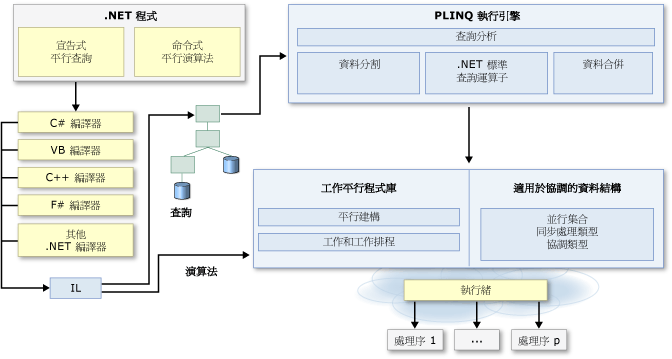

# .NET 的平行程式設計Parallel Programming in .NET
許多個人電腦和工作站都具有兩個或四個核心 (即 CPU)，而能夠同時執行多個執行緒。Many personal computers and workstations have two or four cores (that is, CPUs) that enable multiple threads to be executed simultaneously. 不久的將來，電腦應該會具有更多的核心。Computers in the near future are expected to have significantly more cores. 若要利用現今和未來的硬體優勢，您可以將您的程式碼平行化，以便將工作分散到多個處理器。To take advantage of the hardware of today and tomorrow, you can parallelize your code to distribute work across multiple processors. 在過去，平行化作業需要在低階操作執行緒和鎖定。In the past, parallelization required low-level manipulation of threads and locks. [!INCLUDE[vs_dev10_long](../../../includes/vs-dev10-long-md.md)] 和 [!INCLUDE[net_v40_short](../../../includes/net-v40-short-md.md)] 提供新的執行階段、新的類別庫類型和新的診斷工具，以加強支援平行程式設計。 and the [!INCLUDE[net_v40_short](../../../includes/net-v40-short-md.md)] enhance support for parallel programming by providing a new runtime, new class library types, and new diagnostic tools. 這些功能簡化了平行開發作業，讓您能夠利用簡單常見的語法，撰寫效率高、精細且具彈性的平行程式碼，而不需要直接使用執行緒或執行緒集區。These features simplify parallel development so that you can write efficient, fine-grained, and scalable parallel code in a natural idiom without having to work directly with threads or the thread pool. 下圖提供 [!INCLUDE[net_v40_short](../../../includes/net-v40-short-md.md)] 中平行程式設計架構的高階概觀。The following illustration provides a high-level overview of the parallel programming architecture in the [!INCLUDE[net_v40_short](../../../includes/net-v40-short-md.md)].  
  
   
  
## 相關主題Related Topics  
  
|技術Technology|描述Description|  
|----------------|-----------------|  
|[工作平行程式庫 (TPL)Task Parallel Library (TPL)](../../../docs/standard/parallel-programming/task-parallel-library-tpl.md)|提供 <xref:System.Threading.Tasks.Parallel?displayProperty=nameWithType> 類別 (包含平行版本的 `For` 和 `ForEach` 迴圈) 及 <xref:System.Threading.Tasks.Task?displayProperty=nameWithType> 類別 (表示表達非同步作業較好的方式) 的文件。Provides documentation for the <xref:System.Threading.Tasks.Parallel?displayProperty=nameWithType> class, which includes parallel versions of `For` and `ForEach` loops, and also for the <xref:System.Threading.Tasks.Task?displayProperty=nameWithType> class, which represents the preferred way to express asynchronous operations.|  
|[平行 LINQ (PLINQ)Parallel LINQ (PLINQ)](../../../docs/standard/parallel-programming/parallel-linq-plinq.md)|平行實作的 LINQ to Objects，在許多情節中可大幅改善效能。A parallel implementation of LINQ to Objects that significantly improves performance in many scenarios.|  
|[適用於平行程式設計的資料結構Data Structures for Parallel Programming](../../../docs/standard/parallel-programming/data-structures-for-parallel-programming.md)|提供安全執行緒集合類別、輕量型同步處理類型和延遲初始設定類型的文件連結。Provides links to documentation for thread-safe collection classes, lightweight synchronization types, and types for lazy initialization.|  
|[平行診斷工具Parallel Diagnostic Tools](../../../docs/standard/parallel-programming/parallel-diagnostic-tools.md)|提供 Visual Studio 偵錯工具視窗 (適用於工作和平行堆疊) 和[並行視覺化檢視](/visualstudio/profiling/concurrency-visualizer) (由 [!INCLUDE[vsprvsts](../../../includes/vsprvsts-md.md)] 分析工具中一組可供您進行偵錯和微調平行程式碼效能的檢視所組成) 的文件連結。Provides links to documentation for Visual Studio debugger windows for tasks and parallel stacks, and the [Concurrency Visualizer](/visualstudio/profiling/concurrency-visualizer), which consists of a set of views in the [!INCLUDE[vsprvsts](../../../includes/vsprvsts-md.md)] Profiler that you can use to debug and to tune the performance of parallel code.|  
|[PLINQ 和 TPL 的自訂 PartitionerCustom Partitioners for PLINQ and TPL](../../../docs/standard/parallel-programming/custom-partitioners-for-plinq-and-tpl.md)|說明 Partitioner 的運作方式，以及如何設定預設 Partitioner 或建立新的 Partitioner。Describes how partitioners work and how to configure the default partitioners or create a new partitioner.|  
|[工作排程器Task Schedulers](http://msdn.microsoft.com/library/638f8ea5-21db-47a2-a934-86e1e961bf65)|說明排程器的運作方式以及如何設定預設排程器。Describes how schedulers work and how the default schedulers may be configured.|  
|[PLINQ 和 TPL 中的 Lambda 運算式Lambda Expressions in PLINQ and TPL](../../../docs/standard/parallel-programming/lambda-expressions-in-plinq-and-tpl.md)|提供 C# 和 Visual Basic 中之 Lambda 運算式的簡短概觀，並且顯示如何在 PLINQ 和工作平行程式庫中使用這些運算式。Provides a brief overview of lambda expressions in C# and Visual Basic, and shows how they are used in PLINQ and the Task Parallel Library.|  
|[進一步閱讀For Further Reading](../../../docs/standard/parallel-programming/for-further-reading-parallel-programming.md)|提供以 .NET Framework 進行平行程式設計的其他文件和範例資源連結。Provides links to additional documentation and sample resources for parallel programming in the .NET Framework.|  
  
## 另請參閱See Also  
 [平行程式設計模式：了解及套用平行模式與 .NET Framework 4Patterns for Parallel Programming: Understanding and Applying Parallel Patterns with the .NET Framework 4](http://go.microsoft.com/fwlink/?LinkID=185142)  
 [使用 .NET Framework 進行平行程式設計的範例Samples for Parallel Programming with the .NET Framework](http://code.msdn.microsoft.com/Samples-for-Parallel-b4b76364)
