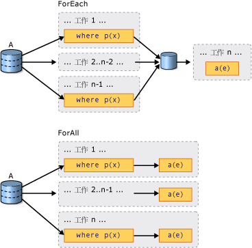

# PLINQ 簡介Introduction to PLINQ
## 何謂平行查詢？What is a Parallel Query?  
 Language-Integrated Query (LINQ) 是在 [!INCLUDE[net_v35_long](../../../includes/net-v35-long-md.md)] 中引進的。Language-Integrated Query (LINQ) was introduced in the [!INCLUDE[net_v35_long](../../../includes/net-v35-long-md.md)].  它的特色統一的模型來查詢任何<xref:System.Collections.IEnumerable?displayProperty=nameWithType>或<xref:System.Collections.Generic.IEnumerable%601?displayProperty=nameWithType>資料來源，以類型安全的方式。It features a unified model for querying any <xref:System.Collections.IEnumerable?displayProperty=nameWithType> or <xref:System.Collections.Generic.IEnumerable%601?displayProperty=nameWithType> data source in a type-safe manner. LINQ to 物件是的名稱，例如執行針對記憶體中集合的 LINQ 查詢的<xref:System.Collections.Generic.List%601>和陣列。LINQ to Objects is the name for LINQ queries that are run against in-memory collections such as <xref:System.Collections.Generic.List%601> and arrays. 本文假設您已對 LINQ 有基本了解。This article assumes that you have a basic understand of LINQ. 如需詳細資訊，請參閱 [LINQ (Language-Integrated Query)](http://msdn.microsoft.com/library/a73c4aec-5d15-4e98-b962-1274021ea93d)。For more information, see [LINQ (Language-Integrated Query)](http://msdn.microsoft.com/library/a73c4aec-5d15-4e98-b962-1274021ea93d).  
  
 Parallel LINQ (PLINQ) 是平行實作的 LINQ 模式。Parallel LINQ (PLINQ) is a parallel implementation of the LINQ pattern. PLINQ 查詢在很多方面類似於非平行 LINQ to Objects 查詢。A PLINQ query in many ways resembles a non-parallel LINQ to Objects query. PLINQ 查詢中，就像循序[!INCLUDE[vbteclinq](../../../includes/vbteclinq-md.md)]查詢，對任何記憶體<xref:System.Collections.IEnumerable>或<xref:System.Collections.Generic.IEnumerable%601>資料的來源，並已延後執行，這表示不會開始執行，直到列舉查詢的方式。PLINQ queries, just like sequential [!INCLUDE[vbteclinq](../../../includes/vbteclinq-md.md)] queries, operate on any in-memory <xref:System.Collections.IEnumerable> or <xref:System.Collections.Generic.IEnumerable%601> data source, and have deferred execution, which means they do not begin executing until the query is enumerated. 這兩種查詢的主要差別在於，PLINQ 會嘗試充分利用系統上的所有處理器。The primary difference is that PLINQ attempts to make full use of all the processors on the system. 它所採取的方式是將資料來源分割成多個區段，然後在多個處理器上，以平行方式在不同的背景工作執行緒上對每個區段執行查詢。It does this by partitioning the data source into segments, and then executing the query on each segment on separate worker threads in parallel on multiple processors. 在許多情況下，平行執行意謂著查詢的執行速度會明顯加快。In many cases, parallel execution means that the query runs significantly faster.  
  
 平行執行，透過 PLINQ 可以顯著的效能改進達到針對特定種類的查詢，通常您只是新增的舊版程式碼透過<xref:System.Linq.ParallelEnumerable.AsParallel%2A>查詢至資料來源的作業。Through parallel execution, PLINQ can achieve significant performance improvements over legacy code for certain kinds of queries, often just by adding the <xref:System.Linq.ParallelEnumerable.AsParallel%2A> query operation to the data source. 不過，平行處理原則也會帶來自己的複雜性，所以並非所有查詢作業都可透過 PLINQ 加快執行速度。However, parallelism can introduce its own complexities, and not all query operations run faster in PLINQ. 事實上，平行處理的確會降低某些查詢的速度。In fact, parallelization actually slows down certain queries. 因此，您應該了解各種問題 (例如排序) 會如何影響平行查詢。Therefore, you should understand how issues such as ordering affect parallel queries. 如需詳細資訊，請參閱[認識 PLINQ 中的加速](../../../docs/standard/parallel-programming/understanding-speedup-in-plinq.md)。For more information, see [Understanding Speedup in PLINQ](../../../docs/standard/parallel-programming/understanding-speedup-in-plinq.md).  
  
> [!NOTE]
>  本文件使用 Lambda 運算式來定義 PLINQ 中的委派。This documentation uses lambda expressions to define delegates in PLINQ. 如果您不熟悉 C# 或 Visual Basic 中的 Lambda 運算式，請參閱 [PLINQ 和 TPL 中的 Lambda 運算式](../../../docs/standard/parallel-programming/lambda-expressions-in-plinq-and-tpl.md)。If you are not familiar with lambda expressions in C# or Visual Basic, see [Lambda Expressions in PLINQ and TPL](../../../docs/standard/parallel-programming/lambda-expressions-in-plinq-and-tpl.md).  
  
 本文其餘部分會概述 PLINQ 的主要類別，並討論如何建立 PLINQ 查詢。The remainder of this article gives an overview of the main PLINQ classes, and discusses how to create PLINQ queries. 每一節都附有連結，可供您獲得詳細資訊和程式碼範例。Each section contains links to more detailed information and code examples.  
  
## ParallelEnumerable 類別The ParallelEnumerable Class  
 <xref:System.Linq.ParallelEnumerable?displayProperty=nameWithType>類別會公開幾乎所有的 PLINQ 的功能。The <xref:System.Linq.ParallelEnumerable?displayProperty=nameWithType> class exposes almost all of PLINQ's functionality.  它和其他<xref:System.Linq?displayProperty=nameWithType>命名空間類型會編譯成 system.core.dll 的參考組件。It and the rest of the <xref:System.Linq?displayProperty=nameWithType> namespace types are compiled into the System.Core.dll assembly. Visual Studio 中預設的 C# 和 Visual Basic 專案都會參考此組件並匯入該命名空間。The default C# and Visual Basic projects in Visual Studio both reference the assembly and import the namespace.  
  
 <xref:System.Linq.ParallelEnumerable>雖然它不會嘗試平行處理每個包含支援 LINQ to Objects 的所有標準查詢運算子的實作。<xref:System.Linq.ParallelEnumerable> includes implementations of all the standard query operators that LINQ to Objects supports, although it does not attempt to parallelize each one. 如果您不熟悉 [!INCLUDE[vbteclinq](../../../includes/vbteclinq-md.md)]，請參閱 [LINQ 簡介](http://msdn.microsoft.com/library/24dddf19-12a0-4707-a4bc-eba4fa7f219e)。If you are not familiar with [!INCLUDE[vbteclinq](../../../includes/vbteclinq-md.md)], see [Introduction to LINQ](http://msdn.microsoft.com/library/24dddf19-12a0-4707-a4bc-eba4fa7f219e).  
  
 除了標準查詢運算子，<xref:System.Linq.ParallelEnumerable>類別包含一組啟用平行執行的特定行為的方法。In addition to the standard query operators, the <xref:System.Linq.ParallelEnumerable> class contains a set of methods that enable behaviors specific to parallel execution. 下表列出這些 PLINQ 特有的方法。These PLINQ-specific methods are listed in the following table.  
  
|ParallelEnumerable 運算子ParallelEnumerable Operator|說明Description|  
|---------------------------------|-----------------|  
|<xref:System.Linq.ParallelEnumerable.AsParallel%2A>|PLINQ 的進入點。The entry point for PLINQ. 指定系統應該在情況允許時平行處理其餘查詢。Specifies that the rest of the query should be parallelized, if it is possible.|  
|<xref:System.Linq.ParallelEnumerable.AsSequential%2A>|指定系統應該將其餘查詢當作非平行 LINQ 查詢來循序執行。Specifies that the rest of the query should be run sequentially, as a non-parallel LINQ query.|  
|<xref:System.Linq.ParallelEnumerable.AsOrdered%2A>|指定 PLINQ 應該為其餘查詢保留來源序列的排序，或保留到排序變更時，例如透過使用 orderby (在 Vlsual Basic 中是 Order By) 子句來變更。Specifies that PLINQ should preserve the ordering of the source sequence for the rest of the query, or until the ordering is changed, for example by the use of an orderby (Order By in Vlsual Basic) clause.|  
|<xref:System.Linq.ParallelEnumerable.AsUnordered%2A>|指定用於其餘查詢的 PLINQ 不需要保留來源序列的排序。Specifies that PLINQ for the rest of the query is not required to preserve the ordering of the source sequence.|  
|<xref:System.Linq.ParallelEnumerable.WithCancellation%2A>|指定 PLINQ 應定期監視所提供之取消權杖的狀態，並在經過要求後取消執行。Specifies that PLINQ should periodically monitor the state of the provided cancellation token and cancel execution if it is requested.|  
|<xref:System.Linq.ParallelEnumerable.WithDegreeOfParallelism%2A>|指定 PLINQ 應該用來平行處理查詢的處理器數目上限。Specifies the maximum number of processors that PLINQ should use to parallelize the query.|  
|<xref:System.Linq.ParallelEnumerable.WithMergeOptions%2A>|在情況允許時提供提示，說明 PLINQ 應該如何將平行結果合併回取用者執行緒上的單一序列中。Provides a hint about how PLINQ should, if it is possible, merge parallel results back into just one sequence on the consuming thread.|  
|<xref:System.Linq.ParallelEnumerable.WithExecutionMode%2A>|指定 PLINQ 是否應在預設行為是循序執行查詢時，仍平行處理查詢。Specifies whether PLINQ should parallelize the query even when the default behavior would be to run it sequentially.|  
|<xref:System.Linq.ParallelEnumerable.ForAll%2A>|多執行緒列舉方法不同於逐一查看查詢結果的方法，前者可平行處理所有結果，而不必先合併回取用者執行緒。A multithreaded enumeration method that, unlike iterating over the results of the query, enables results to be processed in parallel without first merging back to the consumer thread.|  
|<xref:System.Linq.ParallelEnumerable.Aggregate%2A>多載<xref:System.Linq.ParallelEnumerable.Aggregate%2A> overload|這是 PLINQ 特有的多載，可對執行緒區域分割啟用中繼彙總，並附有最後彙總函式可結合所有分割的結果。An overload that is unique to PLINQ and enables intermediate aggregation over thread-local partitions, plus a final aggregation function to combine the results of all partitions.|  
  
## 加入模型The Opt-in Model  
 當您撰寫查詢時，來選擇加入 PLINQ 叫用<xref:System.Linq.ParallelEnumerable.AsParallel%2A?displayProperty=nameWithType>上資料來源，如下列範例所示的擴充方法。When you write a query, opt in to PLINQ by invoking the <xref:System.Linq.ParallelEnumerable.AsParallel%2A?displayProperty=nameWithType> extension method on the data source, as shown in the following example.  
  
 [!code-csharp[PLINQ#1](../../../samples/snippets/csharp/VS_Snippets_Misc/plinq/cs/plinq2_cs.cs#1)]
 [!code-vb[PLINQ#1](../../../samples/snippets/visualbasic/VS_Snippets_Misc/plinq/vb/plinq2_vb.vb#1)]  
  
 <xref:System.Linq.ParallelEnumerable.AsParallel%2A>擴充方法會將繫結的後續查詢運算子，在此情況下，`where`和`select`至<xref:System.Linq.ParallelEnumerable?displayProperty=nameWithType>實作。The <xref:System.Linq.ParallelEnumerable.AsParallel%2A> extension method binds the subsequent query operators, in this case, `where` and `select`, to the <xref:System.Linq.ParallelEnumerable?displayProperty=nameWithType> implementations.  
  
## 執行模式Execution Modes  
 根據預設，PLINQ 會保守行事。By default, PLINQ is conservative. 在執行階段，PLINQ 基礎結構會分析查詢的整體結構。At run time, the PLINQ infrastructure analyzes the overall structure of the query. 如果查詢可透過平行化作業來加快執行速度，PLINQ 會將來源序列分割成可同時執行的工作。If the query is likely to yield speedups by parallelization, PLINQ partitions the source sequence into tasks that can be run concurrently. 如果平行處理查詢的方式並不安全，PLINQ 就會循序執行查詢。If it is not safe to parallelize a query, PLINQ just runs the query sequentially. 如果 PLINQ 可選擇是要使用成本可能較高的平行演算法，還是使用成本不高的循序演算法，則依預設它會選擇循序演算法。If PLINQ has a choice between a potentially expensive parallel algorithm or an inexpensive sequential algorithm, it chooses the sequential algorithm by default. 您可以使用<xref:System.Linq.ParallelEnumerable.WithExecutionMode%2A>方法和<xref:System.Linq.ParallelExecutionMode?displayProperty=nameWithType>指示 PLINQ 選取平行演算法的列舉。You can use the <xref:System.Linq.ParallelEnumerable.WithExecutionMode%2A> method and the <xref:System.Linq.ParallelExecutionMode?displayProperty=nameWithType> enumeration to instruct PLINQ to select the parallel algorithm. 當您在測試和測量後得知，某特定查詢在平行執行時速度會更快，便適合這麼做。This is useful when you know by testing and measurement that a particular query executes faster in parallel. 如需詳細資訊，請參閱[如何：在 PLINQ 中指定執行模式](../../../docs/standard/parallel-programming/how-to-specify-the-execution-mode-in-plinq.md)。For more information, see [How to: Specify the Execution Mode in PLINQ](../../../docs/standard/parallel-programming/how-to-specify-the-execution-mode-in-plinq.md).  
  
## 平行處理原則的刻度Degree of Parallelism  
 根據預設，PLINQ 使用所有處理器的主機電腦上。By default, PLINQ uses all of the processors on the host computer. 您可以指示不能超過指定數目的處理器使用，方法是使用 PLINQ<xref:System.Linq.ParallelEnumerable.WithDegreeOfParallelism%2A>方法。You can instruct PLINQ to use no more than a specified number of processors by using the <xref:System.Linq.ParallelEnumerable.WithDegreeOfParallelism%2A> method. 若您想要確保電腦上執行的其他處理序可獲得一定的 CPU 使用時間，您便可以這麼做。This is useful when you want to make sure that other processes running on the computer receive a certain amount of CPU time. 下列程式碼片段會限制查詢最多只能使用兩個處理器。The following snippet limits the query to utilizing a maximum of two processors.  
  
 [!code-csharp[PLINQ#5](../../../samples/snippets/csharp/VS_Snippets_Misc/plinq/cs/plinqsamples.cs#5)]
 [!code-vb[PLINQ#5](../../../samples/snippets/visualbasic/VS_Snippets_Misc/plinq/vb/plinq2_vb.vb#5)]  
  
 當查詢在執行大量非計算繫結工作 (例如檔案 I/O) 的情況下，將平行處理程度指定為大於電腦上的核心數目可能會有幫助。In cases where a query is performing a significant amount of non-compute-bound work such as File I/O, it might be beneficial to specify a degree of parallelism greater than the number of cores on the machine.  
  
## 比較排序與未排序的平行查詢Ordered Versus Unordered Parallel Queries  
 在某些查詢中，查詢運算子所產生的結果必須保留來源序列的排序。In some queries, a query operator must produce results that preserve the ordering of the source sequence. PLINQ 提供<xref:System.Linq.ParallelEnumerable.AsOrdered%2A>針對此用途的運算子。PLINQ provides the <xref:System.Linq.ParallelEnumerable.AsOrdered%2A> operator for this purpose. <xref:System.Linq.ParallelEnumerable.AsOrdered%2A>不同於<xref:System.Linq.ParallelEnumerable.AsSequential%2A>。<xref:System.Linq.ParallelEnumerable.AsOrdered%2A> is distinct from <xref:System.Linq.ParallelEnumerable.AsSequential%2A>. <xref:System.Linq.ParallelEnumerable.AsOrdered%2A>順序仍會處理以平行方式，但其結果是經過緩衝處理和排序。An <xref:System.Linq.ParallelEnumerable.AsOrdered%2A> sequence is still processed in parallel, but its results are buffered and sorted. 順序保留通常牽涉到額外的工作，因為<xref:System.Linq.ParallelEnumerable.AsOrdered%2A>順序可能會與預設值的放慢處理<xref:System.Linq.ParallelEnumerable.AsUnordered%2A>順序。Because order preservation typically involves extra work, an <xref:System.Linq.ParallelEnumerable.AsOrdered%2A> sequence might be processed more slowly than the default <xref:System.Linq.ParallelEnumerable.AsUnordered%2A> sequence. 有許多因素會決定特定的排序平行作業是否會比循序作業更快。Whether a particular ordered parallel operation is faster than a sequential version of the operation depends on many factors.  
  
 下列程式碼範例示範如何選擇加入順序保留功能。The following code example shows how to opt in to order preservation.  
  
 [!code-csharp[PLINQ#3](../../../samples/snippets/csharp/VS_Snippets_Misc/plinq/cs/plinq2_cs.cs#3)]
 [!code-vb[PLINQ#3](../../../samples/snippets/visualbasic/VS_Snippets_Misc/plinq/vb/plinq2_vb.vb#3)]  
  
 如需詳細資訊，請參閱 [PLINQ 中的順序保留](../../../docs/standard/parallel-programming/order-preservation-in-plinq.md)。For more information, see [Order Preservation in PLINQ](../../../docs/standard/parallel-programming/order-preservation-in-plinq.md).  
  
## 平行 vs。連續的查詢Parallel vs. Sequential Queries  
 某些作業會要求系統以循序方式傳遞來源資料。Some operations require that the source data be delivered in a sequential manner. <xref:System.Linq.ParallelEnumerable>運算子為循序模式自動還原會在需要時的查詢。The <xref:System.Linq.ParallelEnumerable> query operators revert to sequential mode automatically when it is required. PLINQ 提供使用者定義的查詢運算子和需要循序執行的使用者委派，<xref:System.Linq.ParallelEnumerable.AsSequential%2A>方法。For user-defined query operators and user delegates that require sequential execution, PLINQ provides the <xref:System.Linq.ParallelEnumerable.AsSequential%2A> method. 當您使用<xref:System.Linq.ParallelEnumerable.AsSequential%2A>，查詢中的所有後續運算子會循序執行，直到<xref:System.Linq.ParallelEnumerable.AsParallel%2A>會再次呼叫。When you use <xref:System.Linq.ParallelEnumerable.AsSequential%2A>, all subsequent operators in the query are executed sequentially until <xref:System.Linq.ParallelEnumerable.AsParallel%2A> is called again. 如需詳細資訊，請參閱[如何：結合平行和循序 LINQ 查詢](../../../docs/standard/parallel-programming/how-to-combine-parallel-and-sequential-linq-queries.md)。For more information, see [How to: Combine Parallel and Sequential LINQ Queries](../../../docs/standard/parallel-programming/how-to-combine-parallel-and-sequential-linq-queries.md).  
  
## 可供合併查詢結果的選項Options for Merging Query Results  
 當 PLINQ 查詢以平行方式執行時，其來自每個背景工作執行緒的結果，必須合併回主要執行緒以供 `foreach` 迴圈 (在 [!INCLUDE[vbprvb](../../../includes/vbprvb-md.md)] 中是 `For Each`) 取用，或以供插入至清單或陣列。When a PLINQ query executes in parallel, its results from each worker thread must be merged back onto the main thread for consumption by a `foreach` loop (`For Each` in [!INCLUDE[vbprvb](../../../includes/vbprvb-md.md)]), or insertion into a list or array. 在某些情況下，指定特定種類的合併作業可能會有幫助，例如，若您要更快速地開始產生結果的話。In some cases, it might be beneficial to specify a particular kind of merge operation, for example, to begin producing results more quickly. 基於此目的，支援 PLINQ<xref:System.Linq.ParallelEnumerable.WithMergeOptions%2A>方法，而<xref:System.Linq.ParallelMergeOptions>列舉型別。For this purpose, PLINQ supports the <xref:System.Linq.ParallelEnumerable.WithMergeOptions%2A> method, and the <xref:System.Linq.ParallelMergeOptions> enumeration. 如需詳細資訊，請參閱 [PLINQ 中的合併選項](../../../docs/standard/parallel-programming/merge-options-in-plinq.md)。For more information, see [Merge Options in PLINQ](../../../docs/standard/parallel-programming/merge-options-in-plinq.md).  
  
## ForAll 運算子The ForAll Operator  
 在循序[!INCLUDE[vbteclinq](../../../includes/vbteclinq-md.md)]查詢執行會延後，直到列舉查詢的方式有兩種`foreach`(`For Each`中[!INCLUDE[vbprvb](../../../includes/vbprvb-md.md)]) 迴圈，或藉由這類叫用方法<xref:System.Linq.ParallelEnumerable.ToList%2A>， <xref:System.Linq.ParallelEnumerable.ToArray%2A> ，或<xref:System.Linq.ParallelEnumerable.ToDictionary%2A>。In sequential [!INCLUDE[vbteclinq](../../../includes/vbteclinq-md.md)] queries, execution is deferred until the query is enumerated either in a `foreach` (`For Each` in [!INCLUDE[vbprvb](../../../includes/vbprvb-md.md)]) loop or by invoking a method such as <xref:System.Linq.ParallelEnumerable.ToList%2A> , <xref:System.Linq.ParallelEnumerable.ToArray%2A> , or <xref:System.Linq.ParallelEnumerable.ToDictionary%2A>. 在 PLINQ 中，您也可以使用 `foreach` 來執行查詢，並逐一查看各項結果。In PLINQ, you can also use `foreach` to execute the query and iterate through the results. 不過，`foreach` 本身並不會以平行方式執行，因此，所有平行工作的輸出必須合併回用來執行迴圈的執行緒。However, `foreach` itself does not run in parallel, and therefore, it requires that the output from all parallel tasks be merged back into the thread on which the loop is running. 在 PLINQ 中，當您必須保留查詢結果的最終排序時，以及每當您以序列方式處理結果時 (例如，當您為每個元素呼叫 `Console.WriteLine` 時)，您都可以使用 `foreach`。In PLINQ, you can use `foreach` when you must preserve the final ordering of the query results, and also whenever you are processing the results in a serial manner, for example when you are calling `Console.WriteLine` for each element. 若為更快查詢執行時不需要保留順序，然後使用時處理結果本身可平行處理，<xref:System.Linq.ParallelEnumerable.ForAll%2A>方法才能執行 PLINQ 查詢。For faster query execution when order preservation is not required and when the processing of the results can itself be parallelized, use the <xref:System.Linq.ParallelEnumerable.ForAll%2A> method to execute a PLINQ query. <xref:System.Linq.ParallelEnumerable.ForAll%2A>不會執行此步驟中最後的合併。<xref:System.Linq.ParallelEnumerable.ForAll%2A> does not perform this final merge step. 下列程式碼範例示範如何使用 <xref:System.Linq.ParallelEnumerable.ForAll%2A> 方法。The following code example shows how to use the <xref:System.Linq.ParallelEnumerable.ForAll%2A> method. <xref:System.Collections.Concurrent.ConcurrentBag%601?displayProperty=nameWithType>這裡使用是因為它適合多個執行緒同時新增，而不會嘗試移除任何項目。<xref:System.Collections.Concurrent.ConcurrentBag%601?displayProperty=nameWithType> is used here because it is optimized for multiple threads adding concurrently without attempting to remove any items.  
  
 [!code-csharp[PLINQ#4](../../../samples/snippets/csharp/VS_Snippets_Misc/plinq/cs/plinq2_cs.cs#4)]
 [!code-vb[PLINQ#4](../../../samples/snippets/visualbasic/VS_Snippets_Misc/plinq/vb/plinq2_vb.vb#4)]  
  
 下圖顯示之間的差異`foreach`和<xref:System.Linq.ParallelEnumerable.ForAll%2A>方面查詢執行。The following illustration shows the difference between `foreach` and <xref:System.Linq.ParallelEnumerable.ForAll%2A> with regard to query execution.  
  
   
  
## 取消Cancellation  
 PLINQ 已與 [!INCLUDE[net_v40_short](../../../includes/net-v40-short-md.md)] 中的取消作業型別整合 PLINQ is integrated with the cancellation types in [!INCLUDE[net_v40_short](../../../includes/net-v40-short-md.md)]. (如需詳細資訊，請參閱 [Managed 執行緒中的取消作業](../../../docs/standard/threading/cancellation-in-managed-threads.md))。因此，不像循序 LINQ to Objects 查詢，PLINQ 查詢是可以取消的。(For more information, see [Cancellation in Managed Threads](../../../docs/standard/threading/cancellation-in-managed-threads.md).) Therefore, unlike sequential LINQ to Objects queries, PLINQ queries can be canceled. 若要建立可取消 PLINQ 查詢時，使用<xref:System.Linq.ParallelEnumerable.WithCancellation%2A>對查詢運算子，並提供<xref:System.Threading.CancellationToken>做為引數的執行個體。To create a cancelable PLINQ query, use the <xref:System.Linq.ParallelEnumerable.WithCancellation%2A> operator on the query and provide a <xref:System.Threading.CancellationToken> instance as the argument. 當<xref:System.Threading.CancellationToken.IsCancellationRequested%2A>在權杖上的屬性設定為 true，PLINQ 發現它、 停止所有的執行緒上處理和擲回<xref:System.OperationCanceledException>。When the <xref:System.Threading.CancellationToken.IsCancellationRequested%2A> property on the token is set to true, PLINQ will notice it, stop processing on all threads, and throw an <xref:System.OperationCanceledException>.  
  
 在設定了取消權杖之後，PLINQ 查詢還是可能會繼續處理某些元素。It is possible that a PLINQ query might continue to process some elements after the cancellation token is set.  
  
 若要提高回應速度，您也可以在長時間執行的使用者委派中回應取消要求。For greater responsiveness, you can also respond to cancellation requests in long-running user delegates. 如需詳細資訊，請參閱[如何：取消 PLINQ 查詢](../../../docs/standard/parallel-programming/how-to-cancel-a-plinq-query.md)。For more information, see [How to: Cancel a PLINQ Query](../../../docs/standard/parallel-programming/how-to-cancel-a-plinq-query.md).  
  
## 例外狀況Exceptions  
 PLINQ 查詢在執行時，不同的執行緒可能會同時擲回多個例外狀況。When a PLINQ query executes, multiple exceptions might be thrown from different threads simultaneously. 此外，負責處理例外狀況之程式碼所在的執行緒，可能會不同於擲回例外狀況之程式碼所在的執行緒。Also, the code to handle the exception might be on a different thread than the code that threw the exception. 使用 PLINQ<xref:System.AggregateException>輸入封裝查詢，所擲回的所有例外狀況，並封送處理回呼叫執行緒這些例外狀況。PLINQ uses the <xref:System.AggregateException> type to encapsulate all the exceptions that were thrown by a query, and marshal those exceptions back to the calling thread. 呼叫端執行緒只需要一個 try-catch 區塊。On the calling thread, only one try-catch block is required. 不過，您可以逐一查看所有的封裝中的例外狀況<xref:System.AggregateException>並攔截任何您可以從安全地復原。However, you can iterate through all of the exceptions that are encapsulated in the <xref:System.AggregateException> and catch any that you can safely recover from. 在罕見的情況下，某些例外狀況可能會擲回的未包裝在<xref:System.AggregateException>，和<xref:System.Threading.ThreadAbortException>s 也未包裝。In rare cases, some exceptions may be thrown that are not wrapped in an <xref:System.AggregateException>, and <xref:System.Threading.ThreadAbortException>s  are also not wrapped.  
  
 當系統允許例外狀況反昇至聯結的執行緒時，查詢可能就可以在引發例外狀況之後，繼續處理某些項目。When exceptions are allowed to bubble up back to the joining thread, then it is possible that a query may continue to process some items after the exception is raised.  
  
 如需詳細資訊，請參閱[如何：處理 PLINQ 查詢中的例外狀況](../../../docs/standard/parallel-programming/how-to-handle-exceptions-in-a-plinq-query.md)。For more information, see [How to: Handle Exceptions in a PLINQ Query](../../../docs/standard/parallel-programming/how-to-handle-exceptions-in-a-plinq-query.md).  
  
## 自訂 PartitionerCustom Partitioners  
 在某些情況下，您可以藉由撰寫自訂 Partitioner 來利用來源資料的某些特性，以改善查詢效能。In some cases, you can improve query performance by writing a custom partitioner that takes advantage of some characteristic of the source data. 在查詢中，自訂 Partitioner 本身就是所查詢的可列舉物件。In the query, the custom partitioner itself is the enumerable object that is queried.  
  
 [!code-csharp[PLINQ#2](../../../samples/snippets/csharp/VS_Snippets_Misc/plinq/cs/plinq2_cs.cs#2)]
 [!code-vb[PLINQ#2](../../../samples/snippets/visualbasic/VS_Snippets_Misc/plinq/vb/plinq3.vb#2)]  
  
 PLINQ 支援固定數目的分割 (但在執行階段為了保持負載平衡，系統可能會以動態方式將資料重新指派給這些分割)。PLINQ supports a fixed number of partitions (although data may be dynamically reassigned to those partitions during run time for load balancing.). <xref:System.Threading.Tasks.Parallel.For%2A>和<xref:System.Threading.Tasks.Parallel.ForEach%2A>支援只有動態磁碟分割，這表示資料分割變更的數目在執行階段。<xref:System.Threading.Tasks.Parallel.For%2A> and <xref:System.Threading.Tasks.Parallel.ForEach%2A> support only dynamic partitioning, which means that the number of partitions changes at run time. 如需詳細資訊，請參閱 [PLINQ 和 TPL 的自訂 Partitioner](../../../docs/standard/parallel-programming/custom-partitioners-for-plinq-and-tpl.md)。For more information, see [Custom Partitioners for PLINQ and TPL](../../../docs/standard/parallel-programming/custom-partitioners-for-plinq-and-tpl.md).  
  
## 測量 PLINQ 效能Measuring PLINQ Performance  
 在許多情況下，查詢可平行處理，但設定平行查詢時所帶來的額外負荷，遠超過所獲得的效能好處。In many cases, a query can be parallelized, but the overhead of setting up the parallel query outweighs the performance benefit gained. 如果查詢不會執行許多計算，或如果資料來源很小，PLINQ 查詢的速度可能會比 LINQ to Objects 循序查詢還慢。If a query does not perform much computation or if the data source is small, a PLINQ query may be slower than a sequential LINQ to Objects query. 您可以使用 Visual Studio Team Server 中的 Parallel Performance Analyzer 來比較各種查詢的效能，以找出處理瓶頸，以及判斷您的查詢該平行執行還是循序執行。You can use the Parallel Performance Analyzer in Visual Studio Team Server to compare the performance of various queries, to locate processing bottlenecks, and to determine whether your query is running in parallel or sequentially. 如需詳細資訊，請參閱[並行視覺化檢視](/visualstudio/profiling/concurrency-visualizer)和[如何：測量 PLINQ 查詢效能](../../../docs/standard/parallel-programming/how-to-measure-plinq-query-performance.md)。For more information, see [Concurrency Visualizer](/visualstudio/profiling/concurrency-visualizer) and [How to: Measure PLINQ Query Performance](../../../docs/standard/parallel-programming/how-to-measure-plinq-query-performance.md).  
  
## 另請參閱See Also  
 [平行 LINQ (PLINQ)Parallel LINQ (PLINQ)](../../../docs/standard/parallel-programming/parallel-linq-plinq.md)  
 [認識 PLINQ 中的加速Understanding Speedup in PLINQ](../../../docs/standard/parallel-programming/understanding-speedup-in-plinq.md)
