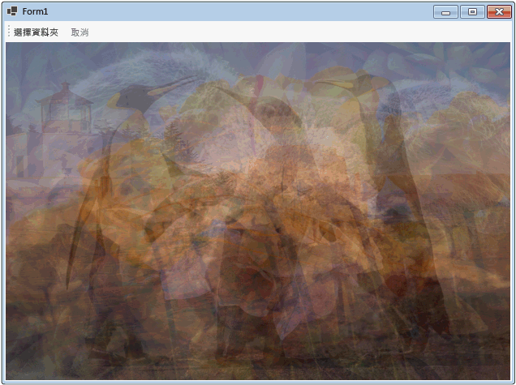

# 逐步解說：在 Windows Forms 應用程式中使用資料流程Walkthrough: Using Dataflow in a Windows Forms Application
本文鍵示範如何建立資料流程區塊網路，其可以在 Windows Forms 應用程式中執行映像處理。This document demonstrates how to create a network of dataflow blocks that perform image processing in a Windows Forms application.  
  
 這個範例會從指定的資料夾載入映像檔案、建立複合映像，以及顯示結果。This example loads image files from the specified folder, creates a composite image, and displays the result. 這個範例會使用資料流程模型，透過網路路由映像。The example uses the dataflow model to route images through the network. 在資料流程模型中，程式的獨立元件會透過傳送訊息，彼此進行通訊。In the dataflow model, independent components of a program communicate with one another by sending messages. 當元件收到訊息時，它會執行某些動作，然後將結果傳遞給另一個元件。When a component receives a message, it performs some action and then passes the result to another component. 比較資料流程模型與控制流程模型，在其中應用程式會使用控制項結構，例如，條件陳述式、迴圈等等，來控制程式中作業的順序。Compare this with the control flow model, in which an application uses control structures, for example, conditional statements, loops, and so on, to control the order of operations in a program.  
  
## 必要條件Prerequisites  
 在開始進行這個逐步解說之前，請先閱讀[資料流程](../../../docs/standard/parallel-programming/dataflow-task-parallel-library.md)。Read [Dataflow](../../../docs/standard/parallel-programming/dataflow-task-parallel-library.md) before you start this walkthrough.  

[!INCLUDE [tpl-install-instructions](../../../includes/tpl-install-instructions.md)]

## 章節Sections  
 本逐步解說包含下列各節：This walkthrough contains the following sections:  
  
-   [建立 Windows Forms 應用程式Creating the Windows Forms Application](#winforms)  
  
-   [建立資料流程網路Creating the Dataflow Network](#network)  
  
-   [連接資料流程網路與使用者介面Connecting the Dataflow Network to the User Interface](#ui)  
  
-   [完整範例The Complete Example](#complete)  
  
   
## 建立 Windows Forms 應用程式Creating the Windows Forms Application  
 本節描述如何建立基本 Windows Forms 應用程式，並且將控制項新增至主要表單。This section describes how to create the basic Windows Forms application and add controls to the main form.  
  
#### 若要建立 Windows Forms 應用程式To Create the Windows Forms Application  
  
1.  在 [!INCLUDE[vsprvs](../../../includes/vsprvs-md.md)]中，建立 [!INCLUDE[csprcs](../../../includes/csprcs-md.md)] 或 Visual Basic 的 [Windows Forms 應用程式] 專案。In [!INCLUDE[vsprvs](../../../includes/vsprvs-md.md)], create a [!INCLUDE[csprcs](../../../includes/csprcs-md.md)] or Visual Basic **Windows Forms Application** project. 在本文件中，專案命名為 `CompositeImages`。In this document, the project is named `CompositeImages`.  
  
2.  在主要表單 Form1.cs (在 [!INCLUDE[vbprvb](../../../includes/vbprvb-md.md)] 中為 Form1.vb) 的表單設計工具上，加入 <xref:System.Windows.Forms.ToolStrip> 控制項。On the form designer for the main form, Form1.cs (Form1.vb for [!INCLUDE[vbprvb](../../../includes/vbprvb-md.md)]), add a <xref:System.Windows.Forms.ToolStrip> control.  
  
3.  將 <xref:System.Windows.Forms.ToolStripButton> 控制項加入 <xref:System.Windows.Forms.ToolStrip> 控制項。Add a <xref:System.Windows.Forms.ToolStripButton> control to the <xref:System.Windows.Forms.ToolStrip> control. 將 <xref:System.Windows.Forms.ToolStripItem.DisplayStyle%2A> 屬性設為 <xref:System.Windows.Forms.ToolStripItemDisplayStyle.Text>，並將 <xref:System.Windows.Forms.ToolStripItem.Text%2A> 屬性設為 **Choose Folder**。Set the <xref:System.Windows.Forms.ToolStripItem.DisplayStyle%2A> property to <xref:System.Windows.Forms.ToolStripItemDisplayStyle.Text> and the <xref:System.Windows.Forms.ToolStripItem.Text%2A> property to **Choose Folder**.  
  
4.  將第二個 <xref:System.Windows.Forms.ToolStripButton> 控制項加入 <xref:System.Windows.Forms.ToolStrip> 控制項。Add a second <xref:System.Windows.Forms.ToolStripButton> control to the <xref:System.Windows.Forms.ToolStrip> control. 將 <xref:System.Windows.Forms.ToolStripItem.DisplayStyle%2A> 屬性設為 <xref:System.Windows.Forms.ToolStripItemDisplayStyle.Text>，將 <xref:System.Windows.Forms.ToolStripItem.Text%2A> 屬性設為 **Cancel**，然後將 <xref:System.Windows.Forms.ToolStripItem.Enabled%2A> 屬性設為 `False`。Set the <xref:System.Windows.Forms.ToolStripItem.DisplayStyle%2A> property to <xref:System.Windows.Forms.ToolStripItemDisplayStyle.Text>, the <xref:System.Windows.Forms.ToolStripItem.Text%2A> property to **Cancel**, and the <xref:System.Windows.Forms.ToolStripItem.Enabled%2A> property to `False`.  
  
5.  將 <xref:System.Windows.Forms.PictureBox> 物件加入主要表單。Add a <xref:System.Windows.Forms.PictureBox> object to the main form. 將 <xref:System.Windows.Forms.Control.Dock%2A> 屬性設定為 <xref:System.Windows.Forms.DockStyle.Fill>。Set the <xref:System.Windows.Forms.Control.Dock%2A> property to <xref:System.Windows.Forms.DockStyle.Fill>.  
  
   
## 建立資料流程網路Creating the Dataflow Network  
 本節描述如何建立會執行映像處理的資料流程網路。This section describes how to create the dataflow network that performs image processing.  
  
#### 若要建立資料流程網路To Create the Dataflow Network  
  
1.  將 System.Threading.Tasks.Dataflow.dll 參考新增至您的專案。Add a reference to System.Threading.Tasks.Dataflow.dll to your project.  
  
2.  確定 Form1.cs (在 [!INCLUDE[vbprvb](../../../includes/vbprvb-md.md)] 中為 Form1.vb) 包含下列 `using` (在 [!INCLUDE[vbprvb](../../../includes/vbprvb-md.md)] 中為 `Using`) 陳述式：Ensure that Form1.cs (Form1.vb for [!INCLUDE[vbprvb](../../../includes/vbprvb-md.md)]) contains the following `using` (`Using` in [!INCLUDE[vbprvb](../../../includes/vbprvb-md.md)]) statements:  
  
     [!code-csharp[TPLDataflow_CompositeImages#1](../../../samples/snippets/csharp/VS_Snippets_Misc/tpldataflow_compositeimages/cs/compositeimages/form1.cs#1)]  
  
3.  將下列資料成員新增至 `Form1` 類別：Add the following data members to the `Form1` class:  
  
     [!code-csharp[TPLDataflow_CompositeImages#2](../../../samples/snippets/csharp/VS_Snippets_Misc/tpldataflow_compositeimages/cs/compositeimages/form1.cs#2)]  
  
4.  將下列 `CreateImageProcessingNetwork` 方法新增至 `Form1` 類別。Add the following method, `CreateImageProcessingNetwork`, to the `Form1` class. 這個方法會建立映像處理網路。This method creates the image processing network.  
  
     [!code-csharp[TPLDataflow_CompositeImages#3](../../../samples/snippets/csharp/VS_Snippets_Misc/tpldataflow_compositeimages/cs/compositeimages/form1.cs#3)]  
  
5.  實作 `LoadBitmaps` 方法。Implement the `LoadBitmaps` method.  
  
     [!code-csharp[TPLDataflow_CompositeImages#4](../../../samples/snippets/csharp/VS_Snippets_Misc/tpldataflow_compositeimages/cs/compositeimages/form1.cs#4)]  
  
6.  實作 `CreateCompositeBitmap` 方法。Implement the `CreateCompositeBitmap` method.  
  
     [!code-csharp[TPLDataflow_CompositeImages#5](../../../samples/snippets/csharp/VS_Snippets_Misc/tpldataflow_compositeimages/cs/compositeimages/form1.cs#5)]  
  
    > [!NOTE]
    >  C# 版本的 `CreateCompositeBitmap` 方法會使用指標，以便有效處理 <xref:System.Drawing.Bitmap?displayProperty=nameWithType> 物件。The C# version of the `CreateCompositeBitmap` method uses pointers to enable efficient processing of the <xref:System.Drawing.Bitmap?displayProperty=nameWithType> objects. 因此，您必須在專案中啟用 [容許 Unsafe 程式碼] 選項，以便使用 [unsafe](~/docs/csharp/language-reference/keywords/unsafe.md) 關鍵字。Therefore, you must enable the **Allow unsafe code** option in your project in order to use the [unsafe](~/docs/csharp/language-reference/keywords/unsafe.md) keyword. 如需如何在 [!INCLUDE[csprcs](../../../includes/csprcs-md.md)] 專案中啟用 unsafe 程式碼的詳細資訊，請參閱[專案設計工具、建置頁 (C#)](/visualstudio/ide/reference/build-page-project-designer-csharp)。For more information about how to enable unsafe code in a [!INCLUDE[csprcs](../../../includes/csprcs-md.md)] project, see [Build Page, Project Designer (C#)](/visualstudio/ide/reference/build-page-project-designer-csharp).  
  
 下表描述網路的成員。The following table describes the members of the network.  
  
|成員Member|類型Type|描述Description|  
|------------|----------|-----------------|  
|`loadBitmaps`|<xref:System.Threading.Tasks.Dataflow.TransformBlock%602>|採用資料夾路徑做為輸入，並且產生 <xref:System.Drawing.Bitmap> 物件的集合作為輸出。Takes a folder path as input and produces a collection of <xref:System.Drawing.Bitmap> objects as output.|  
|`createCompositeBitmap`|<xref:System.Threading.Tasks.Dataflow.TransformBlock%602>|採用 <xref:System.Drawing.Bitmap> 物件的集合做為輸入，並且產生複合點陣圖做為輸出。Takes a collection of <xref:System.Drawing.Bitmap> objects as input and produces a composite bitmap as output.|  
|`displayCompositeBitmap`|<xref:System.Threading.Tasks.Dataflow.ActionBlock%601>|在表單上顯示複合點陣圖。Displays the composite bitmap on the form.|  
|`operationCancelled`|<xref:System.Threading.Tasks.Dataflow.ActionBlock%601>|顯示映像以表示作業已取消，讓使用者選取另一個資料夾。Displays an image to indicate that the operation is canceled and enables the user to select another folder.|  
  
 為了連線資料流程區塊以形成網路，此範例會使用 <xref:System.Threading.Tasks.Dataflow.ISourceBlock%601.LinkTo%2A> 方法。To connect the dataflow blocks to form a network, this example uses the <xref:System.Threading.Tasks.Dataflow.ISourceBlock%601.LinkTo%2A> method. <xref:System.Threading.Tasks.Dataflow.ISourceBlock%601.LinkTo%2A> 方法包含採用 <xref:System.Predicate%601> 物件的多載版本，該物件會判斷目標區塊是否接受或拒絕訊息。The <xref:System.Threading.Tasks.Dataflow.ISourceBlock%601.LinkTo%2A> method contains an overloaded version that takes a <xref:System.Predicate%601> object that determines whether the target block accepts or rejects a message. 這個篩選機制可讓訊息區塊僅接收特定的值。This filtering mechanism enables message blocks to receive only certain values. 在此範例中，網路可以使用兩種方式之一進行分支。In this example, the network can branch in one of two ways. 主要分支會從磁碟載入映像、建立複合映像，以及在表單上顯示該映像。The main branch loads the images from disk, creates the composite image, and displays that image on the form. 替代分支會取消目前的作業。The alternate branch cancels the current operation. <xref:System.Predicate%601> 物件會啟用主要分支上的資料流程區塊，以藉由拒絕特定訊息來切換至替代分支。The <xref:System.Predicate%601> objects enable the dataflow blocks along the main branch to switch to the alternative branch by rejecting certain messages. 例如，如果使用者取消作業，資料流程區塊 `createCompositeBitmap` 會產生 `null` (在 [!INCLUDE[vbprvb](../../../includes/vbprvb-md.md)] 中為 `Nothing`) 做為其輸出。For example, if the user cancels the operation, the dataflow block `createCompositeBitmap` produces `null` (`Nothing` in [!INCLUDE[vbprvb](../../../includes/vbprvb-md.md)]) as its output. 資料流程區塊 `displayCompositeBitmap` 會拒絕 `null` 輸入值，因此，訊息會提供給 `operationCancelled`。The dataflow block `displayCompositeBitmap` rejects `null` input values, and therefore, the message is offered to `operationCancelled`. 資料流程區塊 `operationCancelled` 接受所有訊息，因此，會顯示映像表示作業取消。The dataflow block `operationCancelled` accepts all messages and therefore, displays an image to indicate that the operation is canceled.  
  
 下圖顯示映像處理網路。The following illustration shows the image processing network.  
  
   
  
 由於 `displayCompositeBitmap` 和 `operationCancelled`資料流程區塊會在使用者介面上進行處理，因此這個動作一定要在使用者介面執行緒上發生。Because the `displayCompositeBitmap` and `operationCancelled` dataflow blocks act on the user interface, it is important that these actions occur on the user-interface thread. 為了要完成這項作業，這些物件在建構時會提供 <xref:System.Threading.Tasks.Dataflow.ExecutionDataflowBlockOptions> 物件，而且其 <xref:System.Threading.Tasks.Dataflow.DataflowBlockOptions.TaskScheduler%2A> 屬性會設定為 <xref:System.Threading.Tasks.TaskScheduler.FromCurrentSynchronizationContext%2A?displayProperty=nameWithType>。To accomplish this, during construction, these objects each provide a <xref:System.Threading.Tasks.Dataflow.ExecutionDataflowBlockOptions> object that has the <xref:System.Threading.Tasks.Dataflow.DataflowBlockOptions.TaskScheduler%2A> property set to <xref:System.Threading.Tasks.TaskScheduler.FromCurrentSynchronizationContext%2A?displayProperty=nameWithType>. <xref:System.Threading.Tasks.TaskScheduler.FromCurrentSynchronizationContext%2A?displayProperty=nameWithType> 方法會建立 <xref:System.Threading.Tasks.TaskScheduler> 物件，該物件會在目前的同步處理內容上執行工作。The <xref:System.Threading.Tasks.TaskScheduler.FromCurrentSynchronizationContext%2A?displayProperty=nameWithType> method creates a <xref:System.Threading.Tasks.TaskScheduler> object that performs work on the current synchronization context. 因為 `CreateImageProcessingNetwork` 方法是從 [選擇資料夾] 按鈕的處理常式呼叫，它會在使用者介面執行緒上執行，`displayCompositeBitmap` 和 `operationCancelled` 資料流程區塊的動作也會在使用者介面執行緒上執行。Because the `CreateImageProcessingNetwork` method is called from the handler of the **Choose Folder** button, which runs on the user-interface thread, the actions for the `displayCompositeBitmap` and `operationCancelled` dataflow blocks also run on the user-interface thread.  
  
 此範例使用共用取消權杖，而非設定 <xref:System.Threading.Tasks.Dataflow.DataflowBlockOptions.CancellationToken%2A> 屬性，因為 <xref:System.Threading.Tasks.Dataflow.DataflowBlockOptions.CancellationToken%2A> 屬性會永久取消資料流程區塊的執行。This example uses a shared cancellation token instead of setting the <xref:System.Threading.Tasks.Dataflow.DataflowBlockOptions.CancellationToken%2A> property because the <xref:System.Threading.Tasks.Dataflow.DataflowBlockOptions.CancellationToken%2A> property permanently cancels dataflow block execution. 取消語彙基元可讓此範例重複使用相同的資料流程網路多次，即使使用者取消一或多個作業。A cancellation token enables this example to reuse the same dataflow network multiple times, even when the user cancels one or more operations. 如需使用 <xref:System.Threading.Tasks.Dataflow.DataflowBlockOptions.CancellationToken%2A> 以永久取消資料流程區塊執行的範例，請參閱[如何：取消資料流程區塊](../../../docs/standard/parallel-programming/how-to-cancel-a-dataflow-block.md)。For an example that uses <xref:System.Threading.Tasks.Dataflow.DataflowBlockOptions.CancellationToken%2A> to permanently cancel the execution of a dataflow block, see [How to: Cancel a Dataflow Block](../../../docs/standard/parallel-programming/how-to-cancel-a-dataflow-block.md).  
  
   
## 連接資料流程網路與使用者介面Connecting the Dataflow Network to the User Interface  
 本節描述如何連接資料流程網路與使用者介面。This section describes how to connect the dataflow network to the user interface. 建立複合映像和取消作業是從 [選擇資料夾] 和 [取消] 按鈕起始。The creation of the composite image and cancellation of the operation are initiated from the **Choose Folder** and **Cancel** buttons. 當使用者選擇任一個按鈕時，會以非同步方式起始適當的動作。When the user chooses either of these buttons, the appropriate action is initiated in an asynchronous manner.  
  
#### 若要連接資料流程網路與使用者介面To Connect the Dataflow Network to the User Interface  
  
1.  在主要表單的表單設計工具上，為 **Choose Folder** 按鈕的 <xref:System.Windows.Forms.ToolStripItem.Click> 事件建立事件處理常式。On the form designer for the main form, create an event handler for the <xref:System.Windows.Forms.ToolStripItem.Click> event for the **Choose Folder** button.  
  
2.  實作 **Choose Folder** 按鈕的 <xref:System.Windows.Forms.ToolStripItem.Click> 事件。Implement the <xref:System.Windows.Forms.ToolStripItem.Click> event for the **Choose Folder** button.  
  
     [!code-csharp[TPLDataflow_CompositeImages#6](../../../samples/snippets/csharp/VS_Snippets_Misc/tpldataflow_compositeimages/cs/compositeimages/form1.cs#6)]  
  
3.  在主要表單的表單設計工具上，為 **Cancel** 按鈕的 <xref:System.Windows.Forms.ToolStripItem.Click> 事件建立事件處理常式。On the form designer for the main form, create an event handler for the <xref:System.Windows.Forms.ToolStripItem.Click> event for the **Cancel** button.  
  
4.  實作 **Cancel** 按鈕的 <xref:System.Windows.Forms.ToolStripItem.Click> 事件。Implement the <xref:System.Windows.Forms.ToolStripItem.Click> event for the **Cancel** button.  
  
     [!code-csharp[TPLDataflow_CompositeImages#7](../../../samples/snippets/csharp/VS_Snippets_Misc/tpldataflow_compositeimages/cs/compositeimages/form1.cs#7)]  
  
   
## 完整範例The Complete Example  
 下列範例將示範本逐步解說的完整程式碼。The following example shows the complete code for this walkthrough.  
  
 [!code-csharp[TPLDataflow_CompositeImages#100](../../../samples/snippets/csharp/VS_Snippets_Misc/tpldataflow_compositeimages/cs/compositeimages/form1.cs#100)]  
  
 下圖顯示通用 \Sample Pictures\ 資料夾的一般輸出。The following illustration shows typical output for the common \Sample Pictures\ folder.  
  
   

## 請參閱See Also  
 [資料流程Dataflow](../../../docs/standard/parallel-programming/dataflow-task-parallel-library.md)
