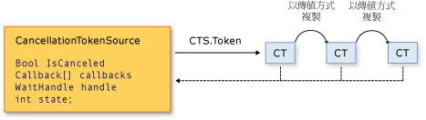

# Cancellation in Managed Threads
隨著 [!INCLUDE[net_v40_long](../../../includes/net-v40-long-md.md)] 一起啟動， .NET Framework 使用統一的模型來進行非同步或長時間執行的同步作業的合作式取消。  此模型是根據一個被稱為取消權杖的輕量級物件。  叫用一或多個可取消作業的物件，例如藉由建立新的執行緒或工作，會將權杖傳遞至每個作業。  個別作業可以依序將權杖的複本傳遞至其他作業。  之後的某些時候 ，建立權杖的物件可以使用它來要求作業停止活動。  只有要求的物件可以發出取消要求，而且每個接聽程式負責留意要求，並且以適當且即時的方式回應。  
  
 合作式取消模型的一般實作模式是：  
  
-   具現化 <xref:System.Threading.CancellationTokenSource> 物件，該物件會管理並傳送取消通知給個別的取消權杖。  
  
-   傳遞由 <xref:System.Threading.CancellationTokenSource.Token%2A?displayProperty=fullName> 屬性傳回的權杖給每個接聽取消的工作或執行緒。  
  
-   提供一種機制讓每個工作或執行緒都能回應取消作業。  
  
-   呼叫 <xref:System.Threading.CancellationTokenSource.Cancel%2A?displayProperty=fullName> 方法以提供取消的通知。  
  
> [!IMPORTANT]
>  <xref:System.Threading.CancellationTokenSource> 類別會實作 <xref:System.IDisposable> 介面。  當您完成使用取消權杖來釋放任何它所保留的 Unmanaged 資源之後，您一定要呼叫 <xref:System.Threading.CancellationTokenSource.Dispose%2A?displayProperty=fullName> 方法。  
  
 下圖顯示權杖來源和其權杖的所有複本兩者之間的關係。  
  
   
  
 新的取消模型可讓您更輕鬆地建立取消感知應用程式和程式庫，它可支援下列功能：  
  
-   取消作業為合作式且對於接聽程式為非強制。  接聽程式會決定如何依正常程序來終止以回應取消要求。  
  
-   要求與接聽有所不同。  當 \(如果有的話\) 要求取消作業時，可以控制叫用可取消作業的物件。  
  
-   送出要求的物件藉著只使用一個方法呼叫，來發出取消要求給權杖的所有複本。  
  
-   接聽程式可以透過將這些權杖聯結成單一個 *「連結的權杖」*\(linked token\) 來同時接聽多個權杖。  
  
-   使用者程式碼可以注意並回應來自程式庫程式碼的取消要求，並且程式庫程式碼可以注意並回應來自使用者程式碼的取消要求。  
  
-   接聽程式可以收到取消要求，藉由輪詢、回呼註冊，或等候等候控制代碼。  
  
## 取消類型  
 取消架構被實作為一組相關的類型，這些會在下表中列出。  
  
|類型名稱|描述|  
|----------|--------|  
|<xref:System.Threading.CancellationTokenSource>|建立取消權杖，並發出取消要求給該權杖所有複本的物件。|  
|<xref:System.Threading.CancellationToken>|輕量型的實值類型通常做為方法參數傳遞至一或多個接聽程式。  接聽程式會監控權杖中 `IsCancellationRequested` 屬性的值，藉由輪詢、回呼，或等候控制代碼。|  
|<xref:System.OperationCanceledException>|此例外狀況之建構函式的多載接受 <xref:System.Threading.CancellationToken> 做為參數。  接聽程式可以選擇性地擲回這個例外狀況來驗證取消來源，並通知其他接聽程式它已經回應取消要求。|  
  
 新的取消模型已整合至 [!INCLUDE[dnprdnshort](../../../includes/dnprdnshort-md.md)] 的數種類型中。最重要的部分包括 <xref:System.Threading.Tasks.Parallel?displayProperty=fullName>、<xref:System.Threading.Tasks.Task?displayProperty=fullName>、<xref:System.Threading.Tasks.Task%601?displayProperty=fullName> 和 <xref:System.Linq.ParallelEnumerable?displayProperty=fullName>。  我們建議您針對所有新程式庫和應用程式程式碼使用這個新的取消模型。  
  
## 程式碼範例  
 在下列範例中，要求的物件會建立 <xref:System.Threading.CancellationTokenSource> 物件，然後傳遞其 <xref:System.Threading.CancellationTokenSource.Token%2A> 屬性給可取消作業。  接收要求的作業會藉由輪詢來監視權杖之 <xref:System.Threading.CancellationToken.IsCancellationRequested%2A> 屬性的值。  當此值變成 `true` 時，接聽程式能夠以任何合適的方式來結束。  在此範例中，方法只會結束，就如同在許多情況下所要求的。  
  
> [!NOTE]
>  此範例會使用 <xref:System.Threading.ThreadPool.QueueUserWorkItem%2A> 方法來示範新的取消架構與舊版應用程式開發介面相容。  如需使用慣用的新 <xref:System.Threading.Tasks.Task?displayProperty=fullName> 類型之範例，請參閱[How to: Cancel a Task and Its Children](../../../docs/standard/parallel-programming/how-to-cancel-a-task-and-its-children.md)。  
  
 [!code-csharp[Cancellation#1](../../../samples/snippets/csharp/VS_Snippets_Misc/cancellation/cs/cancellationex1.cs#1)]
 [!code-vb[Cancellation#1](../../../samples/snippets/visualbasic/VS_Snippets_Misc/cancellation/vb/cancellationex1.vb#1)]  
  
## 作業取消與物件取消  
 在新的取消架構中，取消指的是作業而不是物件。  取消要求意味著作業應該在任何必要的清除執行之後盡快停止。  一個取消權杖所指的應該是一個「可取消作業」，但是該作業可能會在程式中實作。  在權杖的 <xref:System.Threading.CancellationToken.IsCancellationRequested%2A> 屬性已設定為 `true` 之後，無法被重設為 `false`。  因此，取消權杖在被取消之後無法重複使用。  
  
 如果您需要物件取消機制，您可以藉由呼叫 <xref:System.Threading.CancellationToken.Register%2A?displayProperty=fullName> 方法來根據其作業取消機制，如下列範例所示。  
  
 [!code-csharp[Cancellation#2](../../../samples/snippets/csharp/VS_Snippets_Misc/cancellation/cs/objectcancellation1.cs#2)]
 [!code-vb[Cancellation#2](../../../samples/snippets/visualbasic/VS_Snippets_Misc/cancellation/vb/objectcancellation1.vb#2)]  
  
 如果物件支援多個並行的可取消作業，會將個別的權杖做為輸入傳遞給每個不同的可取消作業。  如此一來，可以取消一項作業而不會對其他造成影響。  
  
## 接聽並回應取消要求  
 在使用者委派，可取消作業的實作器會決定如何終止作業以取消要求的回應。  在許多情況下，使用者委派可以只執行任何必要的清除作業，然後立即傳回。  
  
 不過，在更複雜的情況下，使用者委派可能需要通知程式庫程式碼已發生取消。  在這種情況下，終止作業的正確方式是委派要呼叫會導致擲回 <xref:System.OperationCanceledException> 的 <xref:System.Threading.CancellationToken.ThrowIfCancellationRequested%2A> 方法。  程式庫程式碼可以在使用者委派執行緒上攔截此例外狀況，並檢查例外狀況的權杖來判斷此例外狀況是否表示合作式取消或一些其他的例外狀況。  
  
 <xref:System.Threading.Tasks.Task> 類別以這種方式控制 <xref:System.OperationCanceledException> 。  如需詳細資訊，請參閱[Task Cancellation](../../../docs/standard/parallel-programming/task-cancellation.md)。  
  
### 透過輪詢接聽  
 針對長時間執行計算的迴圈或遞迴，您可以透過定期輪詢 <xref:System.Threading.CancellationToken.IsCancellationRequested%2A?displayProperty=fullName> 屬性的值來接聽取消要求。  如果其值為 `true` ，方法應該清除並盡快結束。  最佳的輪詢頻率取決於應用程式的類型。  其由開發人員決定任何指定程式的最佳輪詢頻率。  輪詢本身不會大幅影響效能。  下列範例會示範一個輪詢的可行方法。  
  
 [!code-csharp[Cancellation#3](../../../samples/snippets/csharp/VS_Snippets_Misc/cancellation/cs/cancellationex11.cs#3)]
 [!code-vb[Cancellation#3](../../../samples/snippets/visualbasic/VS_Snippets_Misc/cancellation/vb/cancellationex11.vb#3)]  
  
 如需更完整的範例，請參閱[How to: Listen for Cancellation Requests by Polling](../../../docs/standard/threading/how-to-listen-for-cancellation-requests-by-polling.md)。  
  
### 藉由註冊回呼來接聽  
 某些作業可能會被封鎖，原因是它們無法及時檢查取消權杖的值。  在這些情況下，您可以註冊一個會在收到取消要求時解鎖該方法的回呼方法。  
  
 <xref:System.Threading.CancellationToken.Register%2A> 方法會傳回一個專門用於此用途的 <xref:System.Threading.CancellationTokenRegistration> 物件。  下列範例示範如何使用 <xref:System.Threading.CancellationToken.Register%2A> 方法來取消非同步的 Web 要求。  
  
 [!code-csharp[Cancellation#4](../../../samples/snippets/csharp/VS_Snippets_Misc/cancellation/cs/cancellationex4.cs#4)]
 [!code-vb[Cancellation#4](../../../samples/snippets/visualbasic/VS_Snippets_Misc/cancellation/vb/cancellationex4.vb#4)]  
  
 <xref:System.Threading.CancellationTokenRegistration> 物件管理執行緒同步處理，並確保回呼會及時在精準的時間點停止執行。  
  
 為了確保系統的回應能力並避免死結，註冊回呼時必須遵循下列指導方針：  
  
-   回呼方法應該快速，因為它會以同步方式呼叫，因此對 <xref:System.Threading.CancellationTokenSource.Cancel%2A> 的呼叫在回呼傳回之前不會傳回。  
  
-   如果您在回呼執行時呼叫 <xref:System.Threading.CancellationTokenRegistration.Dispose%2A>，並且您保存了回呼正在等候的鎖定，您的程式可能會發生死結。  在 `Dispose` 傳回後，您可以釋放回呼所需的任何資源。  
  
-   回呼不應該執行任何手動執行緒或 <xref:System.Threading.SynchronizationContext> 使用方式於回呼中。  如果回呼必須在特定執行緒上執行，請使用 <xref:System.Threading.CancellationTokenRegistration?displayProperty=fullName> 建構函式，它可讓您指定目標 syncContext 為作用中的 <xref:System.Threading.SynchronizationContext.Current%2A?displayProperty=fullName>。  於回呼中執行手動執行緒可能會導致死結。  
  
 如需更完整的範例，請參閱[How to: Register Callbacks for Cancellation Requests](../../../docs/standard/threading/how-to-register-callbacks-for-cancellation-requests.md)。  
  
### 使用等候控制代碼來接聽  
 當可取消的作業等候同步處理基本類型，例如 <xref:System.Threading.ManualResetEvent?displayProperty=fullName> 或 <xref:System.Threading.Semaphore?displayProperty=fullName>，而可以封鎖可取消作業時，您可以使用 <xref:System.Threading.CancellationToken.WaitHandle%2A?displayProperty=fullName> 屬性，來啟用事件以等候前述兩種事件以及取消要求。  取消權杖的等候控制代碼會被通知以回應取消要求，而且方法可以使用 <xref:System.Threading.WaitHandle.WaitAny%2A> 方法被傳回的值，以判斷它是否是被通知的取消權杖。  作業可以就在那時結束，或在適當的情況擲回 <xref:System.OperationCanceledException> 。  
  
 [!code-csharp[Cancellation#5](../../../samples/snippets/csharp/VS_Snippets_Misc/cancellation/cs/cancellationex9.cs#5)]
 [!code-vb[Cancellation#5](../../../samples/snippets/visualbasic/VS_Snippets_Misc/cancellation/vb/cancellationex9.vb#5)]  
  
 標記 [!INCLUDE[net_v40_long](../../../includes/net-v40-long-md.md)] 、 <xref:System.Threading.ManualResetEventSlim?displayProperty=fullName> 和 <xref:System.Threading.SemaphoreSlim?displayProperty=fullName> 的新程式碼中兩者都能以其 `Wait` 方法支援新的取消架構。  您可以傳遞 <xref:System.Threading.CancellationToken> 給該方法，並且當要求取消作業時，事件會甦醒並擲回 <xref:System.OperationCanceledException>。  
  
 [!code-csharp[Cancellation#6](../../../samples/snippets/csharp/VS_Snippets_Misc/cancellation/cs/cancellationex10.cs#6)]
 [!code-vb[Cancellation#6](../../../samples/snippets/visualbasic/VS_Snippets_Misc/cancellation/vb/cancellationex10.vb#6)]  
  
 如需更完整的範例，請參閱[How to: Listen for Cancellation Requests That Have Wait Handles](../../../docs/standard/threading/how-to-listen-for-cancellation-requests-that-have-wait-handles.md)。  
  
### 同時接聽多個權杖  
 在某些情況下，接聽程式可能必須同時接聽多個取消權杖。  例如，可取消的作業可能需要監視內部的取消權杖，除了在外部做為引數傳遞至方法參數的權杖。  若要達成此目的，建立連結的權杖來源，它可以將兩個或多個權杖聯結到一個權杖，如下列範例所示。  
  
 [!code-csharp[Cancellation#7](../../../samples/snippets/csharp/VS_Snippets_Misc/cancellation/cs/cancellationex13.cs#7)]
 [!code-vb[Cancellation#7](../../../samples/snippets/visualbasic/VS_Snippets_Misc/cancellation/vb/cancellationex13.vb#7)]  
  
 請注意，當您完成聯結後，必須在連結的權杖來源上呼叫 `Dispose` 。  如需更完整的範例，請參閱[How to: Listen for Multiple Cancellation Requests](../../../docs/standard/threading/how-to-listen-for-multiple-cancellation-requests.md)。  
  
## 程式庫程式碼和使用者程式碼之間的合作  
 統一的取消架構可讓程式庫程式碼取消使用者程式碼，並且讓使用者程式碼以合作方式取消程式庫程式碼。  平滑合作取決於每一邊都遵循下列方針：  
  
-   如果程式庫程式碼提供取消作業，它也應該提供一個接受外部取消權杖而進一步讓使用者程式碼可以要求取消的公用方法。  
  
-   如果程式庫程式碼呼叫使用者程式碼，程式庫程式碼應該將 OperationCanceledException\(externalToken\) 解譯為 *合作式取消* ，且不一定解譯為失敗例外狀況。  
  
-   使用者委派應該及時嘗試回應來自程式庫程式碼的取消要求。  
  
 <xref:System.Threading.Tasks.Task?displayProperty=fullName> 和 <xref:System.Linq.ParallelEnumerable?displayProperty=fullName> 是遵循這些指導方針之類別的範例。  如需詳細資訊，請參閱[Task Cancellation](../../../docs/standard/parallel-programming/task-cancellation.md) 和[How to: Cancel a PLINQ Query](../../../docs/standard/parallel-programming/how-to-cancel-a-plinq-query.md)。  
  
## 請參閱  
 [Managed Threading Basics](../../../docs/standard/threading/managed-threading-basics.md)