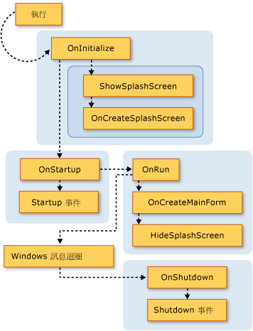
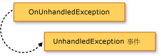

# 擴充 Visual Basic 應用程式模型
您可以將功能加入至應用程式模型覆寫`Overridable`成員的<xref:Microsoft.VisualBasic.ApplicationServices.WindowsFormsApplicationBase>類別。</xref:Microsoft.VisualBasic.ApplicationServices.WindowsFormsApplicationBase> 這項技術可讓您自訂應用程式模型的行為，並將呼叫加入至您自己的方法在應用程式啟動和關機。  
  
## 應用程式模型的視覺化概觀  
 本節以視覺化方式呈現 Visual Basic 應用程式模型中的函式呼叫的順序。 下一節中說明的目的詳述每個函式。  
  
 下圖顯示一般的 Visual Basic Windows Form 應用程式中的應用程式模型的呼叫順序。 在順序啟動時`Sub Main`程序呼叫<xref:Microsoft.VisualBasic.ApplicationServices.WindowsFormsApplicationBase.Run%2A>方法。</xref:Microsoft.VisualBasic.ApplicationServices.WindowsFormsApplicationBase.Run%2A>  
  
   
  
 Visual Basic 應用程式模型也提供<xref:Microsoft.VisualBasic.ApplicationServices.WindowsFormsApplicationBase.StartupNextInstance>和<xref:Microsoft.VisualBasic.ApplicationServices.WindowsFormsApplicationBase.UnhandledException>事件。</xref:Microsoft.VisualBasic.ApplicationServices.WindowsFormsApplicationBase.UnhandledException> </xref:Microsoft.VisualBasic.ApplicationServices.WindowsFormsApplicationBase.StartupNextInstance> 下圖顯示引發這些事件的機制。  
  
   
  
   
  
## 覆寫基底方法  
 <xref:Microsoft.VisualBasic.ApplicationServices.WindowsFormsApplicationBase.Run%2A>方法中定義的順序`Application`方法執行。</xref:Microsoft.VisualBasic.ApplicationServices.WindowsFormsApplicationBase.Run%2A> 根據預設， `Sub Main` Windows Form 應用程式的程序呼叫<xref:Microsoft.VisualBasic.ApplicationServices.WindowsFormsApplicationBase.Run%2A>方法。</xref:Microsoft.VisualBasic.ApplicationServices.WindowsFormsApplicationBase.Run%2A>  
  
 如果應用程式是正常的應用程式 （多個執行個體應用程式） 或單一執行個體應用程式的第一個執行個體<xref:Microsoft.VisualBasic.ApplicationServices.WindowsFormsApplicationBase.Run%2A>方法執行`Overridable`依照下列順序的方法︰</xref:Microsoft.VisualBasic.ApplicationServices.WindowsFormsApplicationBase.Run%2A>  
  
1.  <xref:Microsoft.VisualBasic.ApplicationServices.WindowsFormsApplicationBase.OnInitialize%2A>.</xref:Microsoft.VisualBasic.ApplicationServices.WindowsFormsApplicationBase.OnInitialize%2A> 根據預設，這個方法會設定視覺化樣式、 文字顯示樣式和目前的主體，主應用程式的執行緒 （如果應用程式使用 Windows 驗證），並呼叫`ShowSplashScreen`如果沒有`/nosplash`也不`-nosplash`用做為命令列引數。  
  
     如果此函數會傳回取消應用程式啟動順序`False`。 這可以是在其中應用程式不應該執行的情況下很有用。  
  
     <xref:Microsoft.VisualBasic.ApplicationServices.WindowsFormsApplicationBase.OnInitialize%2A>方法會呼叫下列方法︰</xref:Microsoft.VisualBasic.ApplicationServices.WindowsFormsApplicationBase.OnInitialize%2A>  
  
    1.  <xref:Microsoft.VisualBasic.ApplicationServices.WindowsFormsApplicationBase.ShowSplashScreen%2A>.</xref:Microsoft.VisualBasic.ApplicationServices.WindowsFormsApplicationBase.ShowSplashScreen%2A> 決定應用程式是否具有定義的啟動顯示畫面，如果是的話，會啟動顯示畫面顯示另一個執行緒上。  
  
         <xref:Microsoft.VisualBasic.ApplicationServices.WindowsFormsApplicationBase.ShowSplashScreen%2A>方法所包含的程式碼，會顯示啟動顯示畫面的最少的所指定的毫秒數<xref:Microsoft.VisualBasic.ApplicationServices.WindowsFormsApplicationBase.MinimumSplashScreenDisplayTime%2A>屬性。</xref:Microsoft.VisualBasic.ApplicationServices.WindowsFormsApplicationBase.MinimumSplashScreenDisplayTime%2A> </xref:Microsoft.VisualBasic.ApplicationServices.WindowsFormsApplicationBase.ShowSplashScreen%2A> 若要使用這項功能，您必須加入啟動顯示畫面應用程式使用**專案設計工具**(將`My.Application.MinimumSplashScreenDisplayTime`屬性為兩秒)，或設定`My.Application.MinimumSplashScreenDisplayTime`屬性會覆寫方法中的<xref:Microsoft.VisualBasic.ApplicationServices.WindowsFormsApplicationBase.OnInitialize%2A>或<xref:Microsoft.VisualBasic.ApplicationServices.WindowsFormsApplicationBase.OnCreateSplashScreen%2A>方法。</xref:Microsoft.VisualBasic.ApplicationServices.WindowsFormsApplicationBase.OnCreateSplashScreen%2A> </xref:Microsoft.VisualBasic.ApplicationServices.WindowsFormsApplicationBase.OnInitialize%2A> 如需詳細資訊，請參閱<xref:Microsoft.VisualBasic.ApplicationServices.WindowsFormsApplicationBase.MinimumSplashScreenDisplayTime%2A>。</xref:Microsoft.VisualBasic.ApplicationServices.WindowsFormsApplicationBase.MinimumSplashScreenDisplayTime%2A>  
  
    2.  <xref:Microsoft.VisualBasic.ApplicationServices.WindowsFormsApplicationBase.OnCreateSplashScreen%2A>.</xref:Microsoft.VisualBasic.ApplicationServices.WindowsFormsApplicationBase.OnCreateSplashScreen%2A> 可讓設計工具發出初始化啟動顯示畫面的程式碼。  
  
         根據預設，這個方法沒有作用。 如果您選取應用程式的啟動顯示畫面[!INCLUDE[vbprvb](../../../csharp/programming-guide/concepts/linq/includes/vbprvb_md.md)]**專案設計工具**，設計工具會覆寫<xref:Microsoft.VisualBasic.ApplicationServices.WindowsFormsApplicationBase.OnCreateSplashScreen%2A>方法的方法，設定<xref:Microsoft.VisualBasic.ApplicationServices.WindowsFormsApplicationBase.SplashScreen%2A>啟動顯示畫面表單的新執行個體的屬性。</xref:Microsoft.VisualBasic.ApplicationServices.WindowsFormsApplicationBase.SplashScreen%2A> </xref:Microsoft.VisualBasic.ApplicationServices.WindowsFormsApplicationBase.OnCreateSplashScreen%2A>  
  
2.  <xref:Microsoft.VisualBasic.ApplicationServices.WindowsFormsApplicationBase.OnStartup%2A>.</xref:Microsoft.VisualBasic.ApplicationServices.WindowsFormsApplicationBase.OnStartup%2A> 提供的擴充點引發`Startup`事件。 如果此函數會傳回，就會停止應用程式啟動順序`False`。  
  
     根據預設，這個方法會引發<xref:Microsoft.VisualBasic.ApplicationServices.WindowsFormsApplicationBase.Startup>事件。</xref:Microsoft.VisualBasic.ApplicationServices.WindowsFormsApplicationBase.Startup> 如果事件處理常式將@System.ComponentModel.CancelEventArgs.Cancel的事件引數屬性`True`，方法會傳回`False`取消應用程式啟動。  
  
3.  <xref:Microsoft.VisualBasic.ApplicationServices.WindowsFormsApplicationBase.OnRun%2A>.</xref:Microsoft.VisualBasic.ApplicationServices.WindowsFormsApplicationBase.OnRun%2A> 準備開始完成初始化之後執行主應用程式時提供的起點。  
  
     根據預設，即會進入 Windows Form 訊息迴圈之前，這個方法會呼叫`OnCreateMainForm`（若要建立應用程式的主表單） 和`HideSplashScreen`（若要關閉啟動顯示畫面） 方法︰  
  
    1.  <xref:Microsoft.VisualBasic.ApplicationServices.WindowsFormsApplicationBase.OnCreateMainForm%2A>.</xref:Microsoft.VisualBasic.ApplicationServices.WindowsFormsApplicationBase.OnCreateMainForm%2A> 可讓設計工具發出初始化主要表單的程式碼。  
  
         根據預設，這個方法沒有作用。 不過，當您選取主表單中的應用程式[!INCLUDE[vbprvb](../../../csharp/programming-guide/concepts/linq/includes/vbprvb_md.md)]**專案設計工具**，設計工具會覆寫<xref:Microsoft.VisualBasic.ApplicationServices.WindowsFormsApplicationBase.OnCreateMainForm%2A>方法的方法，設定<xref:Microsoft.VisualBasic.ApplicationServices.WindowsFormsApplicationBase.MainForm%2A>主要表單的新執行個體的屬性。</xref:Microsoft.VisualBasic.ApplicationServices.WindowsFormsApplicationBase.MainForm%2A> </xref:Microsoft.VisualBasic.ApplicationServices.WindowsFormsApplicationBase.OnCreateMainForm%2A>  
  
    2.  <xref:Microsoft.VisualBasic.ApplicationServices.WindowsFormsApplicationBase.HideSplashScreen%2A>.</xref:Microsoft.VisualBasic.ApplicationServices.WindowsFormsApplicationBase.HideSplashScreen%2A> 如果應用程式已定義的開頭顯示畫面，並開啟，則這個方法會關閉啟動顯示畫面。  
  
         根據預設，這個方法會關閉啟動顯示畫面。  
  
4.  <xref:Microsoft.VisualBasic.ApplicationServices.WindowsFormsApplicationBase.OnStartupNextInstance%2A>.</xref:Microsoft.VisualBasic.ApplicationServices.WindowsFormsApplicationBase.OnStartupNextInstance%2A> 提供一個方法來自訂應用程式的另一個執行個體啟動時，單一執行個體應用程式的運作方式。  
  
     根據預設，這個方法會引發<xref:Microsoft.VisualBasic.ApplicationServices.WindowsFormsApplicationBase.StartupNextInstance>事件。</xref:Microsoft.VisualBasic.ApplicationServices.WindowsFormsApplicationBase.StartupNextInstance>  
  
5.  <xref:Microsoft.VisualBasic.ApplicationServices.WindowsFormsApplicationBase.OnShutdown%2A>.</xref:Microsoft.VisualBasic.ApplicationServices.WindowsFormsApplicationBase.OnShutdown%2A> 提供的擴充點引發`Shutdown`事件。 這個方法不會執行，如果主應用程式中發生未處理例外狀況。  
  
     根據預設，這個方法會引發<xref:Microsoft.VisualBasic.ApplicationServices.WindowsFormsApplicationBase.Shutdown>事件。</xref:Microsoft.VisualBasic.ApplicationServices.WindowsFormsApplicationBase.Shutdown>  
  
6.  <xref:Microsoft.VisualBasic.ApplicationServices.WindowsFormsApplicationBase.OnUnhandledException%2A>.</xref:Microsoft.VisualBasic.ApplicationServices.WindowsFormsApplicationBase.OnUnhandledException%2A> 如果未處理的例外狀況就會發生任何上述列出的方法中，執行。  
  
     根據預設，這個方法會引發<xref:Microsoft.VisualBasic.ApplicationServices.WindowsFormsApplicationBase.UnhandledException>只要未附加偵錯工具和應用程式正在處理的事件`UnhandledException`事件。</xref:Microsoft.VisualBasic.ApplicationServices.WindowsFormsApplicationBase.UnhandledException>  
  
 如果是單一執行個體應用程式，應用程式已在執行後續的執行個體的應用程式呼叫<xref:Microsoft.VisualBasic.ApplicationServices.WindowsFormsApplicationBase.OnStartupNextInstance%2A>方法上的原始執行個體的應用程式，然後結束。</xref:Microsoft.VisualBasic.ApplicationServices.WindowsFormsApplicationBase.OnStartupNextInstance%2A>  
  
 <xref:Microsoft.VisualBasic.ApplicationServices.WindowsFormsApplicationBase>建構函式呼叫<xref:Microsoft.VisualBasic.ApplicationServices.WindowsFormsApplicationBase.UseCompatibleTextRendering%2A>屬性來判斷要用於應用程式的表單的文字轉譯引擎。</xref:Microsoft.VisualBasic.ApplicationServices.WindowsFormsApplicationBase.UseCompatibleTextRendering%2A> </xref:Microsoft.VisualBasic.ApplicationServices.WindowsFormsApplicationBase> 根據預設，<xref:Microsoft.VisualBasic.ApplicationServices.WindowsFormsApplicationBase.UseCompatibleTextRendering%2A>屬性會傳回`False`，表示使用 GDI 文字轉譯引擎，這是在預設[!INCLUDE[vbprvblong](../../../visual-basic/developing-apps/customizing-extending-my/includes/vbprvblong_md.md)]。</xref:Microsoft.VisualBasic.ApplicationServices.WindowsFormsApplicationBase.UseCompatibleTextRendering%2A> 您可以覆寫<xref:Microsoft.VisualBasic.ApplicationServices.WindowsFormsApplicationBase.UseCompatibleTextRendering%2A>屬性以傳回`True`，這表示使用 GDI + 文字轉譯引擎，這是 Visual Basic.NET 2002年和 Visual Basic.NET 2003年中的預設值。</xref:Microsoft.VisualBasic.ApplicationServices.WindowsFormsApplicationBase.UseCompatibleTextRendering%2A>  
  
## 設定應用程式  
 做為一部分[!INCLUDE[vbprvb](../../../csharp/programming-guide/concepts/linq/includes/vbprvb_md.md)]應用程式模型<xref:Microsoft.VisualBasic.ApplicationServices.WindowsFormsApplicationBase>類別提供受保護的內容，設定應用程式。</xref:Microsoft.VisualBasic.ApplicationServices.WindowsFormsApplicationBase> 實作類別的建構函式中，應該設定這些屬性。  
  
 在預設的 Windows Form 專案中，**專案設計工具**建立程式碼以設定與設計工具設定的屬性。 只有當應用程式正在啟動; 時，會使用屬性設定應用程式啟動後沒有任何作用。  
  
|屬性|決定|專案設計工具的 [應用程式] 窗格中的設定|  
|---|---|---|  
|<xref:Microsoft.VisualBasic.ApplicationServices.WindowsFormsApplicationBase.IsSingleInstance%2A></xref:Microsoft.VisualBasic.ApplicationServices.WindowsFormsApplicationBase.IsSingleInstance%2A>|無論應用程式會執行為單一執行個體或多重執行個體的應用程式。|**讓單一執行個體的應用程式**核取方塊|  
|<xref:Microsoft.VisualBasic.ApplicationServices.WindowsFormsApplicationBase.EnableVisualStyles%2A></xref:Microsoft.VisualBasic.ApplicationServices.WindowsFormsApplicationBase.EnableVisualStyles%2A>|如果應用程式將使用視覺化樣式符合 Windows XP。|**啟用 XP 視覺化樣式**核取方塊|  
|<xref:Microsoft.VisualBasic.ApplicationServices.WindowsFormsApplicationBase.SaveMySettingsOnExit%2A></xref:Microsoft.VisualBasic.ApplicationServices.WindowsFormsApplicationBase.SaveMySettingsOnExit%2A>|如果應用程式結束時，應用程式會自動儲存應用程式的使用者設定的變更。|**在關閉儲存 My.Settings**核取方塊|  
|<xref:Microsoft.VisualBasic.ApplicationServices.WindowsFormsApplicationBase.ShutdownStyle%2A></xref:Microsoft.VisualBasic.ApplicationServices.WindowsFormsApplicationBase.ShutdownStyle%2A>|什麼會導致應用程式結束，例如啟動表單關閉時，或最後一個表單關閉時。|**關閉模式**清單|  
  
## 另請參閱  
 <xref:Microsoft.VisualBasic.ApplicationServices.ApplicationBase></xref:Microsoft.VisualBasic.ApplicationServices.ApplicationBase>   
 <xref:Microsoft.VisualBasic.ApplicationServices.WindowsFormsApplicationBase.Startup></xref:Microsoft.VisualBasic.ApplicationServices.WindowsFormsApplicationBase.Startup>   
 <xref:Microsoft.VisualBasic.ApplicationServices.WindowsFormsApplicationBase.StartupNextInstance></xref:Microsoft.VisualBasic.ApplicationServices.WindowsFormsApplicationBase.StartupNextInstance>   
 <xref:Microsoft.VisualBasic.ApplicationServices.WindowsFormsApplicationBase.UnhandledException></xref:Microsoft.VisualBasic.ApplicationServices.WindowsFormsApplicationBase.UnhandledException>   
 <xref:Microsoft.VisualBasic.ApplicationServices.WindowsFormsApplicationBase.Shutdown></xref:Microsoft.VisualBasic.ApplicationServices.WindowsFormsApplicationBase.Shutdown>   
 <xref:Microsoft.VisualBasic.ApplicationServices.WindowsFormsApplicationBase.NetworkAvailabilityChanged></xref:Microsoft.VisualBasic.ApplicationServices.WindowsFormsApplicationBase.NetworkAvailabilityChanged>   
 <xref:Microsoft.VisualBasic.ApplicationServices.WindowsFormsApplicationBase></xref:Microsoft.VisualBasic.ApplicationServices.WindowsFormsApplicationBase>   
 [Visual Basic 應用程式模型概觀](../../../visual-basic/developing-apps/development-with-my/overview-of-the-visual-basic-application-model.md)   
 [專案設計工具、應用程式頁面 (Visual Basic)](https://docs.microsoft.com/visualstudio/ide/reference/application-page-project-designer-visual-basic)
