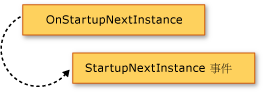

# Extending the Visual Basic Application Model
[!INCLUDE[vs2017banner](../../../visual-basic/includes/vs2017banner.md)]

您可以為應用程式模型加入一些功能，其方式是覆寫 <xref:Microsoft.VisualBasic.ApplicationServices.WindowsFormsApplicationBase> 類別的 `Overridable` 成員。  這個方法可讓您在應用程式啟動和關閉時，自訂應用程式模型的行為，並為您自己的方法加入呼叫。  
  
## 應用程式模型的視覺化概觀  
 這一節會在 Visual Basic 應用程式模型中以視覺化方式呈現函式呼叫的順序，  下一節則會詳述每一個函式的用途。  
  
 下圖將顯示一般 Visual Basic Windows Form 應用程式中的應用程式模型呼叫順序。  當 `Sub Main` 程序呼叫 <xref:Microsoft.VisualBasic.ApplicationServices.WindowsFormsApplicationBase.Run%2A> 方法時，即會啟動此順序。  
  
   
  
 Visual Basic 應用程式模型也提供 <xref:Microsoft.VisualBasic.ApplicationServices.WindowsFormsApplicationBase.StartupNextInstance> 及 <xref:Microsoft.VisualBasic.ApplicationServices.WindowsFormsApplicationBase.UnhandledException> 事件。  下圖將顯示引發這些事件的機制。  
  
   
  
   
  
## 覆寫基底方法  
 <xref:Microsoft.VisualBasic.ApplicationServices.WindowsFormsApplicationBase.Run%2A> 方法會定義 `Application` 方法執行的順序。  根據預設，Windows Form 應用程式的 `Sub Main` 程序會呼叫 <xref:Microsoft.VisualBasic.ApplicationServices.WindowsFormsApplicationBase.Run%2A> 方法。  
  
 如果應用程式是標準的應用程式 \(多個執行個體的應用程式\) 或是單一執行個體應用程式的第一個執行個體，則 <xref:Microsoft.VisualBasic.ApplicationServices.WindowsFormsApplicationBase.Run%2A> 方法會以下列順序執行 `Overridable` 方法：  
  
1.  <xref:Microsoft.VisualBasic.ApplicationServices.WindowsFormsApplicationBase.OnInitialize%2A>.  根據預設，這個方法會設定主應用程式執行緒的視覺化樣式、文字顯示樣式和目前主體 \(如果應用程式使用 Windows 驗證\)，並呼叫 `ShowSplashScreen` \(如果 `/nosplash` 和 `-nosplash` 都未用做命令列引數\)。  
  
     如果此函式會傳回 `False`，則表示應用程式啟動順序已取消。  如果有不應該執行應用程式的情況，此功能會很有用。  
  
     <xref:Microsoft.VisualBasic.ApplicationServices.WindowsFormsApplicationBase.OnInitialize%2A> 方法會呼叫下列方法：  
  
    1.  <xref:Microsoft.VisualBasic.ApplicationServices.WindowsFormsApplicationBase.ShowSplashScreen%2A>.  判斷應用程式是否有定義啟動顯示畫面，如果有，會在不同執行緒上顯示啟動顯示畫面。  
  
         <xref:Microsoft.VisualBasic.ApplicationServices.WindowsFormsApplicationBase.ShowSplashScreen%2A> 方法所包含的程式碼，會將啟動顯示畫面至少顯示 <xref:Microsoft.VisualBasic.ApplicationServices.WindowsFormsApplicationBase.MinimumSplashScreenDisplayTime%2A> 屬性所指定的毫秒數。  若要使用此功能，您必須使用 \[**專案設計工具**\] 將啟動顯示畫面加入至應用程式 \(並將 `My.Application.MinimumSplashScreenDisplayTime` 屬性設定為兩秒\)，或採用某種方法設定 `My.Application.MinimumSplashScreenDisplayTime` 屬性，以便覆寫 <xref:Microsoft.VisualBasic.ApplicationServices.WindowsFormsApplicationBase.OnInitialize%2A> 或 <xref:Microsoft.VisualBasic.ApplicationServices.WindowsFormsApplicationBase.OnCreateSplashScreen%2A> 方法。  如需詳細資訊，請參閱<xref:Microsoft.VisualBasic.ApplicationServices.WindowsFormsApplicationBase.MinimumSplashScreenDisplayTime%2A>。  
  
    2.  <xref:Microsoft.VisualBasic.ApplicationServices.WindowsFormsApplicationBase.OnCreateSplashScreen%2A>.  允許設計工具發出用於初始化啟動顯示畫面的程式碼。  
  
         根據預設，此方法不會執行任何動作。  如果您在 [!INCLUDE[vbprvb](../../../csharp/programming-guide/concepts/linq/includes/vbprvb-md.md)] \[**專案設計工具**\] 中選取應用程式的啟動顯示畫面，則設計工具會以將 <xref:Microsoft.VisualBasic.ApplicationServices.WindowsFormsApplicationBase.SplashScreen%2A> 屬性設為啟動顯示畫面表單新執行個體的方法，覆寫 <xref:Microsoft.VisualBasic.ApplicationServices.WindowsFormsApplicationBase.OnCreateSplashScreen%2A> 方法。  
  
2.  <xref:Microsoft.VisualBasic.ApplicationServices.WindowsFormsApplicationBase.OnStartup%2A>.  提供能引發 `Startup` 事件的擴充性項目。  如果此函式傳回 `False`，則應用程式啟動順序就會停止。  
  
     根據預設，此方法會引發 <xref:Microsoft.VisualBasic.ApplicationServices.WindowsFormsApplicationBase.Startup> 事件。  如果事件處理常式將事件引數的 <xref:System.ComponentModel.CancelEventArgs.Cancel%2A> 屬性設定為 `True`，則方法會傳回 `False`，以取消應用程式啟動。  
  
3.  <xref:Microsoft.VisualBasic.ApplicationServices.WindowsFormsApplicationBase.OnRun%2A>.  提供主要應用程式準備開始執行且已完成初始化的開始點。  
  
     根據預設，在它進入 Windows Forms 訊息迴圈之前，此方法會呼叫 `OnCreateMainForm` 方法 \(以建立應用程式的主要表單\) 和 `HideSplashScreen` 方法 \(以關閉啟動顯示畫面\)：  
  
    1.  <xref:Microsoft.VisualBasic.ApplicationServices.WindowsFormsApplicationBase.OnCreateMainForm%2A>.  提供設計工具發出用於初始化主要表單之程式碼的方法。  
  
         根據預設，此方法不會執行任何動作。  然而，當您在 [!INCLUDE[vbprvb](../../../csharp/programming-guide/concepts/linq/includes/vbprvb-md.md)] \[**專案設計工具**\] 中選取應用程式的主要表單時，設計工具會以將 <xref:Microsoft.VisualBasic.ApplicationServices.WindowsFormsApplicationBase.MainForm%2A> 屬性設為主要表單新執行個體的方法，覆寫 <xref:Microsoft.VisualBasic.ApplicationServices.WindowsFormsApplicationBase.OnCreateMainForm%2A> 方法。  
  
    2.  <xref:Microsoft.VisualBasic.ApplicationServices.WindowsFormsApplicationBase.HideSplashScreen%2A>.  如果應用程式已定義並開啟啟動顯示畫面，則此方法會關閉啟動顯示畫面。  
  
         根據預設，此方法會關閉啟動顯示畫面。  
  
4.  <xref:Microsoft.VisualBasic.ApplicationServices.WindowsFormsApplicationBase.OnStartupNextInstance%2A>.  當單一執行個體應用程式已啟動一個執行個體時，可以自訂此應用程式的行為方式。  
  
     根據預設，此方法會引發 <xref:Microsoft.VisualBasic.ApplicationServices.WindowsFormsApplicationBase.StartupNextInstance> 事件。  
  
5.  <xref:Microsoft.VisualBasic.ApplicationServices.WindowsFormsApplicationBase.OnShutdown%2A>.  提供能引發 `Shutdown` 事件的擴充性項目。  如果主應用程式中發生未處理的例外狀況，則不會執行此方法。  
  
     根據預設，此方法會引發 <xref:Microsoft.VisualBasic.ApplicationServices.WindowsFormsApplicationBase.Shutdown> 事件。  
  
6.  <xref:Microsoft.VisualBasic.ApplicationServices.WindowsFormsApplicationBase.OnUnhandledException%2A>.  如果以上列出的任何方法中發生未處理的例外狀況，便會執行此方法。  
  
     根據預設，只要未附加偵錯工具，而且應用程式正在處理 `UnhandledException` 事件，此方法就會引發 <xref:Microsoft.VisualBasic.ApplicationServices.WindowsFormsApplicationBase.UnhandledException> 事件。  
  
 如果應用程式是單一執行個體應用程式，並已開始執行，則後續的應用程式執行個體會呼叫原始應用程式執行個體上的 <xref:Microsoft.VisualBasic.ApplicationServices.WindowsFormsApplicationBase.OnStartupNextInstance%2A> 方法，然後結束。  
  
 <xref:Microsoft.VisualBasic.ApplicationServices.WindowsFormsApplicationBase> 建構函式會呼叫 <xref:Microsoft.VisualBasic.ApplicationServices.WindowsFormsApplicationBase.UseCompatibleTextRendering%2A> 屬性，以判斷要將哪一個文字呈現引擎用於應用程式的表單。  根據預設，<xref:Microsoft.VisualBasic.ApplicationServices.WindowsFormsApplicationBase.UseCompatibleTextRendering%2A> 屬性會傳回 `False`，表示應該要使用 GDI 文字呈現引擎 \(這是 [!INCLUDE[vbprvblong](../../../visual-basic/developing-apps/customizing-extending-my/includes/vbprvblong-md.md)] 中的預設值\)。  您可以覆寫 <xref:Microsoft.VisualBasic.ApplicationServices.WindowsFormsApplicationBase.UseCompatibleTextRendering%2A> 屬性來傳回 `True`，表示應該要使用 GDI\+ 文字呈現引擎 \(這是 Visual Basic .NET 2002 和 Visual Basic .NET 2003 中的預設值\)。  
  
## 設定應用程式  
 <xref:Microsoft.VisualBasic.ApplicationServices.WindowsFormsApplicationBase> 類別是 [!INCLUDE[vbprvb](../../../csharp/programming-guide/concepts/linq/includes/vbprvb-md.md)] 應用程式模型的一部分，會提供用於設定應用程式的保護 \(Protected\) 屬性。  這些屬性應該在實作類別的建構函式 \(Constructor\) 中加以設定。  
  
 在預設的 Windows Form 專案中，\[**專案設計工具**\] 會建立程式碼，並利用設計工具的設定，進行屬性的設定。  這些屬性只有在啟動應用程式時才會用到，在應用程式啟動之後設定屬性則不會有任何作用。  
  
||||  
|-|-|-|  
|屬性|判斷|設定在專案設計工具的窗格應用程式|  
|<xref:Microsoft.VisualBasic.ApplicationServices.WindowsFormsApplicationBase.IsSingleInstance%2A>|應用程式是以單一執行個體應用程式或是多個執行個體應用程式執行。|\[**建立單一執行個體應用程式**\] 核取方塊。|  
|<xref:Microsoft.VisualBasic.ApplicationServices.WindowsFormsApplicationBase.EnableVisualStyles%2A>|如果應用程式將使用符合 Windows XP 的視覺化樣式。|\[**啟用 XP 視覺化樣式**\] 核取方塊。|  
|<xref:Microsoft.VisualBasic.ApplicationServices.WindowsFormsApplicationBase.SaveMySettingsOnExit%2A>|應用程式是否會在結束時，自動儲存應用程式的使用者設定變更。|\[**程式關閉時儲存 My.Settings**\] 核取方塊。|  
|<xref:Microsoft.VisualBasic.ApplicationServices.WindowsFormsApplicationBase.ShutdownStyle%2A>|原因會造成應用程式結束，例如，當啟動表單關閉，或是最後一個表單關閉。|\[**程式關閉模式**\] 清單|  
  
## 請參閱  
 <xref:Microsoft.VisualBasic.ApplicationServices.ApplicationBase>   
 <xref:Microsoft.VisualBasic.ApplicationServices.WindowsFormsApplicationBase.Startup>   
 <xref:Microsoft.VisualBasic.ApplicationServices.WindowsFormsApplicationBase.StartupNextInstance>   
 <xref:Microsoft.VisualBasic.ApplicationServices.WindowsFormsApplicationBase.UnhandledException>   
 <xref:Microsoft.VisualBasic.ApplicationServices.WindowsFormsApplicationBase.Shutdown>   
 <xref:Microsoft.VisualBasic.ApplicationServices.WindowsFormsApplicationBase.NetworkAvailabilityChanged>   
 <xref:Microsoft.VisualBasic.ApplicationServices.WindowsFormsApplicationBase>   
 [Overview of the Visual Basic Application Model](../../../visual-basic/developing-apps/development-with-my/overview-of-the-visual-basic-application-model.md)   
 [應用程式頁面，專案設計工具 \(Visual Basic\)](/visual-studio/ide/reference/application-page-project-designer-visual-basic)