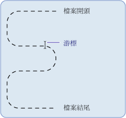

# .NET Framework 檔案 I/O 和檔案系統基本概念 (Visual Basic)
<xref:System.IO> 命名空間中的類別是用來處理磁碟機、檔案和目錄。  
  
 <xref:System.IO> 命名空間包含 <xref:System.IO.File> 和 <xref:System.IO.Directory> 類別，以提供管理檔案和目錄的 [!INCLUDE[dnprdnshort](~/includes/dnprdnshort-md.md)] 功能。 因為這些物件的方法是靜態或共用成員，所以您可以直接使用它們，而不需要先建立類別的執行個體。 這些類別是與 <xref:System.IO.FileInfo> 和 <xref:System.IO.DirectoryInfo> 類別相關聯，對 `My` 功能的使用者而言這應該十分熟悉。 若要使用這些類別，您必須完整限定名稱，或在受影響程式碼的開頭包含 `Imports` 陳述式來匯入適當的命名空間。 如需詳細資訊，請參閱 [Imports 陳述式 (.NET 命名空間和類型)](../../../../visual-basic/language-reference/statements/imports-statement-net-namespace-and-type.md)。  
  
> [!NOTE]
>  本節中的其他主題使用 `My.Computer.FileSystem` 物件，而非處理磁碟機、檔案和目錄的 `System.IO` 類別。 `My.Computer.FileSystem` 物件主要用於 Visual Basic 程式。 `System.IO` 類別是要用於任何支援 [!INCLUDE[dnprdnshort](~/includes/dnprdnshort-md.md)] 的語言 (包括 Visual Basic)。  
  
## 資料流的定義  
 [!INCLUDE[dnprdnshort](~/includes/dnprdnshort-md.md)] 使用資料流來支援讀取和寫入檔案。 您可以將資料流視為一組包含開始和結束的一維連續資料，而資料指標表示目前在資料流中的位置。  
  
   
  
## 資料流作業  
 資料流中所包含的資料可能來自記憶體、檔案或 TCP/IP 通訊端。 資料流具有可套用至它們的基本作業︰  
  
-   讀取。 您可以讀取資料流，方法是將資料從資料流傳送至資料結構 (例如字串或位元組陣列)。  
  
-   **撰寫**。 將資料從資料來源傳送至資料流，即可寫入資料流。  
  
-   **搜尋**。 您可以查詢和修改您在資料流中的位置。  
  
 如需詳細資訊，請參閱 [Composing Streams](../../../../standard/io/composing-streams.md)。  
  
## 資料流類型  
 在 [!INCLUDE[dnprdnshort](~/includes/dnprdnshort-md.md)] 中，資料流是透過 <xref:System.IO.Stream> 類別呈現，以構成所有其他資料流的抽象類別。 您無法直接建立 <xref:System.IO.Stream> 類別執行個體，但必須使用它所實作的其中一個類別。  
  
 有許多類型的資料流，但若要使用檔案輸入/輸出 (I/O)，最重要的類型是可讀取和寫入檔案的 <xref:System.IO.FileStream> 類別，以及可在隔離儲存體中建立檔案和目錄的 <xref:System.IO.IsolatedStorage.IsolatedStorageFileStream> 類別。 可以在使用檔案 I/O 時使用的其他資料流包括︰  
  
-   <xref:System.IO.BufferedStream>  
  
-   <xref:System.Security.Cryptography.CryptoStream>  
  
-   <xref:System.IO.MemoryStream>  
  
-   <xref:System.Net.Sockets.NetworkStream>.  
  
 下表列出一般會使用資料流來完成的工作︰  
  
|以|請參閱|
|---|---|   
|讀取和寫入資料檔案|[如何：讀取和寫入新建立的資料檔案](../../../../standard/io/how-to-read-and-write-to-a-newly-created-data-file.md)|  
|讀取檔案中的文字|[如何：從檔案讀取文字](../../../../standard/io/how-to-read-text-from-a-file.md)|  
|將文字寫入檔案中|[如何：將文字寫入檔案](../../../../standard/io/how-to-write-text-to-a-file.md)|  
|讀取字串中的字元|[如何：從字串中讀取字元](../../../../standard/io/how-to-read-characters-from-a-string.md)|  
|將字元寫入字串中|[如何：將字元寫入至字串](../../../../standard/io/how-to-write-characters-to-a-string.md)|  
|加密資料|[加密資料](../../../../standard/security/encrypting-data.md)|  
|解密資料|[解密資料](../../../../standard/security/decrypting-data.md)|  
  
## 檔案存取和屬性  
 您可以控制如何建立檔案、如何開啟檔案，以及如何與 <xref:System.IO.FileAccess>、<xref:System.IO.FileMode> 和 <xref:System.IO.FileShare> 列舉共用，而列舉包含 <xref:System.IO.FileStream> 類別的建構函式所使用的旗標。 例如，當您開啟或建立新 <xref:System.IO.FileStream> 時，<xref:System.IO.FileMode> 列舉可讓您指定是否開啟檔案以進行附加、是否在指定的檔案不存在時建立新檔案、是否覆寫檔案等等。  
  
 <xref:System.IO.FileAttributes> 列舉類型可收集檔案特定資訊。 <xref:System.IO.FileAttributes> 列舉會傳回檔案的預存屬性，例如是否壓縮、加密、隱藏、唯讀、封存、目錄、系統檔案或暫存檔案。  
  
 下表列出與檔案存取和檔案屬性有關的工作︰  
  
|以|請參閱|  
|---|---|
|開啟文字並將其附加至記錄檔|[如何：開啟並附加至記錄檔](../../../../standard/io/how-to-open-and-append-to-a-log-file.md)|  
|判斷檔案的屬性|<xref:System.IO.FileAttributes>|  
  
## 檔案權限  
 使用 <xref:System.Security.Permissions.FileIOPermission> 類別可以控制檔案和目錄的存取。 對於處理 Web Form (預設在名為 ASPNET 的特殊本機使用者帳戶內容內執行，而此帳戶是建立為 [!INCLUDE[vstecasp](~/includes/vstecasp-md.md)] 和 [!INCLUDE[dnprdnshort](~/includes/dnprdnshort-md.md)] 安裝的一部分) 的開發人員，則這可能特別重要。 當這類應用程式要求存取資源時，ASPNET 使用者帳戶會具有有限的權限，這樣可能會讓使用者無法執行從 Web 應用程式寫入檔案這類動作。 如需詳細資訊，請參閱<xref:System.Security.Permissions.FileIOPermission>。  
  
## 隔離檔案儲存區  
 隔離儲存區是嘗試解決處理使用者或程式碼可能缺乏必要權限的檔案時所產生的問題。 隔離儲存區會將資料區間指派給每位使用者，以保留一或多個存放區。 存放區可以依使用者和組件彼此隔離。 只有建立存放區的使用者和組件才能存取存放區。 存放區是完整虛擬檔案系統；您可以在一個存放區內建立和管理目錄與檔案。  
  
 下表列出一般與隔離檔案儲存區相關聯的工作。  
  
|以|請參閱|
|---|---|  
|建立隔離存放區|[操作說明：取得隔離儲存區的存放區](../../../../standard/io/how-to-obtain-stores-for-isolated-storage.md)|  
|列舉隔離存放區|[操作說明：列舉隔離儲存區的存放區](../../../../standard/io/how-to-enumerate-stores-for-isolated-storage.md)|  
|刪除隔離存放區|[如何：刪除隔離儲存區中的存放區](../../../../standard/io/how-to-delete-stores-in-isolated-storage.md)|  
|在隔離儲存區中建立檔案或目錄|[操作說明：在隔離儲存區中建立檔案和目錄](../../../../standard/io/how-to-create-files-and-directories-in-isolated-storage.md)|  
|在隔離儲存區中尋找檔案|[操作說明：尋找隔離儲存區中的現有檔案和目錄](../../../../standard/io/how-to-find-existing-files-and-directories-in-isolated-storage.md)|  
|讀取或寫入隔離儲存區中的檔案|[操作說明：讀取和寫入隔離儲存區中的檔案](../../../../standard/io/how-to-read-and-write-to-files-in-isolated-storage.md)|  
|刪除隔離儲存區中的檔案或目錄|[操作說明：刪除隔離儲存區中的檔案和目錄](../../../../standard/io/how-to-delete-files-and-directories-in-isolated-storage.md)|  
  
## 檔案事件  
 <xref:System.IO.FileSystemWatcher> 元件可讓您監看系統或任何具有網路存取之電腦上的檔案和目錄變更。 例如，如果修改檔案，您可能要將已進行變更的警示傳送給使用者。 發生變更時，會引發一或多個事件、將其儲存在緩衝區中，並且交給 <xref:System.IO.FileSystemWatcher> 元件進行處理。  
  
## 請參閱  
 [撰寫資料流](../../../../standard/io/composing-streams.md)  
 [檔案和資料流 I/O](../../../../standard/io/index.md)  
 [非同步檔案 I/O](../../../../standard/io/asynchronous-file-i-o.md)  
 [用於 .NET Framework 檔案 I/O 和檔案系統的類別 (Visual Basic)](../../../../visual-basic/developing-apps/programming/drives-directories-files/classes-used-in-net-framework-file-io-and-the-file-system.md)
