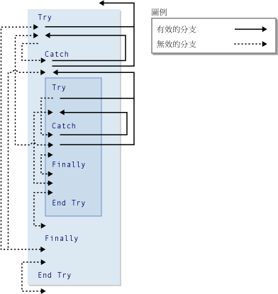

# GoTo Statement
[!INCLUDE[vs2017banner](../../../visual-basic/includes/vs2017banner.md)]

無條件將程式分支到程序中指定的一行程式。  
  
## 語法  
  
```  
GoTo line  
```  
  
## 組件  
 `line`  
 必要項。  任何程式行標籤 \(Label\)。  
  
## 備註  
 `GoTo` 陳述式只能將程式分支到所在程序內的程式行。  該程式行必須具有程式行標籤，以供 `GoTo` 參考。  如需詳細資訊，請參閱 [How to: Label Statements](../../../visual-basic/programming-guide/program-structure/how-to-label-statements.md)。  
  
> [!NOTE]
>  `GoTo` 陳述式會使他人難以閱讀及維護您的程式碼。  如果可能，請使用控制結構。  如需詳細資訊，請參閱 [Control Flow](../../../visual-basic/programming-guide/language-features/control-flow/index.md)。  
  
 您無法使用 `GoTo` 陳述式，將程式從 `For`...`Next`、`For Each`...`Next`、`SyncLock`...`End SyncLock`、`Try`...`Catch`...`Finally`、`With`...`End With` 或 `Using`...`End Using` 語法結構以外的位置分支到語法結構內的標籤。  
  
## 分支和 Try 語法結構  
 在 `Try`...`Catch`...`Finally` 語法結構內，使用 `GoTo` 陳述式進行分支適用於下列規則。  
  
|區塊或區域|由外往內分支|由內往外分支|  
|-----------|------------|------------|  
|`Try` 區塊|只能從同一語法結構的 `Catch` 區塊分支進來 <sup>1</sup>|只能分支到整個語法結構以外|  
|`Catch` 區塊|絕不允許|只能分支到整個語法結構以外，或是分支到同一語法結構的 `Try` 區塊 <sup>1</sup>|  
|`Finally` 區塊|絕不允許|絕不允許|  
  
 <sup>1</sup> 若某個 `Try`...`Catch`...`Finally` 語法結構內嵌於其他的語法結構內，則 `Catch` 區塊可以分支到本身巢狀層次的 `Try` 區塊，但不能分支到其他的 `Try` 區塊。  內層的巢狀 `Try`...`Catch`...`Finally` 語法結構，必須完全包含在外層語法結構的 `Try` 或 `Catch` 區塊內。  
  
 下圖會顯示巢狀於其他語法結構內的 `Try` 語法結構。  這兩個語法結構區塊之間的各種分支會標示為有效或無效。  
  
   
Try 語法結構的有效和無效分支  
  
## 範例  
 下列範例會使用 `GoTo` 陳述式，將程式分支到程序內的程式行標籤。  
  
 [!code-vb[VbVbalrStatements#31](../../../visual-basic/language-reference/error-messages/codesnippet/visualbasic/goto-statement_1.vb)]  
  
## 請參閱  
 [Do...Loop Statement](../../../visual-basic/language-reference/statements/do-loop-statement.md)   
 [For...Next 陳述式](../../../visual-basic/language-reference/statements/for-next-statement.md)   
 [For Each...Next 陳述式](../../../visual-basic/language-reference/statements/for-each-next-statement.md)   
 [If...Then...Else Statement](../../../visual-basic/language-reference/statements/if-then-else-statement.md)   
 [Select...Case Statement](../../../visual-basic/language-reference/statements/select-case-statement.md)   
 [Try...Catch...Finally Statement](../../../visual-basic/language-reference/statements/try-catch-finally-statement.md)   
 [While...End While Statement](../../../visual-basic/language-reference/statements/while-end-while-statement.md)   
 [With...End With Statement](../../../visual-basic/language-reference/statements/with-end-with-statement.md)