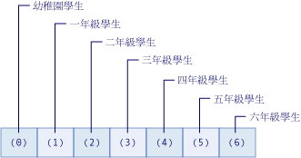

# Visual Basic 中的陣列
[!INCLUDE[vs2017banner](../../../../csharp/includes/vs2017banner.md)]

「陣列」是一組值，這些值在邏輯上彼此相關，就像文法學校中，各年級的學生總數一樣。  如果您在尋找 Visual Basic for Applications \(VBA\) 陣列的說明，請參閱[語言參考](https://msdn.microsoft.com/en-us/library/office/gg264383\(v=office.14\).aspx)。  
  
 藉由使用陣列，您可以透過相同名稱參考這些相關值，並使用稱為索引或註標的數字來加以區分。 這些個別值稱為陣列的項目。 它們是從索引 0 到最高索引值的連續值。  
  
 相對於陣列，包含單一值的變數稱為*「純量」\(Scalar\)* 變數。  
  
 開始說明前，先提供一些簡單的範例：  
  
```vb  
  
'Declare a single-dimension array of 5 values Dim numbers(4) As Integer ‘Declare a single-dimension array and set array element values Dim numbers = New Integer() {1, 2, 4, 8} ‘Redefine the size of an existing array retaining the current values ReDim Preserve numbers(15) ‘Redefine the size of an existing array, resetting the values ReDim numbers(15) ‘Declare a multi-dimensional array Dim matrix(5, 5) As Double ‘Declare a multi-dimensional array and set array element values Dim matrix = New Integer(4, 4) {{1, 2}, {3, 4}, {5, 6}, {7, 8}} ‘Declare a jagged array Dim sales()() As Double = New Double(11)() {}  
```  
  
 **本主題內容**  
  
-   [簡單陣列中的陣列項目](#BKMK_ArrayElements)  
  
-   [建立陣列](#BKMK_CreatingAnArray)  
  
-   [在陣列中儲存值](#BKMK_StoringValues)  
  
-   [在陣列填入初始值](#BKMK_Populating)  
  
    -   [巢狀陣列常值](#BKMK_NestedArrayLiterals)  
  
-   [逐一查看陣列](#BKMK_Iterating)  
  
-   [做為傳回值和參數的陣列](#BKMK_ReturnValues)  
  
-   [不規則陣列](#BKMK_JaggedArrays)  
  
-   [長度為零的陣列](#BKMK_ZeroLength)  
  
-   [陣列大小](#BKMK_ArraySize)  
  
-   [陣列類型及其他類型](#BKMK_ArrayTypes)  
  
-   [使用集合取代陣列](#BKMK_Collections)  
  
##  <a name="BKMK_ArrayElements"></a> 簡單陣列中的陣列項目  
 下列範例宣告含有文法學校中每一年級學生數目的陣列變數。  
  
 [!code-vb[VbVbalrArrays#2](../../../../visual-basic/programming-guide/language-features/arrays/codesnippet/VisualBasic/index_1.vb)]  
  
 前述範例中的陣列 `students` 包含了七個項目。 項目的索引範圍從 0 到 6。 建立此陣列較宣告七個不同的變數來得簡單。  
  
 下圖顯示陣列 `students`。 對於陣列的每一項目︰  
  
-   項目的索引代表年級 \(索引 0 代表幼稚園\)。  
  
-   項目包含的值代表該年級的學生數目。  
  
   
"students" 陣列的項目  
  
 下列範例說明參考陣列 `students` 第一、第二和最後一個項目的方法。  
  
 [!code-vb[VbVbalrArrays#3](../../../../visual-basic/programming-guide/language-features/arrays/codesnippet/VisualBasic/index_2.vb)]  
  
 您可以只使用沒有索引的陣列變數名稱，用來當做整個陣列的參考。  
  
 前述範例中的陣列 `students` 使用了一個索引，所以是一維陣列。 使用一個以上的索引或註標則稱為多維。 如需詳細資訊，請參閱本主題和 [Array Dimensions in Visual Basic](../../../../visual-basic/programming-guide/language-features/arrays/array-dimensions.md)中的其他部分。  
  
##  <a name="BKMK_CreatingAnArray"></a> 建立陣列  
 您可以使用數種方式來定義陣列的大小。 您可以在宣告陣列時提供大小，如下列範例所示。  
  
 [!code-vb[VbVbalrArrays#12](../../../../visual-basic/programming-guide/language-features/arrays/codesnippet/VisualBasic/index_3.vb)]  
  
 您也可以在建立陣列時使用 `New` 子句提供陣列大小，如下列範例所示。  
  
 [!code-vb[VbVbalrArrays#11](../../../../visual-basic/programming-guide/language-features/arrays/codesnippet/VisualBasic/index_4.vb)]  
  
 如果您有現有的陣列，便可以使用 `Redim` 陣述式來重新定義其大小。 您可以指定 `Redim` 陳述式應保留陣列中的值，也可以指定建立空的新陣列。 下列範例顯示 `Redim` 陳述式的不同使用方法，以修改現有陣列的大小。  
  
 [!code-vb[VbVbalrArrays#13](../../../../visual-basic/programming-guide/language-features/arrays/codesnippet/VisualBasic/index_5.vb)]  
  
 如需詳細資訊，請參閱 [ReDim Statement](../../../../visual-basic/language-reference/statements/redim-statement.md)。  
  
##  <a name="BKMK_StoringValues"></a> 在陣列中儲存值  
 您可以使用類型為 `Integer` 的索引來存取陣列中的每一個位置。 使用括弧內的陣列索引即可參照各陣列的位置，從而儲存並擷取陣列中的值。 多維陣列的索引以逗號 \(,\) 分隔。 各個陣列維度皆需一個索引。 下列範例顯示一些將值儲存在陣列中的陳述式。  
  
 [!code-vb[VbVbalrArrays#5](../../../../visual-basic/programming-guide/language-features/arrays/codesnippet/VisualBasic/index_6.vb)]  
  
 下列範例顯示一些從陣列中取得值的陳述式。  
  
 [!code-vb[VbVbalrArrays#6](../../../../visual-basic/programming-guide/language-features/arrays/codesnippet/VisualBasic/index_7.vb)]  
  
##  <a name="BKMK_Populating"></a> 在陣列填入初始值  
 您可以使用陣列常值來建立含有一組初始值的陣列。 陣列常值由大括弧 \(`{}`\) 括住的逗點分隔值清單構成。  
  
 當您使用陣列常值來建立陣列時，可以提供陣列類型，或者使用類型推斷來判別陣列類型。 下列程式碼顯示這兩種選項。  
  
 [!code-vb[VbVbalrCollectionInitializers#3](../../../../visual-basic/programming-guide/language-features/collection-initializers/codesnippet/VisualBasic/index_8.vb)]  
  
 使用類型推斷時，陣列的類型是由提供當做陣列常值之值清單中的主類型決定。 在陣列常值中，只有主類型是其他類型皆可擴展而成的類型。 如果無法決定此唯一類型，則主類型將成為陣列中其他類型皆可縮小而成的唯一類型。 如果這些類型皆無法決定，則主類型為 `Object`。 例如，如果提供給陣列常值的值清單含有類型值 `Integer`、`Long` 和 `Double`，則結果陣列的類型是 `Double`。`Integer` 和 `Long` 都只會擴展為 `Double`。 因此，`Double` 是主類型。 如需詳細資訊，請參閱[Widening and Narrowing Conversions](../../../../visual-basic/programming-guide/language-features/data-types/widening-and-narrowing-conversions.md)。 這些推斷規則適用於針對類別成員中定義之陣列 \(即區域變數\) 進行的類型推斷。 雖然您可以在建立類別層級的變數時使用陣列常值，但無法在該類別層級使用類型推斷。 因此，在類別層級指定的陣列常值，會將提供當做陣列常值之值的類型推斷為 `Object`。  
  
 您可以明確指定使用陣列常值建立之陣列的項目類型。 在這種情況下，陣列常值中的值必須擴展為陣列項目類型。 下列程式碼範例將從整數清單建立類型為 `Double` 的陣列。  
  
 [!code-vb[VbVbalrCollectionInitializers#4](../../../../visual-basic/programming-guide/language-features/collection-initializers/codesnippet/VisualBasic/index_9.vb)]  
  
###  <a name="BKMK_NestedArrayLiterals"></a> 巢狀陣列常值  
 您可以使用巢狀陣列常值來建立多維陣列。 巢狀陣列常值必須具有維度與稱為「順位」\(Rank\) 的維度數目，該維度數目必須和結果陣列一致。 下列程式碼範例將使用陣列常值建立整數的二維陣列。  
  
 [!code-vb[VbVbalrCollectionInitializers#7](../../../../visual-basic/programming-guide/language-features/collection-initializers/codesnippet/VisualBasic/index_10.vb)]  
  
 在前面範例中，如果巢狀陣列常值中的項目數量不一致，將會發生錯誤。 如果陣列變數明確宣告為非二維，也會發生錯誤。  
  
> [!NOTE]
>  您可以在提供不同維度之巢狀陣列常值時，使用括弧括住內部陣列常值來避免錯誤。  括弧將強制評估陣列常值運算式，結果值則用於外部陣列常值，如下列程式碼所示。  
  
 [!code-vb[VbVbalrCollectionInitializers#11](../../../../visual-basic/programming-guide/language-features/collection-initializers/codesnippet/VisualBasic/index_11.vb)]  
  
 使用巢狀陣列常值來建立多維陣列時，可以使用類型推斷。  當您使用類型推斷時，推斷的類型是某個巢狀層次之所有陣列常值中所有值的主類型。 下列程式碼範例將從類型為 `Integer` 和 `Double` 的值建立類型為 `Double` 的二維陣列。  
  
 [!code-vb[VbVbalrCollectionInitializers#8](../../../../visual-basic/programming-guide/language-features/collection-initializers/codesnippet/VisualBasic/index_12.vb)]  
  
 如需其他範例，請參閱[How to: Initialize an Array Variable in Visual Basic](../../../../visual-basic/programming-guide/language-features/arrays/how-to-initialize-an-array-variable.md)。  
  
##  <a name="BKMK_Iterating"></a> 逐一查看陣列  
 當您逐一查看陣列時，您從最低的索引到最高的索引來存取陣列中的每個項目。  
  
 下列範例會使用 [For...Next 陳述式](../../../../visual-basic/language-reference/statements/for-next-statement.md) 逐一查看一維陣列。<xref:System.Array.GetUpperBound%2A> 方法會傳回索引可具有的最大值。 最小的索引值一律為 0。  
  
 [!code-vb[VbVbalrArrays#41](../../../../visual-basic/programming-guide/language-features/arrays/codesnippet/VisualBasic/index_13.vb)]  
  
 下列範例會使用 `For...Next` 逐一查看多維陣列。<xref:System.Array.GetUpperBound%2A> 方法具有可指定維度的參數。`GetUpperBound(0)` 會傳回第一個維度的最高索引值，而 `GetUpperBound(1)` 則傳回第二個維度的最高索引值。  
  
 [!code-vb[VbVbalrArrays#42](../../../../visual-basic/programming-guide/language-features/arrays/codesnippet/VisualBasic/index_14.vb)]  
  
 下列範例會使用 [For Each...Next 陳述式](../../../../visual-basic/language-reference/statements/for-each-next-statement.md) 逐一查看一維陣列。  
  
 [!code-vb[VbVbalrArrays#43](../../../../visual-basic/programming-guide/language-features/arrays/codesnippet/VisualBasic/index_15.vb)]  
  
 下列範例會使用 `For Each...Next` 逐一查看多維陣列。 不過，如果您使用巢狀 `For…Next` 陳述式 \(如上述範例\)，而不是 `For Each…Next` 陳述式，就能更充分控制多維陣列中的項目。  
  
 [!code-vb[VbVbalrArrays#44](../../../../visual-basic/programming-guide/language-features/arrays/codesnippet/VisualBasic/index_16.vb)]  
  
##  <a name="BKMK_ReturnValues"></a> 做為傳回值和參數的陣列  
 若要從 `Function` 程序傳回陣列，請將陣列資料類型和維度數目指定為 [Function Statement](../../../../visual-basic/language-reference/statements/function-statement.md) 的傳回類型。 在該函式內，使用相同的資料類型和維度數目來宣告區域陣列變數。 在 [Return Statement](../../../../visual-basic/language-reference/statements/return-statement.md) 中，加入沒有括弧的區域陣列變數。  
  
 若要將陣列指定為 `Sub` 程序或 `Function` 程序的參數，請為參數定義所指定的資料類型和維度數目。 在對程序的呼叫中，傳送具有相同資料類型和維數的陣列變數。  
  
 在下列範例中，`GetNumbers` 函式會傳回 `Integer()`。 這個陣列類型是類型 `Integer` 的一維陣列。`ShowNumbers` 程序接受 `Integer()` 引數。  
  
 [!code-vb[VbVbalrArrays#51](../../../../visual-basic/programming-guide/language-features/arrays/codesnippet/VisualBasic/index_17.vb)]  
  
 在下列範例中，`GetNumbersMultiDim` 函式會傳回 `Integer(,)`。 這個陣列類型是類型 `Integer` 的二維陣列。`ShowNumbersMultiDim` 程序接受 `Integer(,)` 引數。  
  
 [!code-vb[VbVbalrArrays#52](../../../../visual-basic/programming-guide/language-features/arrays/codesnippet/VisualBasic/index_18.vb)]  
  
##  <a name="BKMK_JaggedArrays"></a> 不規則陣列  
 將其他陣列當做項目的陣列，就是所謂的「陣列的陣列」或不規則陣列。 不規則陣列和不規則陣列中的每個項目都可以有一或多個維度。 有時候應用程式中的資料結構會是非矩形的二維陣列。  
  
 下列範例包含一個月份陣列，而該陣列的每個項目則是日期陣列。 由於不同月份的天數也不同，因此這些項目不會形成矩形的二維陣列。 因此使用不規則陣列，而非多維陣列。  
  
 [!code-vb[VbVbalrArrays#21](../../../../visual-basic/programming-guide/language-features/arrays/codesnippet/VisualBasic/index_19.vb)]  
  
##  <a name="BKMK_ZeroLength"></a> 長度為零的陣列  
 沒有任何項目的陣列也稱為長度為零的陣列。 含有長度為零之陣列的變數並不會具有 `Nothing` 值。 若要建立沒有項目的陣列，請將陣列的其中一個維度宣告為 \-1，如下列範例所示。  
  
 [!code-vb[VbVbalrArrays#14](../../../../visual-basic/programming-guide/language-features/arrays/codesnippet/VisualBasic/index_20.vb)]  
  
 在下列情況中，您可能需要建立長度為零的陣列：  
  
-   為了避免發生 <xref:System.NullReferenceException> 例外狀況，程式碼必須存取 <xref:System.Array> 類別的成員 \(例如 <xref:System.Array.Length%2A> 或 <xref:System.Array.Rank%2A>\)，或者呼叫 [!INCLUDE[vbprvb](../../../../csharp/programming-guide/concepts/linq/includes/vbprvb_md.md)] Basic 函式 \(例如 <xref:Microsoft.VisualBasic.Information.UBound%2A>\)。  
  
-   您希望不需檢查 `Nothing` \(以特殊情況處理\)，讓取用程式碼更簡單。  
  
-   程式碼會與應用程式開發介面互動，這個介面會要求您傳遞長度為零的陣列給一個或多個程序，或從一個或多個程序傳回長度為零的陣列。  
  
##  <a name="BKMK_ArraySize"></a> 陣列大小  
 陣列大小為其所有維度長度之乘積。 它代表目前包含於陣列中的項目總數。  
  
 下列範例宣告一個三維陣列︰  
  
```  
Dim prices(3, 4, 5) As Long  
```  
  
 變數 `prices` 中的陣列之整體大小為 \(3 \+ 1\) x \(4 \+ 1\) x \(5 \+ 1\) \= 120。  
  
 您可以使用 <xref:System.Array.Length%2A> 屬性來尋找陣列的大小。 您也可以使用 <xref:System.Array.GetLength%2A> 方法來尋找多維陣列中每一維的長度。  
  
 您可以指派新的陣列物件或者使用 `ReDim` 陳述式來調整陣列變數的大小。  
  
 處理陣列大小時，請注意幾點︰  
  
|||  
|-|-|  
|維度長度|每個維度的索引都以 0 為起點，也就是它的範圍是由 0 到它的上限為止。 因此，指定維度的長度會比該維度的宣告上限多 1。|  
|長度限制|每個陣列之維度長度都受限於 `Integer` 資料類型的最大值，也就是 \(2 ^ 31\) \- 1。 然而，陣列之總大小也同時受限於系統可用的記憶體。 若您試圖對總大小超過可用的 RAM 之陣列進行初始化，通用語言執行平台將擲回 <xref:System.OutOfMemoryException> 例外狀況。|  
|大小及項目大小|陣列大小與其項目的資料類型無關。 大小一律是指項目的總數，而不是它們於儲存體中所佔的位元組。|  
|記憶體消耗量|對陣列在記憶體中的儲存方式做任何假設都是不安全的。 儲存體會因不同資料寬度的平台而有差異，所以相同陣列於 64 位元系統上所佔記憶體將較 32 位元系統來的多。 當您初始化陣列時，隨著系統組態不同，通用語言執行平台 \(CLR\) 會指派儲存體盡可能將項目存放在一起，或是根據實體硬體界限全部加以調整。 同時，陣列需要耗用儲存體以供其控制資訊使用，此消耗量會隨著維度增加而增加。|  
  
##  <a name="BKMK_ArrayTypes"></a> 陣列類型及其他類型  
 每個陣列都具有其資料類型，但此資料類型不同於陣列項目的資料類型。 沒有任何單一的資料類型適用於所有的陣列。 陣列的類型反而是由陣列的維度數目，或稱為*「順位」*\(rank\) 以及陣列項目的資料類型所決定。 只要兩個陣列變數具有相同的順位且其項目具有相同的資料類型，就視為具有相同的資料類型。 陣列中維度的長度不會影響陣列的資料類型。  
  
 每個陣列繼承自 <xref:System.Array?displayProperty=fullName> 類別，且可將變數宣告為類型 `Array`，但您不能建立類型為 `Array` 的陣列。 同時，[ReDim Statement](../../../../visual-basic/language-reference/statements/redim-statement.md) 無法在類型宣告為 `Array` 的變數上運作。 由於這些原因及類型安全，建議您將每個陣列宣告為特定類型，如前述範例中的 `Integer`。  
  
 有幾個方法可以找出陣列或其項目的資料類型。  
  
-   您可以在變數上呼叫 <xref:System.Object.GetType%2A?displayProperty=fullName> 方法，以接收變數之執行階段類型的 <xref:System.Type> 物件。<xref:System.Type> 物件在其屬性和方法中保留了大量的資訊。  
  
-   您可以將變數傳遞給 <xref:Microsoft.VisualBasic.Information.TypeName%2A> 函式，以接收包含執行階段類型名稱的 `String`。  
  
-   您可以將變數傳遞給 <xref:Microsoft.VisualBasic.Information.VarType%2A> 函式，以接收表示變數類型類別的 `VariantType` 值。  
  
 下列範例呼叫 `TypeName` 函式來判斷陣列的類型以及陣列中項目的類型。 陣列類型為 `Integer(,)`，陣列中項目的類型為 `Integer`。  
  
 [!code-vb[VbVbalrArrays#15](../../../../visual-basic/programming-guide/language-features/arrays/codesnippet/VisualBasic/index_21.vb)]  
  
##  <a name="BKMK_Collections"></a> 使用集合取代陣列  
 陣列是最適用於建立和處理固定數目的強類型物件。 集合會提供較具彈性的方式來使用物件群組。 與陣列不同的是，您使用的物件群組可依程式變更的需要來動態增減。  
  
 如果必須變更陣列的大小，請務必使用 [ReDim Statement](../../../../visual-basic/language-reference/statements/redim-statement.md)。 當您這麼做時，[!INCLUDE[vbprvb](../../../../csharp/programming-guide/concepts/linq/includes/vbprvb_md.md)] 會建立新的陣列，並釋出先前的陣列以供處置， 這將佔用執行時間。 因此，如果您處理的項目數經常變更，或無法預測需要的最大項目數，您可以使用集合來達到較佳的效能。  
  
 對於某些集合，您可以將索引鍵值指派給您放入集合的任何物件，讓您可以藉由使用索引鍵快速擷取物件。  
  
 如果集合包含只有一個資料類型的項目，則可使用 <xref:System.Collections.Generic?displayProperty=fullName> 命名空間內的其中一個類別。  泛型集合會強制類型安全，如此就不會加入其他資料類型。 當您從泛型集合中擷取項目時，並不需要判斷其資料類型或將其轉換。  
  
 如需集合的詳細資訊，請參閱[集合](../Topic/Collections%20\(C%23%20and%20Visual%20Basic\).md)。  
  
### 範例  
 下列範例使用 [!INCLUDE[dnprdnshort](../../../../csharp/getting-started/includes/dnprdnshort_md.md)] 泛型類別 <xref:System.Collections.Generic.List%601?displayProperty=fullName> 來建立 `Customer` 物件的清單集合。  
  
 [!code-vb[VbVbalrArrays#1](../../../../visual-basic/programming-guide/language-features/arrays/codesnippet/VisualBasic/index_22.vb)]  
  
 `CustomerFile` 集合的宣告指定它僅可包含類型 `Customer` 的項目。 同時也提供 200 個項目的初始容量。 程序 `AddNewCustomer` 會檢查新項目是否有效，然後將它加入集合中。 程序 `PrintCustomers` 會使用 `For Each` 迴圈以便穿越集合並顯示項目。  
  
## 相關主題  
  
|詞彙|定義|  
|--------|--------|  
|[Array Dimensions in Visual Basic](../../../../visual-basic/programming-guide/language-features/arrays/array-dimensions.md)|說明陣列中的順位和維度。|  
|[How to: Initialize an Array Variable in Visual Basic](../../../../visual-basic/programming-guide/language-features/arrays/how-to-initialize-an-array-variable.md)|描述如何在陣列中填入初始值。|  
|[How to: Sort An Array in Visual Basic](../../../../visual-basic/programming-guide/language-features/arrays/how-to-sort-an-array.md)|示範如何依字母順序排列陣列中的項目。|  
|[How to: Assign One Array to Another Array](../../../../visual-basic/programming-guide/language-features/arrays/how-to-assign-one-array-to-another-array.md)|描述將陣列指派給另一個陣列變數的規則和步驟。|  
|[Troubleshooting Arrays](../../../../visual-basic/programming-guide/language-features/arrays/troubleshooting-arrays.md)|討論在使用陣列時會引發的一些常見問題。|  
  
## 請參閱  
 <xref:System.Array>   
 [Dim Statement](../../../../visual-basic/language-reference/statements/dim-statement.md)   
 [ReDim Statement](../../../../visual-basic/language-reference/statements/redim-statement.md)