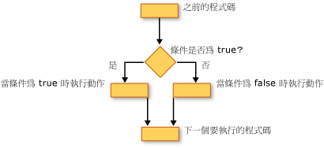

# 決策結構 (Visual Basic)
Visual Basic 可讓您測試條件，並執行不同的作業，根據該測試的結果。 您可以測試條件為 true 或 false，各種不同值的運算式，或當您執行一系列陳述式時，產生的各種例外狀況。  
  
 下圖顯示的決策結構測試條件為 true，而且會採用不同的動作，取決於它是否為 true 或 false。  
  
   
當條件為 true，而且當為 false 時，採取不同的動作  
  
## 如果...Then...其他建構  
 `If...Then...Else` 語法結構，可讓您測試一個或多個條件，並執行一或多個陳述式，根據每個條件。 您可以測試條件，並採取動作以下列方式：  
  
-   如果條件為，執行一或多個陳述式 `True`  
  
-   如果條件為，執行一或多個陳述式 `False`  
  
-   執行某些陳述式，如果條件為`True`和其他人是否 `False`  
  
-   如果先前的條件為，測試其他的條件 `False`  
  
 提供所有這些可能性的控制結構是[如果...Then...Else 陳述式](../../../../visual-basic/language-reference/statements/if-then-else-statement.md)。 如果您有一個測試和要執行一個陳述式，您可以使用單行版本。 如果您有一組更複雜的條件和動作，您可以使用多行版本。  
  
## 選取此項目...案例的建構  
 `Select...Case`建構可讓您評估運算式一次，並執行不同的陳述式，根據不同的可能值組。 如需詳細資訊，請參閱[選取...陳述式的大小寫](../../../../visual-basic/language-reference/statements/select-case-statement.md)。  
  
## 若要再試一次...Catch...最後建構  
 `Try...Catch...Finally` 語法結構，可讓您執行一組陳述式會保留控制項，如果陳述式的任何一個導致例外狀況的環境下。 您可以採取不同的動作不同例外狀況。 您可以選擇性地指定一段程式碼執行之前結束整個`Try...Catch...Finally`建構，不論發生的狀況。 如需詳細資訊，請參閱 [Try...Catch...Finally 陳述式](../../../../visual-basic/language-reference/statements/try-catch-finally-statement.md)。  
  
> [!NOTE]
>  許多控制項結構，當您按一下關鍵字，所有的結構中的關鍵字會反白顯示。 比方說，當您按一下`If`中`If...Then...Else`建構的所有執行個體`If`， `Then`， `ElseIf`， `Else`，和`End If`建構中會反白顯示。 若要移至下一頁或上一頁反白顯示關鍵字，請按 CTRL + SHIFT + 向下鍵或 CTRL + SHIFT + 向上鍵。  
  
## 另請參閱  
 [控制流程](../../../../visual-basic/programming-guide/language-features/control-flow/index.md)  
 [迴圈結構](../../../../visual-basic/programming-guide/language-features/control-flow/loop-structures.md)  
 [其他控制結構](../../../../visual-basic/programming-guide/language-features/control-flow/other-control-structures.md)  
 [巢狀控制結構](../../../../visual-basic/programming-guide/language-features/control-flow/nested-control-structures.md)  
 [If 運算子](../../../../visual-basic/language-reference/operators/if-operator.md)
