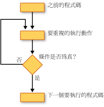

# 迴圈結構 (Visual Basic)
[!INCLUDE[vbprvb](../../../../csharp/programming-guide/concepts/linq/includes/vbprvb_md.md)]迴圈結構可讓您重複執行一或多行程式碼。 您可以重複迴圈結構中的陳述式，直到條件為`True`，直到條件為`False`、 在集合中指定的次數，或是過一次針對每個項目。  
  
 下圖顯示會執行一組陳述式，直到條件變成 true 迴圈結構。  
  
   
執行一組陳述式，直到條件變成 true  
  
## While 迴圈  
 The `While`...`End While`建構會執行一組陳述式中指定的條件為`While`陳述式是`True`。 如需詳細資訊，請參閱[時...While 陳述式結束](../../../../visual-basic/language-reference/statements/while-end-while-statement.md)。  
  
## Do 迴圈  
 The `Do`...`Loop`建構可讓您測試開頭或結尾的迴圈結構的條件。 您也可以指定是否要重複迴圈條件維持`True`或直到它變成`True`。 如需詳細資訊，請參閱[執行...迴圈陳述式](../../../../visual-basic/language-reference/statements/do-loop-statement.md)。  
  
## For 迴圈  
 The `For`...`Next`建構執行特定次數的迴圈。 它會使用迴圈控制變數，也稱為*計數器*，若要保留的次數。 您指定的開始和結束此計數器的值，您可以選擇性地指定，而增加時重複一次從到下一個量。 如需詳細資訊，請參閱[For...下一個陳述式](../../../../visual-basic/language-reference/statements/for-next-statement.md)。  
  
## For Each 迴圈  
 The `For Each`...`Next`建構集合中執行一組陳述式，針對每個項目執行一次。 您指定的迴圈控制變數，但您不需要決定開始或結束值。 如需詳細資訊，請參閱[每個...下一個陳述式](../../../../visual-basic/language-reference/statements/for-each-next-statement.md)。  
  
## 另請參閱  
 [控制流程](../../../../visual-basic/programming-guide/language-features/control-flow/index.md)   
 [決策結構](../../../../visual-basic/programming-guide/language-features/control-flow/decision-structures.md)   
 [其他控制結構](../../../../visual-basic/programming-guide/language-features/control-flow/other-control-structures.md)   
 [巢狀控制結構](../../../../visual-basic/programming-guide/language-features/control-flow/nested-control-structures.md)
