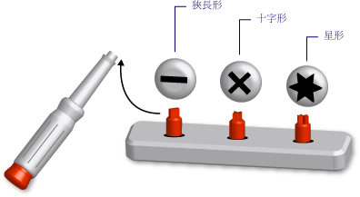

# Visual Basic 中的泛型類型 (Visual Basic)
*「泛型類型」* (generic type) 是單一程式設計項目，適用於為各種資料類型執行相同的功能。 當您定義泛型類別或程序時，不需要為想要執行該功能的每種資料類型定義不同的版本。  
  
 類似的項目是頭部可拆卸的螺絲起子組。 您可以檢查需要轉動的螺絲，並選取該螺絲的正確螺絲起子頭 (一字、十字、星形)。 將正確的螺絲起子頭插入螺絲起子握把之後，即可執行與螺絲起子完全相同的功能，即轉動螺絲。  
  
   
一組泛用螺絲起子工具組  
  
 當您定義泛型類型時，即使用一個或多個資料類型對其進行參數化。 這可讓您使用程式碼來調整資料類型，使其符合需求。 您的程式碼可以宣告泛型項目的數個不同程式設計項目，而且各代表一組不同的資料類型。 但是，宣告的項目不論使用何種資料類型，都會執行相同的邏輯。  
  
 例如，您可能想要建立和使用佇列類別，而這些佇列類別作用於特定資料類型 (如 `String`)。 您可以從這類類別宣告<xref:System.Collections.Generic.Queue%601?displayProperty=nameWithType>，如下列範例所示。  
  
 [!code-vb[VbVbalrDataTypes#1](../../../../visual-basic/language-reference/data-types/codesnippet/VisualBasic/generic-types_1.vb)]  
  
 您現在可以使用 `stringQ` ，以獨佔方式使用 `String` 值。 因為 `stringQ` 是 `String` 特有的，而不是通用於 `Object` 值，所以您沒有晚期繫結或類型轉換。 這可以節省執行時間，並減少執行階段錯誤。  
  
 如需使用泛型類型的詳細資訊，請參閱 [How to: Use a Generic Class](../../../../visual-basic/programming-guide/language-features/data-types/how-to-use-a-generic-class.md)。  
  
## 泛型類別範例  
 下列範例顯示泛型類別的基本架構定義。  
  
 [!code-vb[VbVbalrDataTypes#2](../../../../visual-basic/language-reference/data-types/codesnippet/VisualBasic/generic-types_2.vb)]  
  
 在上述的基本架構中， `t` 是 *「類型參數」*(type parameter)，即宣告類別時所提供資料類型的預留位置。 您可以在程式碼的其他位置，提供 `classHolder` 的各種資料類型來宣告各種版本的 `t`。 下列範例顯示兩個這類宣告。  
  
 [!code-vb[VbVbalrDataTypes#3](../../../../visual-basic/language-reference/data-types/codesnippet/VisualBasic/generic-types_3.vb)]  
  
 先前的陳述式宣告 *「已建構類別」*(constructed class)，其中，特定類型會取代類型參數。 這項取代遍及已建構類別內的程式碼。 下列範例顯示 `processNewItem` 程序在 `integerClass`中的外觀。  
  
 [!code-vb[VbVbalrDataTypes#4](../../../../visual-basic/language-reference/data-types/codesnippet/VisualBasic/generic-types_4.vb)]  
  
 如需更完整的範例，請參閱[How to： 在不同的資料類型上定義類別，可以提供相同功能](../../../../visual-basic/programming-guide/language-features/data-types/how-to-define-a-class-that-can-provide-identical-functionality.md)。  
  
## 合格的程式設計項目  
 您可以定義和使用泛型類別、結構、介面、程序和委派。 請注意， [!INCLUDE[dnprdnshort](~/includes/dnprdnshort-md.md)] 定義數個泛型類別、結構和介面來代表常用的泛型項目。 <xref:System.Collections.Generic?displayProperty=nameWithType>命名空間提供字典、 清單、 佇列和堆疊。 然後再定義您自己的泛型項目，請參閱是否它是已經用於<xref:System.Collections.Generic?displayProperty=nameWithType>。  
  
 程序不是類型，但您可以定義和使用泛型程序。 請參閱 [Generic Procedures in Visual Basic](../../../../visual-basic/programming-guide/language-features/data-types/generic-procedures.md)。  
  
## 泛型類型的優點  
 泛型類型是宣告數個不同程式設計項目的基礎，而這些項目各作用於特定資料類型。 泛型類型的替代項目是：  
  
1.  作用於 `Object` 資料類型的單一類型。  
  
2.  類型的一組 *「類型專用」* (type-specific) 版本，每個版本都會分別進行編碼，並作用於一種特定資料類型 (例如 `String`)、 `Integer`或使用者定義的類型 (例如 `customer`)。  
  
 泛型類型優於這些替代項目的優點如下：  
  
-   **類型安全。** 泛型類型會強制執行編譯階段類型檢查。 以 `Object` 為基礎的類型會接受任何資料類型，而且您必須撰寫程式碼來檢查是否可以接受輸入資料類型。 使用泛型類型，編譯器可以在執行階段之前捕捉類型不符。  
  
-   **效能。** 泛型類型不需要 *Box* 和 *Unbox* 資料，因為每種泛型類型都是一種資料類型特有的。 以 `Object` 為基礎的作業必須對輸入資料類型進行 Box 處理以將它們轉換成 `Object` ，並對要進行輸出的資料進行 Unbox 處理。 Box 和 Unbox 處理會降低效能。  
  
     以 `Object` 為基礎的類型也會進行晚期繫結，這表示在執行階段時存取其成員需要額外撰寫程式碼。 這也會降低效能。  
  
-   **程式碼合併。** 泛型類型中的程式碼僅需要定義一次。 類型的一組類型專用版本必須在每個版本中複寫相同的程式碼，唯一的差異在於為該版本的特定資料類型。 使用泛型類型，類型專用版本都是產生自原始泛型類型。  
  
-   **程式碼重複使用。** 如果未依賴特定資料類型的程式碼是泛型，則可以與各種資料類型一起重複使用。 您甚至可以經常將它與您原先未預期的資料類型一起重複使用。  
  
-   **IDE 支援。** 當您使用從泛型類型宣告的已建構類型時，整合式開發環境 (IDE) 可在您開發程式碼時提供更多的支援。 例如，IntelliSense 可以顯示建構函式或方法引數的類型專用選項。  
  
-   **泛型演算法。** 與類型無關的抽象演算法適用於泛型類型。 例如，使用 <xref:System.IComparable> 介面排序項目的泛型程序，可以與任何實作 <xref:System.IComparable>的資料類型搭配使用。  
  
## 條件約束  
 雖然泛型類型定義中的程式碼應該盡可能與類型無關，但是您可能需要要求提供給泛型類型之任何資料類型的特定功能。 例如，如果您基於排序或定序而想要比較兩個項目，則其資料類型必須實作 <xref:System.IComparable> 介面。 您可以將 *「條件約束」* (constraint) 加入類型參數中，來強制執行這項需求。  
  
### 條件約束範例  
 下列範例顯示條件約束需要有類型引數才能實作 <xref:System.IComparable>之類別的基本架構定義。  
  
 [!code-vb[VbVbalrDataTypes#5](../../../../visual-basic/language-reference/data-types/codesnippet/VisualBasic/generic-types_5.vb)]  
  
 如果後續程式碼嘗試從提供未實作 `itemManager` 之類型的 <xref:System.IComparable>來建構類別，則編譯器會發出發生錯誤訊號。  
  
### 條件約束類型  
 您的條件約束可以利用任意組合指定下列需求：  
  
-   類型引數必須實作一或多個介面  
  
-   類型引數最多只能是一個類別的類型，或繼承自一個類別  
  
-   類型引數必須公開從中建立物件之程式碼可存取的無參數建構函式  
  
-   類型引數必須是 *「參考類型」*(reference type)，或必須是 *「實值類型」*(value type)  
  
 如果您需要多個需求，請在大括弧 ( *) 內使用逗號分隔的* 「條件約束清單」`{ }`(constraint list)。 若要要求存取的建構函式，包括[New 運算子](../../../../visual-basic/language-reference/operators/new-operator.md)清單中的關鍵字。 若需要參考類型，請包括 `Class` 關鍵字；若需要實值類型，請包括 `Structure` 關鍵字。  
  
 如需條件約束的詳細資訊，請參閱 [Type List](../../../../visual-basic/language-reference/statements/type-list.md)。  
  
### 多個條件約束範例  
 下列範例顯示類型參數上具有條件約束清單之泛型類別的基本架構定義。 在建立這個類別之執行個體的程式碼中，類型引數必須同時實作 <xref:System.IComparable> 和 <xref:System.IDisposable> 介面、為參考類型，並且公開可存取的無參數建構函式。  
  
 [!code-vb[VbVbalrDataTypes#6](../../../../visual-basic/language-reference/data-types/codesnippet/VisualBasic/generic-types_6.vb)]  
  
## 重要詞彙  
 泛型類型引進並使用下列詞彙：  
  
-   *「泛型類型」*(Generic Type)。 在您宣告時至少提供一種資料類型之類別、結構、介面、程序或委派的定義。  
  
-   *「類型參數」*(Type Parameter)。 在泛型類型定義中，這是您在宣告類型時所提供之資料類型的預留位置。  
  
-   *「類型引數」*(Type Argument)。 一種特定資料類型，會在您從泛型類型宣告已建構類型時取代類型參數。  
  
-   *「條件約束」*(Constraint)。 類型參數上限制您可以為其提供類型引數的條件。 條件約束可以要求的類型引數必須實作特定介面、為特定類別或繼承自特定類別、具有可存取的無參數建構函式，或者為參考類型或實值類型。 您可以合併這些條件約束，但最多只能指定一個類別。  
  
-   *「已建構類型」*(Constructed Type)。 透過提供其類型參數的類型引數，以從泛型類型宣告的類別、結構、介面、程序或委派。  
  
## 另請參閱  
 [資料類型](../../../../visual-basic/programming-guide/language-features/data-types/index.md)  
 [類型字元](../../../../visual-basic/programming-guide/language-features/data-types/type-characters.md)  
 [值類型和參考類型](../../../../visual-basic/programming-guide/language-features/data-types/value-types-and-reference-types.md)  
 [在 Visual Basic 中的型別轉換](../../../../visual-basic/programming-guide/language-features/data-types/type-conversions.md)  
 [資料類型的疑難排解](../../../../visual-basic/programming-guide/language-features/data-types/troubleshooting-data-types.md)  
 [資料類型](../../../../visual-basic/language-reference/data-types/data-type-summary.md)  
 [Of](../../../../visual-basic/language-reference/statements/of-clause.md)  
 [As](../../../../visual-basic/language-reference/statements/as-clause.md)  
 [Object 資料類型](../../../../visual-basic/language-reference/data-types/object-data-type.md)  
 [共變數和反變數](../../concepts/covariance-contravariance/index.md)  
 [迭代器](http://msdn.microsoft.com/library/f45331db-d595-46ec-9142-551d3d1eb1a7)
