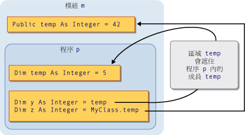
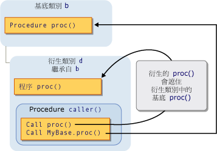

# Shadowing in Visual Basic
[!INCLUDE[vs2017banner](../../../../csharp/includes/vs2017banner.md)]

當兩個程式項目共用相同名稱時，其中之一可以隱藏，也就是「*遮蔽*」\(Shadow\) 另一個。  在這種情況下，無法參考受遮蔽項目 \(Shadowed Element\)，而在程式碼使用項目名稱時，[!INCLUDE[vbprvb](../../../../csharp/programming-guide/concepts/linq/includes/vbprvb_md.md)] 編譯器會將它解析為主導遮蔽項目 \(Shadowing Element\)。  
  
## 用途  
 遮蔽的主要目的，是要保護類別 \(Class\) 成員的定義。  基底類別可能會經歷變更，該變更會使用與已定義的相同名稱來建立項目。  若有上述情形發生，`Shadows` 修飾詞 \(Modifier\) 會透過類別，強制參考解析為您所定義的成員，而非解析為新的基底類別項目。  
  
## 遮蔽的型別  
 項目可以用兩種不同的方式遮蔽另一個項目。  您可以在包含受遮蔽項目區域的子區域中，宣告主導遮蔽項目，在這種情況下，是「*透過範圍*」\(Through Scope\) 而達成遮蔽。  或是衍生類別可重新定義基底類別的成員，在這種情況下，是「*透過繼承*」\(Through Inheritance\) 而達成遮蔽。  
  
### 透過範圍遮蔽  
 相同模組、類別或結構中的程式設計項目可能會有同樣的名稱，但範圍不同。  當您以這種方式宣告兩個項目，而且程式碼代表它們共用的名稱時，使用較小範圍項目的項目會遮蔽另一個項目 \(區塊範圍最小的\)。  
  
 例如，模組可定義一個稱為 `temp` 的 `Public` 變數，而模組內的程序也可宣告同樣命名為 `temp` 的區域變數。  在程序內參考 `temp` 會存取其區域變數，而在程序外參考 `temp` 會存取 `Public` 變數。  在這個例子中，程序變數 `temp` 會遮蔽模組變數 `temp`。  
  
 下列實例示範兩個同樣名為 `temp` 的變數。  當從自身的程序 `p` 內進行存取時，區域變數 `temp` 會遮蔽成員變數 `temp`。  然而，`MyClass` 關鍵字會略過主導遮蔽者而存取成員變數。  
  
   
透過範圍遮蔽  
  
 如需透過範圍遮蔽的範例，請參閱 [How to: Hide a Variable with the Same Name as Your Variable](../../../../visual-basic/programming-guide/language-features/declared-elements/how-to-hide-a-variable-with-the-same-name-as-your-variable.md)。  
  
### 透過繼承遮蔽  
 如果衍生類別 \(Derived Class\) 重新定義它自基底類別所繼承的程式項目，則重新定義的項目會遮蔽原來的項目。  您可以任何型別遮蔽任何其他型別的宣告項目，或一組多載項目。  例如，`Integer` 變數可以遮蔽 `Function` 程序。  如果您以程序遮蔽另一個程序，可以使用不同的參數清單及不同的傳回型別。  
  
 下列實例描述基底類別 `b`，以及繼承自 `b` 的衍生類別 `d`。  基底類別會定義名為 `proc` 的程序，而衍生類別會以另一個同名的程序遮蔽該程序。  第一個 `Call` 陳述式 \(Statement\) 會存取衍生類別中主導遮蔽的 `proc`。  然而，`MyBase` 關鍵字會略過主導遮蔽者，而存取基底類別中受遮蔽的程序。  
  
   
透過繼承遮蔽  
  
 如需透過繼承遮蔽的範例，請參閱 [How to: Hide a Variable with the Same Name as Your Variable](../../../../visual-basic/programming-guide/language-features/declared-elements/how-to-hide-a-variable-with-the-same-name-as-your-variable.md)和 [How to: Hide an Inherited Variable](../../../../visual-basic/programming-guide/language-features/declared-elements/how-to-hide-an-inherited-variable.md)。  
  
#### 遮蔽和存取層級  
 主導遮蔽項目並非一定是透過使用衍生類別的程式碼而存取的。  例如，它可能會宣告為 `Private`。  在這樣的情況下，遮蔽會失敗，而編譯器會將任何參考解析為沒有使用遮蔽時的相同項目。  這個項目是以最少衍生步驟從遮蔽類別中回溯的存取項目。  如果受遮蔽項目是程序，則會解析為相同名稱、參數清單和傳回型別的最接近的可存取版本。  
  
 下列範例說明 3 個類別的繼承階層架構 \(Inheritance Hierarchy\)。  每個類別會定義 `Sub` 程序 `display`，而每個衍生類別會遮蔽其基底類別中的 `display` 程序。  
  
```  
Public Class firstClass  
    Public Sub display()  
        MsgBox("This is firstClass")  
    End Sub  
End Class  
Public Class secondClass  
    Inherits firstClass  
    Private Shadows Sub display()  
        MsgBox("This is secondClass")  
    End Sub  
End Class  
Public Class thirdClass  
    Inherits secondClass  
    Public Shadows Sub display()  
        MsgBox("This is thirdClass")  
    End Sub  
End Class  
Module callDisplay  
    Dim first As New firstClass  
    Dim second As New secondClass  
    Dim third As New thirdClass  
    Public Sub callDisplayProcedures()  
        ' The following statement displays "This is firstClass".  
        first.display()  
        ' The following statement displays "This is firstClass".  
        second.display()  
        ' The following statement displays "This is thirdClass".  
        third.display()  
    End Sub  
End Module  
```  
  
 在前述範例中，衍生類別 `secondClass` 會以 `Private` 程序遮蔽 `display`。  當模組 `callDisplay` 呼叫 `secondClass` 中的 `display` 時，呼叫程式碼位於 `secondClass` 外部，因而無法存取私用的 `display` 程序。  遮蔽也就會失敗，而編譯器會將參考解析為基底類別的 `display` 程序。  
  
 然而，另一個衍生類別 `thirdClass` 將 `display` 宣告為 `Public`，因此 `callDisplay` 中的程式碼即可以存取該程序。  
  
## 遮蔽和覆寫  
 請勿混淆遮蔽與覆寫。  兩者都是用於繼承自基底類別的衍生類別，也都會以宣告項目重新定義另一個宣告項目。  但是其間還是有許多不同之處。  如需相關的比較，請參閱[Differences Between Shadowing and Overriding](../../../../visual-basic/programming-guide/language-features/declared-elements/differences-between-shadowing-and-overriding.md)。  
  
## 遮蔽和多載  
 如果在衍生類別中，使用多個項目來遮蔽相同的基底類別項目，主導遮蔽項目會變成該項目的多載版本。  如需詳細資訊，請參閱[Procedure Overloading](../../../../visual-basic/programming-guide/language-features/procedures/procedure-overloading.md)。  
  
## 存取受遮蔽項目  
 從衍生類別存取項目時，您通常要利用 `Me` 關鍵字限定項目名稱，以透過衍生類別目前的執行個體來存取項目。  如果您的衍生類別遮蔽了基底類別的項目，您可以利用 `MyBase` 關鍵字限定其名稱以存取基底類別項目。  
  
 如需存取受遮蔽項目的範例，請參閱 [How to: Access a Variable Hidden by a Derived Class](../Topic/How%20to:%20Access%20a%20Variable%20Hidden%20by%20a%20Derived%20Class%20\(Visual%20Basic\).md)。  
  
### 宣告物件變數  
 您建立物件變數的方式，也會影響到衍生類別的存取目標是主導遮蔽項目或受遮蔽項目。  下列範例會建立兩個衍生類別物件，但其中一個物件是宣告為基底類別，而另一個則宣告為衍生類別。  
  
```  
Public Class baseCls  
    ' The following statement declares the element that is to be shadowed.  
    Public z As Integer = 100  
End Class  
Public Class dervCls  
    Inherits baseCls  
    ' The following statement declares the shadowing element.  
    Public Shadows z As String = "*"  
End Class  
Public Class useClasses  
    ' The following statement creates the object declared as the base class.  
    Dim basObj As baseCls = New dervCls()  
    ' Note that dervCls widens to its base class baseCls.  
    ' The following statement creates the object declared as the derived class.  
    Dim derObj As dervCls = New dervCls()  
    Public Sub showZ()   
    ' The following statement outputs 100 (the shadowed element).  
        MsgBox("Accessed through base class: " & basObj.z)  
    ' The following statement outputs "*" (the shadowing element).  
        MsgBox("Accessed through derived class: " & derObj.z)  
    End Sub  
End Class  
```  
  
 在前述範例中，`basObj` 變數宣告為基底類別。  指派 `dervCls` 物件至此變數造成擴展轉換，因此是有效的。  但是，基底類別無法存取衍生類別中主導遮蔽版本的變數 `z`，因此編譯器會將 `basObj.z` 解析為原來的基底類別值。  
  
## 請參閱  
 [References to Declared Elements](../../../../visual-basic/programming-guide/language-features/declared-elements/references-to-declared-elements.md)   
 [Scope in Visual Basic](../../../../visual-basic/programming-guide/language-features/declared-elements/scope.md)   
 [Widening and Narrowing Conversions](../../../../visual-basic/programming-guide/language-features/data-types/widening-and-narrowing-conversions.md)   
 [Shadows](../../../../visual-basic/language-reference/modifiers/shadows.md)   
 [Overrides](../../../../visual-basic/language-reference/modifiers/overrides.md)   
 [Me, My, MyBase, and MyClass](../../../../visual-basic/programming-guide/program-structure/me-my-mybase-and-myclass.md)   
 [Inheritance Basics](../../../../visual-basic/programming-guide/language-features/objects-and-classes/inheritance-basics.md)