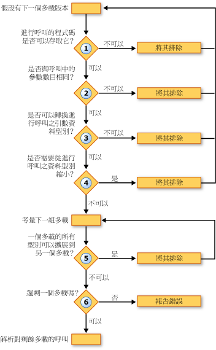

# 多載解析 (Visual Basic)
當[!INCLUDE[vbprvb](../../../../csharp/programming-guide/concepts/linq/includes/vbprvb_md.md)]編譯器遇到定義數個多載版本的程序呼叫，編譯器必須決定要呼叫的多載。 它會執行下列步驟︰  
  
1.  **存取範圍。** 它會排除任何防止呼叫程式碼呼叫它的存取層級。  
  
2.  **參數的數目。** 這可避免在呼叫中定義不同的參數數目所提供的任何多載。  
  
3.  **參數資料類型。** 編譯器會透過擴充方法的執行個體方法的喜好設定。 如果找不到，只需要擴展轉換來比對程序呼叫的任何執行個體方法，會卸除所有的擴充方法，並只執行個體方法候選對象，編譯器會繼續執行。 如果找到這類的執行個體方法，它會繼續與執行個體和擴充方法。  
  
     在此步驟中，它會排除任何為其呼叫之引數的資料型別無法轉換成在多載中定義的參數型別。  
  
4.  **縮小轉換。** 這可避免需要從呼叫的引數型別定義的參數型別來縮小轉換的多載。 這是，則為 true 的型別檢查切換是否 ([Option Strict 陳述式](../../../../visual-basic/language-reference/statements/option-strict-statement.md)) 是`On`或`Off`。  
  
5.  **最小的擴展。** 編譯器會考慮在配對中剩餘的多載。 針對每一個組，它會比較定義之參數的資料型別。 如果所有多載中的型別擴展為其他對應的型別，編譯器會排除後者。 也就是說，它會保留需要最少的擴展的多載。  
  
6.  **單一的候選。** 它會繼續考量成對直到只能有一個多載多載被保留，且能解決該多載的呼叫。 如果編譯器無法減少為單一的候選者的多載，它會產生錯誤。  
  
 下圖顯示指定的一組多載版本來呼叫哪一個程序。  
  
   
在多載版本中進行解析  
  
 下列範例說明此多載解析程序。  
  
 [!code-vb[VbVbcnProcedures #&62;](./codesnippet/VisualBasic/overload-resolution_1.vb)]  
  
 [!code-vb[VbVbcnProcedures #&63;](./codesnippet/VisualBasic/overload-resolution_2.vb)]  
  
 在第一次呼叫時，編譯器會排除第一個多載因為第一個引數型別 (`Short`) 的範圍縮小，對應參數的型別 (`Byte`)。 它接著排除第三個多載，因為每個引數型別中的第二個多載 (`Short`和`Single`) 擴展至對應的型別中的第三個多載 (`Integer`和`Single`)。 第二個多載需要較少的擴展，因此編譯器會將它的呼叫。  
  
 在第二個呼叫中，編譯器無法排除任何以縮小為基礎的多載。 它也消除了第三個多載基於相同理由，第一個呼叫，因為它可以呼叫第二個多載，較不需要擴展引數型別。 不過，編譯器無法解析的第一個和第二個多載之間。 每個都有擴展至對應的型別，在另一個定義的參數型別 (`Byte`至`Short`，但`Single`到`Double`)。 因此，編譯器會產生多載解析錯誤。  
  
## 選擇性的多載和 ParamArray 引數  
 如果程序的兩個多載具有相同的簽章，不同之處在於最後一個參數宣告[選擇性](../../../../visual-basic/language-reference/modifiers/optional.md)之一和[ParamArray](../../../../visual-basic/language-reference/modifiers/paramarray.md)在另一個，編譯器會解析該程序的呼叫，如下所示︰  
  
|如果呼叫所提供做為最後一個引數|編譯器將呼叫解析為宣告做為最後一個引數的多載|  
|---|---|  
|沒有值 （省略引數）|`Optional`|  
|單一值|`Optional`|  
|以逗號分隔的清單中的兩個或多個值|`ParamArray`|  
|陣列的長度 （包括空的陣列）|`ParamArray`|  
  
## 另請參閱  
 [選擇性參數](./optional-parameters.md)   
 [參數陣列](./parameter-arrays.md)   
 [多載化程序](./procedure-overloading.md)   
 [疑難排解程序](./troubleshooting-procedures.md)   
 [如何︰ 定義程序的多個版本](./how-to-define-multiple-versions-of-a-procedure.md)   
 [如何︰ 呼叫多載程序](./how-to-call-an-overloaded-procedure.md)   
 [如何︰ 多載使用選擇性參數的程序](./how-to-overload-a-procedure-that-takes-optional-parameters.md)   
 [如何︰ 多載使用不定數目參數的程序](./how-to-overload-a-procedure-that-takes-an-indefinite-number-of-parameters.md)   
 [多載化程序的考量](./considerations-in-overloading-procedures.md)   
 [多載](../../../../visual-basic/language-reference/modifiers/overloads.md)   
 [擴充方法](./extension-methods.md)
