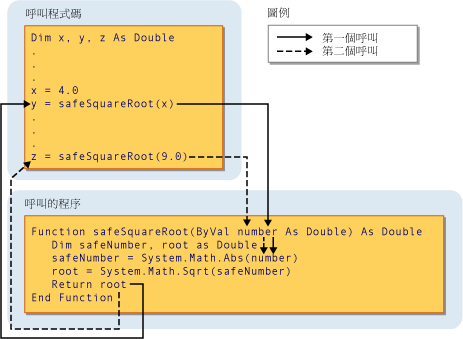

# 程序參數和引數 (Visual Basic)
在大部分情況下，需要一些資訊在其中呼叫的情況的相關程序。 執行重複或共用的工作的程序會針對每個呼叫使用不同的資訊。 這項資訊包含變數、 常數和呼叫它時傳遞至程序的運算式。  
  
 A*參數*表示程序需要您提供當您呼叫它的值。 程序的宣告會定義它的參數。  
  
 您可以定義具有任何參數，一個參數，或一個以上的程序。 呼叫程序定義指定之參數的一部分*參數清單*。  
  
 *引數*程序參數表示您提供的值時呼叫的程序。 呼叫程序時，如果呼叫程式碼所提供的引數。 指定的引數的程序呼叫的部份稱為*引數清單*。  
  
 下圖顯示程式碼呼叫此程序`safeSquareRoot`兩個不同位置。 第一次呼叫會將變數的值傳遞`x`(4.0) 的參數`number`，和傳回值中的`root`(2.0) 指派給變數`y`。 第二個呼叫會傳遞至常值 9.0 `number`，並將傳回的值 (3.0) 指派給變數`z`。  
  
   
傳遞至參數的引數  
  
 如需詳細資訊，請參閱[參數之間的差異和引數](./differences-between-parameters-and-arguments.md)。  
  
## 參數資料類型  
 您定義資料類型的參數使用`As`在其宣告中的子句。 例如，下列函式會接受一個字串和整數。  
  
 [!code-vb[VbVbcnProcedures#32](./codesnippet/VisualBasic/procedure-parameters-and-arguments_1.vb)]  
  
 如果類型檢查參數 ([Option Strict 陳述式](../../../../visual-basic/language-reference/statements/option-strict-statement.md)) 是`Off,``As`子句是選擇性的不同之處在於任何一個參數會使用它，如果所有參數必須都使用它。 如果型別檢查`On`、`As`子句是必要的所有程序參數。  
  
 如果呼叫的程式碼必須不同於其對應的參數資料類型提供的引數，例如`Byte`至`String`參數，則必須執行下列其中之一：  
  
-   提供唯一可擴展參數資料類型; 資料類型的引數  
  
-   設定`Option Strict Off`允許隱含的縮小轉換; 或  
  
-   使用轉換關鍵字，明確地轉換資料類型。  
  
### 型別參數  
 A*泛型程序*也會定義一或多個*型別參數*除了一般參數。 泛型程序可讓呼叫的程式碼傳遞不同的資料類型每次呼叫程序，讓它可以調整資料類型，每個個別呼叫的需求。 請參閱 [Generic Procedures in Visual Basic](../../../../visual-basic/programming-guide/language-features/data-types/generic-procedures.md)。  
  
## 另請參閱  
 [程序](./index.md)  
 [Sub 程序](./sub-procedures.md)  
 [函式程序](./function-procedures.md)  
 [屬性程序](./property-procedures.md)  
 [運算子程序](./operator-procedures.md)  
 [如何：定義程序的參數](./how-to-define-a-parameter-for-a-procedure.md)  
 [如何：將引數傳遞至程序](./how-to-pass-arguments-to-a-procedure.md)  
 [以傳值和傳址方式傳遞引數](./passing-arguments-by-value-and-by-reference.md)  
 [程序多載化](./procedure-overloading.md)  
 [在 Visual Basic 中的型別轉換](../../../../visual-basic/programming-guide/language-features/data-types/type-conversions.md)
